# Обход сайта

<figure>

.png>)

<figcaption>

</figcaption>

</figure>

### **Что такое битая ссылка?**

Битая ссылка -- это ссылка, которая ведёт на несуществующую страницу или файл. Такие ссылки могут возникать по следующим причинам:

1. **Удаление или перемещение страницы/файла**: Если страница или файл, на который вела ссылка, был удалён или перемещён, а ссылка не была обновлена.

2. **Ошибка в URL**: Ссылка может содержать опечатку или неправильный путь.

3. **Внешние ресурсы**: Если ваш сайт ссылается на внешние ресурсы, которые больше не доступны.

### **Почему важно устранять битые ссылки?**

1. Пользователи могут столкнуться с не работающими ссылками, при нажатии на которые будет выходить страница 404 ошибки, что **негативно влияет на восприятие сайта.**

2. Помимо этого, важно знать, что поисковые системы, такие как Google, Yandex и другие, считают наличие битых ссылок на сайте негативным фактором, что **может снизить позиции сайта в поисковой выдаче.**

**Структура раздела**

Раздел состоит из двух вкладок:

1. **Ссылки** -- здесь отображаются все обнаруженные битые ссылки.

2. **Изображения** -- здесь отображаются изображения, которые не могут быть загружены из-за неправильно указанных ссылок.

## **Ссылки**

<figure>

.png>)

<figcaption>

</figcaption>

</figure>

Если на сайте обнаружены битые ссылки, они будут отображены в этой вкладке. Каждая запись содержит следующую информацию:

-  **Страница**: Указывает на страницу, где обнаружена битая ссылка. При нажатии на ссылку откроется проблемная страница.

-  **Битая ссылка**: Неисправная ссылка, которая ведёт на несуществующий ресурс.

-  **Анкор**: Текст ссылки, который отображается на странице (обычно подчёркнут или выделен цветом).

-  **Кнопка редактирования (карандаш)** .png>): Позволяет перейти к редактированию страницы, где находится битая ссылка, для быстрого исправления.

### **Как исправить битые ссылки?**

1. **Перейдите на страницу с ошибкой**: Нажмите на ссылку в столбце "Страница".

2. **Найдите битую ссылку**:

   -  Скопируйте ссылку из столбца "Битая ссылка".

   -  Нажмите `F12` для открытия инструментов разработчика в браузере.

   -  Используйте сочетание клавиш `Ctrl+F`, вставьте скопированную ссылку и найдите её в коде страницы.

3. **Исправьте ссылку**:

   -  Вернитесь в админ-панель и нажмите на кнопку редактирования (карандаш) в строке с ошибкой.

   -  Найдите и исправьте битую ссылку в редакторе страницы.

4. **Проверка меню**: Если ошибка связана с пунктом меню, перейдите в раздел Контент -> Наполнение сайта -> Меню -> Верхнее меню и исправьте или удалите неисправный пункт.

Ошибка исчезнет после следующей автоматической проверки, которая проводится каждое воскресенье.

#### Пример устранения битой ссылки в HTML-коде:

[tabs]

[tab:Перейти в редактор]

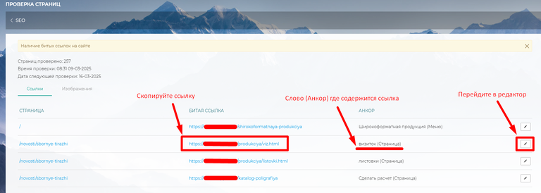{width=768px height=274px}

[/tab]

[tab:Заменить ссылку]

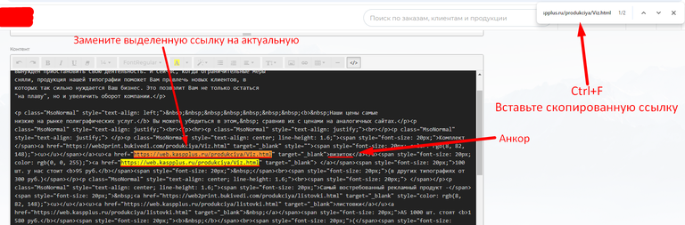{width=768px height=253px}

[/tab]

[/tabs]

**Пример устранения битой ссылки в пунктах меню:**

[tabs]

[tab:Битая ссылка]

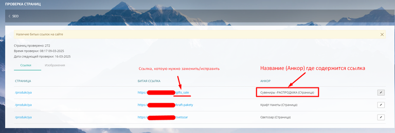{width=768px height=260px}

[/tab]

[tab:Исправление битой ссылки]

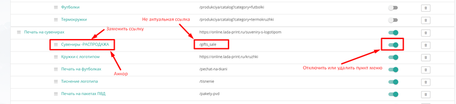{width=768px height=176px}

[/tab]

[/tabs]

## **Изображения**

<figure>

.png>)

<figcaption>

</figcaption>

</figure>

В этой вкладке отображаются изображения, которые не могут быть загружены из-за неправильных ссылок. Каждая запись содержит:

-  **Страница**: Указывает на страницу, где обнаружено битое изображение.

-  **Битая ссылка**: Ссылка на изображение, которое не может быть загружено.

-  **Кнопка редактирования (карандаш)**: Позволяет перейти к редактированию страницы, где находится битое изображение.

### **Как исправить битые изображения?**

1. **Перейдите на страницу с ошибкой**: Нажмите на ссылку в столбце "Страница".

2. **Найдите битое изображение**: Скопируйте часть ссылки (например, номер изображения) из столбца "Битая ссылка". Откройте инструменты разработчика в браузере`(F12)`, нажмите `Ctrl+F` и вставьте скопированный фрагмент в появившуюся строку снизу. Это выделит место, где находится битое изображение.

3. **Исправьте ссылку на изображение**:

   -  Перейдите в редактор страницы, нажав на кнопку "Настройки" в правом нижнем углу экрана (если вы авторизованы на сайте).

   -  Найдите изображение в соответствующем разделе (например, "Контент", "Статьи" или HTML-код).

   -  В основном все элементы вставленных ссылок на изображения содержатся в редакторе кода .png>). Перейдите туда и воспользуйтесь сочетанием клавиш `Ctrl+F` для быстрого поиска. В появившемся окне вставьте номер изображения, взятый из столбика "Битая ссылка" (следует копировать только конец ссылки где написан номер изображения)

   -  Замените битую ссылку на актуальную. Обычно изображения берутся из раздела "[Изображения](./obkhod-saita#izobrazheniya)" на сайте или из внешних источников.

4. Убедитесь, что изображение теперь отображается корректно.

#### Обнаружение битого изображения на сайте

[tabs]

[tab:Шаг 1]

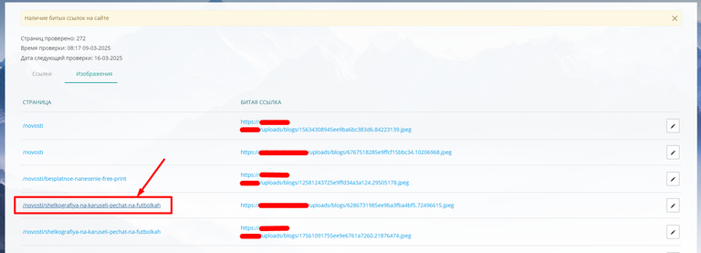{width=768px height=277px}

[/tab]

[tab:Шаг 2]

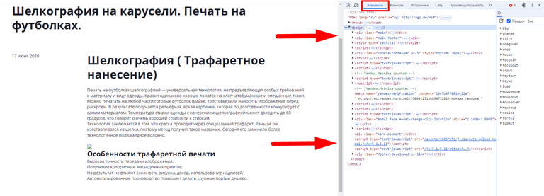{width=768px height=277px}

[/tab]

[tab:Шаг 3]

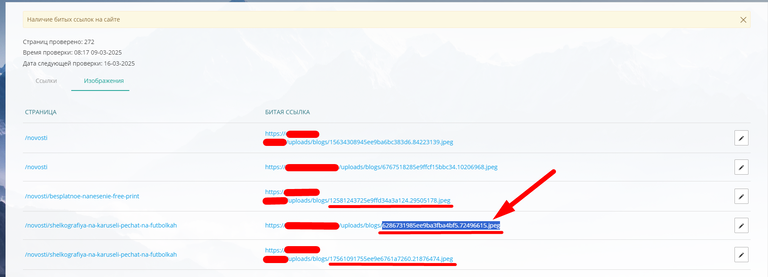{width=768px height=277px}

[/tab]

[tab:Шаг 4]

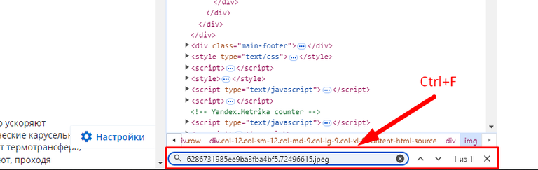{width=768px height=243px}

[/tab]

[tab:Шаг 5]

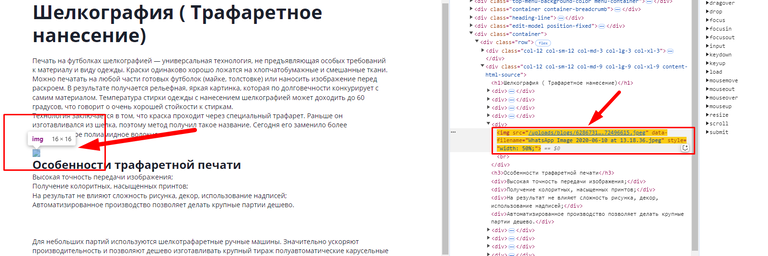{width=768px height=256px}

[/tab]

[/tabs]

#### Пример исправления изображения в HTML-коде:

[tabs]

[tab:Нажать]

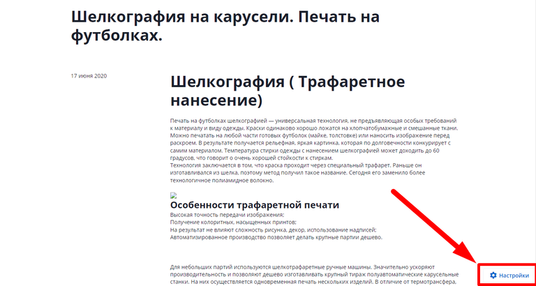{width=768px height=410px}

[/tab]

[tab:Скопировать ссылку]

{width=768px height=277px}

[/tab]

[tab:Найти и заменить]

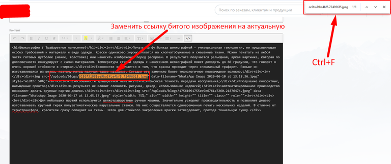{width=768px height=323px}

[/tab]

[/tabs]

:::note 

Если у вас возникли трудности с устранением битых ссылок или изображений, обратитесь в техническую поддержку TCS для получения помощи.

:::