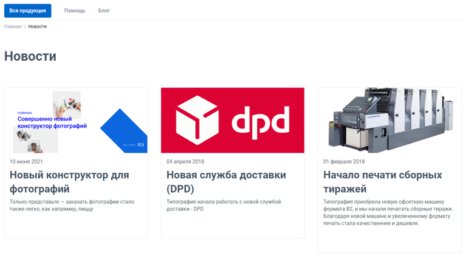
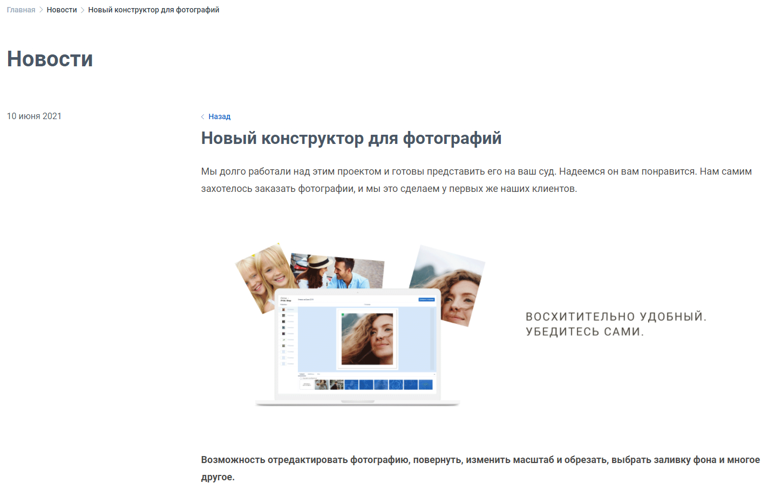
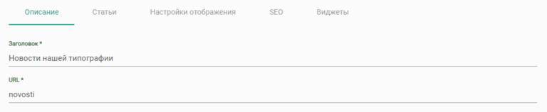
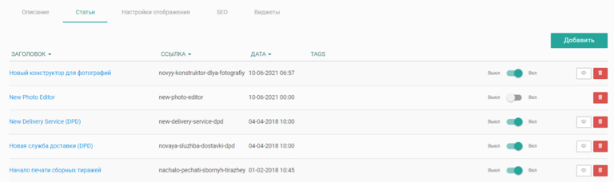
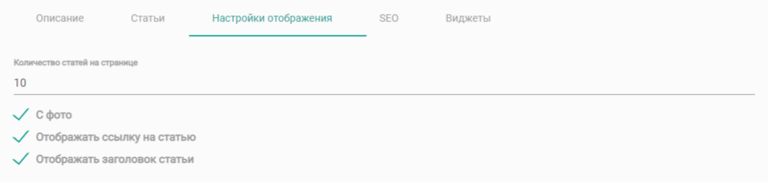
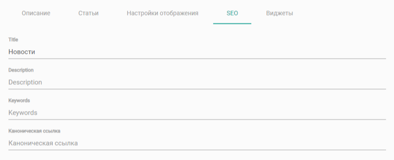
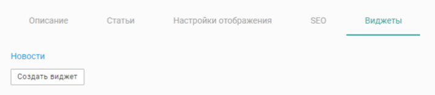
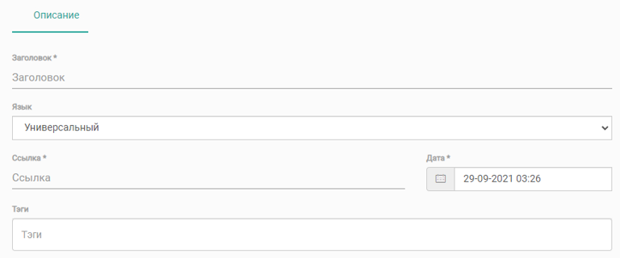
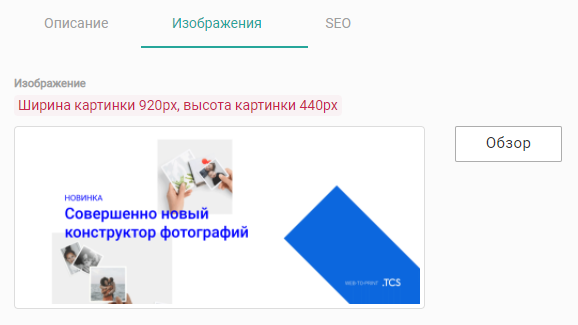
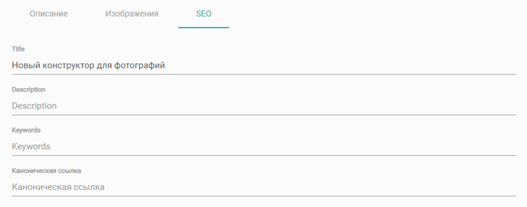

## Общие положения

В web-to-print платформе TCS имеется возможность создавать и размещать на страницах сайта блок новостей или вести блог компании.

[tabs]

[tab:Страница блока новостей/блога]

{width=768px height=424px}

Страница новостей состоит из постоянных элементов:

-  **Хлебные крошки**

-  **Заголовок страницы** Название страницы блока новостей.

-  **Статьи** Все активные статьи данного блока новостей.

[/tab]

[tab:Страница статьи]

{width=768px height=490px}

Страница статьи также состоит из постоянных элементов:

-  **Хлебные крошки**

-  **Заголовок** Название страницы блока новостей.

-  **Текст статьи** В левой части указана дата публикации; В правой части текст статьи.

[/tab]

[/tabs]

### **Страница новостей**

Чтобы создать блок новостей / блог, в админ-панели сайта войдите в раздел «*Контент -> Наполнение сайта -> Новости / блог»*, нажмите на кнопку «Добавить» в правом верхнем углу, введите заголовок и сохраните. После сохранения, отобразятся 4 новые вкладки:

[tabs]

[tab:Описание]

Общие настройки страницы новостей.

{width=768px height=158px}

-  **Заголовок** 

   Заголовок страницы новостей типа H1.

-  **Url** 

   Url страницы новостей. Формируется автоматически при заполнении поля «Заголовок».

[/tab]

[tab:Статьи]

Здесь можно [создать ](https://support.wow2print.com/kontent/untitled/novosti-blog#stati)новую статью, изменить существующую и увидеть общую информацию по всем размещенным статьям в данном блоке новостей.

{width=768px height=228px}

-  **Заголовок** 

   Заголовок статьи.

-  **Ссылка** 

   Url (страница) статьи на сайте.

-  **Дата** 

   Дата публикации статьи. Дату можно указать любую в настройках статьи.

-  **Теги** 

   Теги статьи, необходимы для удобства фильтрации и поиска.

-  **Статус** 

   Статью можно в любой момент выключить и включить с отображения на сайте.

[/tab]

[tab:Настройки отображения]

Настройки отображения блока новостей.

{width=768px height=182px}

-  **Количество статей на странице** 

   Общее количество статей блока, которое будет отображаться на одной странице. Статьи всегда отображаются по 3 в ряд, учитывайте это при указании общего количества статей на странице.

-  **С фото** 

   Статьи в общем списке будут отображаться с превью. Изображение в качестве превью необходимо загрузить на вкладке «Изображение» в настройках статьи.

-  **Отображать ссылку на статью** 

   Данный параметр отключает активную ссылку для перехода на страницу статьи, статься будет отображаться только в виде тизера (изображение, заголовок и цитата статьи); Таким образом можно отображать отзывы на сайте.

-  **Отображать заголовок статьи** 

   Данный параметр позволяет отключить отображение заголовка статьи, в этом случае на блоке статьи будет отображаться лишь изображение

[/tab]

[tab:SEO]

SEO настройки (мета-теги) страницы блока новостей.

{width=768px height=313px}

-  **Title** 

   Основной тег страницы, который позволяет поисковым роботам понять какая информация на ней находится. В него необходимо включить поисковый запрос соответствующий названию блока новостей и несколько уточняющих слов

-  **Description**

   Краткое описание страницы. Данный тег на сайте не отображается, но его видят и используют поисковые роботы, индексирующие ваш сайт. Description должен быть смысловым продолжением Title.

-  **Keywords** 

   Ключевые слова через запятую, которые встречаются на данной странице, а также отображают тематику сайта.

-  **Каноническая ссылка** 

   Ссылка на определенную страницу, которая будет индексироваться. Если на сайте имеются похожие по содержанию страницы (страницы-дубли), это плохо влияет на индексацию сайта поисковыми роботами, в этом случае необходимо у похожих страниц указывать каноническую ссылку на одну «главную» страницу среди похожих, чтобы индексировалась только она.

[/tab]

[tab:Виджеты]

Список виджетов данного блока новостей. При нажатии на кнопку «Создать виджет», откроется стандартное окно создания виджета. Подробнее о виджете Новости / блог [здесь](https://support.wow2print.com/kontent/vidzhety/vidzhet-novosti-blog).

{width=712px height=157px}

[/tab]

[/tabs]

### **Статьи**

Статьи всегда располагаются в конкретном блоке новостей на вкладке «Статьи», здесь можно создать новую, редактировать существующую и просмотреть все имеющиеся статьи в данном блоке новостей.

Для того чтобы создать статью, на вкладке «Статьи» нажмите на кнопку «Добавить». Перед вами откроется форма для создания статьи.

[tabs]

[tab:Описание]

Основные настройки статьи

{width=768px height=320px}

-  **Заголовок** 

   Заголовок статьи типа H3.

-  **Язык** 

   Если вы используете модуль мультиязычность, необходимо создать отдельную статью для каждого используемого языка.

-  **Ссылка** 

   Url (страницы) статьи на сайте. Формируется автоматически при заполнении поля «Заголовок».

-  **Дата** 

   Дата публикации статьи. По умолчанию дата выбирается текущая. Если статью необходимо опубликовать позднее, то выберите соответствующие время и дату, именно в этот момент статья будет опубликована.

-  **Теги**

   Теги статьи, необходимы для удобства фильтрации и поиска. При клике на поле ввода, в выпадающем списке отобразятся все доступные теги, если вам нужен новый тег, просто введите его название в поле ввода и нажмите на полученный тег с выпадающем списке.

Также на данной вкладке находятся стандартные текстовые редакторы для размещения в них Цитаты и Контента статьи.

-  **Цитата** 

   Краткое описание статьи или цитата из нее. Отображается в превью статьи на странице блока новостей или в виджете «Новости / блог».

-  **Контент** 

   Текст статьи, отображается только на странице статьи. Здесь можно размещать, как текст, изображения и видео, так и html-код (верстку).

[/tab]

[tab:Изображения]

Здесь можно загрузить изображение, которое будет отображаться в качестве превью статьи в общем списке новостей. Данное изображение не отображается в контенте статьи.

{width=578px height=325px}

[/tab]

[tab:SEO]

SEO настройки (мета-теги) статьи.

{width=768px height=303px}

-  **\
   Title** Основной тег страницы, который позволяет поисковым роботам понять какая информация на ней находится. В него необходимо включить поисковый запрос соответствующий названию статьи и несколько уточняющих слов

-  **Description** Краткое описание страницы. Данный тег на сайте не отображается, но его видят и используют поисковые роботы, индексирующие ваш сайт. Description должен быть смысловым продолжением Title.

-  **Keywords** Ключевые слова через запятую, которые встречаются на данной странице, а также отображают тематику сайта.

-  **Каноническая ссылка** Ссылка на определенную страницу, которая будет индексироваться. Если на сайте имеются похожие по содержанию страницы (страницы-дубли), это плохо влияет на индексацию сайта поисковыми роботами, в этом случае необходимо у похожих страниц указывать каноническую ссылку на одну «главную» страницу среди похожих, чтобы индексировалась только она.

[/tab]

[/tabs]

### **Требования к изображениям**

Требование только к изображению для превью статьи.

**Размер изображения**: 440 x 200 px.

**Допустимые форматы**: .jpeg, .png и .gif.