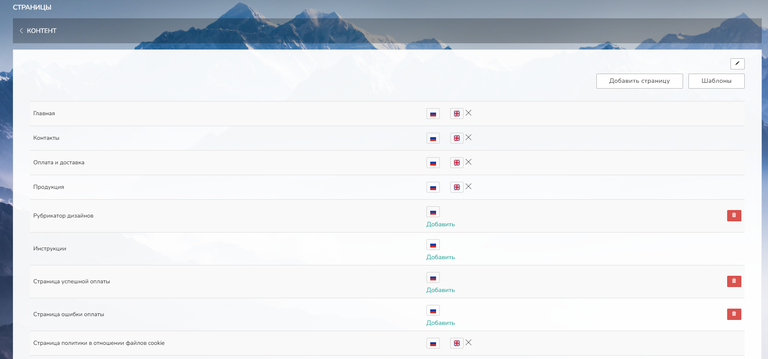
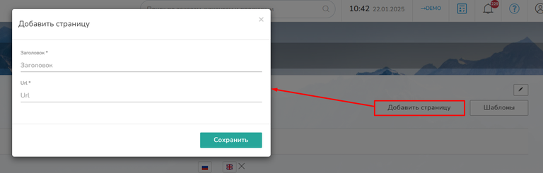
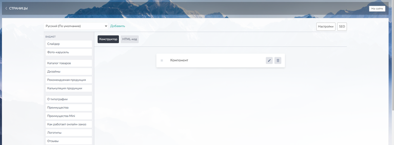
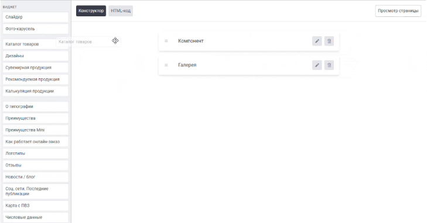
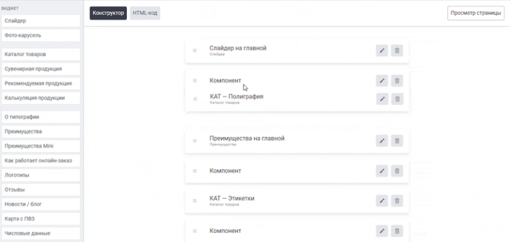
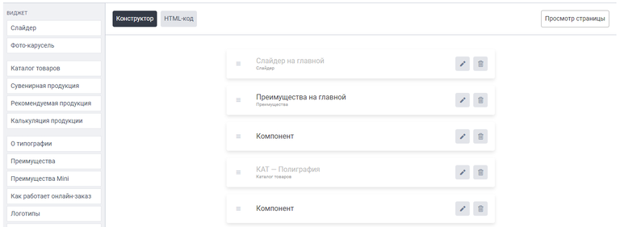
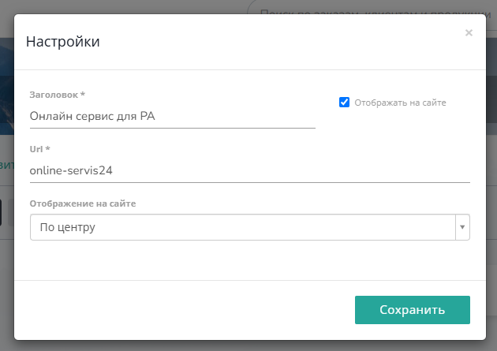
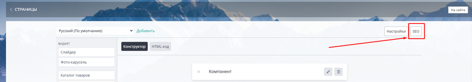
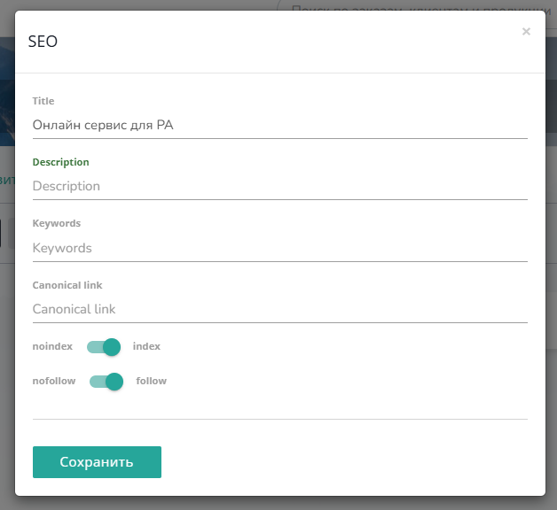

[view:hierarchy=none::::List]

В данном разделе можно создавать, редактировать, удалять страницы сайта, а также готовить шаблоны для массового создания посадочных страниц.

## **Общие положения**

### **Типы страниц**

В админ-панели TCS имеются 3 типа страниц:

-  **Стандартные страницы** Находятся в разделе Страницы, весь контент страницы свободно редактируется.

-  **Страницы продукции** Находятся в разделе [Продукция](https://github.com/alexeyWow2print/support-center/tree/main/product/README.md), в контенте таких страниц имеется предустановленный элемент -- калькуляция продукта, по этой причине контент страницы поделен на 3 части:

   -  Контент до калькулятора -- от шапки сайта до начала калькуляции;

   -  Калькулятор -- настраивается отдельно в продукте на вкладке Калькуляция;

   -  Контент после калькулятора -- от конца калькуляции до футера сайта.

-  **Посадочные страницы** Находятся в подразделе [Шаблоны](https://support.wow2print.com/kontent/untitled/stranicy/shablony), по функционалу очень схожи со стандартными страницами, полностью редактируются, но создаются на основе шаблона.

### **Содержание раздела**

В разделе Страницы можно сразу заметить список предустановленных страниц:

{width=768px height=359px}

Все предустановленные страницы имеют постоянные url:

-  **Главная** -- [demo.wow2print.com/](http://demo.wow2print.com/) Главная страница сайта. Контент страницы свободно редактируется.

-  **Контакты** -- [/contacts](https://demo.wow2print.com/contacts) Здесь следует располагать всю контактную информацию компании. Контент страницы свободно редактируется.

-  **Оплата и доставка** -- [/delivery](https://demo.wow2print.com/delivery) Здесь следует располагать всю информацию по оплате и доставке, которые используются на сайте. Контент страницы свободно редактируется.

-  **Продукция** -- [/produkciya](https://demo.wow2print.com/produkciya) Здесь следует располагать каталог продукции. Контент страницы свободно редактируется, также присутствуют постоянные хлебные крошки

-  **Рубрикатор дизайнов** -- [/design](https://demo.wow2print.com/design) На странице присутствует постоянный элемент -- каталог доступных дизайнов, то есть список всех продуктов сайта, в которых имеется возможность создать макет в конструкторе. Свободно редактируется только контент после каталога дизайнов, также присутствуют постоянные хлебные крошки

-  **Инструкции** -- [/instructions-and-templates](https://demo.wow2print.com/instructions-and-templates) На странице присутствует постоянный элемент -- инструкции и шаблоны ко всей продукции сайта, продукт отображается на этой странице, если в нем имеется шаблон и/или инструкция по подготовке макета. Свободно редактируется только контент после инструкций.

-  **Страница успешной оплаты** -- [/success](https://demo.wow2print.com/success) Здесь следует разместить текст-уведомление об успешной оплате заказа. Контент страницы свободно редактируется.

-  **Страница ошибки оплаты** -- [/fail](https://demo.wow2print.com/fail) Здесь следует разместить текст-уведомление в случае ошибки оплаты. Контент страницы свободно редактируется.

-  **Страница политики в отношении файлов cookie** -- [/cookie](https://demo.wow2print.com/cookie) Здесь должен быть указан текст политики в отношении файлов cookie, этого требует 152-ФЗ «О персональных данных» и регламент [General Data Protection Regulation](https://ec.europa.eu/info/law/law-topic/data-protection_en) (GDPR). Контент страницы свободно редактируется.

-  **Страница по условиям обработки персональных данных** -- [/agreement](https://demo.wow2print.com/agreement) Здесь должен быть указан текст условий обработки персональных данных клиентов, этого требует положение статьи 13.11 КоАП РФ. Контент страницы свободно редактируется.

-  **Пользовательское соглашение** -- [/terms-of-use](https://demo.wow2print.com/terms-of-use) Здесь должен быть указан текст пользовательского соглашения, который регулирует условия регистрации на сайте и бесплатного использования его функционала. Контент страницы свободно редактируется.

-  **Корзина** -- [/cart](https://demo.wow2print.com/cart)

   -  Если в корзине имеется продукт -- на странице присутствует постоянный элемент -- форма для оформления заказа. Контент страницы свободно редактируется только под формой оформления заказа.

   -  Если корзина пустая -- здесь необходимо разместить текст-уведомление о пустой корзине. Контент страницы свободно редактируется.

## **Создание и редактирование страницы**

Добавить новую страницу можно путем нажатия на кнопку в правом верхнем углу «Добавить страницу». Откроется форма, с заполнением заголовка и url-адреса страницы.

{width=768px height=245px}

После нажатия на кнопку "Сохранить", вас перенесёт в конструктор страницы, где можно добавить новый контент для неё.

### **Конструктор страниц**

С помощью конструктора страниц можно за несколько кликов создать полноценную страницу сайта.

{width=768px height=283px}

#### **В левой части конструктора располагаются элементы страницы:**

-  Виджеты;

-  Компонент -- элемент страницы с текстовым редактором, внутри которого можно разместить любой контент или html-код

#### **В середине -- рабочая область.**

[tabs]

[tab:Добавить элемент]

Добавить элементы в рабочую область можно путем перетаскивания их курсором мыши из боковой панели.

{width=729px height=382px}

При добавлении виджета в рабочую область, система предложит создать новый виджет или же выбрать существующий.

-  **Создать** Открывает полноценную форму создания виджета, нет необходимости переходить в раздел виджеты, все сделать можно прямо в конструкторе.

-  **Выбрать** Показывает все доступные виджеты данного вида.

[/tab]

[tab:Сортировка элементов]

Все элементы страницы могут быть отсортированы, путем перетаскивания их курсором мыши

{width=730px height=346px}

[/tab]

[tab:Статус виджета]

Добавленный в рабочую область виджет, может быть выключен. В этом случае в рабочей области он отмечается более светлым цветом шрифта.

{width=768px height=281px}

[/tab]

[/tabs]

:::tip 

В конструкторе страниц предусмотрена возможность переключиться в режим html-кода, чтобы верстать страницу самостоятельно

:::

### **Настройки**

В правом верхнем углу редактора страницы есть кнопка "Настройки". Нажав на неё вы можете внести изменения в отображение страницы на сайте

-  **Заголовок** Добавляет на страницу заголовок, типа H1.

-  **Отображать на сайте** Отображение заголовка на сайте.

-  **Url** Ссылка страницы.

:::note 

Ссылку необходимо писать без "/" в начале. Иначе страница на сайте не откроется. Правильный пример ссылки приведён ниже на изображении

:::

-  **Отображение на сайте**

   -  По центру -- границы контента страницы будут равны 1 440 px;

   -  По всей ширине -- контент будет располагаться по всей ширине страницы браузера.

{width=630px height=445px}

### **SEO**

Настройки страницы можно найти в правой части редактора, кнопка "SEO":

{width=768px height=134px}

Откроется форма, с возможностью настроить SEO для страницы.

{width=628px height=576px}

-  **Title** По умолчанию подставляется из названия страницы. Несёт информацию о содержимом страницы;

-  **Description**

   Представление краткого и точного описания страницы;

-  **Keywords**

   Заполненный раздел Keywords позволяет поисковым роботам легче определить, контент на какую тему размещён на странице и для какой аудитории он может быть интересен;

-  **Canonical link**

   Применяется с целью предотвращения дублей контента. Благодаря этому, поисковые боты воспринимают страницу с canonical как приоритетную для поисковой выдачи; ([Подробнее](https://support.wow2print.com/kontent/seo#ukazyvat-u-stranic-kanonicheskuyu-ssylku-na-samu-sebya))

-  **noindex, nofollow**

   Нужны для управления репутацией сайта в поисковых системах; ([Подробнее](https://support.wow2print.com/kontent/seo#tegi-robots-noindex-nofollow)) noindex - запрещает поисковым роботам индексировать страницу; nofollow - запрещает поисковым роботам переходить по ссылкам на странице;