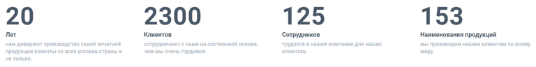
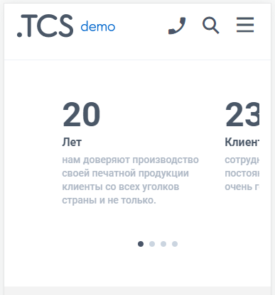
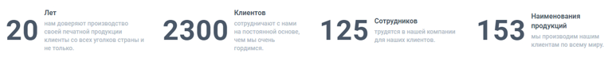
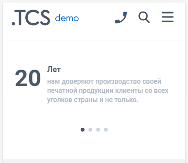

# Виджет «Числовые данные»

## Общий вид

## Варианты отображения (2 вида)

[tabs]

[tab:Текст снизу]

**Десктоп:**

{width=768px height=96px}

**Мобильные устройства:**

{width=387px height=416px}

[/tab]

[tab:Текст справа]

**Десктоп:**

{width=768px height=73px}

**Мобильные устройства:**

{width=387px height=337px}

[/tab]

[/tabs]

## Как создать?

Чтобы создать виджет «Числовые данные», в админ-панели сайта войдите в раздел «*Контент -> Виджеты»*, нажмите на кнопку «Добавить» в правом верхнем углу. В открывшемся окне найдите виджет «Числовые данные» и нажмите «Создать».

## Параметры

### 

### Общие

Перед вами откроется форма с возможностью выбрать параметры виджета.

.png>)

Заполните поля и выберите параметры:

-  **Название** виджета\
   Внутреннее название для админ-панели. Нигде не отображается.

-  **Тип устройства**

   -  Универсальный -- виджет будет отображаться на всех устройствах;

   -  Для десктопа -- отображение будет только на компьютере/ноутбуке;

   -  Для мобильных устройств -- отображение только на мобильных устройствах.

-  **Количество в ряд**\
   Можно выбрать 3, 4 или 6 элементов в ряд.

-  **Текст**\
   Расположение заголовка элемента:

   -  Снизу -- заголовок и описание элемента будут располагаться под числовым значением;

   -  Справа -- заголовок и описание элемента будут располагаться справа от числового значения.

Далее идут настройки элементов, каждый элемент имеет индивидуальные настройки:

-  **Количество**\
   Введите числовое значение типа большой текст.

-  **Заголовок**\
   Добавьте заголовок типа основной наборный текст (толщина 3).

-  **Описание**\
   Текст описания элемента типа малый наборный текст.

-  **Добавить**\
   Количество элементов не ограничено, с помощью кнопки «Добавить», в виджет можно добавить любое количество элементов.

:::note 

Не забудьте активировать виджет после создания. Это можно сделать в разделе «Контент -> Виджеты», путем переключения бегунка в состояние Вкл.

:::

## Порядок установки (2 вар.)

### 

### 1 вариант -- Через вставку кода

После сохранения всех параметров, скопируйте «Код для установки на сайт».

{width=888px height=188px}

Перейдите на нужную страницу или продукт, в режиме исходного кода вставьте код виджета в то место, которое необходимо.\
Готово!

(*Дважды кликните по изображению, чтобы запустить GIF*)

{width=924px height=384px}

### 2 вариант -- Через редактор страниц

Перейдите в раздел "Контент -> Наполнение сайта -> Страницы" нажмите на название страницы. Вы окажитесь в редакторе страниц.\
Слева выберите необходимый виджет и вставьте в поле правее в нужном порядке.\
Готово!

(*Дважды кликните по изображению, чтобы запустить GIF*)

{width=1426px height=754px}