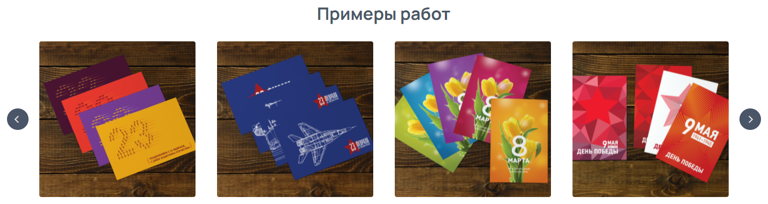
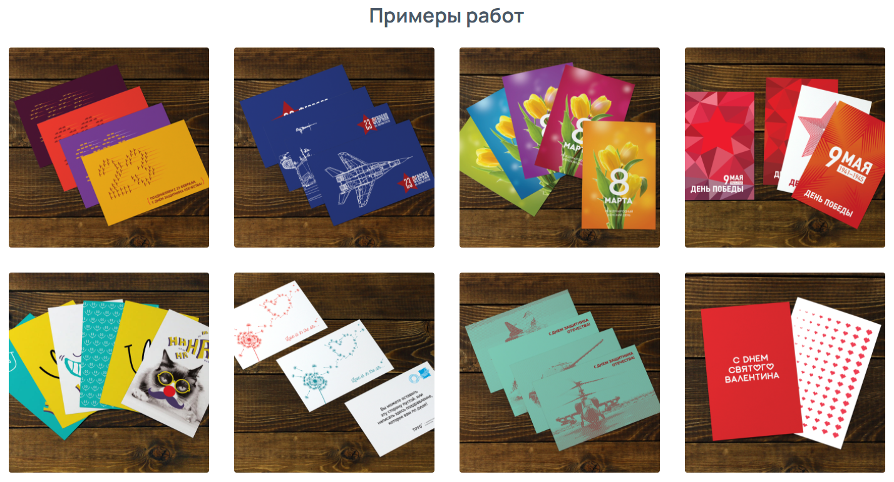
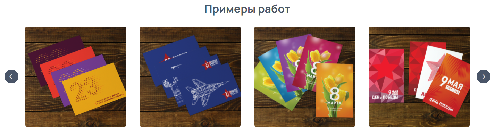

Виджет «Фото-карусель» позволяет отобразить на сайте выбранные изображения в виде портфолио.

## Варианты отображения (2 вида)

[tabs]

[tab:Отображение слайдером]

{width=768px height=204px}

**Особенности:**

-- Компактный вид - фотографии отображаются в одну строку с возможностью их пролистывать;

-- Отлично будет смотреться на посадочной странице или на странице продукта .

[/tab]

[tab:Отображение блоками]

{width=1428px height=771px}

**Особенности:**

-- Сразу все фотографии отображаются на странице;

-- Отлично будет смотреться на отдельной странице «Портфолио».

[/tab]

[/tabs]

## Как создать?

Чтобы создать виджет «Фото-карусель», в админ-панели сайта войдите в раздел «*Контент -> Виджеты»*, нажмите на кнопку «Добавить» в правом верхнем углу. В открывшемся окне найдите виджет «Фото-карусель\*»\* и нажмите «Создать».

## Параметры

### 

### Общие

Перед вами откроется форма с возможностью выбрать параметры виджета.

.png>)

Заполните поля и выберите параметры:

-  **Название** виджета\
   Внутреннее название для админ-панели. Нигде не отображается.

-  **Тип устройства**

   -  Универсальный -- виджет будет отображаться на всех устройствах;

   -  Для десктопа -- отображение будет только на компьютере/ноутбуке;

   -  Для мобильных устройств -- отображение только на мобильных устройствах.

-  **Выбор**\
   Способ формирования виджета:

   -  Галерея -- формирование виджета на основе существующей папки с изображениями в разделе [Галереи](./../untitled/galerei);

   -  Тэги -- формирование виджета на основе тэгов изображения.

-  **Галерея**\
   Если способ формирования виджета «Галерея», то в данном поле необходимо выбрать папку из раздела Галереи, на основе этой папки будет сформирован виджет.

-  **Заголовок**\
   Заголовок типа H2, отображается над виджетом.

-  **Тип отображения**

   -  Слайдер -- отображение виджета в одну строку со стрелками по бокам для перелистывания;

   -  Блоки -- данный вид исключает возможность перелистывать фотографии, все фотографии отображаются на странице в виде блоков.

-  **Количество строк**\
   Параметр доступен только при типе отображении блоками, позволяет регулировать количество отображаемых на странице строк изображений. Можно отображать 1, 2 или 3 строки.

-  **Количество изображений в строке**\
   Можно выбрать 1, 2, 3, 4 или 6 изображений в ряд. Если у вас достаточно большое портфолио, то оптимальнее выбрать 4 или 6 изображений в ряд, это позволит разместить на небольшой области большое количество фотографий.

-  **Увеличение изображений при клике**\
   Данный параметр добавляет клиенту возможность посмотреть изображение в полном размере, путем увеличения при клике.

:::note 

Не забудьте активировать виджет после создания. Это можно сделать в разделе «Контент -> Виджеты», путем переключения бегунка в состояние Вкл.

:::

### Требования к изображениям

Требования к изображениям зависят от параметров виджета «Тип отображения» и «Количество изображений в строке».

[tabs]

[tab:Отображение слайдером]

**Допустимые форматы**: .jpeg, .png и .gif.

**Количество изображений в строке** и соответствующий **размер изображения:**

1 элемент -- 680 x 680 px;

2 элемента -- 440 x 440 px;

3 элемента -- 320 x 320 px;

4 элемента -- 290 x 290 px;

6 элементов -- 180 x 180 px.

{width=1426px height=380px}

[/tab]

[tab:Отображение блоками]

**Допустимые форматы**: .jpeg, .png и .gif.

**Количество изображений в строке** и соответствующий **размер изображения:**

1 элемент -- 1 400 x 650 px;

2 элемента -- 680 x 504 px;

3 элемента -- 440 x 440 px;

4 элемента -- 320 x 320 px;

6 элементов -- 200 x 200 px.

{width=1428px height=771px}

[/tab]

[/tabs]

## Порядок установки (2 вар.)

### 

### 1 вариант -- Через вставку кода

После сохранения всех параметров, скопируйте «Код для установки на сайт».

{width=888px height=188px}

Перейдите на нужную страницу или продукт, в режиме исходного кода вставьте код виджета в то место, которое необходимо.\
Готово!

(*Дважды кликните по изображению, чтобы запустить GIF*)

{width=924px height=384px}

### 2 вариант -- Через редактор страниц

Перейдите в раздел "Контент -> Наполнение сайта -> Страницы" нажмите на название страницы. Вы окажитесь в редакторе страниц.\
Слева выберите необходимый виджет и вставьте в поле правее в нужном порядке.\
Готово!

(*Дважды кликните по изображению, чтобы запустить GIF*)

{width=1426px height=754px}