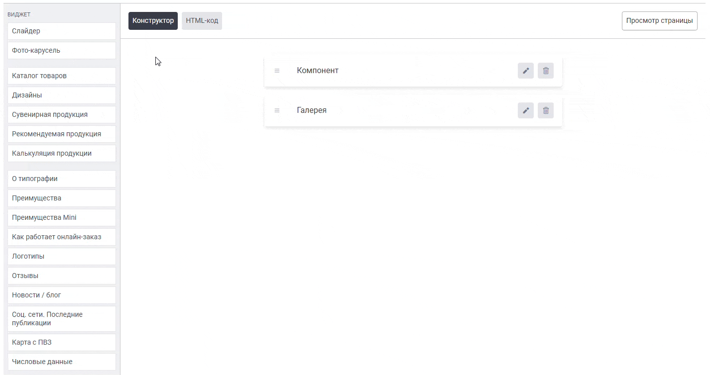

Виджет «Исходный код» позволяет поместить html-код (верстку) в виджет и размещать его на любых страницах сайта. Виджет повышает удобство работы с кодом, путем уменьшения объема кода на странице.

## **О виджете «Исходный код»**


### Как создать?

Чтобы создать виджет «Исходный код», в админ-панели сайта войдите в раздел «*Контент -> Виджеты»*, нажмите на кнопку «Добавить» в правом верхнем углу. В открывшемся окне найдите виджет «Исходный код\*»\* и нажмите «Создать».


### Параметры виджета

Перед вами откроется форма с возможностью выбрать параметры виджета.

.png>)

Заполните поля и выберите параметры:

#### **Название виджета**

Внутреннее название для админ-панели. Нигде не отображается.

#### **Тип устройства**

-  Универсальный -- виджет будет отображаться на всех устройствах;

-  Для десктопа -- отображение будет только на компьютере/ноутбуке;

-  Для мобильных устройств -- отображение только на мобильных устройствах.

#### **Контент**

Наполнение виджета -- текст, изображения, html-код и т.д.


:::note 

Не забудьте активировать виджет после создания. Это можно сделать в разделе «Контент -> Виджеты», путем переключения бегунка в состояние Вкл.

:::


### Порядок установки (2 вар.)

#### 1 вариант -- Через вставку кода

После сохранения всех параметров, скопируйте «Код для установки на сайт».

{width=888px height=188px}


Перейдите на нужную страницу или продукт, в режиме исходного кода вставьте код виджета в то место, которое необходимо.\
Готово!

(*Дважды кликните по изображению, чтобы запустить GIF*)

{width=924px height=384px}


#### 2 вариант -- Через редактор страниц

Перейдите в раздел "Контент -> Наполнение сайта -> Страницы" нажмите на название страницы. Вы окажитесь в редакторе страниц.\
Слева выберите необходимый виджет и вставьте в поле правее в нужном порядке.\
Готово!

(*Дважды кликните по изображению, чтобы запустить GIF*)

{width=1426px height=754px}


## Пример использования

#### Виджет «Исходный код» в виде «Отзывы клиентов»

Свёрстанный в html-редакторе виджет «Исходный код» в качестве блока «Отзывы клиентов» для сайта


#### Опции

Можно править html-код виджета, меняя аватарки клиентов, рейтинг, цвет рейтинга, текст отзыва и дату размещения, фотографии продукции. А также можно увеличивать или уменьшать количество отзывов.


#### HTML-код

Скопируйте код и вставьте в виджет «Исходный код» в редакторе в режиме кода (иконка \</>)

```
<div class="full-width" style="padding: 48px 0; background-color: #F2F3F5;">

  <div id="reviews-widget" class="container reviews-widget reviews-widget-170">
      <div class="reviews list-review">
          <div class="reviews__header">
              <div class="reviews__header-title text-gray-800"><span style="font-family: FontBold; font-size: 26px; color: rgb(0, 0, 0);">Отзывы наших клиентов</span></div><div class="reviews__header-info"><div class="row"><div class=""><div class="text-3" style="text-align: center;"><span><span class="d-sm-block d-md-inline mb-1 text-gray-700" style="font-size: 18px;"><span style="font-family: FontRegular; font-size: 20px;">Общий рейтинг </span><span style="font-size: 20px; font-family: FontRegular;">4,83</span><span style="font-family: FontRegular; font-size: 20px;">&nbsp;из </span><span style="font-size: 20px; font-family: FontRegular;">5</span><span style="font-family: FontRegular; font-size: 20px;">. Всего отзывов </span><span style="font-size: 20px; font-family: FontRegular;">21</span></span><span style="font-size: 20px;">&nbsp;</span><span><span style="font-size: 18px;"></span></span></span></div>
                      </div>
                  </div>
              </div>
          </div>
          <div class="reviews__content">
            
            <div class="reviews__content_item">
                  <div class="reviews__content_item-img">
                      
                  </div>
                  <div class="reviews__content_item-text">
                      <div class="reviews__content_item-text-top text-3">
                          <div class="item-text-top-name">Александра Маринина</div>
                          <div class="item-text-top-score text-3 d-block d-md-inline-block">
                              <div style="display:flex; align-items: center;">
                                  <span><i class="w2p-icon-star4 active"></i></span>
                                  <span><i class="w2p-icon-star4 active"></i></span>
                                  <span><i class="w2p-icon-star4 active"></i></span>
                                  <span><i class="w2p-icon-star4 active"></i></span>
                                  <span><i class="w2p-icon-star4 active"></i></span>
                                  <span class="text-gray-700">5.0</span>
                              </div>
                          </div>
                          <div class="item-text-top-date small-text text-gray-500">28-05-2019</div>
                      </div>
                      <div class="reviews__content_item-text-bottom text-1 text-gray-700">Заказала календарь и не пожалела! Хорошее качество, календарь приятный на ощупь, фотографии напечатались яркими красивыми. Закзаала онлайн, сделали все быстро. Работой довольна, советую всем</div><br>
                    <!----------------------Начало блока с изображениями отзывов----------------------->
                        <div class="reviews_images slider-modal">
                            <div class="slider-modal-item reviews_images-item" data-image="/uploads/imagesContent/45108257262d80d6214f691.34470060.jpg" style="background-image: url('/uploads/imagesContent/45108257262d80d6214f691.34470060.jpg');"></div>
                            <div class="slider-modal-item reviews_images-item" data-image="/uploads/imagesContent/188319026262d80d40235953.19346062.jpg" style="background-image: url('/uploads/imagesContent/188319026262d80d40235953.19346062.jpg');"></div>
                            <div class="slider-modal-item reviews_images-item" data-image="/uploads/imagesContent/179311537062d80d621fbb38.36377519.jpg" style="background-image: url('/uploads/imagesContent/179311537062d80d621fbb38.36377519.jpg');"></div>
                        </div>
                        <!----------------------Конец блока с изображениями отзывов----------------------->  
                  </div>
              </div>
  
            
              <div class="reviews__content_item">
                  <div class="reviews__content_item-img">
                      
                  </div>
                  <div class="reviews__content_item-text">
                      <div class="reviews__content_item-text-top text-3">
                          <div class="item-text-top-name">Ирина Иванова</div>
                          <div class="item-text-top-score text-3 d-block d-md-inline-block">
                              <div style="display:flex; align-items: center;">
                                  <span><i class="w2p-icon-star4 active"></i></span>
                                  <span><i class="w2p-icon-star4 active"></i></span>
                                  <span><i class="w2p-icon-star4 active"></i></span>
                                  <span><i class="w2p-icon-star4 active"></i></span>
                                  <span><i class="w2p-icon-star4 active"></i></span>
                                  <span class="text-gray-700">5.0</span>
                              </div>
                          </div>
                          <div class="item-text-top-date small-text text-gray-500">20-07-2022</div>
                      </div>
                      <div class="reviews__content_item-text-bottom text-1 text-gray-700">Решила создать фотокалендарь для своей подруги в подарок. Немного боялась, что получится не то, что я хотела. В итоге зря переживала. Заказ пришел, качество хорошее. Моя подруга не ожидала такого необычного подарка!</div><br>
                		<!----------------------Начало блока с изображениями отзывов----------------------->
                        <div class="reviews_images slider-modal">
                            <div class="slider-modal-item reviews_images-item" data-image="/uploads/imagesContent/151272796862d8103c457230.69555842.jpg" style="background-image: url('/uploads/imagesContent/151272796862d8103c457230.69555842.jpg');"></div>
                            <div class="slider-modal-item reviews_images-item" data-image="/uploads/imagesContent/65011563162d8103c2bfc06.94008170.jpg" style="background-image: url('/uploads/imagesContent/65011563162d8103c2bfc06.94008170.jpg');"></div>
                        </div>
                        <!----------------------Конец блока с изображениями отзывов----------------------->  
                	</div>
              </div>
  
              <div class="reviews__content_item">
                  <div class="reviews__content_item-img">
                      
                  </div>
                  <div class="reviews__content_item-text">
                      <div class="reviews__content_item-text-top text-3">
                          <div class="item-text-top-name">Гульназ Н.</div>
                          <div class="item-text-top-score text-3 d-block d-md-inline-block">
                              <div style="display:flex; align-items: center;">
                                  <span><i class="w2p-icon-star4 active"></i></span>
                                  <span><i class="w2p-icon-star4 active"></i></span>
                                  <span><i class="w2p-icon-star4 active"></i></span>
                                  <span><i class="w2p-icon-star4 active"></i></span>
                                  <span><i class="w2p-icon-star4 active"></i></span>
                                  <span class="text-gray-700">5.0</span>
                              </div>
                          </div>
                          <div class="item-text-top-date small-text text-gray-500">13-07-2022</div>
                      </div>
                      <div class="reviews__content_item-text-bottom text-1 text-gray-700">Заказала себе календарь с фотографиями. Удобно, что на сайте самостоятельно создавала макет и выбирала подходящие фото. В онлайн-редакторе фотокалендаря видно, как будет смотреться вживую, и сразу можно было внести правки — удобно. Календарь доставили за 3 дня до Москвы. Качество отличное. Приятно трогать, плотная бумага — ребенок постоянно вертит, все на месте :)
 Я сделала коллаж фотографий с прошлого года. Перелистывая сейчас фотокалендарь мы всей семьей с удовольствием вспоминаем теплые и приятные моменты, вот так!</div>
                  </div>
              </div>
  
              <div class="reviews__content_item">
                  <div class="reviews__content_item-img">
                      
                  </div>
                  <div class="reviews__content_item-text">
                      <div class="reviews__content_item-text-top text-3">
                          <div class="item-text-top-name">Олечка Ильина</div>
                          <div class="item-text-top-score text-3 d-block d-md-inline-block">
                              <div style="display:flex; align-items: center;">
                                  <span><i class="w2p-icon-star4 active"></i></span>
                                  <span><i class="w2p-icon-star4 active"></i></span>
                                  <span><i class="w2p-icon-star4 active"></i></span>
                                  <span><i class="w2p-icon-star4 active"></i></span>
                                  <span><i class="w2p-icon-star4 active"></i></span>
                                  <span class="text-gray-700">5.0</span>
                              </div>
                          </div>
                          <div class="item-text-top-date small-text text-gray-500">12-07-2022</div>
                      </div>
                      <div class="reviews__content_item-text-bottom text-1 text-gray-700">Приятная, плотная бумага, хорошее качество, удобно загружать свои фото с компьютера и создавать фотокалендарь прямо на сайте. Ставлю одни пятерки, рекомендую !!!</div>
                  </div>
              </div>
  
              <div class="reviews__content_item">
                  <div class="reviews__content_item-img">
                      
                  </div>
                  <div class="reviews__content_item-text">
                      <div class="reviews__content_item-text-top text-3">
                          <div class="item-text-top-name">Дима Ф.</div>
                          <div class="item-text-top-score text-3 d-block d-md-inline-block">
                              <div style="display:flex; align-items: center;">
                                  <span><i class="w2p-icon-star4 active"></i></span>
                                  <span><i class="w2p-icon-star4 active"></i></span>
                                  <span><i class="w2p-icon-star4 active"></i></span>
                                  <span><i class="w2p-icon-star4 active"></i></span>
                                  <span><i class="w2p-icon-star4"></i></span>
                                  <span class="text-gray-700">4.0</span>
                              </div>
                          </div>
                          <div class="item-text-top-date small-text text-gray-500">09-07-2022</div>
                      </div>
                      <div class="reviews__content_item-text-bottom text-1 text-gray-700">Заказал календарь с семейными фотографиями, попробовал по акции, недорого. Жене понравилось, сейчас хотим ещё заказать. Единственное, фотокалендарь с доставка в Екатеринбург приходится ждать 7 дней, за это 4.</div>
                  </div>
              </div>
              <div class="reviews__content_item">
                  <div class="reviews__content_item-img">
                      
                  </div>
                  <div class="reviews__content_item-text">
                      <div class="reviews__content_item-text-top text-3">
                          <div class="item-text-top-name">Александр С.А.</div>
                          <div class="item-text-top-score text-3 d-block d-md-inline-block">
                              <div style="display:flex; align-items: center;">
                                  <span><i class="w2p-icon-star4 active"></i></span>
                                  <span><i class="w2p-icon-star4 active"></i></span>
                                  <span><i class="w2p-icon-star4 active"></i></span>
                                  <span><i class="w2p-icon-star4 active"></i></span>
                                  <span><i class="w2p-icon-star4 active"></i></span>
                                  <span class="text-gray-700">5.0</span>
                              </div>
                          </div>
                          <div class="item-text-top-date small-text text-gray-500">26-06-2019</div>
                      </div>
                      <div class="reviews__content_item-text-bottom text-1 text-gray-700">Заказывал фотокалендари. Получились оригинальные и очень красочные! Возможность начать с любого месяца. Отлично вписался в наш интерьер. Однозначно обращусь ещё раз =)</div>
                  </div>
              </div>
          </div>
      </div>
  </div>
  
  </div>
  <style>
  
      /**
       * Widget Reviews
       */
  
      .reviews-widget .reviews {
          width: 100%;
          margin-left: auto;
          margin-right: auto;
      }
  
      .reviews-widget .list-review {
          max-width: 918px;
      }
  
      .reviews-widget .reviews__header {
          margin-bottom: 38px;
      }
  
      .reviews-widget .reviews__header-title {
          text-align: center;
          margin-bottom: 32px;
      }
  
      .reviews-widget .reviews__header-info h1, .reviews__header-info h3 {
          display: inline;
      }
  
      .reviews-widget .reviews__header-info_rating, .reviews-widget .reviews__header-info_count {
          display: flex;
          align-items: center;
          height: 100%;
      }
  
      .reviews-widget .reviews__header-info_rating a, .reviews-widget .reviews__header-info_count a {
          text-decoration: none;
      }
  
      .reviews-widget .reviews__header-info_rating {
          justify-content: flex-end;
      }
  
      .reviews-widget .reviews__header-info_count .company-color-text {
          margin-left: 8px;
      }
  
      .reviews-widget .reviews__header-info_rating .bg-company-color {
          margin-left: 4px;
      }
  
      .reviews-widget .reviews__header-info_rating .bg-company-color {
          line-height: 32px;
          padding: 0 8px;
          border-radius: 4px;
      }
  
      .reviews-widget .reviews__content_item {
          display: flex;
          margin-bottom: 48px;
          position: relative;
      }
  
      .reviews-widget .reviews__content_item-img img {
          max-width: 60px;
          max-height: 60px;
      }
  
      .reviews-widget .reviews__content_item-text-top {
          margin-bottom: 0;
          display: flex;
      }
  
      .reviews-widget .item-text-top-name, .reviews-widget .item-text-top-score {
          display: inline-block;
      }
  
      .reviews-widget .list-review .item-text-top-name {
          margin-bottom: 9px;
          color: #4a5767;
      }
  
      .reviews-widget .item-text-top-score > div {
          display: flex;
          align-items: center;
      }
  
      .reviews-widget .item-text-top-name {
          margin-right: 26px;
      }
  
      .reviews-widget .item-text-top-date {
          position: absolute;
          right: 0;
          top: 0;
      }
  
      .reviews-widget .reviews__content_item-text {
          margin-left: 16px;
      }
  
      .reviews-widget .reviews__content_item-text-bottom {
          line-height: 22px;
      }
  
      .reviews-widget .w2p-icon-star4 {
          color: #CBD5E0;
          font-size: 14px;
          font-style: normal !important;
      }
  
      .reviews-widget .w2p-icon-star4.active {
          color: #F7C34A;
      }
  
      .reviews-widget .item-text-top-score span:last-child {
          margin-left: 8px;
      }
  
      @media (max-width: 788px) {
          .reviews-widget .reviews__header-info_rating, .reviews-widget .reviews__header-info_count {
              justify-content: center;
              text-align: center;
          }
  
          .reviews-widget .horizontal-review .reviews__header-info_rating .text-3 {
              display: flex;
              flex-direction: column;
          }
  
          .reviews-widget .reviews__content_item-text-top {
              display: block;
              align-items: unset;
          }
  
          .reviews-widget .greed-review .item-text-top-score {
              display: inline-block;
              margin-right: 8px;
          }
      }
  
      .reviews-widget .greed-review {
          max-width: 1440px;
      }
  
      .reviews-widget .greed-review .item-text-top-name {
          margin-right: 86px;
      }
  
      .reviews-widget .greed-review .reviews__content_item-text-bottom {
          margin-bottom: 8px;
      }
  
      .reviews-widget .horizontal-review .reviews__header-info .col-sm-12 {
          margin-bottom: 15px;
      }
  
      .reviews-widget .horizontal-review .reviews__header-info_rating {
          justify-content: center;
      }
  
      .reviews-widget .horizontal-review .reviews__header-info_rating .text-3 {
          margin-right: 32px;
      }
  
      .reviews-widget .horizontal-review .reviews__header-info .col-sm-12 {
          margin-bottom: 15px;
      }
  
      .reviews-widget .greed-mini .reviews__header-info_rating {
          justify-content: unset;
      }
  
      @media (max-width: 1044px) {
          .reviews-widget .horizontal-review .reviews__header-info_rating {
              flex-direction: column;
          }
  
          .reviews-widget .horizontal-review .reviews__header-info_rating .text-3 {
              margin-bottom: 7px;
              margin-right: unset;
          }
  
          .reviews-widget .horizontal-review .reviews__header-info_rating .text-3 span:first-child {
              margin-bottom: 22px;
          }
      }
  
      .read-more {
          font-size: 14px !important;
          text-decoration-color: #0a2b1d;
          display: none;
      }
  
      .read-more:hover {
          cursor: pointer;
      }
  
      text-gray-900 {
          color: #4a5767 !important;
      }
  
      .text-3 {
          font-size: 15px;
          font-family: FontSemiBold;
      }
  
      .text-gray-500 {
          color: #4a5767 !important;
      }

 /*----------------------Начало блока со стилями изображений отзывов-----------------------*/
            .reviews_images-item {
            width: 100px;
            height: 100px;
            float: left;
            position: relative;
            margin-right: 16px;
            background-position: center;
            background-size: cover;
        }
 /*----------------------Конец блока со стилями изображений отзывов-----------------------*/

  
      .small-text {
          font-size: 13px;
          font-family: FontRegular;
      }
  
      .text-gray-700, .text-gray-800 {
          color: #4a5767 !important;
      }
  
      .text-1 {
          font-size: 15px;
          font-family: FontRegular;
      }
      
      .full-width {
          margin-left: calc(50% - 50vw);
          margin-right: calc(50% - 50vw);
      }

      @media (max-width: 768px) {
          .reviews-widget .item-text-top-score {
              display: block;
          }

          .reviews-widget .item-text-top-name {
            margin-right: 80px;
          }
      }
  </style>  
```