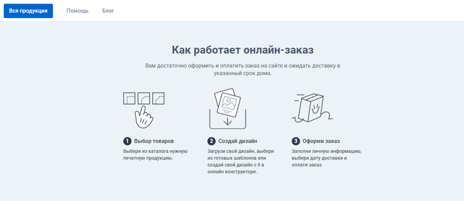
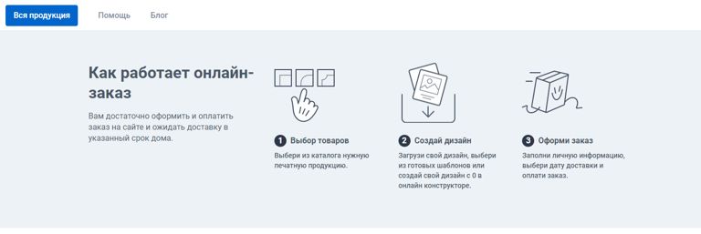
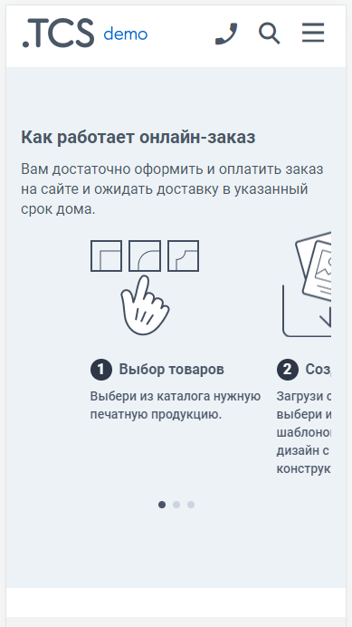

Виджет «Как работает онлайн заказ» позволяет показать клиенту порядок оформления заказа. Отображает 3-4 шага, каждый шаг имеет иконку, заголовок и текст описания, также к шагу можно добавить ссылку.

## Варианты отображения (2 вида)

[tabs]

[tab:Надпись сверху]

**Десктоп:**

{width=768px height=338px}

**Мобильные устройства:**

{width=389px height=692px}

**Особенности:**

-- В мобильной версии виджет имеет только один вариант отображения.

[/tab]

[tab:Надпись слева]

**Десктоп:**

{width=768px height=257px}

**Мобильные устройства:**

{width=389px height=692px}

**Особенности:**

-- Компактный вид -- все элементы виджета располагаются в одну строку;

-- В мобильной версии виджет имеет только один вариант отображения.

[/tab]

[/tabs]

## Как создать?

Чтобы создать виджет «Как работает онлайн-заказ», в админ-панели сайта войдите в раздел «*Контент -> Виджеты»*, нажмите на кнопку «Добавить» в правом верхнем углу. В открывшемся окне найдите виджет «Как работает онлайн-заказ\*»\* и нажмите «Создать».

## Параметры

### 

### Общие

Перед вами откроется форма с возможностью выбрать параметры виджета.

.png>)

Заполните поля и выберите параметры:

-  **Название** виджета\
   Внутреннее название для админ-панели. Нигде не отображается.

-  **Тип устройства**

   -  Универсальный -- виджет будет отображаться на всех устройствах;

   -  Для десктопа -- отображение будет только на компьютере/ноутбуке;

   -  Для мобильных устройств -- отображение только на мобильных устройствах.

-  **Количество элементов в ряд**

   Имеется возможность разместить в один ряд 3 или 4 элемента.

-  **Тип отображения**

   Вариант отображения виджета:

   -  Надпись сверху -- Заголовок и Описание виджета будут располагаются вверху виджета, под ними -- элементы виджета;

   -  Надпись слева -- Заголовок и Описание располагаются слева, дальше в строку элементы виджета.

-  **Заголовок**\
   Заголовок виджета типа H2.

-  **Описание**\
   Текст описания виджета типа малый наборный текст.

-  **Текст ссылки**\
   Возможность прописать текст, при нажатии на который, клиент будет переадресован на указанную страницу. Текст типа ссылка.

-  **Url ссылки**\
   При нажатии на текст ссылки, клиент будет переадресован на указанную страницу.

Каждый элемент имеет индивидуальные настройки, среди них:

-  **Заголовок**\
   Заголовок элемента типа основной наборный текст (толщина 3).

-  **Описание**\
   Текст описания элемента типа малый наборный текст.

-  **Url**\
   Изображение элемента всегда имеет активную ссылку, в это поле необходимо вставить ссылку на страницу, на которую клиент попадет при клике на изображение.\
   Например, в элемент с содержанием информации о Доставке, можно указать ссылку на страницу сайта «Доставка и оплата».

-  **Изображение**\
   В каждый элемент необходимо загрузить соответствующее изображение.

:::note 

Не забудьте активировать виджет после создания. Это можно сделать в разделе «Контент -> Виджеты», путем переключения бегунка в состояние Вкл.

:::

### Требования к изображениям

Требования к изображениям не зависят от параметров виджета и типа устройства.

**Размер изображения**:\
120 x 120 px

**Допустимые форматы**:\
.jpeg, .png и .gif

:::info 

Виджет по умолчанию имеет заливку фона цветом #eef2f7.\
Учитывайте этот момент при подготовке изображений.

:::

## Порядок установки (2 вар.)

### 

### 1 вариант -- Через вставку кода

После сохранения всех параметров, скопируйте «Код для установки на сайт».

{width=888px height=188px}

Перейдите на нужную страницу или продукт, в режиме исходного кода вставьте код виджета в то место, которое необходимо.\
Готово!

(*Дважды кликните по изображению, чтобы запустить GIF*)

{width=924px height=384px}

### 2 вариант -- Через редактор страниц

Перейдите в раздел "Контент -> Наполнение сайта -> Страницы" нажмите на название страницы. Вы окажитесь в редакторе страниц.\
Слева выберите необходимый виджет и вставьте в поле правее в нужном порядке.\
Готово!

(*Дважды кликните по изображению, чтобы запустить GIF*)

{width=1426px height=754px}