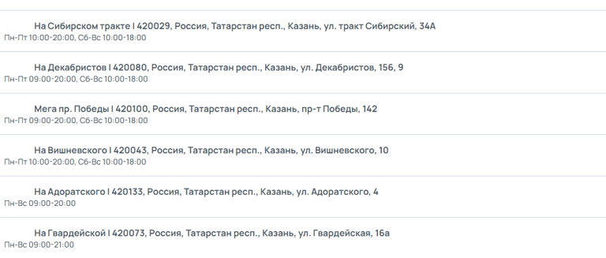
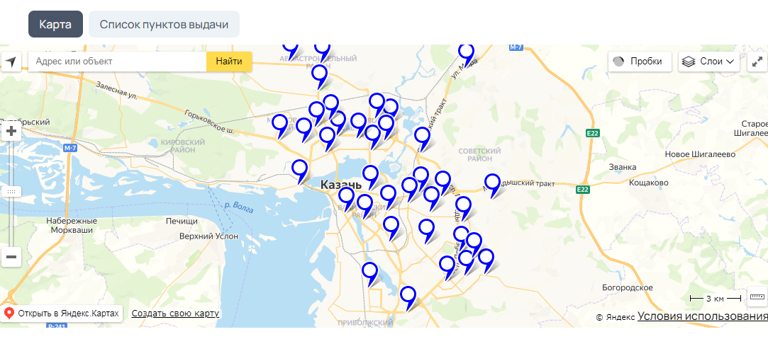
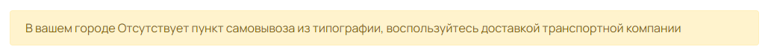
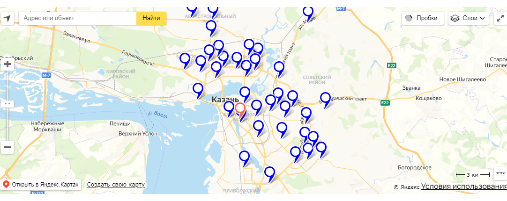

# Виджет «Карта с ПВЗ»

## Варианты отображения (3 вида)

[tabs]

[tab:Отображение картой]

{width=768px height=308px}

**Особенности:**

-- Компактный вид -- клиент видит сразу все ПВЗ;

-- Удобно клиентам, которые привыкли ориентироваться по карте.

[/tab]

[tab:Отображение списком]

{width=768px height=327px}

**Особенности:**

-- Если ПВЗ большое количество, то на странице будут отображаться сразу все, что может усложнить восприятие, так как в некоторых случаях ПВЗ может быть больше 50;

-- Удобно клиентам, которые привыкли ориентироваться по названиям улиц.

[/tab]

[tab:Комбинированное отображение]

{width=768px height=339px}

**Особенности:**

-- Позволяет объединить два разных вида, чтобы клиент мог сам выбрать наиболее удобный.

[/tab]

[/tabs]

## Как создать?

Чтобы создать виджет «Карта с ПВЗ», в админ-панели сайта войдите в раздел «*Контент -> Виджеты»*, нажмите на кнопку «Добавить» в правом верхнем углу. В открывшемся окне найдите виджет «Карта с ПВЗ\*»\* и нажмите «Создать».

## Параметры

### 

### Общие

Перед вами откроется форма с возможностью выбрать параметры виджета.

.png>)

Заполните поля и выберите параметры:

-  **Название** виджета\
   Внутреннее название для админ-панели. Нигде не отображается.

-  **Тип устройства**

   -  Универсальный -- виджет будет отображаться на всех устройствах;

   -  Для десктопа -- отображение будет только на компьютере/ноутбуке;

   -  Для мобильных устройств -- отображение только на мобильных устройствах.

-  **Текст при отсутствии ПВЗ на карте**

   Если в городе клиента нет ни одного ПВЗ, то вместо виджета будет отображаться указанный текст ([пример](./vidzhet-karta-s-pvz#dopolnitelno)).

-  **Отображение**

   -  Показывать филиалы -- в виджете можно отображать пункты самовывоза из типографии, для этого необходимо в настройках [филиала ](./../../settings/dostavka/filialy#nastroiki-punkta-samovyvoza-koordinaty)указать координаты пункта самовывоза из типографии;

   -  Показывать Список -- отображать виджет списком;

   -  Показывать Карту -- отображать виджет картой.

-  **Карта**\
   Необходимо выбрать карты какого сервиса будут использованы при формировании виджета на сайте:

   -  Яндекс.Карты -- универсальный способ, не требует настроек;

   -  Google карты -- данный способ требует наличия ключа интеграции, настраивается в [интеграциях](./../../settings/integracii/karty#google-maps).

-  **Доставка**

   Здесь показаны все активные интеграции доставки, выберите доставку, ПВЗ которой будут отображаться в виджете.

:::info 

На карте виджета отображаются пункты выдачи того города, который указан в шапке сайта. Как правило, этот город определяется автоматически при заходе клиента на сайт.

:::

:::note 

Не забудьте активировать виджет после создания. Это можно сделать в разделе «Контент -> Виджеты», путем переключения бегунка в состояние Вкл.

:::

### Дополнительно

[tabs]

[tab:Отсутствие ПВЗ]

При отсутствии ПВЗ в городе клиента, виджет будет иметь следующий вид:

{width=768px height=55px}

[/tab]

[tab:Пункты самовывоза из типографии]

Пункты самовывоза из типографии отображаются красным цветом, таким образом они будут выделяться на фоне ПВЗ транспортных компаний:

{width=1082px height=430px}

[/tab]

[/tabs]

## Порядок установки (2 вар.)

### 

### 1 вариант -- Через вставку кода

После сохранения всех параметров, скопируйте «Код для установки на сайт».

{width=888px height=188px}

Перейдите на нужную страницу или продукт, в режиме исходного кода вставьте код виджета в то место, которое необходимо.\
Готово!

{width=750px height=299px}

### 2 вариант -- Через редактор страниц

Перейдите в раздел "Контент -> Наполнение сайта -> Страницы" нажмите на название страницы. Вы окажитесь в редакторе страниц.\
Слева выберите необходимый виджет и вставьте в поле правее в нужном порядке.\
Готово!

{width=765px height=404px}