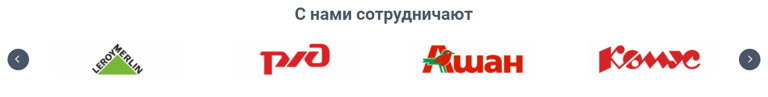
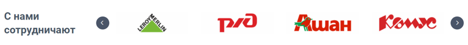
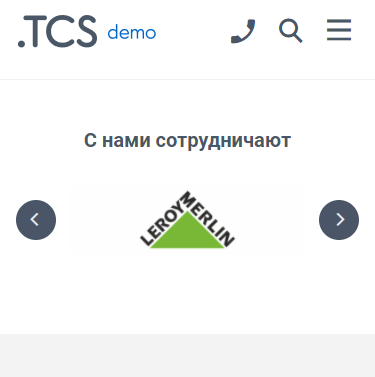
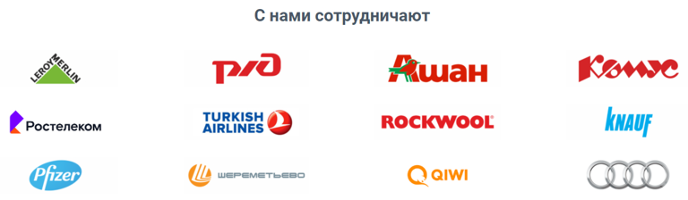
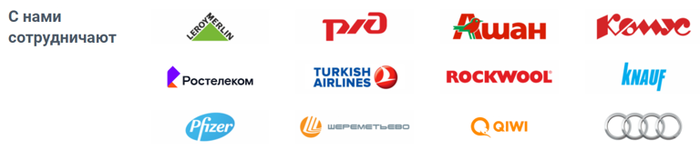
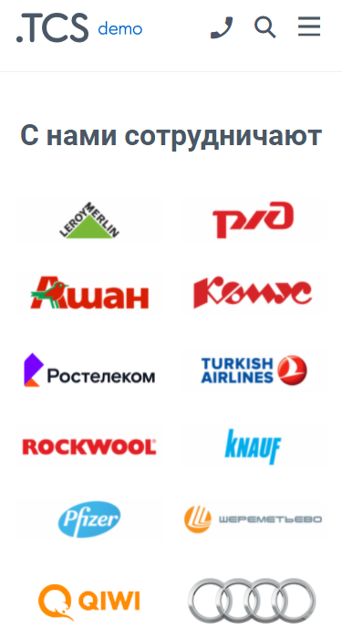
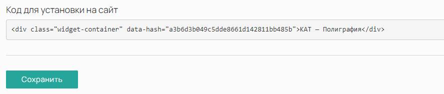

Виджет «Слайдер» позволяет отобразить на сайте изображение в виде слайдера / баннера. На изображение можно добавить текст или встроить ссылку для перехода в различные разделы сайта.

## Варианты отображения (2 вида)

[tabs]

[tab:Слайдером]

**Десктоп:** Надпись сверху

{width=768px height=97px}

Надпись слева

{width=768px height=74px}

**Мобильные устройства:**

{width=375px height=377px}

**Особенности:**

-- Компактный вид -- виджет отображается в одну строку с возможностью их пролистывать;

-- В мобильной версии всегда отображается один логотип со стрелками по бокам для пролистывания.

[/tab]

[tab:Списком]

**Десктоп:** Надпись сверху

{width=768px height=224px}

Надпись слева

{width=768px height=165px}

**Мобильные устройства:**

{width=375px height=701px}

**Особенности:**

-- Отображаются сразу все имеющиеся логотипы -- проще воспринимать информацию, так как все на виду

-- В мобильной версии логотипы отображается в два столбца;

-- Если логотипов большое количество, то для мобильной версии лучше использовать вариант отображения слайдер.

[/tab]

[/tabs]

## Как создать?

Чтобы создать виджет «Логотипы», в админ-панели сайта войдите в раздел «*Контент -> Виджеты»*, нажмите на кнопку «Добавить» в правом верхнем углу. В открывшемся окне найдите виджет «Логотипы\*»\* и нажмите «Создать».

## Параметры

### 

### Общие

Перед вами откроется форма с возможностью выбрать параметры виджета.

.png>)

Заполните поля и выберите параметры:

-  **Название** виджета\
   Заголовок виджета типа типа H3.

-  **Тип устройства**

   -  Универсальный -- виджет будет отображаться на всех устройствах;

   -  Для десктопа -- отображение будет только на компьютере/ноутбуке;

   -  Для мобильных устройств -- отображение только на мобильных устройствах.

-  **Тип отображения**

   Вариант отображения логотипов виджета:

   -  Слайдер -- логотипы будут отображаться слайдером в одну строку;

   -  Список -- отображаться будут сразу все логотипы списком в несколько рядов.

-  **Количество в ряд**\
   Можно выбрать 4, 6 и 12 логотипов в ряд.

-  **Текст**\
   Расположение заголовка виджета, Сверху или Слева от логотипов.

:::note 

Не забудьте активировать виджет после создания. Это можно сделать в разделе «Контент -> Виджеты», путем переключения бегунка в состояние Вкл.

:::

### Дополнительные

После сохранения настроек виджета, появится новая вкладка «Изображения».

Здесь вы можете загружать новые изображения и удалять существующие.\
Также имеется возможность сортировать изображения путем перетаскивания их курсором мыши.

(*Дважды кликните по изображению, чтобы запустить GIF*)

### Требования к изображениям

Требования к изображениям зависят от параметра виджета «Количество в ряд».

[tabs]

[tab:4 логотипа в ряд]

**Размер изображения**:

250 x 69 px.

**Допустимые форматы**:

.jpeg, .png и .gif.

[/tab]

[tab:6 логотипов в ряд]

**Размер изображения**:

180 x 69 px.

**Допустимые форматы**:

.jpeg, .png и .gif.

[/tab]

[tab:12 логотипов в ряд]

**Размер изображения**:

70 x 69 px.

**Допустимые форматы**:

.jpeg, .png и .gif.

[/tab]

[/tabs]

## Порядок установки (2 вар.)

### 

### 1 вариант -- Через вставку кода

После сохранения всех параметров, скопируйте «Код для установки на сайт».

{width=888px height=188px}

Перейдите на нужную страницу или продукт, в режиме исходного кода вставьте код виджета в то место, которое необходимо.\
Готово!

(*Дважды кликните по изображению, чтобы запустить GIF*)

{width=924px height=384px}

### 2 вариант -- Через редактор страниц

Перейдите в раздел "Контент -> Наполнение сайта -> Страницы" нажмите на название страницы. Вы окажитесь в редакторе страниц.\
Слева выберите необходимый виджет и вставьте в поле правее в нужном порядке.\
Готово!

(*Дважды кликните по изображению, чтобы запустить GIF*)

{width=1426px height=754px}