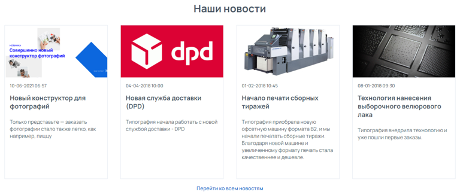
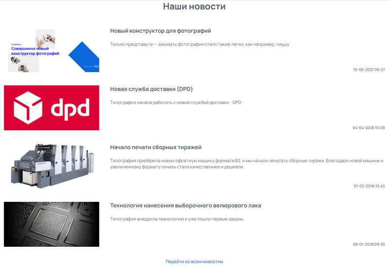
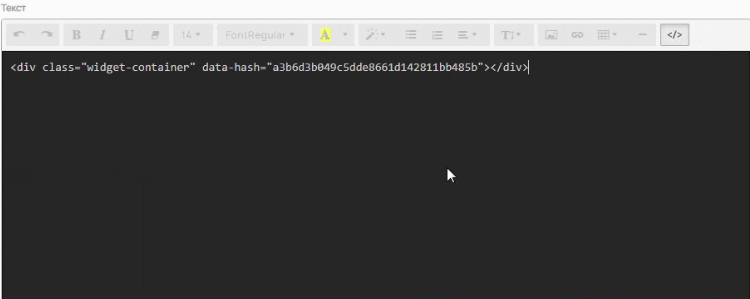
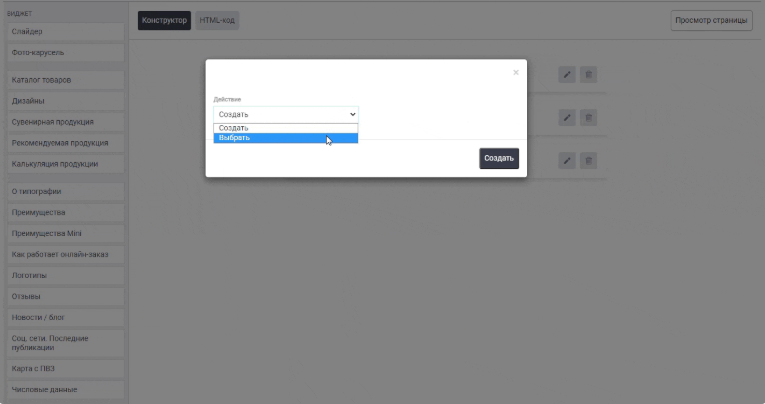

Виджет «Новости / блог» позволяет отобразить на сайте последние статьи новостей / блога. В виджете отображаются Заголовок статьи, Цитата, Изображение (опционально) и Дата публикации.

## Варианты отображения (2 вида)

[tabs]

[tab:Горизонтальный тип отображения]

{width=768px height=326px}

**Особенности:**

-- Компактный вид - отображаются последние 4 статьи в одну строку;

-- Отлично будет смотреться на главной странице.

[/tab]

[tab:Вертикальный тип отображения]

{width=768px height=529px}

**Особенности:**

-- Отображаются последние 4 статьи в списком.

[/tab]

[/tabs]

## Как создать?

Чтобы создать виджет «Новости / блог», в админ-панели сайта войдите в раздел «*Контент -> Виджеты»*, нажмите на кнопку «Добавить» в правом верхнем углу. В открывшемся окне найдите виджет «Новости / блог\*»\* и нажмите «Создать».

## Параметры

### 

### Общие

Перед вами откроется форма с возможностью выбрать параметры виджета.

.png>)

Заполните поля и выберите параметры:

-  **Название** виджета\
   Внутреннее название для админ-панели. Нигде не отображается.

-  **Тип устройства**

   -  Универсальный -- виджет будет отображаться на всех устройствах;

   -  Для десктопа -- отображение будет только на компьютере/ноутбуке;

   -  Для мобильных устройств -- отображение только на мобильных устройствах.

-  **Блог**

   В разделе [Новости](./../untitled/novosti-blog) можно создавать отдельные разделы новостей со своими url.\
   В параметре «Блог» необходимо выбрать раздел, статьи которого будут отображены в виджете.

-  **Тип отображения**

   -  Горизонтальный -- более компактный вид, отображаются 4 последние статьи в одну строку;

   -  Вертикальный -- 4 последние статьи отображаются списком.

-  **Заголовок**\
   Заголовок типа H2, отображается над виджетом.

-  **Текст ссылки**

   Ссылка ведет на отдельную страницу, на которой отображаются все статьи раздела. Текст типа ссылка.

-  **Показать фото**\
   Данный параметр позволяет отображать фотографию в виде тизера статьи. Фотография берется из настроек статьи с вкладки «Изображения».

:::note 

Не забудьте активировать виджет после создания. Это можно сделать в разделе «Контент -> Виджеты», путем переключения бегунка в состояние Вкл.

:::

:::info 

В виджете отображаются Заголовок статьи, Цитата, Изображение (опционально) и Дата публикации.\
Контент статьи отображается только на её странице.

:::

### Требования к изображениям

Требования к изображениям не зависят от параметров виджета.

**Размер изображения**:\
318 x 162 px

**Допустимые форматы**:\
.jpeg, .png и .gif

## Порядок установки (2 вар.)

### 

### 1 вариант -- Через вставку кода

После сохранения всех параметров, скопируйте «Код для установки на сайт».

{width=888px height=188px}

Перейдите на нужную страницу или продукт, в режиме исходного кода вставьте код виджета в то место, которое необходимо.\
Готово!

{width=750px height=299px}

### 2 вариант -- Через редактор страниц

Перейдите в раздел "Контент -> Наполнение сайта -> Страницы" нажмите на название страницы. Вы окажитесь в редакторе страниц.\
Слева выберите необходимый виджет и вставьте в поле правее в нужном порядке.\
Готово!

{width=765px height=404px}