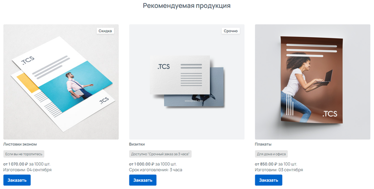
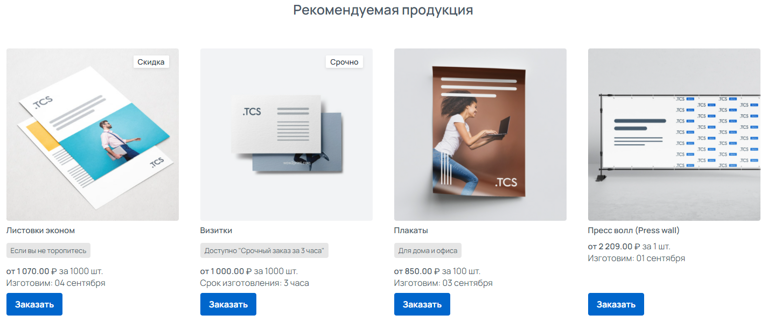
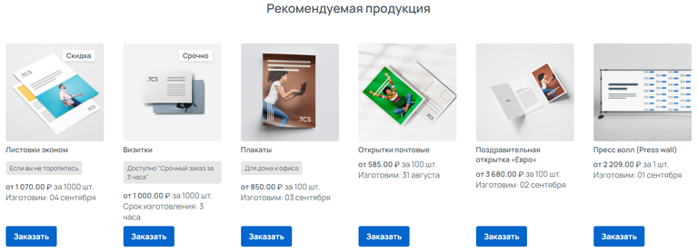
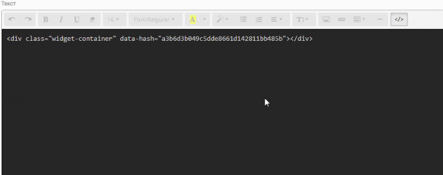
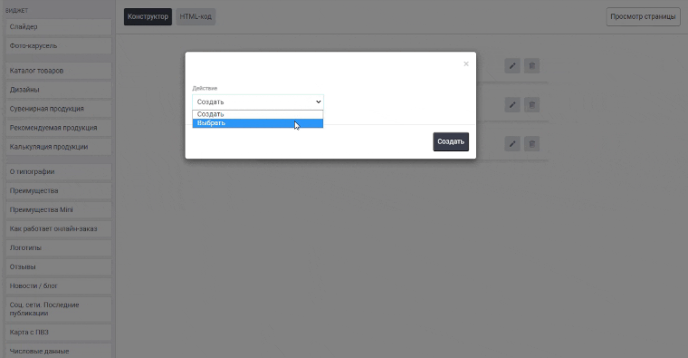

## Общий вид

.png>)

Куда следует размещать виджет «Рекомендуемая продукция»:

1. **На страницу каждого продукта** из вашего каталога\
   Расположите его в контент под калькуляцией.

2. **На страницу Корзины**\
   Виджет будет отображаться как при оформлении заказа, так и в пустой корзине.

:::info 

Данный виджет визуально напоминает виджет «Каталог товаров», основное отличие заключается в том, что виджет «Каталог товаров» отображает Категории продуктов, а виджет «Рекомендуемая продукция» отдельные Продукты.

:::

## Как создать?

Чтобы создать виджет «Рекомендуемая продукция», в админ-панели сайта войдите в раздел «*Контент -> Виджеты»*, нажмите на кнопку «Добавить» в правом верхнем углу. В открывшемся окне найдите виджет «Рекомендуемая продукция\*»\* и нажмите «Создать».

## Параметры

### Общие

Перед вами откроется форма с возможностью выбрать параметры виджета.

.png>)

Заполните поля и выберите параметры:

-  **Название виджета**\
   Внутреннее название для админ-панели. Нигде не отображается.

-  **Тип устройства**

   -  Универсальный -- виджет будет отображаться на всех устройствах;

   -  Для десктопа -- отображение будет только на компьютере/ноутбуке;

   -  Для мобильных устройств -- отображение только на мобильных устройствах.

-  **Заголовок**\
   Заголовок типа H2, отображается над виджетом.

-  **Количество в ряд**\
   Можно выбрать 3, 4 или 6 элементов в ряд.

-  **Количество строк**\
   Можно выбрать 1, 2 или 3 строки.\
   Данный виджет отображает фиксированное количество строк, если элементов больше, чем может отобразить виджет, то отобразятся лишь первые из списка включенных продуктов.

-  **Категории и продукты**\
   Виджет НЕ отображает категории продуктов, необходимо выбрать продукты, которые будут отображаться на сайте.

:::note 

Не забудьте активировать виджет после создания. Это можно сделать в разделе «Контент -> Виджеты», путем переключения бегунка в состояние Вкл.

:::

### Требования к изображениям

Требования к изображениям зависят от параметра виджета «Количество в ряд».

[tabs]

[tab:Отображение 3 в ряд]

**Размер изображения**: 440 x 440 px

**Допустимые форматы**: .jpeg, .png и .gif

{width=768px height=388px}

[/tab]

[tab:Отображение 4 в ряд]

**Размер изображения**: 320 x 320 px

**Допустимые форматы**: .jpeg, .png и .gif

{width=768px height=322px}

[/tab]

[tab:Отображение 6 в ряд]

**Размер изображения**: 200 x 200 px

**Допустимые форматы**: .jpeg, .png и .gif

{width=768px height=278px}

[/tab]

[/tabs]

## **Порядок установки (2 вар.)**

### **1 вариант -- Через вставку кода**

После сохранения всех параметров, скопируйте «Код для установки на сайт».

{width=888px height=188px}

Перейдите на нужную страницу или продукт, в режиме исходного кода вставьте код виджета в то место, которое необходимо. Готово!

{width=750px height=296px}

### **2 вариант -- Через редактор страниц**

Перейдите в раздел «Контент -> Наполнение сайта -> Страницы» нажмите на название страницы. Вы окажитесь в редакторе страниц. Слева выберите необходимый виджет и вставьте в поле правее в нужном порядке. Готово!

{width=760px height=395px}