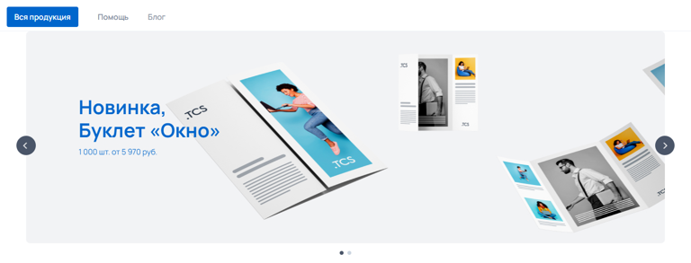
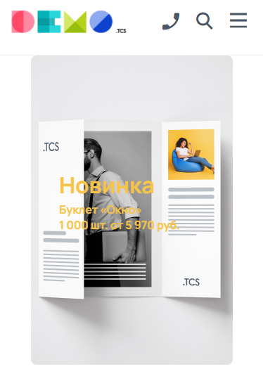
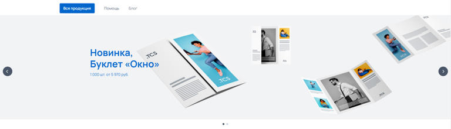
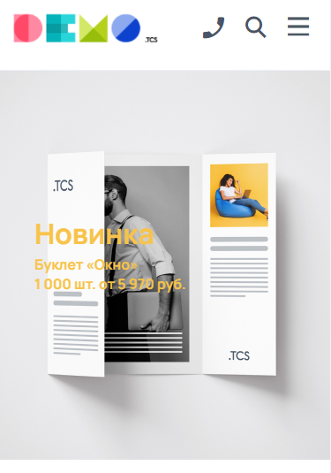
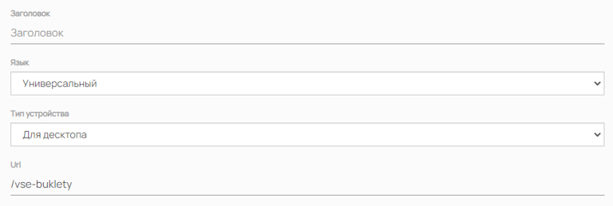
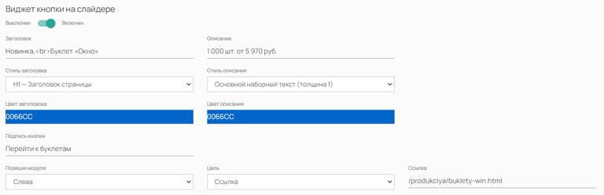
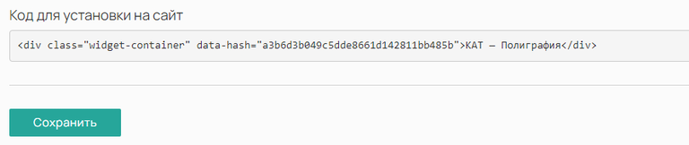

Виджет «Слайдер» позволяет отобразить на сайте изображение в виде слайдера / баннера. На изображение можно добавить текст или встроить ссылку для перехода в различные разделы сайта.

## Варианты отображения (2 вида)

[tabs]

[tab:По ширине контента]

**Десктоп:**

{width=768px height=293px}

**Мобильные устройства:**

{width=374px height=535px}

**Особенности:**

-- Слайдер по ширине имеет четкое ограничение в зависимости от типа устройства;

-- По краям слайдера будут белые полосы.

[/tab]

[tab:На всю ширину]

**Десктоп:**

{width=768px height=220px}

**Мобильные устройства:**

{width=375px height=535px}

**Особенности:**

-- Слайдер растягивается на всю ширину окна браузера;

-- В зависимости от ширины окна браузера (больше чем 1 920 px), изображение по горизонтали - сверху и снизу - может обрезаться.

[/tab]

[/tabs]

:::note 

Чтобы слайдер правильно отображался на всех устройствах, необходимо создавать отдельный виджет для десктопа и отдельный для мобильных устройств.\
Для каждого виджета используйте свои изображения соответствующих размеров.

:::

:::info 

В каждое изображение виджета можно добавить:

-  Текст -- как на примере выше, текст может передавать ключевую информацию, а так как текст идет отдельно от изображения, он при любом разрешении экрана будет находится в области контента, то есть не будет обрезаться;

-  Кнопку -- в дополнении к тексту можно добавить кнопку с ссылкой, например, изображение показывает какой-то конкретный продукт, кнопку можно назвать «Перейти к буклетам» и указать в ней ссылку на страницу буклетов;

-  Ссылку -- без какого-либо текста можно на все изображение добавить ссылку, при клике на изображение, клиент будет переадресован на указанную страницу.

Подробнее о каждом варианте [ниже](./vidzhet-slaider#redaktirovanie-izobrazheniya-dobavlenie-teksta-knopki-ssylki).

:::

## Как создать?

Чтобы создать виджет «Слайдер», в админ-панели сайта войдите в раздел «*Контент -> Виджеты»*, нажмите на кнопку «Добавить» в правом верхнем углу. В открывшемся окне найдите виджет «Слайдер\*»\* и нажмите «Создать».

## Параметры

### Общие

Перед вами откроется форма с возможностью выбрать параметры виджета.

.png>)

Заполните поля и выберите параметры:

-  **Название** виджета\
   Внутреннее название для админ-панели. Нигде не отображается.

-  **Тип устройства**

   -  Универсальный -- виджет будет отображаться на всех устройствах;

   -  Для десктопа -- отображение будет только на компьютере/ноутбуке;

   -  Для мобильных устройств -- отображение только на мобильных устройствах.

-  **Галерея**

   Папка из раздела [Галереи](./../untitled/galerei), на основе которой будет сформирован виджет.

-  **Ширина**

   Опции отображения виджета:

   -  По ширине контента -- изображение будет ограничено шириной контента, ширина контента своя для каждого устройства, подробнее [здесь](./vidzhet-slaider#trebovaniya-k-izobrazheniyam);

   -  На всю ширину -- ограничение по ширине будет исходить лишь от ширины окна браузера.

-  **Высота**\
   Значение высоты слайдера на сайте в пикселях (px).

:::info 

Виджет «Слайдер» имеет жесткое ограничение по высоте, значение высоты вы указываете самостоятельно в настройках виджета.

:::

:::note 

Не забудьте активировать виджет после создания. Это можно сделать в разделе «Контент -> Виджеты», путем переключения бегунка в состояние Вкл.

:::

### Дополнительные

После сохранения настроек виджета, появится новая вкладка «Изображения».

Эта вкладка предназначена для удобства, на ней продублировано содержимое соответствующей папки, выбранной в [общих](./vidzhet-slaider#obshie) настройках в параметре «Галерея». Здесь вы можете загружать новые изображения, удалять существующие, а также редактировать их.\
Также имеется возможность сортировать изображения путем перетаскивания их курсором мыши.

### Редактирование изображения (добавление Текста, Кнопки, Ссылки)

Перейти в окно редактирования изображения можно путем нажатия на иконку карандаша «Изменить»

.png>)

[tabs]

[tab:Ссылка при клике на изображение]

Достаточно указать лишь в поле «Url» ссылку видом «/vse-buklety», остальные поля оставьте без изменений

{width=768px height=259px}

Подробнее о всех настройках можно узнать в соответствующем разделе: [Галереи](https://support.wow2print.com/kontent/untitled/galerei).Необходимо ползунок параметра «Виджет кнопки на слайдере» перевести в состояние Вкл. Отобразятся настройки виджета:

[/tab]

[tab:Кнопка с ссылкой на изображение]

Необходимо ползунок параметра «Виджет кнопки на слайдере» перевести в состояние Вкл. Отобразятся настройки виджета:

{width=768px height=249px}

-  **Заголовок** Добавляет текст заголовка.

-  **Описание** Добавляет описание под заголовком.

-  **Стиль заголовка** и **Стиль описания** Позволяет определить стили текста для Заголовка и Описания. Стили берутся из настроек Дизайна сайта.

-  **Цвет заголовка** и **Цвет описания** Позволяет выбрать свой цвет для текста Заголовка и Описания.

-  **Цвет кнопки** настраивается в разделе Элементы дизайна.

-  **Подпись кнопки** Добавляет текст на кнопку.

-  **Позиция модуля** Позволяет выбрать расположение виджета кнопки на изображении:

   -  Слева;

   -  По центру;

   -  Справа.

-  **Цель** Выбрать событие, которое будет происходить при клике на кнопку:

   -  Ссылка -- при клике клиент будет переадресован на указанную ссылку;

   -  Форма обратной связи -- при клике откроется форма обратной связи.

-  **Ссылка** При клике на кнопку, клиент будет переадресован на указанную ссылку.

Подробнее о всех настройках можно узнать в соответствующем разделе: [Галереи](https://support.wow2print.com/kontent/untitled/galerei).

[/tab]

[/tabs]

### Требования к изображениям

:::info 

Требования к изображениям зависят от параметра виджета «Высота», а также от устройства. Высота виджета задается вручную.

:::

Ширина виджета (изображений виджета) в зависимости от устройства:

-  Desktop (настольные ПК) -- ширина 1 920 px;

-  Mobile (мобильные телефоны) -- ширина 375 px.

Пример:

Если вы хотите использовать виджет высотой 440 рх, то вам необходимо подготовить изображения размером 1920х440 рх для отображении на экранах мониторов настольных компьютеров, и 375х440 рх для отображения на мобильных устройствах.

[tabs]

[tab:По ширине контента]

**Допустимые форматы**: .jpeg и .png.

**Устройство** и соответствующий **размер изображения:**

Для десктопа (ноутбуки и настольные ПК) -- 1 320 x высоту px;

Для мобильных устройств (мобильные телефоны и планшеты) -- 375 x высоту px.

{width=768px height=293px}

[/tab]

[tab:На всю ширину страницы]

**Допустимые форматы**: .jpeg, .png, .webp, .gif

**Устройство** и соответствующий **размер изображения:**

Для десктопа (ноутбуки и настольные ПК) -- 1 920 x высоту px;

Для мобильных устройств (мобильные телефоны и планшеты) -- 375 x высоту px.

{width=768px height=220px}

[/tab]

[/tabs]

## Порядок установки (2 вар.)

### 

### 1 вариант -- Через вставку кода

После сохранения всех параметров, скопируйте «Код для установки на сайт».

{width=768px height=162px}

Перейдите на нужную страницу или продукт, в режиме исходного кода вставьте код виджета в то место, которое необходимо.\
Готово!

(*Дважды кликните по изображению, чтобы запустить GIF*)

{width=924px height=384px}

### 2 вариант -- Через редактор страниц

Перейдите в раздел "Контент -> Наполнение сайта -> Страницы" нажмите на название страницы. Вы окажитесь в редакторе страниц.\
Слева выберите необходимый виджет и вставьте в поле правее в нужном порядке.\
Готово!

(*Дважды кликните по изображению, чтобы запустить GIF*)

{width=1426px height=754px}