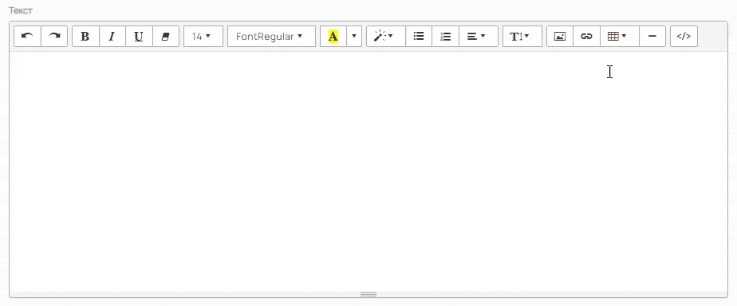

Виджет **"Ссылки / перелинковка"** - это универсальный инструмент для добавления на ваш сайт настраиваемых кнопок с активными ссылками. Он подходит для создания меню действий, ссылок на важные разделы сайта, внешние ресурсы или социальные сети. А так же для открытия и просмотра загруженных на сайт pdf-документов по ссылке в браузере.

<figure>

.png>)

<figcaption>

</figcaption>

</figure>

### **Создание виджета**

Добавить виджет на сайт можно двумя способами:

**Способ 1: Через раздел «Виджеты»**

1. Перейдите в раздел **Контент -> Виджеты**.

2. Нажмите кнопку **«Добавить»** в правом верхнем углу.

3. В открывшемся окне выберите **«Ссылка /** **перелинковка»** и нажмите **«Создать»**.

<figure>

.png>)

<figcaption>

</figcaption>

</figure>

**Способ 2: Через редактор страницы**

Самый наглядный метод, позволяющий сразу видеть расположение виджета на странице.

1. Откройте нужную страницу в визуальном редакторе через **Контент -> Наполнение сайта -> Страницы**.

2. В левой панели с виджетами найдите **«Ссылка /** **перелинковка»**.

3. Перетащите его в нужную область страницы или нажмите на значок `+`.

4. Во всплывающем окне выберите действие:

   -  **«Создать»** -- чтобы сразу настроить новый виджет.

   -  **«Выбрать»** -- чтобы использовать уже созданный ранее виджет из общего списка.

<figure>

.png>)

<figcaption>

</figcaption>

</figure>

### **Настройка виджета**

После создания откроется форма настройки. Заполните необходимые параметры:

-  **Название** - Укажите название виджета для удобства (например, "Ссылки на соцсети" или "Кнопки на главной"). Это название видно только вам в админ-панели, на сайте оно не отображается.

-  **Тип устройства** - Позволяет настроить отображение виджета. Например, его можно скрыть на мобильных устройствах, если он плохо вписывается в данную версию. По умолчанию стоит **«Универсальный»** (отображение на всех устройствах).

-  **Анкор** - Текст, который будет отображаться на кнопке (например, "Наши работы", "Цены", "Telegram").

-  **Ссылка** - Адрес, по которому перейдет пользователь при нажатии на кнопку. Можно указать как внутреннюю страницу (`/catalog`), так и полный внешний URL (`https://vk.com/your_page`).

-  **Добавить** - Кнопка позволяет добавить еще одну строку для создания следующей кнопки в рамках этого виджета.

Не забудьте нажать кнопку «Сохранить» после заполнения всех полей.

<figure>

.png>)

<figcaption>

</figcaption>

</figure>

### Порядок установки на сайт

Если вы создали виджет через раздел «Виджеты» (Способ 1), его нужно вручную разместить на нужной странице с помощью HTML-кода.

1. Перейдите в **Контент -> Виджеты** и найдите созданный виджет.

2. Скопируйте код из поля **«Код для установки на сайт»**.

<figure>

.png>)

<figcaption>

</figcaption>

</figure>

1. Откройте страницу, которую хотите редактировать, перейдите в режим HTML-редактора. Так же можно сделать через виджет **«Компонент»** или **«Исходный код»**.

2. Вставьте скопированный код в то место, где должен отображаться виджет.

3. Сохраните изменения.

(*Дважды кликните по изображению, чтобы запустить GIF*)

{width=924px height=384px}

:::info 

**Совет:** Для простоты и наглядности используйте **Способ 2 (через редактор страницы)**, так как он позволяет сразу видеть, как виджет будет выглядеть в структуре сайта.

:::

(*Дважды кликните по изображению, чтобы запустить GIF*)

<figure>

<figcaption>

</figcaption>

</figure>