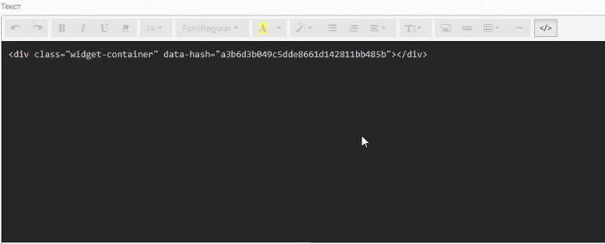
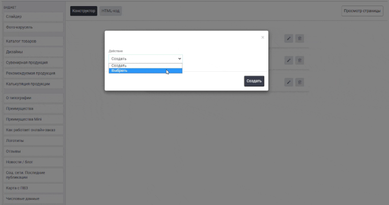

Виджет «Таймер» позволяет отобразить на сайте таймер, который может быть использован для маркетинговых целей.

## Общий вид

.gif>)

## Как создать?

Чтобы создать виджет «Таймер», в админ-панели сайта войдите в раздел «*Контент -> Виджеты»*, нажмите на кнопку «Добавить» в правом верхнем углу. В открывшемся окне найдите виджет «Таймер*»* и нажмите «Создать».

## Параметры

### Общие

Перед вами откроется форма с возможностью выбрать параметры виджета.

.png>)

Заполните поля и выберите параметры:

-  **Название** виджета\
   Внутреннее название для админ-панели.

-  **Тип устройства**

   -  Универсальный -- виджет будет отображаться на всех устройствах;

   -  Для десктопа -- отображение только на компьютере/ноутбуке;

   -  Для мобильных устройств -- отображение только на мобильных устройствах.

-  **Текст блока**\
   Добавляет над виджетом заголовок H2.

-  **Текст таймера**

   Добавляет в виджете над таймером заголовок H3.

-  **Время работы таймера (мес)**\
   Имеется возможность указать время работы таймера в месяцах. 1 месяц = 30 дней.

-  **Время работы таймера (дни)**\
   Время работы таймера в днях.

-  **Время работы таймера (часы)**\
   Время работы таймера в часах.

-  **Время начала**\
   С помощью этого поля можно задать точку отсчета таймера: год, месяц, день, часы и минуты.

-  **Цвет фона**\
   Виджет Таймер имеет сплошную заливку на всю ширину контента (от края до края окна браузера). Цвет выбирается в формате HEX с помощью цветовой палитры.

:::note 

Не забудьте активировать виджет после создания. Это можно сделать в разделе «Контент -> Виджеты», путем переключения бегунка в состояние Вкл.

:::

## Порядок установки (2 вар.)

### 1 вариант -- Через вставку кода

После сохранения всех параметров, скопируйте «Код для установки на сайт».

{width=888px height=188px}

Перейдите на нужную страницу или продукт, в режиме исходного кода вставьте код виджета в то место, которое необходимо.\
Готово!

{width=748px height=302px}

### 2 вариант -- Через редактор страниц

Перейдите в раздел "Контент -> Наполнение сайта -> Страницы" нажмите на название страницы. Вы окажитесь в редакторе страниц.\
Слева выберите необходимый виджет и вставьте в поле правее в нужном порядке.\
Готово!

{width=764px height=403px}