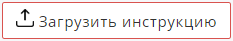

Вы можете подключить связь Поставщик -> Агентство, чтобы отображать продукты Поставщика с учетом собственной наценки. Для подключения, обратитесь с запросом в [Техническую поддержку.](./../dashboard/tekhnicheskaya-podderzhka)

## Если вы Агентство

После подключения вашего сайта к сайту Поставщика в разделе Магазин -> Контрагенты появится дополнительный раздел **Поставщики**,

.png>)

в котором будут отображаться все подключенные к вам типографии-поставщики.

.png>)

### Настройки наценки и условий работы

Для корректировки условий работы с Поставщиком нажмите на *название* поставщика и в открывшемся окне, в правом верхнем углу, нажмите кнопку "Изменить"

.png>)

В открывшейся форме вы можете:

-  Изменить наименование поставщика в поле *Название*

-  В поле *Стоимость доставки* внести фиксированную стоимость доставки в нужной валюте (данная сумма будет всегда прибавляться к стоимости тиража, можете вовсе ее не указывать в этом поле, а воспользоваться общей наценкой на продукцию поставщика)

-  В поле *Кол-во дней доставки* установить нужное количество дней доставки

-  Установить свою наценку от суммы заказа. При необходимости, вы можете установить разную наценку в зависимости от суммы заказа

-  В пункте *Отправка информации о клиенте* вы можете выбрать будет ли видеть данные о вашем клиенте Поставщик или нет. Данные передаются только по API.

-  Вы можете настроить автоматическую отправку заказа Поставщику, выбрав "Да" из списка в поле *Автоматическая отправка заказа.*

-  Заказ с вашего сайта будет сразу попадать в админ-панель Поставщика. Вы можете установить *условие автоматической отправки заказа*: все заказы или только оплаченные/с гарантией оплаты.

.png>)

\
Через кнопки "Внутренний баланс" и "Баланс доставки" вы можете пополнить балансы.

.png>)

По кнопке "История" вы сможете отследить все изменения по связи Агентство -> Поставщик.

### Синхронизация продукции

Чтобы синхронизировать продукцию с Поставщиком, нажмите на кнопку "Синхронизировать продукцию".

Выберите из списка продукцию, которую вы хотите разместить на своем сайте. Если вы синхронизируете продукцию повторно, то продукты, которые уже есть на вашем сайте, будут отмечены специальной иконкой.

.png>)

После выбора нужной продукции нажмите "Сохранить".

:::note 

Обратите внимание! Синхронизируется **только продукция** поставщика, без категорий.

:::

Вся синхронизированная продукция на сайте Агентства попадает в Продукция -> Без категории, откуда вы можете переместить ее в собственные категории.

.png>)

.png>)

В продукции от Поставщика отсутствует вкладка Калькуляция, т.к. Агентство по умолчанию использует полную калькуляцию с сайта поставщика со свой наценкой.

.png>)

Агентство может редактировать следующую информацию в продукте Поставщика:

Во вкладке **Общие**

-  изменить Название продукции

-  присвоить продукции Категорию

-  выбрать функцию Бесплатный продукт

-  выбрать отображать калькулятор или скрыть

-  определить макет в товаре или нет

-  загрузить свое изображение (тизер) продукта и свою иконку.

-  настроить свое отображение калькулятора, отличное от Поставщика (вертикальный, горизонтальный, нейро, карточка товара)

-  загрузить свою инструкцию (через кнопку {width=233px height=41px})

-  заполнить свое краткое описание товара

-  установить размер рамки на согласование.

Во вкладке **Контент**

-  заполнить свой контент (описание, изображения, таблицы, ссылки)

Во вкладке **Фотогалерея** загрузить свои изображения и создать виджеты на сайт.

Во вкладке **SEO** внести необходимые данные: Title, Description, Keywords, Заголовок H1 и Каноническая ссылка

Подробнее о заполнении и функционале этих вкладок вы можете узнать в разделе [Продукты](./../product/produkty/_index).

### Синхронизация статусов Агентства и Поставщика

Если вы отправляете заказ Поставщику, необходимо синхронизировать статусы заказов.

Для этого перейдите в Настройки -> Статусы -> Сопоставление статусов

.png>)

и сопоставьте свои статусы и статусы поставщика

.png>)

Например, статус заказа агентства "Готов к отправке" может быть сопоставлен со статусом поставщика "Завершен", т.к. до агентства заказ еще будет доставляться транспортной компанией.

Если у вас на сайте (Агентство) установлены уведомления об изменении статуса заказа для клиентов, то при изменении статуса заказа на сайте Поставщика, автоматически изменится статус заказа и у вас (Агентство). И клиенту будет отправлено уведомление соответствующее статусу, например, "Заказ отправлен".

Как создать Вкладки и назначить Статусы заказов можно посмотреть в разделе [Статусы заказов](./../settings/statusy/statusy-zakazov/_index).

После того как заказ попадает в общий список заказов Поставщика, Агентство может скачать счет на оплату в [Счета поставщиков (кредит) для агентств](./bukhgalteriya/scheta-postavshikov-kredit-dlya-agentstv).

## Если вы Поставщик

После того, как к вам подключилось Агентство, в Магазин -> Контрагенты появится новый раздел Агентства.

.png>)

в котором будут отображаться все выбранные вами и подключенные типографии-агентства.

.png>)

### Карточка Агентства

Чтобы попасть на карточку агентства, щелкните мышкой на *названии*.

.png>)

В правом верхнем углу находится кнопки управления контрагентом-агентством.

.png>)

**Изменить**. Через кнопку вы можете внести изменения в основные данные:

-  Название

-  Город

-  Host

-  Группа пользователей

-  Менеджер

-  Реквизиты

-  Условия оплаты

-  Доставка при самовывозе у агентства

-  Адрес пункта самовывоза

-  Наценка /скидка (%)

-  Комментарий (данное поле несёт исключительно информативный характер для вас, отображается в карточке агентства и в карточке заказа от агентства)

**Реквизиты.** Внесите банковские реквизиты агентства при необходимости.

**Внутренний баланс и баланс доставки.** Здесь вы можете отслеживать и пополнять внутренний баланс и баланс доставки агентства.

**История.** Вы можете отследить все изменения, внесенные в карточку агентства.

Все заказы агентства вы можете отследить в отдельной вкладке Заказы.

.png>)

В случае, если агентством настроена автоматическая передача заказа поставщику, заказ клиента, сделанный на сайте агентства, будет попадать в общий список заказов поставщика.

Заказ от агентства легко идентифицировать по логотипу возле наименования компании.

.png>)

В случае, если автоматическая передача заказа поставщику не настроена, при заказе клиентом на сайте агентства продуктов поставщика, в функционале заказа появляется кнопка "Отправить поставщику"

.png>)

Форма отправки заказа поставщику содержит перечень необходимых товаров, кол-во, сумму заказа (по ценам поставщика, без наценки и транспортных расходов) и поле для комментария.

.png>)

Заказ попадет в общий список заказов Поставщика.

.png>)