[view:hierarchy=none::::List]

Рассмотрим пример заказа с сайта со стороны админ-панели пользователя системы.

## **Верхняя панель**

Каждому заказу автоматически присваивается уникальный номер, который отображается в левом верхнем углу панели.

**1\. Панель заказа без менеджера** (при отключенном [автоматическом распределении заказов](https://support.wow2print.com/nastroiki/polzovateli-1/nastroika-menedzherov#raspredelyat-zakazy-avtomaticheski)).

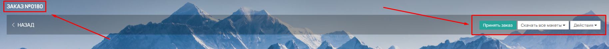{width=1828px height=149px}

**2\. Панель заказа с назначенным менеджером**.

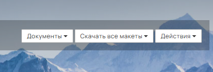{width=419px height=143px}

**3\. Панель заказа при выборе клиентом доставки** (кроме самовывоза).

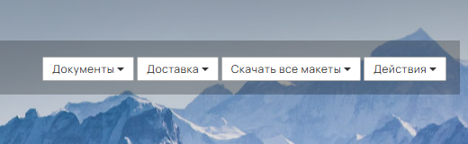{width=520px height=160px}

### **Меню действий (правый верхний угол)**

В правом верхнем углу находится блок кнопок для администрирования заказа:

#### **1\. Кнопка «Документы»**

Позволяет распечатать следующие документы:

-  [Счета на оплату](https://support.wow2print.com/magazin/bukhgalteriya/scheta-klientov-debet) (с печатью / без печати).

-  [УПД или Счет-фактура](https://support.wow2print.com/magazin/bukhgalteriya/realizaciya) (с печатью / без печати / в формате XML).

-  [Технологическую карту](https://support.wow2print.com/magazin/zakazy/zakaz-v-admin-paneli/dokumenty/tekhnologicheskaya-karta).

-  Этикетки на коробку, Этикетку и Маркировочную этикетку (доступно, если в заказе выбрана [доставка транспортной компанией](https://support.wow2print.com/nastroiki/integracii#dostavka)).

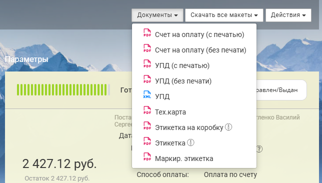{width=644px height=366px}

#### **2\. Кнопка «Скачать все макеты»**

Позволяет скачать единым архивом все исходные изображения (макеты), прикрепленные к заказу.

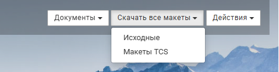{width=471px height=122px}

#### **3\. Кнопка «Доставка» (Создание/обновление посылки)**

Используется для автоматического создания отправления в личном кабинете транспортной компании. Доступно при интеграции с [**CDEK**](https://support.wow2print.com/nastroiki/integracii/dostavka/cdek) и [**DPD**](https://support.wow2print.com/nastroiki/integracii/dostavka/dpd).

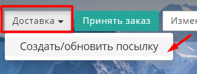{width=331px height=124px}

#### **Принцип работы с посылками (интеграция с ТК CDEK, DPD и Яндекс)**

-  **Создание:** Когда заказ готов к отправке, перейдите в заказ -> нажмите кнопку **«Доставка»** -> выберите **«Создать/Обновить посылку»**. В этот момент в личном кабинете выбранной ТК (СДЭК, DPD или Я.Доставка) автоматически формируется посылка.

:::note 

**Важно для тестирования:** Рекомендуем сразу удалять тестовые посылки в личном кабинете ТК, чтобы избежать списания средств за неиспользуемые отправления.

:::

-  **Обработка реального заказа:** После создания посылки вы можете вызвать курьера (если функция доступна у ТК) или самостоятельно отнести заказ в пункт выдачи согласно выбранному тарифу.

-  **Трек-код:** После фактической отправки посылки трек-номер автоматически подтягивается по интеграции в систему. Он отображается как в Админ-панели сайта, так и в Личном кабинете клиента.

-  **Особый случай (Отгрузка):** При работе с модулем «Отгрузка» посылки **не создаются автоматически**, так как одна отгрузка может содержать как часть заказа, так и несколько заказов одного клиента. В этом случае создание посылок производится вручную напрямую в личном кабинете транспортной компании.

#### **4\. Кнопка «Принять заказ»**

Если заказ оформлен новым клиентом (ранее не зарегистрированным), он попадает в раздел **Магазин -> Заказы ->** [**вкладка «Неразобранные»**](https://support.wow2print.com/magazin/zakazy#vkladka-nerazobrannye). Чтобы начать обработку, нажмите кнопку «Принять заказ». После этого клиент и заказ будут закреплены за текущим менеджером.

#### **5\. Кнопка «Действия» (выпадающее меню)**

Включает дополнительные инструменты для управления заказом.

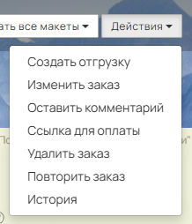{width=218px height=254px}

#### **Кнопка «Создать отгрузку»**

Доступна при подключенном модуле [«Отгрузки»](https://support.wow2print.com/magazin/otgruzki) и при условии, что заказ оплачен или для него установлена «Гарантия оплаты».

#### **Кнопка «Изменить заказ»**

Позволяет редактировать следующие параметры:

-  Номер заказа;

-  Менеджер;

-  Клиент, Получатель, Адрес, Плательщик *(при смене этих полей система предлагает варианты, сохраненные в карточке клиента: **Магазин -> Контрагенты ->*** [***Клиенты***](https://support.wow2print.com/magazin/kontragenty#klienty)*)*;

-  Способ оплаты\*;

-  Индивидуальная скидка на заказ (в валюте или процентах);

-  Трек-номер для отслеживания от транспортной компании.

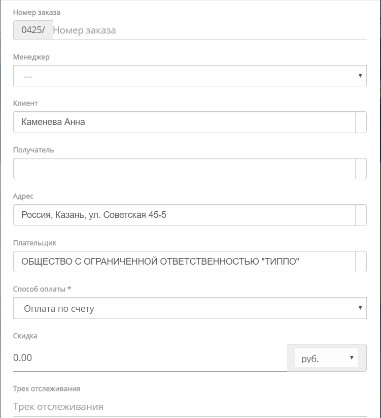{width=751px height=823px}

#### **Кнопка «Оставить комментарий»**

Позволяет менеджеру добавить внутреннюю заметку к заказу. В конце комментария автоматически подставляется имя автора.

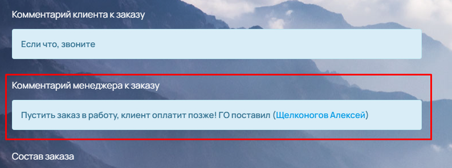{width=768px height=286px}

#### **Кнопка «Ссылка для оплаты»**

Отображается, если заказ не был оплачен. При нажатии открывается окно со ссылкой для оплаты. Скопируйте ссылку и вставьте в браузер, чтобы перейти на страницу оплаты. При оплате через эквайринг кнопка «Оплатить» , на открывшейся странице, становится активной -- нажатие перенаправит вас на платежный шлюз.

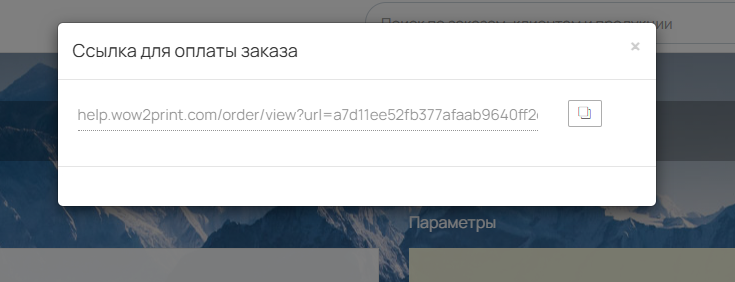{width=735px height=282px}

#### **Кнопка «Удалить заказ»**

Доступна двумя способами:

-  В общем списке заказов ([кнопка «Удалить»](https://support.wow2print.com/magazin/zakazy#udalenie-zakaza));

-  Внутри заказа: **«Действия» -> «Удалить заказ»**.

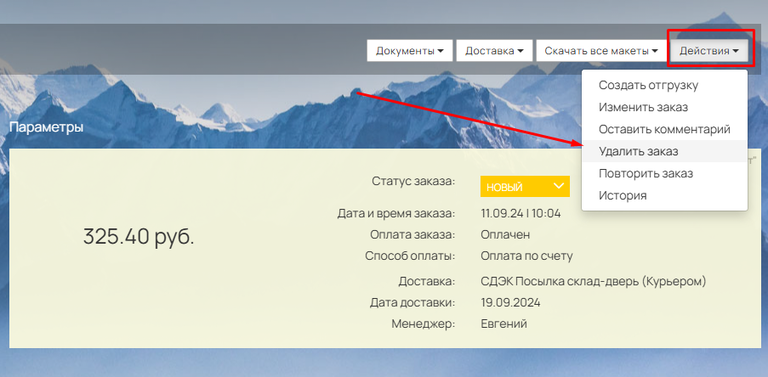{width=768px height=377px}

При удалении **оплаченного** заказа система предложит вариант действий с поступившими средствами:

-  «Вернуть клиенту»;

-  «Зачислить на [внутренний баланс](https://support.wow2print.com/nastroiki/integracii/sposoby-oplaty#vnutrennii-balans)».

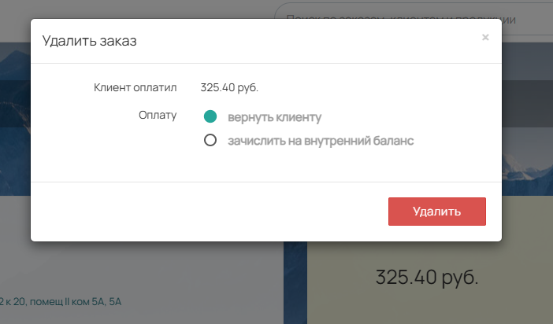{width=702px height=412px}

Все удаленные заказы перемещаются в раздел **Магазин -> Заказы -> вкладка «Удаленные»**.

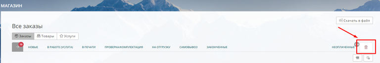{width=768px height=129px}

#### **Кнопка «Повторить заказ»**

После нажатия появится подтверждение. При выборе «Повторить» вы будете перенаправлены на страницу оформления нового заказа в админ-панели. Все данные исходного заказа (товары, характеристики, макет, данные заказчика) будут перенесены автоматически.

:::note 

**Важно:** Повтор заказа недоступен, если в калькуляции входящих в него товаров были изменены параметры.

:::

**Кнопка «История»** Отображает полный лог действий по заказу: дата, время, автор изменения и описание выполненной операции.

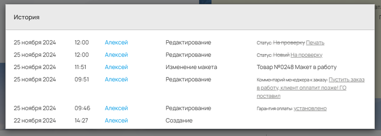{width=768px height=274px}

## **Блок Заказчик**

В этом блоке отображаются:

-  Фамилия, Имя, Email и телефон клиента (данные из Корзины, пункт 2 «Заказчик», или из карточки клиента в разделе **Магазин -> Контрагенты ->** [**Клиенты**](https://support.wow2print.com/magazin/kontragenty#klienty)).

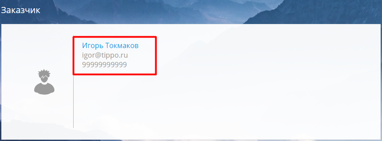{width=768px height=284px}

Если клиент выбрал оплату «На компанию (ЮЛ)» и заполнил реквизиты, в блоке «Заказчик» отобразятся: Наименование компании, юридический адрес и ИНН.

Клик по Фамилии и Имени клиента открывает его карточку в разделе **Магазин -> Контрагенты -> Клиенты**.

## **Блок Параметры**

Содержит ключевую информацию о заказе:

**1\. Поставщик** -- компания-продавец, выставляющая счет и осуществляющая отгрузку.

**2\. Общая сумма** и остаток к доплате.

**3\. Статус заказа** с индикатором прогресса. Управление: выбор значения из выпадающего списка или быстрый перевод на следующий статус (свайп по панели справа).

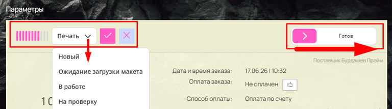{width=768px height=214px}

Также в блоке отображаются:

**4\. Дата и время создания заказа.**

**5\. Статус оплаты** (Оплачен / Не оплачен).

**6\. Гарантия оплаты** -- активируется менеджером после принятия заказа. Позволяет формировать сборные тиражи и отгрузки без фактической оплаты.

:::note 

Будьте внимательны, проставленную гарантию оплаты нельзя отменить/удалить.

:::

7\. Способ оплаты (выбранный при оформлении).

8\. Способ доставки (выбранный при оформлении). Доступна кнопка «Изменить».

9\. Дата доставки.

10\. Менеджер -- сотрудник, за которым закреплен клиент.

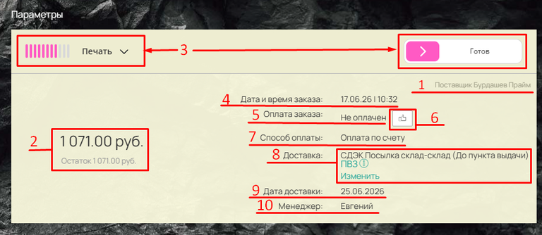{width=768px height=334px}

Если в заказе был применен [промокод](https://support.wow2print.com/marketing/skidki#promokod), он отобразится в этом блоке со ссылкой на настройки скидки в админ-панели.

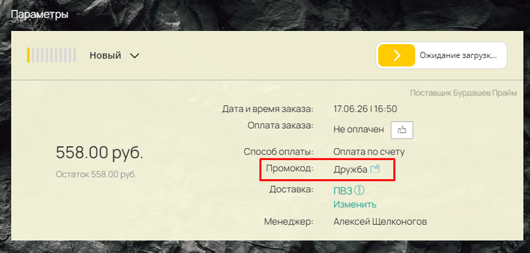{width=768px height=367px}

## **Блок Получатели**

Отображает Фамилию, Имя и Адрес получателя, указанные в Корзине (пункт 3 «Заказчик»).

Если при оформлении была выбрана опция «Указать другого получателя», в поле «Кому» подставятся данные указанного получателя.

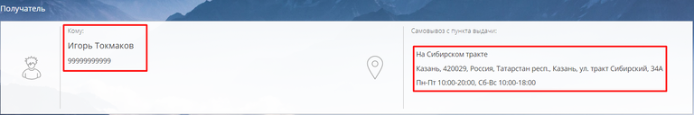{width=768px height=128px}

## **Блок Состав заказа**

1\. Управление статусом товара:

-  Ручной выбор значения из выпадающего списка;

-  Быстрый перевод на следующий статус (свайп вправо).

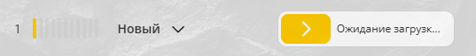{width=537px height=64px}

2\. Номер и наименование позиции. 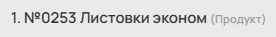{width=276px height=37px}

3\. Кнопка [«Тех. карта»](https://support.wow2print.com/magazin/zakazy/zakaz-v-admin-paneli/dokumenty/tekhnologicheskaya-karta)  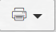{width=70px height=41px} печать техкарты для конкретного товара

4\. Кнопка «Действие» -> выпадающее меню:

-  «Изменить калькуляцию» -- открывает калькулятор товара на сайте;

-  «Изменить данные» -- позволяет изменить артикул и наименование товара в счете;

-  «Оставить комментарий» -- внутренняя заметка по позиции;

-  «Удалить товар» -- удаление позиции из заказа;

-  «Детализация» -- детальный расчет стоимости по всем примененным операциям;

-  «История» -- просмотр действий по данному товару.

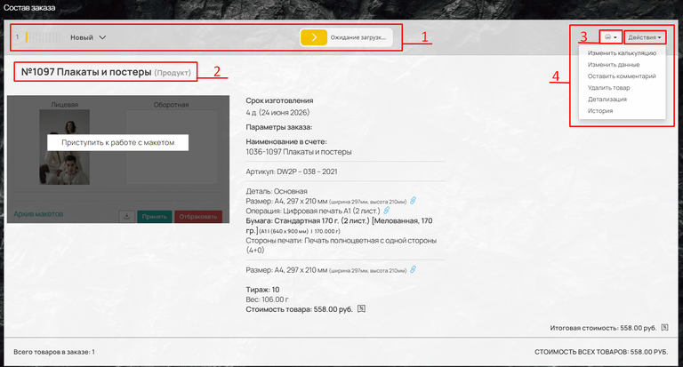{width=768px height=413px}

### **Панель работы с макетом**

**Начало работы:** Нажмите кнопку «Приступить к работе с макетом».

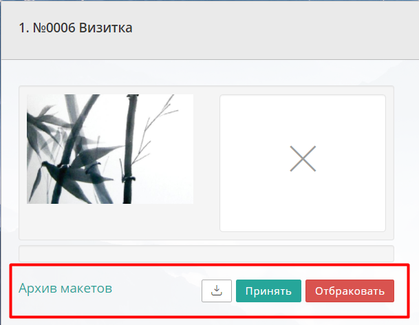{width=609px height=472px}

**Принятие решения по макету:**

-  Если макет соответствует требованиям -> нажмите **«Принять»**.

-  Если макет бракованный -> нажмите **«Отбраковать»** и выберите вариант:

   -  «Уведомить клиента»;

   -  «Сделать самим».

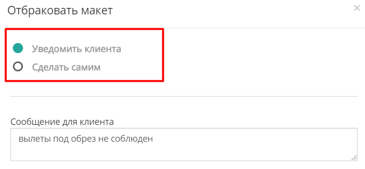{width=733px height=341px}

**Вариант «Сделать самим»:** Вы можете выставить дополнительный счет за корректировку макета. В списке появятся доп. услуги, отмеченные как «Спец.услуга» (**Справочник -> Свойства ->** [**Доп. услуги**](https://support.wow2print.com/spravochnik/svoistva/untitled-4)).

Заказ на услугу проверки отобразится в общем списке (**Магазин -> Заказы**), а счет появится в Личном кабинете клиента (вкладка «Заказы»).

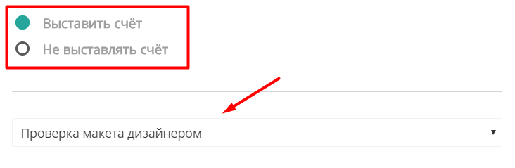{width=732px height=239px}

**Скачивание и настройка:**

-  После принятия макета исходный и проверенный варианты можно скачать по кнопке «Скачать все макеты». При подключении дополнительного модуля также становится доступна загрузка готового спуска.

-  Настройка выравнивания спуска (по левому краю или по центру) выполняется в разделе: **Настройки -> Другие настройки -> Работа с макетом -> Настройки дизайна и загрузки макета -> Выравнивание спуска**.

**Архив макетов:** Кнопка «Архив макетов» открывает окно просмотра, где доступна кнопка «Скачать исходный макет» (загружает архив с исходниками). Ниже расположено текстовое поле для комментариев, сохранения ссылки на готовый спуск или других заметок.

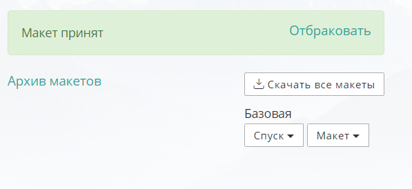{width=597px height=274px}

**Характеристики товара (отображаются справа от макета):**

-  Срок изготовления;

-  Параметры заказа, выбранные клиентом на сайте;

-  **Значок «Скрепка»** напротив параметра -- кнопка быстрого перехода к этому параметру в калькуляции продукта в админ-панели;

-  Наименование в счете (формируется одним из трех способов: по умолчанию, из настроек товара, или вручную заказчиком в корзине);

-  Тираж;

-  Стоимость товара.

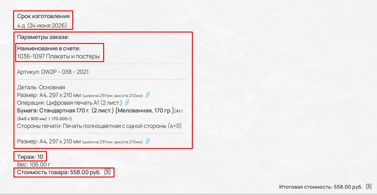{width=768px height=397px}

## **Нижняя панель заказа**

В нижней части заказа выводится сводная информация:

-  Общее количество товаров;

-  Стоимость товаров в заказе;

-  Вес товаров;

-  Скидка (при наличии);

-  Стоимость доставки;

-  Общая сумма заказа;

-  История заказа.

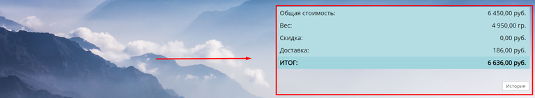{width=768px height=142px}