Частые вопросы:

[view:hierarchy=none::::List]

# FAQ -- Калькуляция

## Общие положения

*Если вы столкнулись с тем, что калькуляция не работает, нет цены (не считается цена), не правильно считается цена, не считается какая-либо конкретная операция и тому подобные вопросы, то данный раздел для вас.*\
З*десь описаны частые вопросы и их решение.*

### Проверьте правильность составления калькуляции

Первое, что необходимо сделать -- проверить правильность составления калькуляции.

Правильная калькуляция в себя включает:

1. **Наличие размеров в модуле размеры**\
   В любой калькуляции обязательно должны быть указаны размеры в основном модуле «Размеры».\
   Модуль «Размеры» присутствует как в основных модулях, так и в модулях каждой детали. Если размеры детали могут быть вовсе не указаны, то размер основных модулей должен быть всегда.\
   [Подробнее на примерах ↓](./_index)

2. **Наличие детали**\
   В любой калькуляции должна присутствовать деталь.\
   Деталь -- это фундамент калькуляции, без неё калькуляция не может работать.\
   [Подробнее на примерах ↓](./_index)

3. **Правильное заполнение модулей калькуляции**\
   Вся калькуляция строится с помощью модулей. Если модуль настроен не правильно, то он не будет учитываться в формировании цены.\
   В каждом модуле калькуляции должен быть активный параметр из справочника. Если модуль состоит из нескольких вкладок, то на каждой вкладке должен быть активный параметр.\
   «Вариант без параметра» не является параметром.\
   [Подробнее на примерах ↓](./_index)

4. **Печатное изделие умещается на печатный лист**\
   При просчете калькуляции, система раскладывает изделие на печатный лист -- формирует спуск. Таким образом высчитывается общее количество печатных листов на тираж и просчитывается итоговая стоимость.\
   В калькуляции имеется возможность проверить данную раскладку -- система покажет какое количество изделий поместится на печатном листе, это значение должно быть не «0».\
   К допустимым значениям относятся целые числа больше нуля (1, 2, 3, ....) и прочерк (-).\
   [Подробнее на примерах ↓](./_index)

5. **Табличная калькуляция с актуальными параметрами калькуляции**\
   Табличная калькуляция работает корректно, если после создания таблицы в параметры калькуляции не вносились изменения.\
   Если же после создания таблицы вы внесли изменения в параметры калькуляции, таблица перестанет нормально функционировать. Необходимо удалить текущую таблицу и создать ее заново.

   [Подробнее на примерах ↓](./_index)

## 

### Наличие размеров в модуле размеры

Если в калькуляции вовсе отсутствуют размеры, то вы увидите характерную ошибку в верхней части страницы калькуляции:

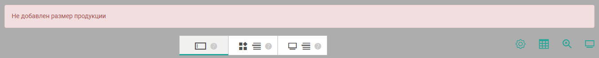{width=1334px height=131px}

Модуль «Размеры» присутствует как в основных модулях, так и в модулях каждой детали.

[tabs]

[tab:Основной модуль Размеры]

Основной модуль «Размеры» располагается в верхней части калькуляции под заголовком «Основные модули». Наличие размеров в данном модуле всегда обязательно.

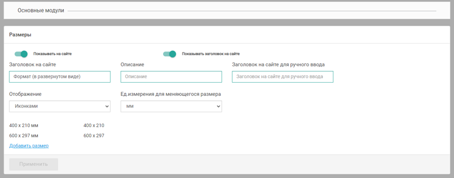{width=768px height=301px}

[/tab]

[tab:Модуль Размеры детали]

Данный модуль «Размеры» располагается в каждой детали под названием детали. Модуль заполняется только в том случае, если того требует калькуляция.

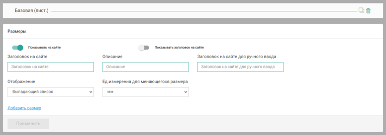{width=768px height=270px}

[/tab]

[/tabs]

[Вернуться ↑](./_index)

### Наличие детали

Если в калькуляции вовсе отсутствует деталь, то вы увидите характерную ошибку в верхней части страницы калькуляции:

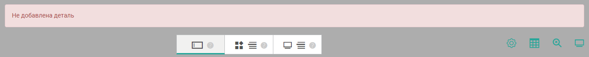{width=1336px height=130px}

В любой калькуляции должны присутствовать деталь и модули, на основе которых формируется стоимость продукта

[Вернуться ↑](./_index)

### Заполнение модулей калькуляции

На примере модуля с тремя вкладками -- «Операция печать»

Вкладка «Операция печать»

[tabs]

[tab:Правильное оформление]

**Пример №1:**

Даже если сам модуль не отображается на сайте, в нем должен быть активный параметр.

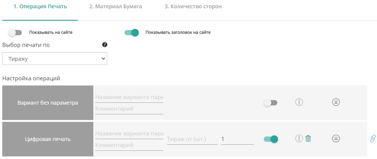{width=768px height=324px}

[/tab]

[tab:НЕправильное оформление]

Пример №1:

Выключенный параметр сравним с отсутствием этого параметра в калькуляции.

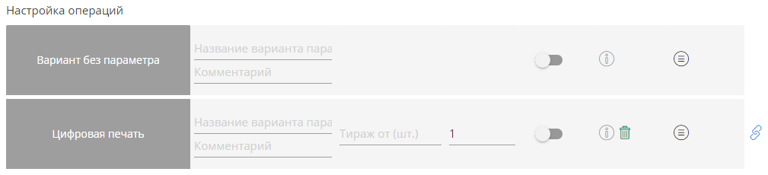{width=768px height=175px}

Пример №2:

«Вариант без параметра» является своеобразной заглушкой, как способ принудительно отключить модуль.

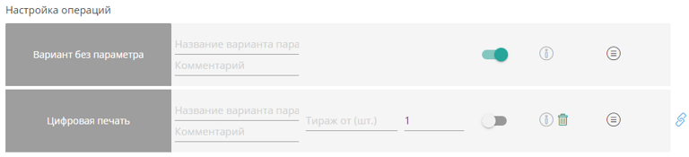{width=768px height=175px}

[/tab]

[/tabs]

[Вернуться ↑](./_index)

:::note 

Параметры, которые имеют дополнительные свойства, в калькуляции должны также иметь активное свойство.

:::

На примере свойств плотности материала.

[tabs]

[tab:Правильное оформление]

Пример №1:

На сайте будут доступны на выбор 3 варианта плотности.

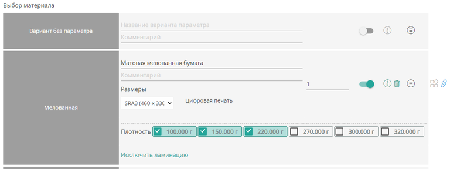{width=768px height=288px}

[/tab]

[tab:НЕправильное оформление]

Пример №1:

В данном случае в калькуляции не участвует ни одно свойство бумаги. Даже если параметр включен, без свойств он не может участвовать в формировании цены.

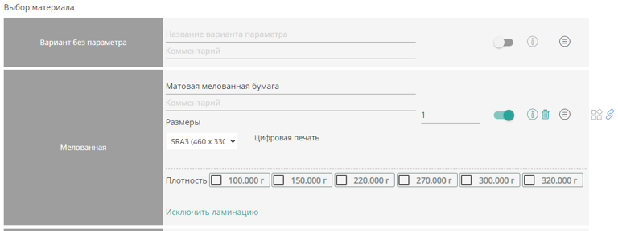{width=768px height=288px}

[/tab]

[/tabs]

[Вернуться ↑](./_index)

На примере модуля «Сроки производства»

[tabs]

[tab:Правильное оформление]

Пример №1:

Положение галочек говорит о том, что тиражи больше 500 можно заказать только со сроком производства 3 дня.

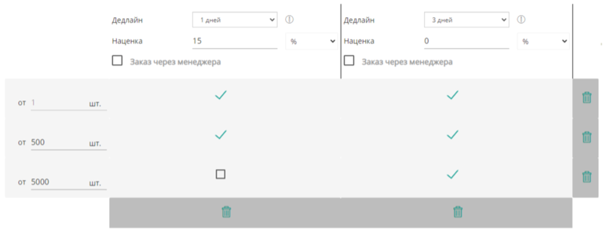{width=768px height=294px}

[/tab]

[tab:НЕправильное оформление]

Пример №1:

Отсутствие всех галочек полностью блокирует возможность оформить заказ, даже если в остальном калькуляция заполнена правильно.

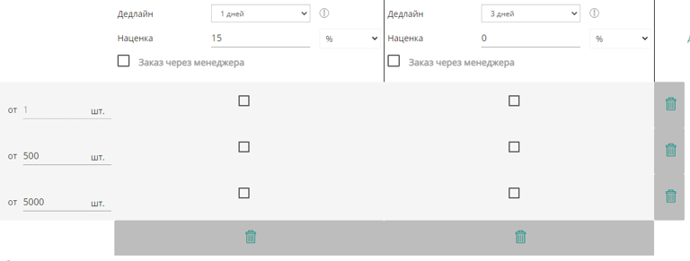{width=768px height=291px}

[/tab]

[/tabs]

[Вернуться ↑](./_index)

### Раскладка на печатном листе

Данный параметр имеет прямое отношение к печатному листу, его необходимо искать в модуле «Операция печать» на вкладке «Материал бумага».\
Напротив названия материала, в правой части параметра имеется иконка «Количество продукции на листе» --{width=50px height=50px}

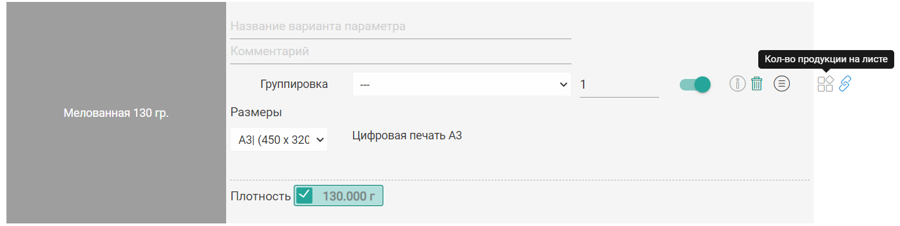{width=1397px height=352px}

При нажатии на иконку, откроется модальное окно с информацией о каждом размере продукта.

[tabs]

[tab:Правильное оформление]

Пример №1:

На лист формата А3 продукты разложатся следующим образом:

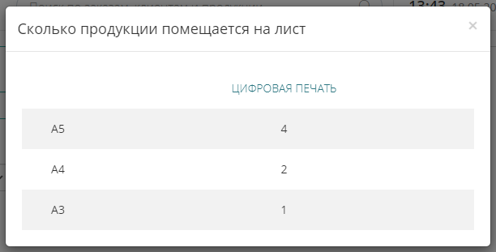{width=612px height=311px}

[/tab]

[tab:НЕправильное оформление]

Пример №1:

Изделие формата А2 никак не умещается на печатном листе формата А3. В данном случае необходимо либо убрать размер этого изделия из калькуляции, либо внести изменения в параметры самой калькуляции, чтобы печать указанного размера стала возможной.

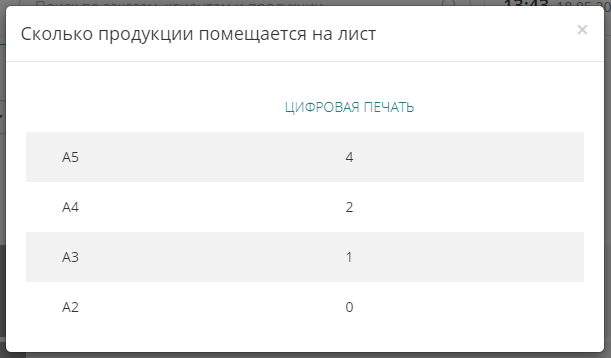{width=611px height=358px}

[/tab]

[/tabs]

[Вернуться ↑](./_index)

### Табличная калькуляция

\
Если же после создания таблицы вы внесли изменения в параметры калькуляции, таблица перестанет нормально функционировать. Необходимо удалить текущую таблицу и создать ее заново.

В старой таблице уже имеются заполненные цены, чтобы их не потерять следуйте данной инструкции:

* [ ] **Скачайте «старую» таблицу**\
   Перейдите на страницу табличной калькуляции и скачайте таблицу с ценами с помощью кнопки «Скачать».

* [ ] **Удалите «старую» таблицу**\
   Удалите текущую таблицу с сайта с помощью кнопки «Удалить все».

* [ ] **Сгенерируйте новую таблицу**\
   С помощью тумблеров выберите модули, которые влияют на формирование цены и нажмите на кнопку «Сохранить».

* [ ] **Скачайте «новую» таблицу**\
   Скачайте новую таблицу без цен.

* [ ] **Перенесите цены из «старой» таблицы в «новую»**\
   Из старой таблицы можно использовать только цены.\
   Если в новой таблице имеются ровно такие же параметры, что и в старой -- смело копируйте цены.\
   Если же параметры значительно отличаются, то цены необходимо заполнить заново самостоятельно.

[Вернуться ↑](./_index)