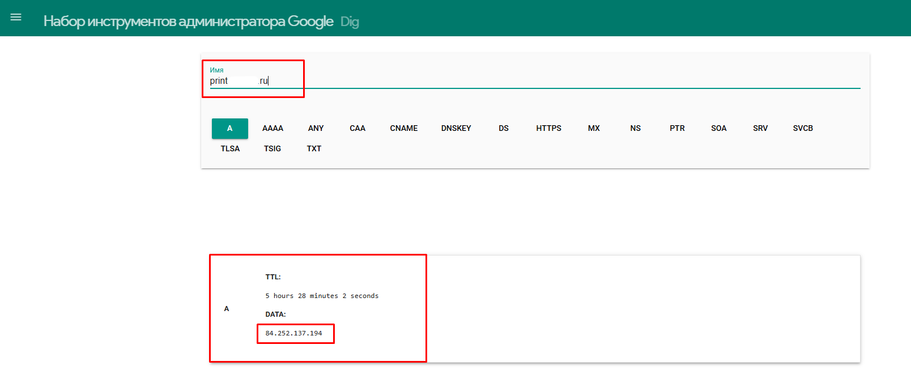
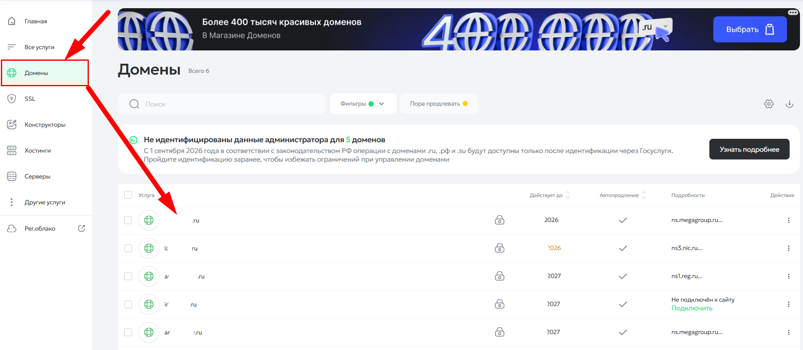
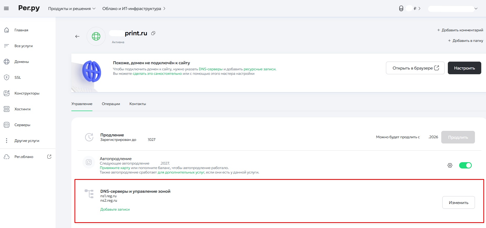
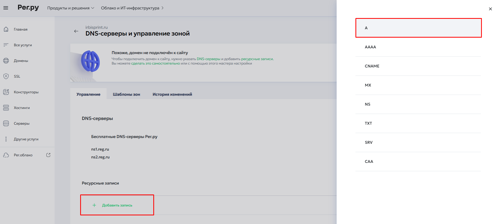
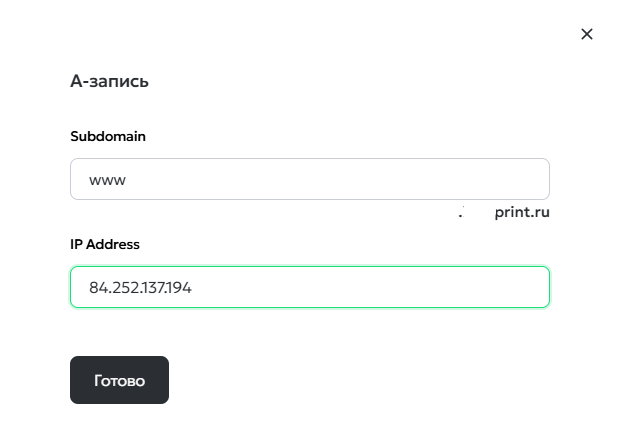
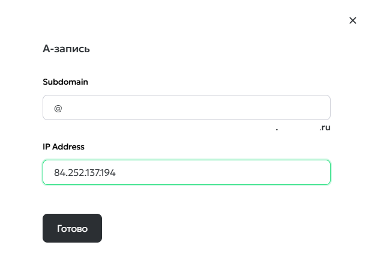
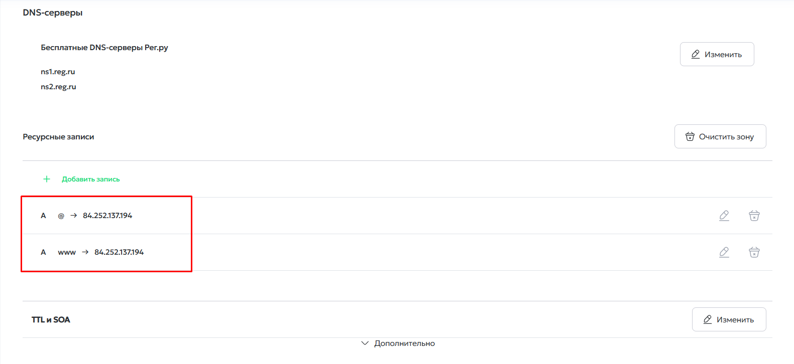

## Общие положения

Изначально ваш сайт на  платформе TCS доступен по техническому поддомену [`site.wow2print.com`](http://site.wow2print.com). После того как вы завершите основные настройки сайта, его нужно переадресовать на ваш собственный домен -- тот, который вы зарегистрировали для своего сайта.

Процесс переадресации состоит из пяти шагов.

#### **Шаг 1. Настройте DNS-записи у регистратора домена**

Перейдите на сайт регистратора, у которого вы зарегистрировали доменное имя ([reg.ru](http://reg.ru), [nic.ru](http://nic.ru) и другие), и в настройках доменного имени добавьте или измените **две ресурсные записи типа A**.

**Первая запись**



---

*  **Поле**

*  **Значение**

---

*  Тип (Subdomain)

*  `@`

---

*  IP-адрес

*  `84.252.137.194` -- для сайтов в РФ

   

   `37.27.212.243` -- для сайтов других стран



**Вторая запись**



---

*  **Поле**

*  **Значение**

---

*  Тип (Subdomain)

*  `www`

---

*  IP-адрес

*  `84.252.137.194` -- для сайтов в РФ

   

   `37.27.212.243` -- для сайтов других стран



:::tip 

**Важно:** используйте только тот IP-адрес, который соответствует региону размещения вашего сайта. Если сайт размещён в РФ -- указывайте `84.252.137.194`, если в другой стране -- `37.27.212.243`.

:::

#### **Шаг 2. Дождитесь обновления записей**

Обновление ресурсных записей занимает от 5 минут до 24 часов.

**Как проверить, что записи обновились:**

1. Откройте сайт <https://toolbox.googleapps.com/apps/dig/>

2. Вставьте имя вашего домена **без** `https://`

3. В результатах проверки вы увидите A-запись с IP-адресом, который вы указали в DNS. Если адрес совпадает -- записи обновились.

   {width=1608px height=653px}

   

#### **Шаг 3. Создайте заявку в Сервис Деск**

После того как записи обновились, перейдите в [Сервис Деск](https://tippo.okdesk.ru/) и создайте заявку:

-  **Название заявки:** «Переадресация домена»

-  **Описание:** укажите доменное имя, на которое нужно переадресовать сайт

#### **Шаг 4. Дождитесь переадресации**

Сотрудники TCS внесут новое доменное имя во внутреннюю базу данных. С этого момента сайт будет доступен только по новому адресу.

#### **Шаг 5. SSL-сертификат безопасности**

Сертификат безопасности будет установлен на сайт сразу при переносе и начнёт действовать в течение 24 часов. Отдельных действий с вашей стороны не требуется.

## **Пример настройки A-записей на** [**reg.ru**](http://reg.ru) 

Ниже показано, как добавить и изменить ресурсные записи на примере регистратора [reg.ru](http://reg.ru).

-  Авторизуйтесь на сайте [reg.ru](http://reg.ru).

-  В левом меню выберите раздел **«Домены»** и нажмите на название вашего доменного имени в появившемся списке.

{width=1861px height=812px}

-  Перейдите в раздел **«DNS-серверы и управление зоной»**.

{width=1846px height=866px}

-  На открывшейся странице в разделе **«Ресурсные записи»** нажмите кнопку **«Добавить запись»**.

-  В появившемся справа окне выберите **«Бесплатный DNS-сервер»**, затем выберите тип записи **«A»**.

{width=1903px height=857px}

-  Заполните две A-записи:

   -  с subdomain `www`

   -  с subdomain `@`

-  В поле **IP Address** укажите:

   -  `84.252.137.194` -- для сайтов в РФ

   -  `37.27.212.243` -- для сайтов других стран

[tabs]

[tab:A-запись www]

{width=620px height=433px}

[/tab]

[tab:A-запись @]

{width=620px height=428px}

[/tab]

[/tabs]

-  Сохраните изменения для обеих записей.

{width=1581px height=726px}

-  Готово!

## **Частые ошибки и рекомендации**

Чтобы переадресация прошла без задержек, проверьте следующие моменты перед созданием заявки в [Сервис Деск](https://tippo.okdesk.ru/).

#### **1\. Удалите старые записи типа AAAA**

Если в DNS-записях вашего домена уже присутствует запись типа **AAAA** (IPv6-адрес), её необходимо **удалить**.

#### **2\. Удалите конфликтующие записи типа A**

Перед добавлением новых A-записей проверьте, нет ли в зоне уже существующих A-записей для `@` или `www`, указывающих на другие IP-адреса (например, на старый хостинг или конструктор сайтов). Такие записи нужно **удалить или заменить**, иначе домен не будет работать стабильно.

#### **3\. Убедитесь, что домен делегирован на DNS-серверы регистратора**

Если вы используете DNS-серверы регистратора (например, бесплатные DNS-серверы [reg.ru](http://reg.ru)), проверьте, что домен действительно делегирован на них. Если домен указывает на DNS-серверы другого провайдера, изменения нужно вносить именно там, а не в панели регистратора.

#### **4\. Учитывайте кэш DNS и браузера**

Даже после обновления записей на стороне регистратора старые данные могут некоторое время храниться в кэше провайдеров и браузеров. Если сайт не открывается сразу -- попробуйте:

-  проверить домен в режиме инкогнито;

-  подождать ещё несколько часов.

[Вернуться ↑](./smena-domennogo-imeni)