# Требования к изображениям

## **Рекомендации по изображениям: форматы**

Чтобы ваш сайт загружался быстро и выглядел профессионально, важно использовать изображения правильных форматов и размеров. Соблюдение этих рекомендаций положительно скажется не только на впечатлении клиентов, но и на поисковой оптимизации (SEO).

**Общие требования к форматам**

-  **Допустимые форматы:** JPEG, PNG, SVG, WebP.

-  **Рекомендуемый формат:** **WebP**. Этот формат обеспечивает оптимальное соотношение качества и размера файла, что ускоряет загрузку страниц и экономит трафик.

## **Рекомендуемые размеры изображений**

## **Контент сайта**

### **Категории продукции**

**Где загрузить:** Продукция -> Редактировать категорию -> вкладка «Изображения».

-  **Изображение (Фото тизера):** max. 440×440 px (За размер изображения отвечает настройка кол-ва в ряд элементов виджета "Каталог товаров" [Смотреть ниже](./trebovaniya-k-izobrazheniyam#katalog-tovarov))

-  **Изображение при наведении:** max. 440×440 px (За размер изображения отвечает настройка кол-ва в ряд элементов виджета "Каталог товаров" [Смотреть ниже](./trebovaniya-k-izobrazheniyam#katalog-tovarov))

-  **Иконка категории:** 50×50 px (отображается для дочерних категорий в меню сайта)

-  **Изображение для задвоенного вида:** 920×440 px

-  **Изображение при наведении для задвоенного вида:** 920×440 px

:::info 

**Примечание:** Изображения для задвоенного вида используются только в виджете «Каталог товаров» при включении соответствующей настройки.

:::

Подробнее о категории в статье: [Категории продукции](./../product/kategorii)

<figure>

.png>)

<figcaption>

</figcaption>

</figure>

### **Товары**

**Где загрузить:** Продукция -> Выбрать товар -> вкладка «Изображения».

-  **Изображение (Фото тизера)**

-  **Изображение при наведении**

-  **Изображение для задвоенного вида**

-  **Изображение при наведении для задвоенного вида**

Размер зависит от настройки кол-ва в ряд элементов виджета "Рекомендуемая продукция". Размер изображений смотреть по таблице ниже.

| Количество элементов в строке | Изображение и Изображение при наведении | Для задвоенного вида | Мобильная версия |
|-------------------------------|-----------------------------------------|----------------------|------------------|
| 3                             | 440×440 px                              | 920×440 px           | 250×250 px       |
| 4                             | 320×320 px                              | 680×320 px           | 250×250 px       |
| 6                             | 200×200 px                              | 440×200 px           | 250×250 px       |

-  **Иконка:** 50×50 px (отображается в раскрывающемся меню на сайте)

:::info 

**Примечание:** Изображения для задвоенного вида отображаются в виджете «Каталог товаров» при выборе отображения «Меню слева» или «Меню сверху».

:::

Подробнее о настройке товара в статье: [Вкладка Изображения](./../product/produkty/vkladka-izobrazheniya)

[tabs]

[tab:Сайт]

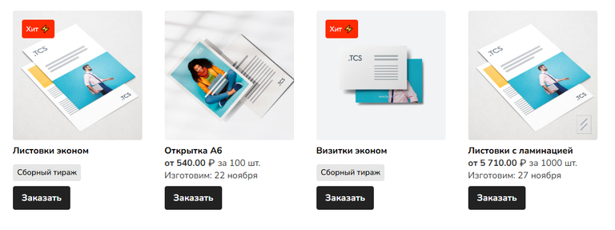{width=768px height=287px}

[/tab]

[tab:Админ-панель]

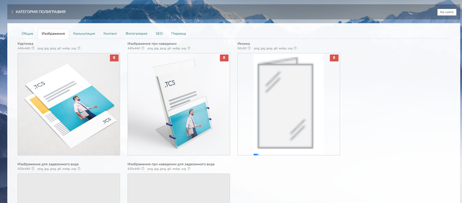{width=768px height=337px}

[/tab]

[/tabs]

### **Пункт самовывоза**

**Где загрузить:** Настройки -> Доставка -> Филиалы -> Пункты выдачи -> Редактировать.

-  **Изображение:** 680×390 px

Подробнее о настройке пунктов самовывоза в статье: [Филиалы](./../settings/dostavka/filialy)

[tabs]

[tab:Сайт]

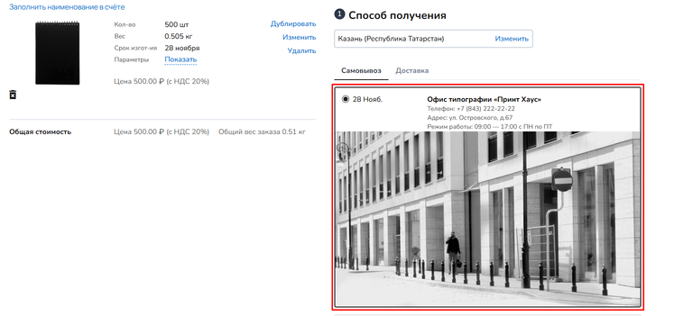{width=768px height=351px}

[/tab]

[tab:Админ-панель]

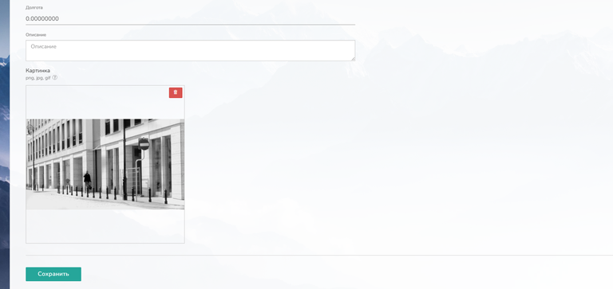{width=768px height=363px}

[/tab]

[/tabs]

### **Логотип и Фавикон сайта**

**Где загрузить:** Настройки -> Дизайн сайта -> Элементы дизайна.

#### **Логотип:**

-  **Форматы:** JPEG, PNG

-  **Макс. размер файла:** 200 kB

-  **Макс. высота:** 70 px

-  **Макс. ширина:** 200 px

Подробнее о настройке логотипа в статье: [Элементы дизайна](./../settings/dizain-saita/elementy-dizaina#logotip)

[tabs]

[tab:Сайт]

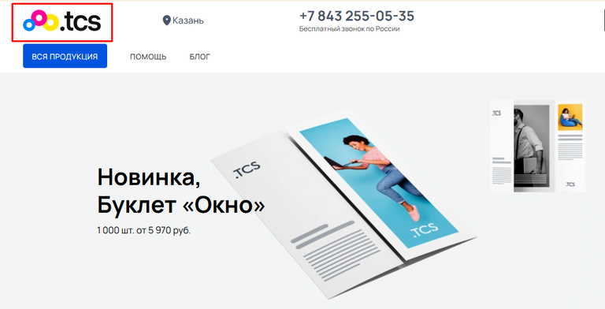{width=768px height=392px}

[/tab]

[tab:Админ-панель]

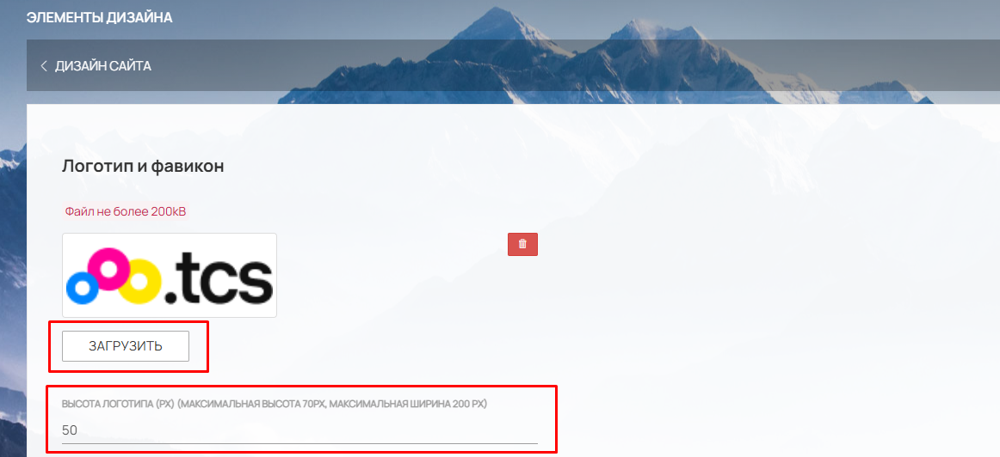{width=1162px height=532px}

[/tab]

[/tabs]

#### **Фавикон:**

-  **Форматы:** ICO, SVG

-  **Макс. размер файла:** 200 kB

-  **Рекомендуемый размер:** 50×50 px

Подробнее о настройке фавикона в статье: [Элементы дизайна](./../settings/dizain-saita/elementy-dizaina#favikon)

[tabs]

[tab:Сайт]

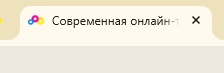{width=224px height=73px}

[/tab]

[tab:Админ-панель]

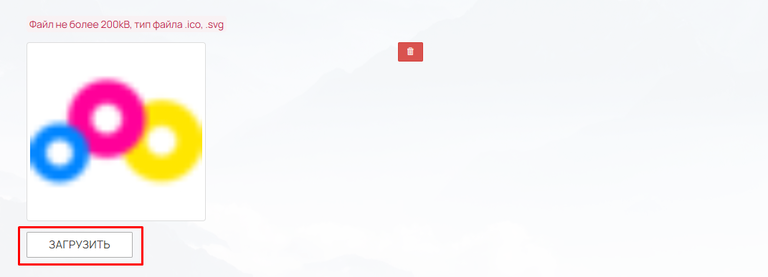{width=768px height=277px}

[/tab]

[/tabs]

## **Калькуляция**

#### **Иконка**

У большинства добавляемых модулей в калькуляции имеется место для загрузки "Иконки".

Иконка отображается в карточке товара рядом с названием параметра. Размер зависит от типа отображения:

-  **Радио баттон с иконками:** 32×32 px

-  **Иконка:** 120×60 px

-  **Плитка:** 230×115 px

[tabs]

[tab:Сайт]

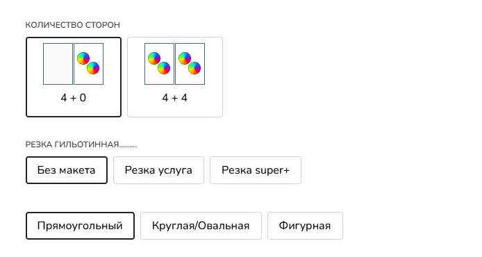{width=694px height=370px}

[/tab]

[tab:Админ-панель]

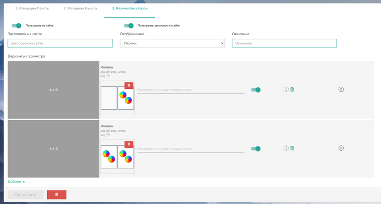{width=768px height=411px}

[/tab]

[/tabs]

#### **Настройка компонента/параметра/материала**

Во многих модулях, у добавляемых компонентов/параметров/материалов имеется своя настройка и в каждой можно загрузить некоторые изображения:

-  **Картинка:** 300×300 px (отображается при наведении на параметр)

-  **Иконка:** 120×60 px (используется по умолчанию если отсутствует иконка из калькуляции)

-  **Иконка для внутр. пользования:** 20×20 px (отображается только в карточке заказа в админ-панели)

[tabs]

[tab:Сайт]

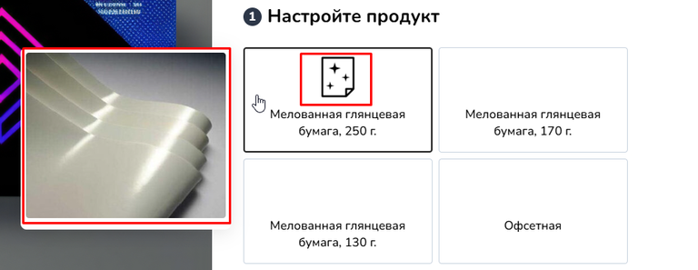{width=768px height=297px}

[/tab]

[tab:Админ-панель]

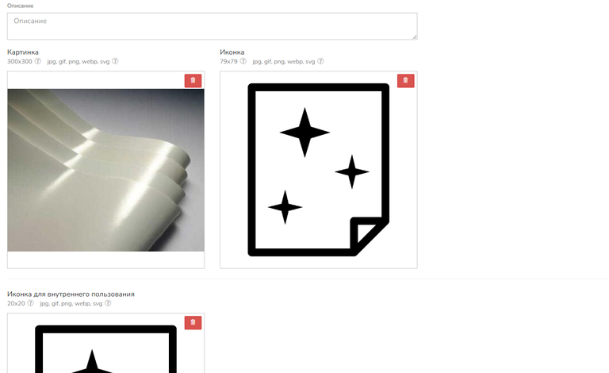{width=768px height=470px}

[/tab]

[/tabs]

## **Виджеты**

### **Каталог товаров**

Размер изображений зависит от настроенного количества товаров в строке. Если виджет используется в нескольких местах, загружайте изображения максимального размера.

| Количество элементов в строке | Изображение и Изображение при наведении | Для задвоенного вида | Мобильная версия |
|-------------------------------|-----------------------------------------|----------------------|------------------|
| 3                             | 440×440 px                              | 920×440 px           | 250×250 px       |
| 4                             | 320×320 px                              | 680×320 px           | 250×250 px       |
| 6                             | 200×200 px                              | 440×200 px           | 250×250 px       |
| 12                            | 80×80 px                                | 200×80 px            | 250×250 px       |

-  **Иконка:** 50×50 px (для дочерних категорий в меню).

Подробнее о виджете Каталог товаров в статье: [Виджет «Каталог товаров»](./../content/vidzhety/vidzhet-katalog-tovarov)

[tabs]

[tab:Сайт]

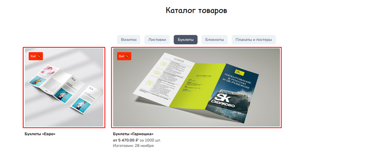{width=768px height=306px}

[/tab]

[tab:Админ-панель]

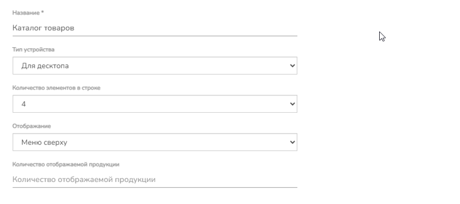{width=768px height=342px}

Настройка задвоенного вида

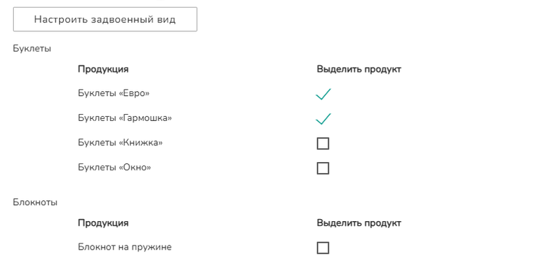{width=768px height=394px}

[/tab]

[/tabs]

### **Фото-карусель**

Рекомендуемый размер зависит от настроенного количества изображений в строке.

| Количество изображений в строке | Рекомендуемый размер | Мобильная версия |
|---------------------------------|----------------------|------------------|
| 1                               | 680×680 px           | 375×375 px       |
| 2                               | 440×440 px           | 375×375 px       |
| 3                               | 320×320 px           | 375×375 px       |
| 4                               | 290×290 px           | 375×375 px       |
| 6                               | 180×180 px           | 375×375 px       |

Подробнее о виджете Фото-карусель в статье: [Виджет «Фото-карусель»](./../content/vidzhety/vidzhet-foto-karusel)

[tabs]

[tab:Сайт]

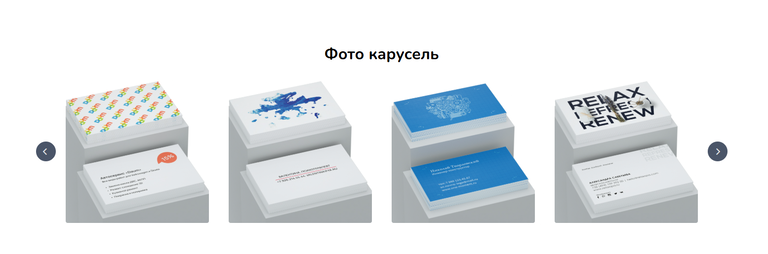{width=768px height=254px}

[/tab]

[tab:Админ-панель]

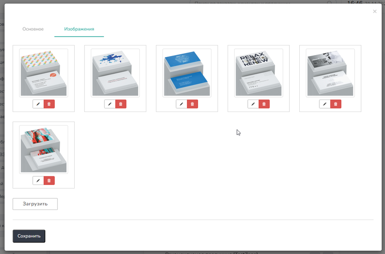{width=768px height=508px}

[/tab]

[/tabs]

### **Слайдер**

Размер зависит от высоты, которая задается вручную, и ширины виджета.

-  **По ширине контента:** макс. 1320 px (на мобильных: 375 px)

-  **На всю ширину:** макс. 1920 px (на мобильных: 375 px)

Подробнее о виджете Слайдер в статье: [Виджет «Слайдер»](./../content/vidzhety/vidzhet-slaider)

[tabs]

[tab:Сайт]

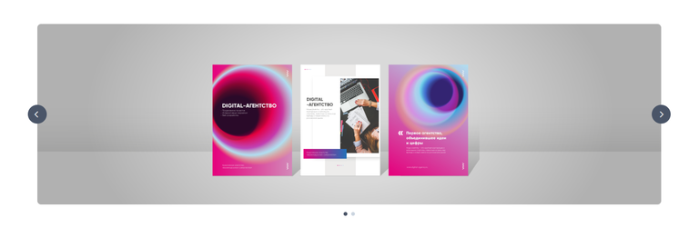{width=768px height=251px}

[/tab]

[tab:Админ-панель]

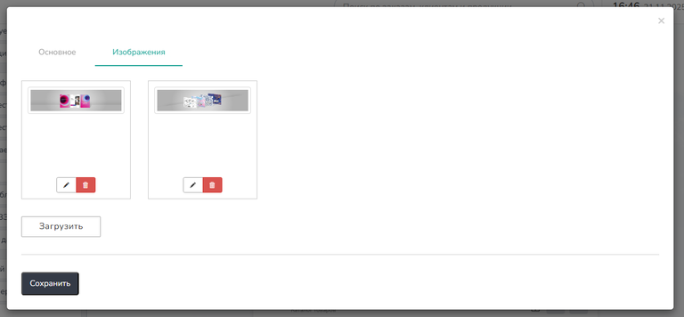{width=768px height=356px}

[/tab]

[/tabs]

### **Как работает онлайн-заказ**

-  **Размер:** 120×120 px (на мобильных: 120×120 px). Размер фиксирован и не зависит от количества элементов в строке.

Подробнее о виджете Как работает онлайн-заказ в статье: [Виджет «Как работает онлайн-заказ»](./../content/vidzhety/vidzhet-kak-rabotaet-onlain-zakaz)

[tabs]

[tab:Сайт]

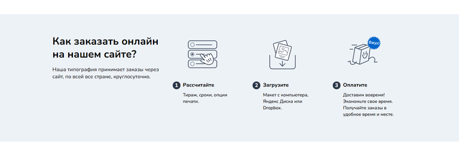{width=768px height=255px}

[/tab]

[tab:Админ-панель]

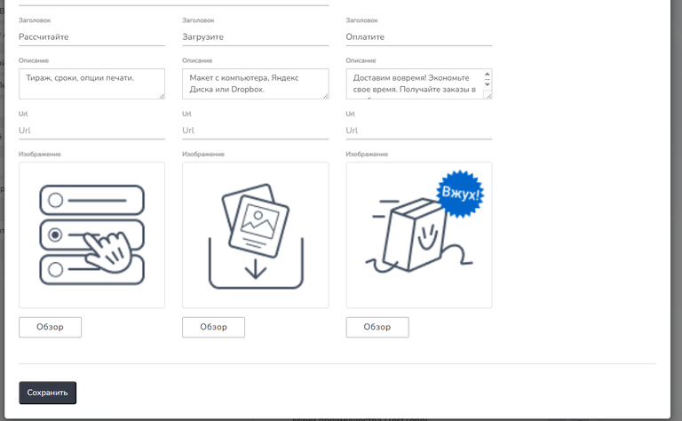{width=768px height=474px}

[/tab]

[/tabs]

### **Логотипы**

Размер зависит от настройки "Тип отображения" и "Количества в ряд".

**Тип отображения «Слайдер»:**

-  4 в ряд: 290×69 px

-  6 в ряд: 180×69 px

-  12 в ряд: 70×69 px

-  **Мобильная версия:** 250×69 px

**Тип отображения «Список»:**

-  4 в ряд: 320×69 px

-  6 в ряд: 200×69 px

-  12 в ряд: 80×69 px

-  **Мобильная версия:** 164×69 px

Подробнее о виджете Логотипы в статье: [Виджет «Логотипы»](./../content/vidzhety/vidzhet-logotipy)

[tabs]

[tab:Сайт]

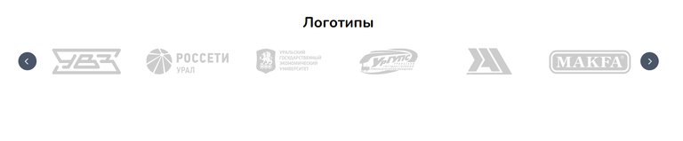{width=768px height=159px}

[/tab]

[tab:Админ-панель]

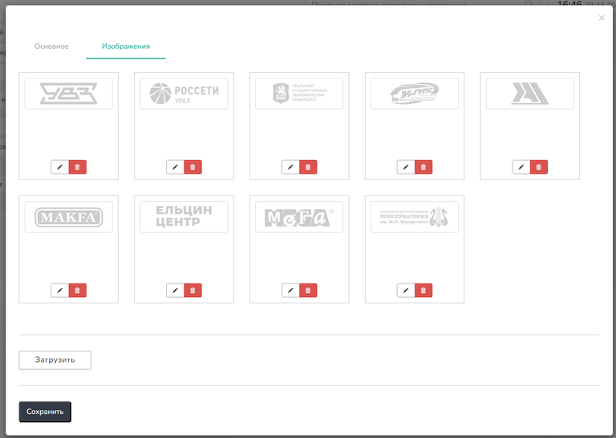{width=768px height=547px}

[/tab]

[/tabs]

### **Рекламный баннер**

Высота задается вручную, ширина зависит от настройки "Ширина":

-  **По ширине контента:** макс. 1400 px (на мобильных: 375 px)

-  **На всю ширину:** макс. 1920 px (на мобильных: 375 px)

Подробнее о виджете Рекламный баннер в статье: [Виджет «Рекламный баннер»](./../content/vidzhety/vidzhet-reklamnyi-banner)

[tabs]

[tab:Сайт]

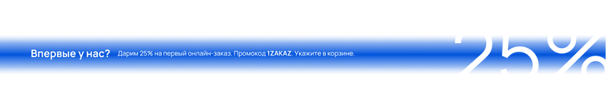{width=768px height=143px}

[/tab]

[tab:Админ-панель]

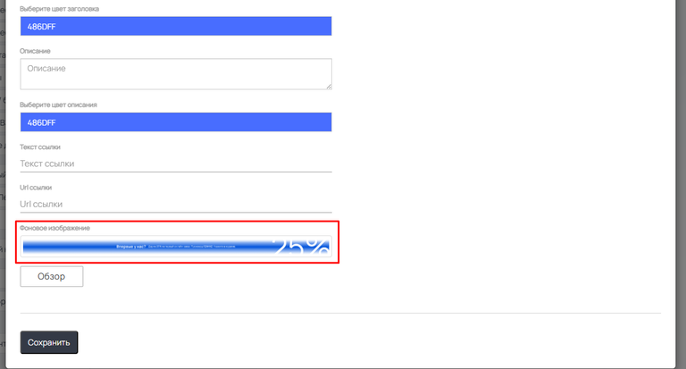{width=768px height=413px}

[/tab]

[/tabs]

### **Преимущества**

-  **Размер:** 120×120 px (на мобильных: 120×120 px). Размер фиксирован.

Подробнее о виджете Преимущество в статье: [Виджет «Преимущества»](./../content/vidzhety/vidzhet-preimushestva)

[tabs]

[tab:Сайт]

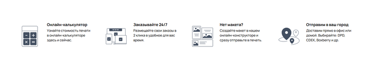{width=768px height=150px}

[/tab]

[tab:Админ-панель]

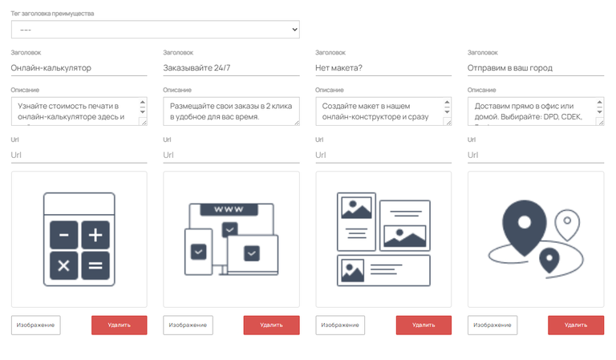{width=768px height=449px}

[/tab]

[/tabs]

### **Преимущества mini**

-  **Размер:** 40×40 px (на мобильных: 40×40 px). Размер фиксирован.

[tabs]

[tab:Сайт]

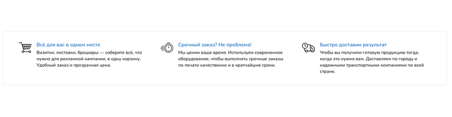{width=768px height=200px}

[/tab]

[tab:Админ-панель]

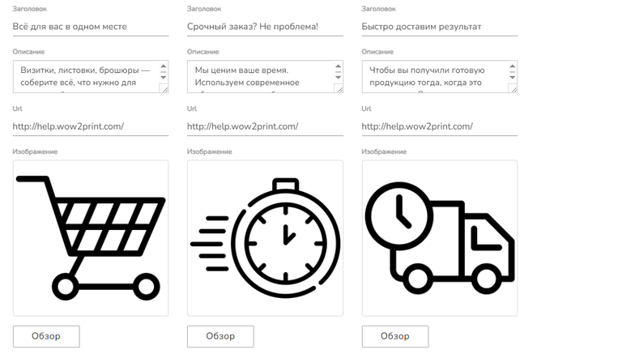{width=768px height=442px}

[/tab]

[/tabs]