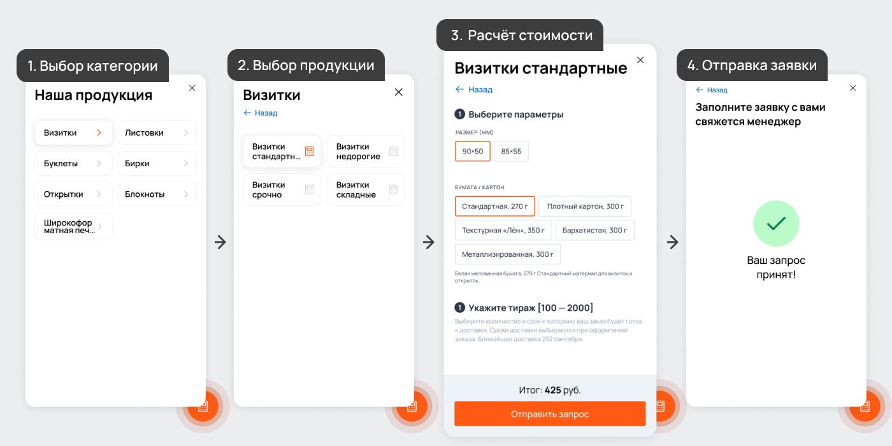
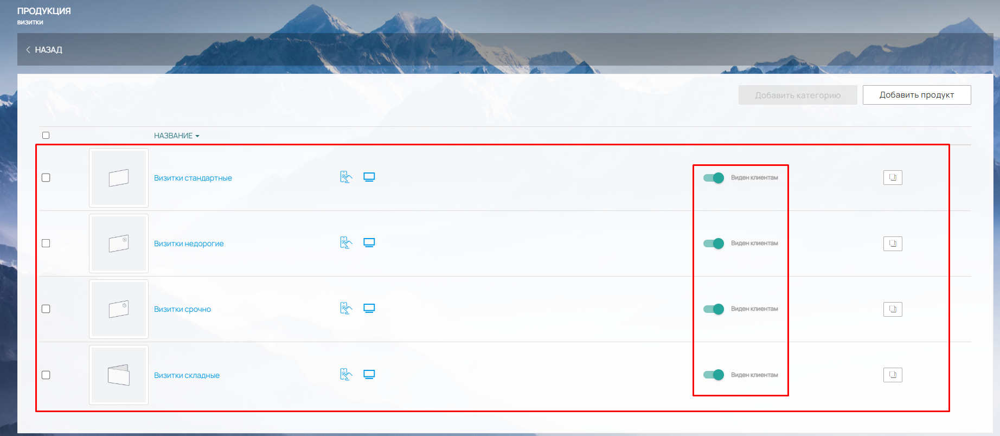
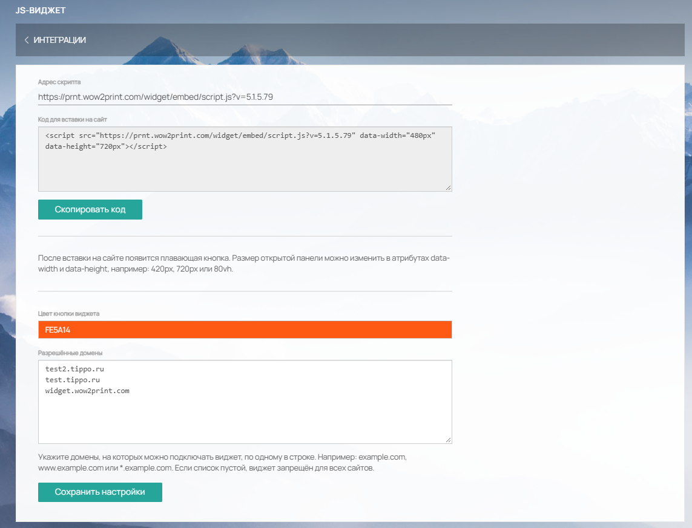
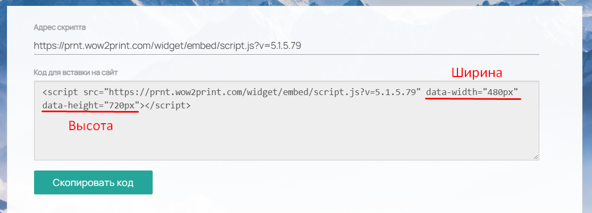
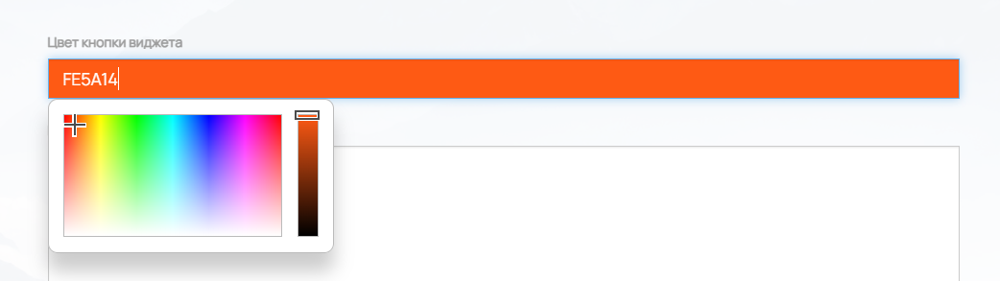
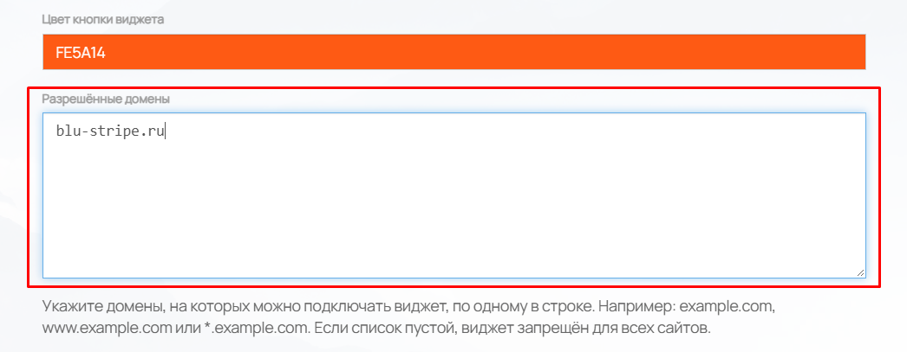
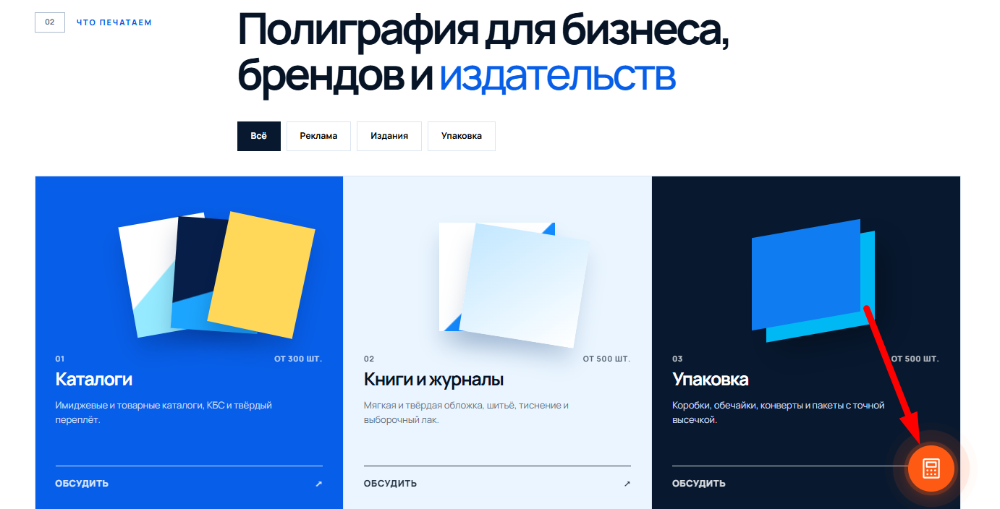
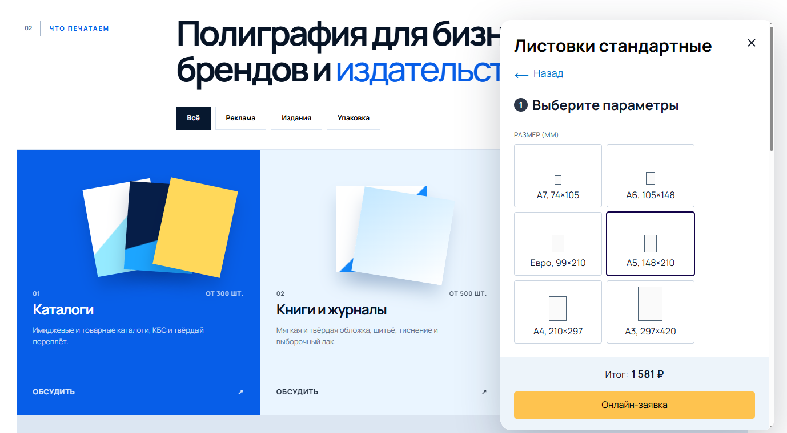
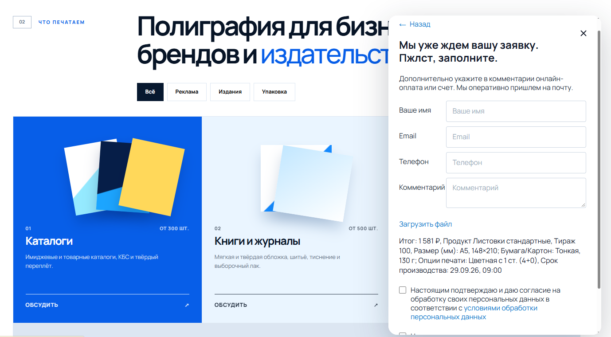
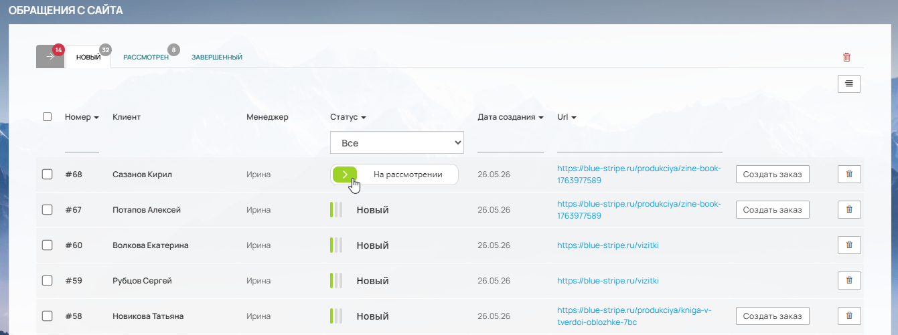

**Как добавить калькулятор продукции на свой сайт с помощью JS-виджета (тариф MINI)**

На тарифе **MINI** вы можете создать виджет с калькуляторами продукции и встроить его прямо на свой сайт. Переходить полностью на нашу платформу не нужно -- достаточно завести у нас рабочую область в виде сайта-админки.

## **Как это работает**

1. Мы создаём на своём поддомене (например, `site.wow2print.com`) ваш рабочий сайт для виджета.

2. Вы настраиваете в нём нужные продукты с помощью наших калькуляторов: берёте готовые или создаёте свои.

3. В разделе **Настройки -> Интеграции -> JS-виджет** задаёте внешний вид виджета: размер, цвет кнопки и список сайтов, на которых он будет работать.

4. Копируете готовый код и вставляете его на свой сайт.

5. На вашем сайте в углу появляется значок калькулятора. Клиент нажимает на него, выбирает категорию и продукт, настраивает параметры, указывает тираж и видит цену.

6. Затем клиент заполняет онлайн-заявку и отправляет её менеджеру.

7. Заявка приходит в админку созданного у нас сайта в раздел **Магазин -> Обращения с сайта**. Дальше вы действуете на своё усмотрение: делаете заказ по полученным параметрам, заводите его в системе или передаёте данные в вашу систему (1С, Битрикс24, AXIOM и т.п.) через интеграции или API.

{width=1400px height=700px}

## **Пошаговая инструкция**

### **Шаг 1. Получите рабочий сайт**

После того как для вас будет создан сайт на нашем поддомене `site.wow2print.com`, можно приступать к настройке виджета.

{width=1328px height=815px}

### **Шаг 2. Настройте продукты**

В разделе [**Продукция**](./../product/_index#общие-положения) выберите или [настройте](./../product/produkty/_index#общие-положения) под себя все продукты, которые хотите видеть у себя на сайте. В виджете отображаются только те категории и продукты, которые отмечены тумблером «Виден клиентам».

{width=1844px height=804px}

### **Шаг 3. Настройте внешний вид виджета**

Перейдите в раздел **Настройки -> Интеграции -> JS-виджет**.

{width=1143px height=873px}

-  **Размер окна виджета.** В поле «Код для вставки на сайт» можно отрегулировать размер открытого окна через атрибуты `data-width` и `data-height`. Например: `420px`, `720px` (ширина и высота) или `80vh` (процент от высоты окна браузера). Сам значок виджета всегда остаётся неизменным по размеру.

{width=1113px height=401px}

-  **Цвет кнопки.** В строке «Цвет кнопки виджета» выберите, каким цветом будет отображаться кнопка виджета.

{width=1042px height=293px}

-  **Список сайтов.** Обязательно укажите, для каких сайтов будет работать виджет. Адреса вводите без `https://`. Если сайтов несколько, добавьте каждый с новой строки в столбик.

{width=1046px height=407px}

### **Шаг 4. Вставьте код на свой сайт**

После всех настроек виджет готов. Скопируйте «Код для вставки на сайт» и разместите его в коде вашего сайта.

#### **Рекомендации по размещению:**

-  Вставьте код перед закрывающим тегом `</body>` на всех страницах, где должен отображаться виджет. Так кнопка будет доступна на каждой странице, и код не будет мешать загрузке основного контента.

-  Если у вас CMS (WordPress, Bitrix, Tilda и т.п.), код можно добавить через настройки темы, в поле для скриптов в подвале сайта или через специальный плагин для вставки HTML/JS.

-  Если сайт на чистом HTML, просто добавьте код в конец каждой страницы перед `</body>`.

-  Убедитесь, что в списке сайтов в настройках виджета указан именно тот домен, на котором вы размещаете код, -- иначе виджет не заработает.

### **Шаг 5. Проверьте работу виджета**

Теперь на вашем сайте в правом нижнем углу отображается значок калькулятора.

{width=1382px height=704px}

При нажатии на него открывается окно с категориями товаров. Клиент выбирает категорию, затем продукт, настраивает параметры будущего заказа и тираж -- тут же отображается цена изделия.

{width=1378px height=760px}

После этого клиент нажимает кнопку **«Онлайн-заявка»**, заполняет свои данные и отправляет заявку менеджеру.

{width=1378px height=760px}

Заявка приходит в админку созданного у нас сайта в раздел **Магазин -> Обращения с сайта**. (подробнее по работе раздела в статье [«Обращения с сайта»](./../magazin/obrasheniya-s-saita))

{width=1341px height=501px}

Посмотреть виджет в работе -> [widget.wow2print.com](http://widget.wow2print.com)

---

Если у вас возникнут вопросы по настройке виджета или размещению кода на сайте, обратитесь в нашу поддержку -- [поможем разобраться](https://tippo.okdesk.ru/).