## Добавление операции Брошюровка/переплет

Чтобы добавить операцию Брошюровка/переплет нажмите на кнопку "Добавить" в правом верхнем углу

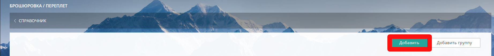{width=1844px height=212px}

### Вкладка Описание

В открывшейся вкладке Описание заполните *Название* и выберите:

-  Плавное распределение цены (при необходимости)

-  *Группу* (при необходимости)

-  *Единицу измерения*: шт. или пог. метры (погонные метры)

-  *Валюту* в которой будет считаться данная операция

-  в *Пуск машина, приладка* заполните сумму (при необходимости).

-  Загрузите  *картинку* (минимальный размер 300x300px,  jpg, gif, png, webp) и  иконку (минимальный размер 79x79px,  jpg, gif, png, webp)

-  *Описание* (заполните поле)

Загруженные картинки и текст в поле *Описание* будут отображаться на сайте, при наведении курсора мыши на параметр. Иконка ускорит поиск операции в папках или общем списке.

После внесения всех данных и загрузки изображений, нажмите кнопк "Сохранить".

:::info 

**Внимание!!! После сохранения вкладки Описание,  параметр "ед. измерения" будет недоступен для редактирования.**

:::

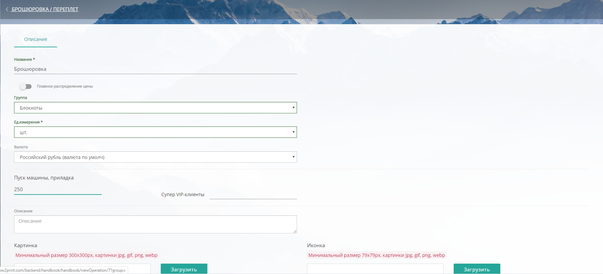{width=1797px height=817px}

После сохранения вкладки Описание, появится расширенная форма с дополнительными вкладками Фотогалерея/Цены.

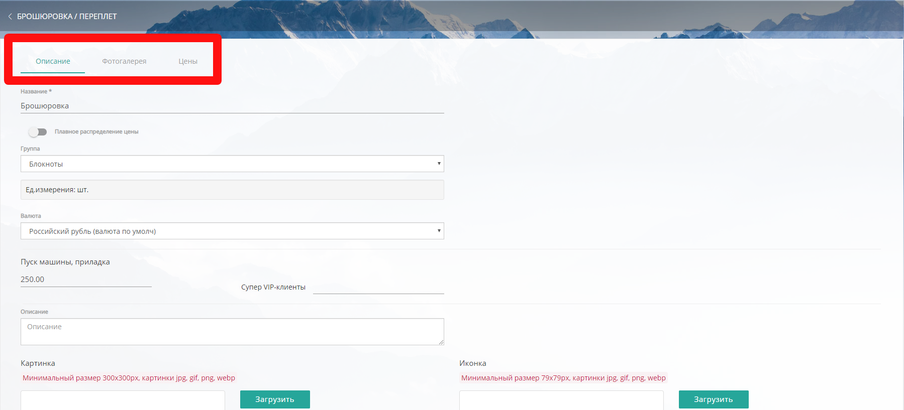{width=1799px height=817px}

### 

### 

### Вкладка Фотогал**е**рея

#### Добавление изображений

Чтобы добавить изображения в Фотогалерею нажмите кнопку \*\*"\*\*Добавить" -> "Начать загрузку" -> "Загрузить".

Требования к загружаемым файлам: минимальный размер 643x300, картинки jpg, gif, png, webp

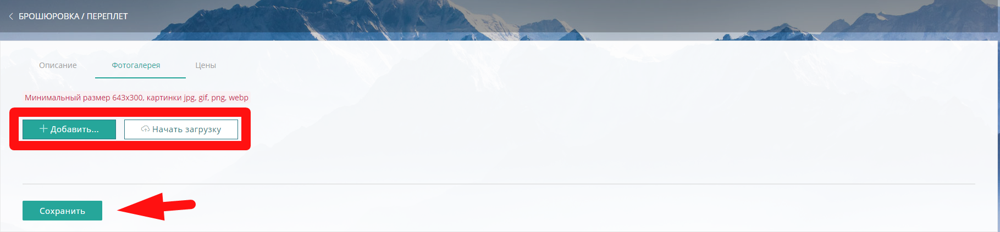{width=1819px height=423px}

#### **Удаление изображений**

Чтобы удалить изображение нажмите кнопку Удалить ( {width=131px height=40px} ) напротив загруженного изображения.

### Вкладка Цены

Во вкладке Цены вы можете заполнить цены от (ед. изм) ->цена за ед. изм., например, от шт. -> цена за шт. или от (пог.м.) -> цена за пог. м.

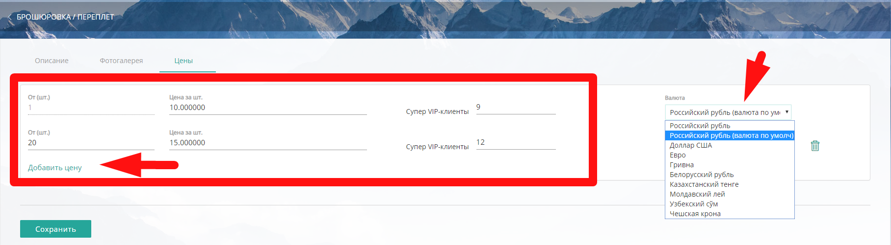{width=1816px height=501px}

Через кнопку "Добавить цену", вы  можете добавить несколько цен, в зависимости от кол-ва шт./пог.м., а также предусмотреть скидки для групп клиентов.

В случае, если у вас установлен модуль ["Мультивалютность"](./../settings/oplata/multivalyutnost), вы можете настроить разную валюту для операции Брошюровка/переплет.

Чтобы удалить цену из списка, нажмите кнопку "Удалить" напротив выбранной цены.

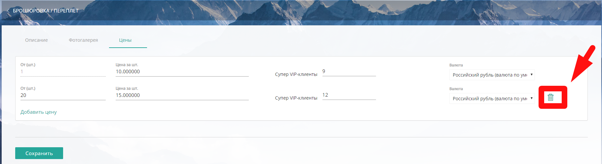{width=1822px height=499px}

## Редактирование операции Брошюровка/переплет

Чтобы отредактировать данные, зайдите в нужную операцию, щелкнув мышкой на *название*.

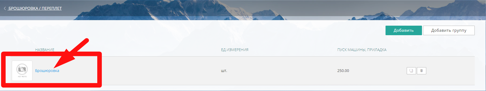{width=1814px height=344px}

Внесите во вкладках необходимые изменения.

Для удобства операцию Брошюровка/переплет можно копировать. Нажмите на кнопку "Копировать" напротив нужной операции

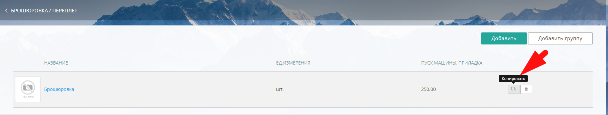{width=1819px height=344px}

-> затем подтвердите действие, нажав "Копировать" ( {width=160px height=40px} ) и дубликат появится в общем списке операций

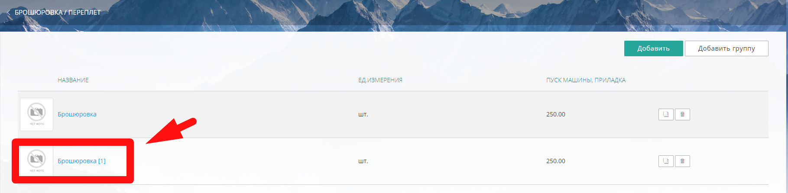{width=1819px height=446px}

## Удаление операции Брошюровка/переплет

Для удаления операции Брошюровка/переплет нажмите "Удалить" напротив выбранной операции.

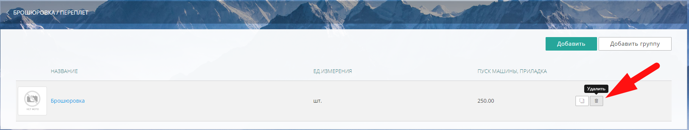{width=1821px height=347px}

В случае, если удаляемая операция используется в калькуляции какой-либо продукции, система предупредит об этом

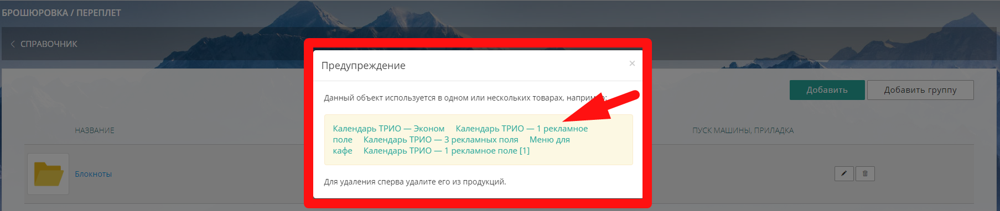{width=1807px height=382px}

В предупреждении для удобства выводится список продукции, в калькуляции которой используется данная операция Брошюровка/переплет.

Щелкнув на *название* вы попадете сразу на продукт, где сможете удалить операцию.