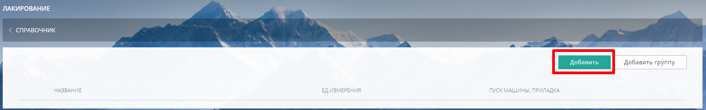
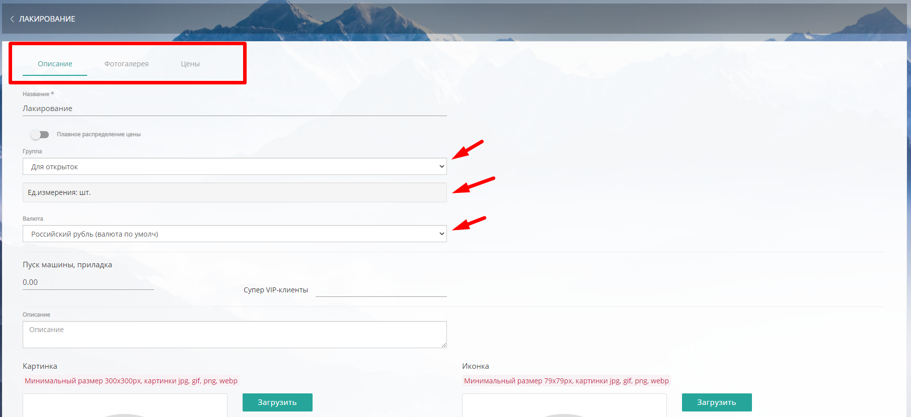
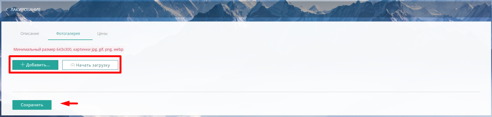
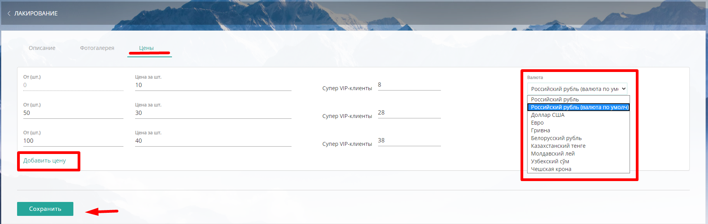
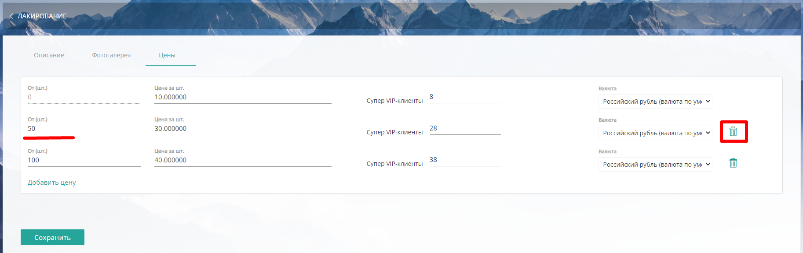
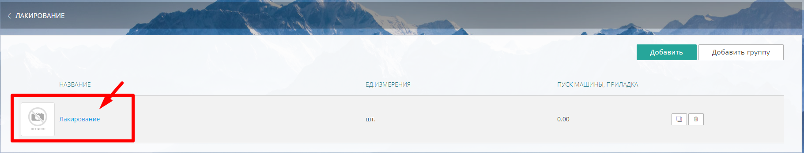
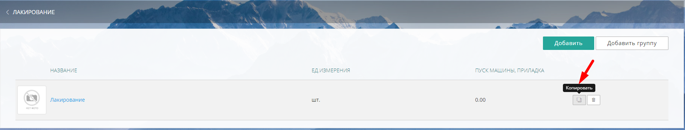
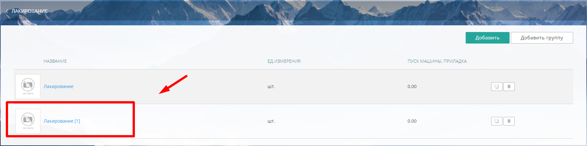
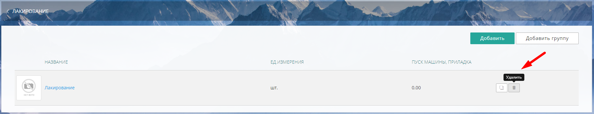
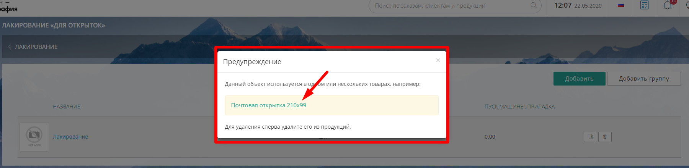

## Добавление операции Лакирование

Чтобы добавить операцию Лакирование, нажмите на кнопку "Добавить" в правом верхнем углу

{width=1831px height=286px}

### 

### Вкладка Описание

В открывшейся вкладке Описание заполните *Название* и выберите:

-  Плавное распределение цены (при необходимости)

-  *Группу* (при необходимости)

-  *Единицу измерения*: шт. или пог. м. (погонный метр)

-  *Валюту* в которой будет считаться данная операция

-  в *Пуск машина, приладка* заполните сумму (при необходимости)

-  Загрузите  *картинку* (минимальный размер 300x300px,  jpg, gif, png, webp) и  *иконку* (минимальный размер 79x79px,  jpg, gif, png, webp)

-  *Описание* (заполните поле)

Загруженные картинки и текст в поле *Описание* будут отображаться на сайте, при наведении курсора мыши на параметр. Иконка ускорит поиск операции в папках или общем списке.

После внесения всех данных и загрузки изображений, нажмите "Сохранить".

:::info 

**После сохранения вкладки Описание,  параметр "ед. измерения" будет недоступен для редактирования.**

:::

После сохранения вкладки Описание,  появится расширенная форма с дополнительными вкладками Фотогалерея/Цены.

{width=1810px height=830px}

### Вкладка Фотогал**е**рея

#### Добавление изображений

Чтобы добавить изображения в Фотогалерею нажмите кнопку "Добавить" -> "Начать загрузку" -> "Загрузить".

Требования к загружаемым файлам: минимальный размер 643x300, картинки jpg, gif, png, webp

{width=1823px height=436px}

#### **Удаление изображений**

Чтобы удалить изображение нажмите кнопку "Удалить" ({width=131px height=40px}) напротив загруженного изображения. ​

### Вкладка Цены

Во вкладке Цены вы можете заполнить цены от (ед. изм) ->цена за ед. изм., например\*\*:\*\* от (шт\*\*.\*\*) -> цена за шт, от (пог.м) -> цена за пог. м.

{width=1824px height=579px}

Через кнопку "Добавить цену", вы  можете добавить несколько цен, в зависимости от количества шт. или пог. м., а также предусмотреть скидки для групп клиентов.

В случае, если у вас установлен модуль ["Мультивалютность"](./../settings/oplata/multivalyutnost), вы можете настроить разную валюту для операции Лакирование.

Чтобы удалить цену из списка, нажмите кнопку "Удалить" напротив выбранной цены

{width=1826px height=578px}

## 

## Редактирование операции Лакирование

Чтобы отредактировать данные, зайдите в нужную операцию, щелкнув мышкой на *название.*

{width=1821px height=348px}

Внесите во вкладках необходимые изменения.

Для удобства операцию Лакирование можно копировать. Нажмите на кнопку "Копировать" напротив нужной операции -> подтвердите действие, нажав  "Копировать" ( {width=160px height=40px} ).

{width=1818px height=349px}

и дубликат появится в общем списке операций

{width=1819px height=456px}

## Удаление операции Лакирование

Для удаления операции Лакирование нажмите "Удалить" напротив выбранной операции.

{width=1825px height=351px}

В случае, если удаляемая операция используется в калькуляции какой-либо продукции, система предупредит об этом

{width=1800px height=440px}

В предупреждении для удобства выводится список продукции, в калькуляции которой используется данная операция Лакирование.

Щелкнув на *название* вы попадете сразу на продукт, где сможете удалить операцию.

### 