## Добавление операции Ламинирование

Чтобы добавить операцию Ламинирование, нажмите на кнопку "Добавить" в правом верхнем углу

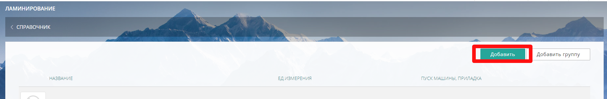{width=1841px height=302px}

### Вкладка Описание

В открывшейся вкладке Описание заполните *Название* и выберите:

-  Плавное распределение цены

-  *Группу* (при необходимости)

-  *Единицу измерения*: лист,  м2 или шт.

-  *Формат* (ед. изм. лист) или *Рулон* (ед. изм. м2)

-  *Валюту* в которой будет считаться данная операция.

-  в *Пуск машина, приладка* заполните сумму.

-  Загрузите  картинку (минимальный размер 300x300px,  jpg, gif, png, webp) и  иконку (минимальный размер 79x79px,  jpg, gif, png, webp)

-  *Описание* (заполните поле)

Загруженные картинки и текст в поле *Описание* будут отображаться на сайте, при наведении курсора мыши на параметр. Иконка ускорит поиск операции в папках или общем списке.

После внесения всех данных и загрузки изображений, нажмите "Сохранить".

:::info 

**Внимание!!! После сохранения вкладки Описание, ед. измерения и выбранный Формат будут недоступны для редактирования.**

:::

После сохранения вкладки Описание,  появится расширенная форма с дополнительными вкладками Фотогалерея/Стороны ламинации/Цены.

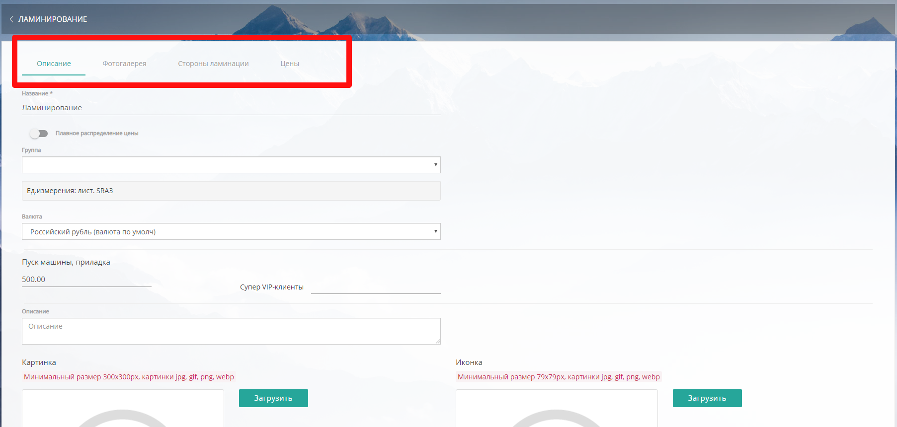{width=1805px height=860px}

### 

### Вкладка Фотогалерея

#### Добавление изображений

Чтобы добавить изображения в Фотогалерею нажмите кнопку \*\*"\*\*Добавить" -> "Начать загрузку".

Требования к загружаемым файлам: минимальный размер 643x300, картинки jpg, gif, png, webp

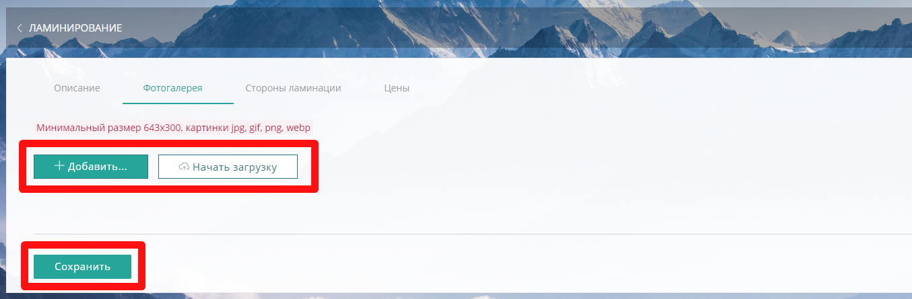{width=1354px height=445px}

#### 

#### **Удаление изображений**

Чтобы удалить изображение нажмите кнопку "Удалить" {width=131px height=40px} напротив  загруженного изображения.

### Вкладка Стороны ламинации

Чтобы добавить стороны ламинации, нажмите кнопку "Добавить"

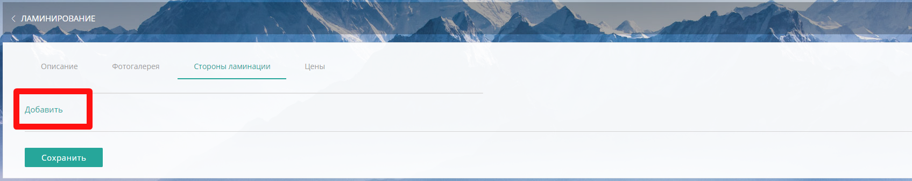{width=1695px height=338px}

и выберите из предложенных вариантов: *Односторонняя, Двусторонняя.*

После сохранения выбранный вариант появится во вкладке.

Чтобы удалить сторону ламинации, нажмите на кнопку "Удалить".

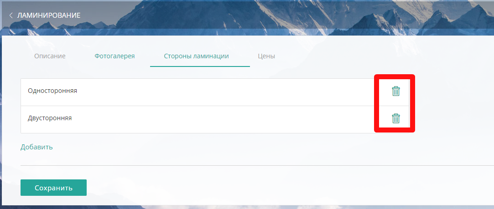{width=1083px height=459px}

### 

### Вкладка Цены

Внести цены на ламинацию можно во вкладке "Цены", щелкнув мышкой на выбранные стороны ламинации.

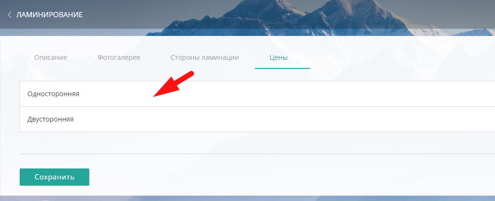{width=1031px height=420px}

В открывшейся форме появится возможность заполнить цены от (лист)->цена за лист, а в случае выбора ед. измерения м2 заполнить от (кв. метр) -> цена за кв.метр.

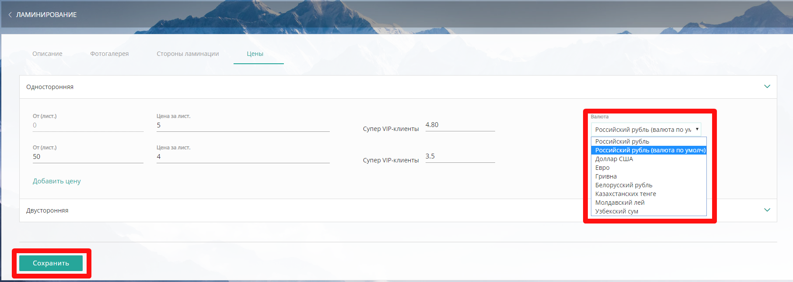{width=1813px height=646px}

Через кнопку "Добавить цену", вы  можете добавить несколько цен, в зависимости от количества листов, а также предусмотреть скидки для групп клиентов.

В случае, если у вас установлен модуль "[Мультивалютность](./../settings/oplata/multivalyutnost)", вы можете настроить разную валюту для операции ламинирование.

## Редактирование операции Ламинирование

Чтобы отредактировать данные, зайдите в нужную операцию Ламинирование, щелкнув мышкой на *названии*.

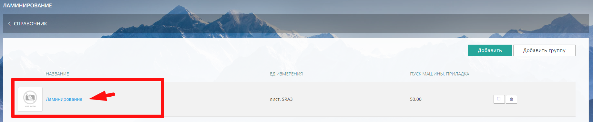{width=1837px height=380px}

Внесите необходимые изменения во вкладках.

Для удобства операцию Ламинирование можно копировать. Нажмите на кнопку "Копировать" напротив нужной операции

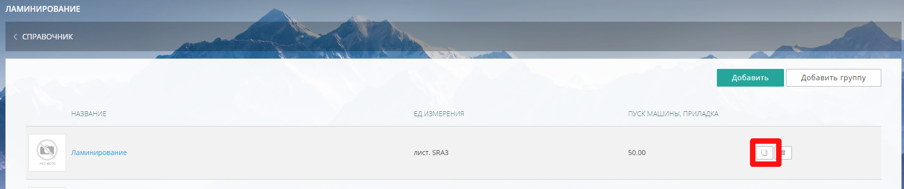{width=1831px height=384px}

и дубликат появится в списке операций

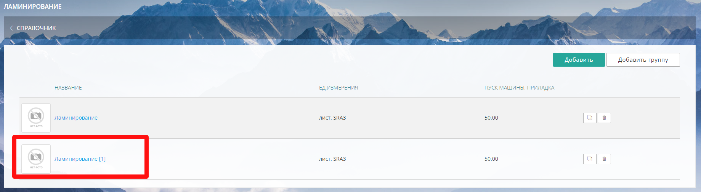{width=1839px height=504px}

## Удаление операции Ламинирование

Для удаления операции Ламинирование нажмите кнопку "Удалить" напротив каждой операции

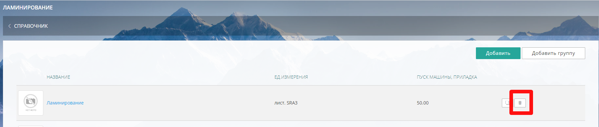{width=1825px height=389px}

В случае, если удаляемая операция используется в продукции, система предупредит об этом.

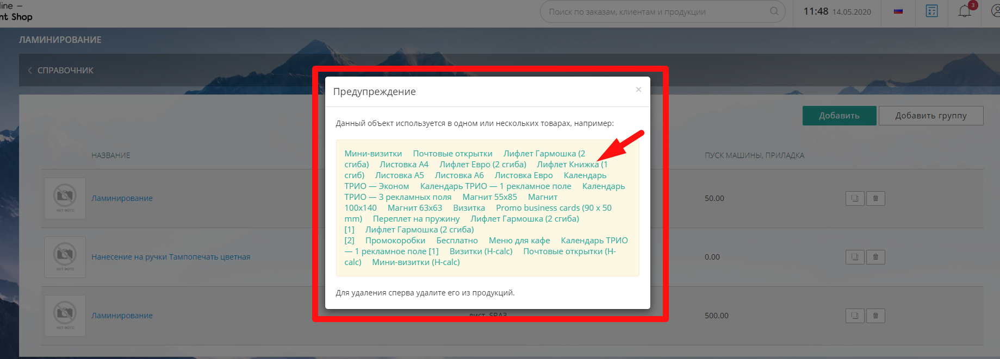{width=1839px height=661px}

В предупреждении для удобства выводится список продукции, в калькуляции которой используется эта операция ламинирования.

Щелкнув на *название* вы попадете сразу на продукт, где сможете ее удалить.

## Видеоинструкция

**по добавлению Операции Ламинирования в Справочник сайта**

https://vkvideo.ru/video-150544481_456239077

https://youtu.be/cYCL4pqpw_Q