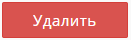

# Магнитное полотно

## Добавление комплектующего Магнитное полотно

Чтобы добавить численник, в Комплектующие щелкните на раздел Магнитное полотно

.png>)

и нажмите "Добавить" в правом верхнем углу

.png>)

### Вкладка Описание

В открывшемся окне заполните поле *Название\** и выберите параметры:

-  *Группу* (при необходимости)

-  Плавное распределение цены (при необходимости)

-  *Вес\** (в гр.)

-  *Ед. измерения* комплектующего: лист, м2, см2, шт., компл., г/м2,  пог.м, пог. см., пог. мм. 

-  Загрузите *картинку* (минимальный размер 300x300px, jpg, gif, png, webp) и *иконку* (минимальный размер 79x79px, jpg, gif, png, webp)

-  *Описание* (заполните поле)

Загруженные картинки и текст в поле *Описание* будут отображаться на сайте, при наведении курсора мыши на параметр. Иконка ускорит поиск операции в папках или общем списке.

После внесения всех данных и загрузки изображений, нажмите "Сохранить".

После сохранения вкладки Описание,  появится расширенная форма с дополнительными вкладками Фотогалерея/Свойства/Цены.

.png>)

### 

### Вкладка Фотогалерея

#### Добавление изображений 

Чтобы добавить изображения в Фотогалерею нажмите кнопку "Добавить" -> "Начать загрузку" -> "Загрузить".

Требования к загружаемым файлам: минимальный размер 643x300, картинки jpg, gif, png, webp

#### **​** 

.png>)

####  

#### **Применение Фотогалереи** 

 Картинки загруженные во вкладку Фотогалереи отображаются в калькуляции продукта при выборе в Комплектующие-> Магнитное полотно-> Галерея -> Вкл. -> Применить.

.png>)

####  

#### **Удаление изображений**  

Чтобы удалить изображение нажмите кнопку "Удалить" ( {width=131px height=40px} ) напротив загруженного изображения. ​

### Вкладка Свойства

:::info 

**Добавление свойства не является обязательным!** Если свойства не предусмотрены,  пропустите вкладку  и переходите сразу к ценам.

:::

Чтобы добавить свойства (цвет, материал и т.д..) нажмите кнопку "Добавить"

.png>)

В открывшемся окне будут отображены свойства из Справочник -> Свойства -> Свойства комплектующих (вы можете добавить туда другие необходимые вам свойства: цвет, материал и т.д..). 

.png>)

Выбранные свойства вы можете отображать на сайте, для этого в Калькуляции продукта выберите "Отображать свойства"**.**

Пример в калькуляции:

.png>)

### Вкладка Цены

Чтобы внести цены на магнитное полотно, щелкните мышкой на выбранные *свойства*.

.png>)

По умолчанию, для варианта когда свойство не выбрано, предусмотрено заполнение цен *Без свойств*.

Цена устанавливается от ед. изм. -> цена за единицу. 

.png>)

Через кнопку "Добавить цену", вы можете добавить несколько цен, в зависимости от количества комплектующего, а также предусмотреть скидки для групп клиентов.

В случае, если у вас установлен модуль ["Мультивалютность"](./../../settings/oplata/multivalyutnost), вы можете настроить разную валюту для комплектующего Магнитное полотно.

Чтобы удалить цену из списка, нажмите кнопку "Удалить" напротив выбранной цены.

.png>)

## Редактирование Магнитного полотна

Чтобы отредактировать данные, зайдите в нужное Магнитное полотно, щёлкнув мышкой на *название*.

.png>)

Внесите необходимые изменения в соответствующих вкладках.

Для удобства комплектующие Магнитное полотно можно копировать. Нажмите кнопку "Копировать" напротив нужного комплектующего

.png>)

и дубликат появится в общем списке:

.png>)

## Отключение Магнитного полотна в калькуляции 

В общем списке, напротив каждого наименования есть переключатели "Выкл/Вкл."

.png>)

При помощи их вы можете отключить магнитное полотно в продукте на сайте, например, если комплектующие временно закончились. 

В этом случае, отключенный вариант не отображается клиенту.

## Удаление Магнитного полотна

Для удаления магнитного полотна, нажмите напротив кнопку "Удалить".

.png>)

В случае, если комплектующие используется в каких-либо продуктах, система предупредит вас об этом.

.png>)

В предупреждении для удобства выводится список продукции, в калькуляции которой используется данное магнитное полотно. 

Щелкнув на *название*, вы попадете сразу на продукт, где сможете удалить его.