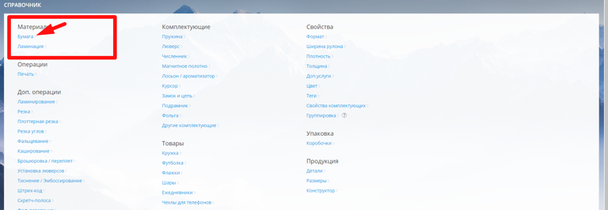
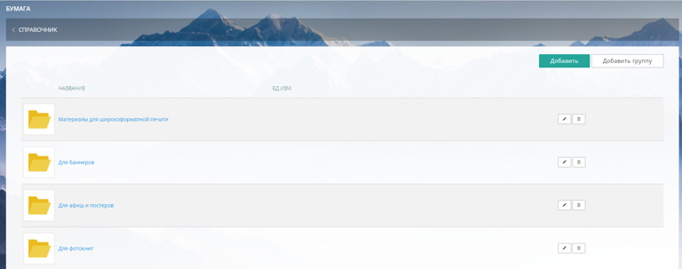
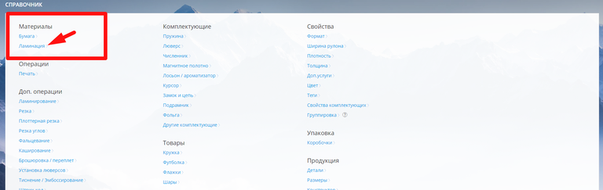
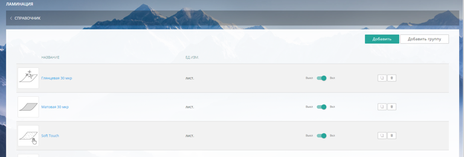

В раздел входят два блока материалов Бумага и Ламинация.

В системе уже занесены основные материалы (Мелованная, Картон и т.д.) Вы можете воспользоваться готовыми, отредактировать их под ваши операции или создать новые.

### Бумага

В блоке Бумага создаются все материалы, предназначенные для печати (используемые в операции Печать). Это не только непосредственно сама бумага, но и материалы для широкоформатной, интерьерной и других видов печати.

Чтобы попасть в раздел щелкните на название.

{width=768px height=266px}

В открывшемся окне появится список всех материалов, используемых для печати с возможностью группировки материалов, добавления новых, редактирования и удаления текущих.

{width=768px height=303px}

### **Ламинация**

В блоке Ламинация создаются материалы для операции Ламинирование.

Нажмите на название блока чтобы попасть в него.

{width=768px height=243px}

Вы увидите общий список материалов для ламинирования, с предусмотренными кнопками добавления, редактирования и удаления материалов.

{width=768px height=261px}