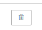

**Внесение цен**

Чтобы внести цены во вкладке Цены щелкните мышкой на строке с характеристиками

.png>)

В открывшейся форме заполните цены. 

Цена устанавливается в зависимости от количества листов цена за 1 лист. Если цены отличаются для разных групп клиентов, вы можете прописать цены для каждой из групп. Добавить новую цену можно через кнопку **"**Добавить"

Если у вас подключен дополнительный модуль "[Мультивалютность](./../../../settings/oplata/multivalyutnost)", вы можете установить любую валюту из списка предложенных: Российский рубль, Доллар США, Евро, Гривна, Белорусский рубль, Казахстанский тенге, Молдавский лей, Узбекский сум, Чешская крона.

После внесения всех цен не забудьте нажать кнопку {width=157px height=45px}

Чтобы удалить  цену нажмите кнопку "Удалить" {width=72px height=52px} напротив ненужной цены.

 