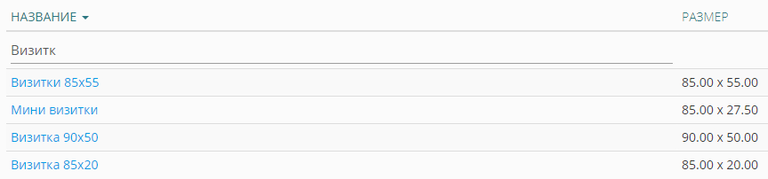

## Общее

Конструктор позволяет создать макет онлайн. В .TCS имеется 2 основных вида конструктора:

-  Конструктор полиграфии (стандарт);

-  Конструктор фотопродукции.

В свою очередь, конструктор фотопродукции включает в себя: фотокниги, фотокарточки и фотокалендари.

В списке стандартных конструкторов присутствуют предустановленные конструкторы полиграфии. Для поиска нужного конструктора можете воспользоваться фильтром по названию:

[view:hierarchy=none::::List]

{width=768px height=179px}