# Фотокалендарь

### Создание конструктора

Чтобы создать новый конструктор, необходимо нажать на кнопку в верхнем правом углу окна браузера "Создать"

## Вкладка Описание

-  *Название* -- название конструктора;

-  *Тип конструктора* -- выбираем "Фотокалендарь";

-  *Ширина (мм)* -- ширина фотокалендаря;

-  *Высота (мм)* -- высота фотокалендаря;

-  *Безопасная область (мм)* -- безопасная область макета фотокалендаря;

-  *Вылеты под обрез (мм)* -- вылеты под обрез макета фотокалендаря;

-  [*Тип продукта*](./fotokalendar#tip-produkta) -- Календарь-домик, Стандарт или С навивкой посередине.

.png>)

:::info 

Макет из конструктора формируется размерами Ш x В + вылеты под обрез.\
Например, конструктор, размерами **150 x 200 мм** и вылетами под обрез **2 мм** с каждой стороны, формирует макет размерами **154 x 204 мм**.\
Файл макета формируется в формате **.pdf**.

:::

:::danger 

После сохранения настроек изменить параметр "Тип конструктора" нельзя.

:::

После сохранения настроек, появятся новая вкладка "Шаблоны" и на вкладке "Описание" появится параметр "Принудительное автозаполнение".

### Тип продукта

От типа продукта зависит **только** внешнее отображение календаря в конструкторе:

-  *Календарь-домик* -- в верхней части страницы и обложки показана навивка;

.png>)

-  *Стандарт* -- в верхней части страницы и обложки показана навивка;

.png>)

-  *С навивкой посередине* -- в середине страницы и обложки показана навивка.

.png>)

### Принудительное автозаполнение

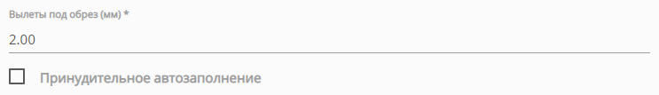{width=743px height=107px}

Фотографии, загруженные клиентом в конструктор, будут автоматически расставлены по всем доступным компонентам "Изображение".

:::note 

Автоматическое заполнение проекта происходит до тех пор, пока в проекте имеется хотя бы один пустой компонент "Изображение".

:::

Если клиента не устраивает автоматическое заполнение, то он всегда может "Очистить" проект:

{width=488px height=200px}

Переходим на вкладку "Шаблоны".

## Вкладка Шаблоны

Основным элементом любого конструктора являются **Шаблоны**, без них конструктор не будет функционировать.

Добавить шаблоны в конструктор можно двумя способами:

-  Создать новый - "[Добавить](./fotokalendar#sozdanie-novogo-shablona)";

-  Импортировать из другого конструктора - "[Импорт](./fotokalendar#import-shablonov)".

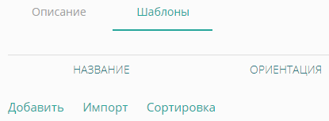{width=415px height=153px}

### Создание нового шаблона

В списке шаблонов нажимаем на кнопку "Добавить"

В открывшемся окне вводим следующие данные:

-  *Название* -- название шаблона, отображается в конструкторе;

-  *Сторона* -- Обложка или Страница;

\ Основные компоненты календаря (месяц, год и календарная сетка) располагаются **только** на шаблоне типа Сторона

\

-  *Ориентация* -- только Горизонтальная;

-  *Группа* -- компоненты, доступные в данном шаблоне: Изображение и текст, Только изображение или Только текст;

-  *Отображение на устройстве* -- устройство, на котором будет отображаться данный шаблон: Универсальный, Для десктопа или Для мобильных устройств;

-  *Иконка* -- иконка шаблона, отображается в конструкторе.

.png>)

После сохранения настроек, откроется общий список шаблонов, в котором новый шаблон будет иметь статус "Выкл".

.png>)

:::note 

 Необходимо создать сам шаблон в [редакторе](./fotokalendar#redaktor): разместить на нем необходимые компоненты, которые клиент сможет использовать.

:::

### Шаблон по умолчанию

.png>)

Для каждого типа (обложка и страница) можно установить шаблон по умолчанию, он будет выбран первым при загрузке конструктора.

:::info 

Чтобы снять выбор шаблона пол умолчанию, нажмите повторно на иконку "Установить по умолчанию"

:::

### Сортировка шаблонов

Шаблоны по умолчанию располагаются в том порядке, в котором были созданы.\
Имеется возможность ручной сортировки шаблонов, для этого на вкладке "Шаблоны", в самом низу экрана, нажмите на кнопку "Сортировка".

Откроется окно сортировки:

.png>)

Шаблоны сортируются отдельно для каждого типа и перемещаются с помощью курсора мыши.\
На превью шаблонов, в правом верхнем углу, имеется отметка о типе устройства, для которого шаблон доступен:

.png>)

### Импорт шаблонов

Если в другом конструкторе уже имеются типовые шаблоны, их можно импортировать в новый шаблон с помощью кнопки "Импорт"

{width=415px height=153px}

При нажатии на кнопку "Импорт", откроется окно следующего вида:

.png>)

В этом окне выбираем конструктор, затем отмечаем шаблоны, которые необходимо импортировать.

:::note 

Шаблоны импортируются ровно в том виде, в котором они были созданы. Компоненты шаблонов **сохраняют настройки координат**.\
Если размеры нового конструктор отличаются от размеров конструктора из которого происходит импорт, шаблоны необходимо корректировать.

:::

## Редактор

.png>)

В строке шаблона нажимаем на "Редактор". откроется редактор шаблона, в котором имеются следующие элементы:

-  [область шаблона](./fotokalendar#oblast-shablona-komponenty);

-  [компоненты](./fotokalendar#komponenty);

-  [слои](./fotokalendar#sloi).

### Область шаблона (компоненты)

:::note 

Изначально шаблон создается пустой, его необходимо заполнить

:::

.png>)

:::info 

Область шаблона отображает шаблон с учетом вылетов под обрез.\
**Сплошная черная линия** -- размеры готового изделия.\
**Пунктирная красная линия** -- безопасная область.

:::

Кнопка "Сетка" над областью шаблона, позволяет отобразить сетку:

.png>)

### Компоненты

Шаблон наполняется только с помощью компонентов. Их можно найти в нижней части редактора:

.png>)

-  *Изображение* -- поле для загрузки изображения;

-  *Текст* -- текст в одну строку;

-  *Мультитекст* -- текст в несколько строк;

-  *Прямоугольник* -- компонент со сплошной заливкой;

-  Месяц -- компонент, на месте которого будет отображаться месяц;

-  Год -- компонент, на месте которого в конструкторе будет отображаться выбранный год;

-  Месяц + год -- комбинированный компонент, на месте которого в конструкторе будет отображаться выбранные месяц и год;

-  Сетка -- компонент, на месте которого в конструкторе будет отображаться выбранная календарная сетка.

Чтобы добавить любой компонент в область шаблона, нажмите на его название. Все компоненты по умолчанию добавляются в левый верхний угол шаблона.

.png>)

:::info 

Система координат начинает отсчет от левого верхнего угла области шаблона: горизонтальная -- x, вертикальная -- y (x = 0, y = 0).

:::

Манипулировать компонентами (их расположением и размерами) можно как курсором мыши, так и ручным вводом цифровых значений в панели управления:

{width=504px height=68px}

У каждого компонента имеется параметр "Тэг", он позволяет связать разные шаблоны между собой и не потерять заполненный результат при переключении одного шаблона на другой.

.png>)

Как правило, в конструкторе макетов зачастую имеется несколько шаблонов. Чтобы, при переключении шаблонов, заполненные данные не терялись и не приходилось заполнять каждый шаблон заново, необходимо использовать Тэги компонентов.

Поле "Тэг" по умолчанию заполняется случайным набором цифр и букв. Компоненты из разных шаблонов, которые выполняют одну и ту же функцию, например, являются полем для загрузки логотипа, необходимо отмечать одним и тем же тэгом.

### Дополнительные настройки компонента

.png>)

В панели управления каждого компонента имеется иконка карандаша (редактировать), нажав на нее, откроются дополнительные настройки компонента.

[tabs]

[tab:Изображение]

{width=413px height=214px}

Настройки компонента "Изображение".

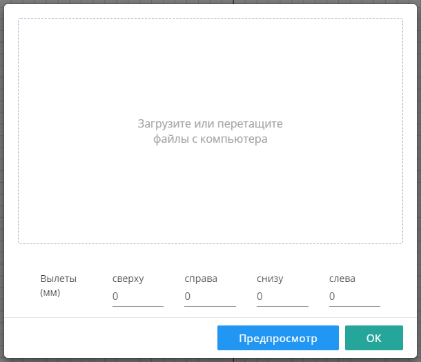{width=610px height=525px}

В компонент можно загрузить свое изображение, оно будет отображаться в конструкторе для клиента.

Также на этот компонент можно выставить свои параметры вылетов. Они пригодятся, если изображение каким-то образом дополнительно обрабатывается, из-за чего края могут быть видны не полностью.

[/tab]

[tab:Текст/Мультитекст]

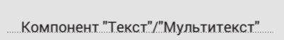{width=401px height=57px}

Настройки компонента "Текст" и "Мультитекст".

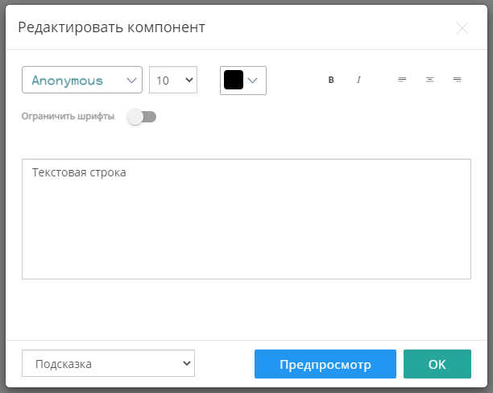{width=612px height=488px}

В компоненте присутствуют стандартные инструменты редактирования текста: Шрифт, Размер шрифта, Цвет шрифта, Тип шрифта и Тип выравнивания по горизонтали.

Текст может быть как подсказкой, так и значением по умолчанию. Компонент по умолчанию имеет предустановленный текст-подсказку "Текстовая строка".

-  *Подсказка* -- предустановленный текст НЕ идет в итоговый макет;

-  *Значение по умолчанию* -- предустановленный текст ИДЕТ в итоговый макет.

Также в данном компоненте имеется инструмент "Ограничить шрифты", он позволяет ограничить как размер шрифта (диапазон "от" и "до"), так и сам шрифт.

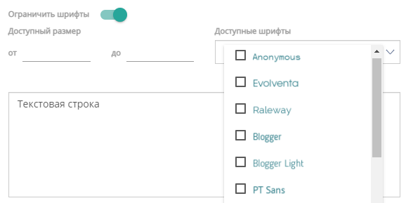{width=578px height=289px}

[/tab]

[tab:Прямоугольник]

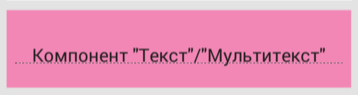{width=358px height=95px}

Настройки компонента "Прямоугольник".

{width=610px height=336px}

Каждый компонент может быть определенного цвета в формате CMYK и степенью прозрачности.

Данный компонент может пригодится в каких-либо дизайнерских решениях (отображать при печати), либо в случае, когда необходимо показать клиенту, что данная часть макета не запечатывается (не отображать при печати).

[/tab]

[/tabs]

[tabs]

[tab:Месяц]

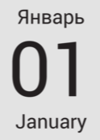{width=124px height=172px}

:::danger 

Для корректной работы конструктора фотокалендарей и его компонентов, необходимо настроить [Стили календарей](https://support.wow2print.com/konstruktor/stili-kalendarei)

:::

Настройки компонента "Месяц".

{width=612px height=233px}

В дополнительных настройках компонента можно выбрать тип месяца:

-  *Стандартный* -- месят обозначается словом - Январь;

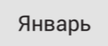{width=123px height=52px}

-  *Комбинированный* -- месяц обозначается двумя языками через символ "/" - Январь / January (обозначение месяца через "/" **всегда** на английском;

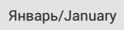{width=209px height=51px}

-  *Цифровой* -- месяц обозначается цифрой - 01 (Январь).

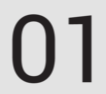{width=106px height=94px}

Язык, на котором будет отображаться месяц. Если выбран параметр "---", язык берется из [Стилей календарей](https://support.wow2print.com/konstruktor/stili-kalendarei).

Также, можно настроить выравнивание месяца по горизонтали.

:::note 

Компонент "Месяц" необходимо разместить в область шаблона, в конструкторе для клиента будет автоматически отображаться название соответствующего месяца.

:::

[/tab]

[tab:Год]

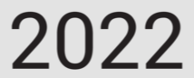{width=214px height=86px}

:::danger 

Для корректной работы конструктора фотокалендарей и его компонентов, необходимо настроить [Стили календарей](https://support.wow2print.com/konstruktor/stili-kalendarei)

:::

Настройки компонента "Год".

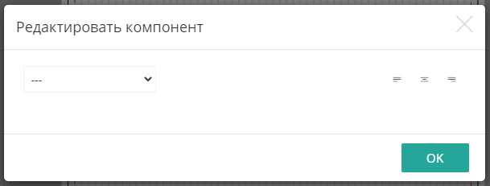{width=609px height=231px}

В дополнительных настройках компонента "Год" присутствует лишь настройка выравнивания по горизонтали.

:::note 

Компонент "Год" необходимо разместить в область шаблона, в конструкторе для клиента будет автоматически отображаться соответствующий год.

:::

[/tab]

[tab:Месяц+год]

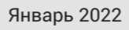{width=164px height=39px}

:::danger 

Для корректной работы конструктора фотокалендарей и его компонентов, необходимо настроить [Стили календарей](https://support.wow2print.com/konstruktor/stili-kalendarei)

:::

Настройки компонента "Месяц + Год".

{width=609px height=231px}

В дополнительных настройках компонента можно выбрать язык, на котором будет отображаться месяц. Если выбран параметр "---", язык берется из [Стилей календарей](https://support.wow2print.com/konstruktor/stili-kalendarei).

Также, можно настроить выравнивание компонента по горизонтали.

:::note 

Компонент "Месяц + Год" необходимо разместить в область шаблона, в конструкторе для клиента будет автоматически отображаться соответствующий год название месяца .

:::

[/tab]

[tab:Сетка]

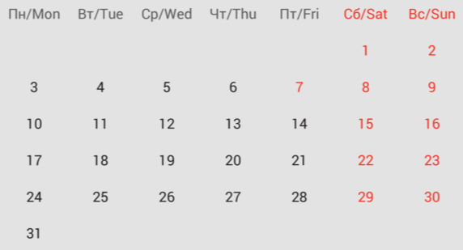{width=572px height=309px}

Настройки компонента "Сетка".

:::note 

Компонент "Сетка" необходимо разместить в область шаблона, в конструкторе для клиента будет автоматически отображаться сетка соответствующего месяца.

:::

:::danger 

Компонент "Сетка" настраивается в стилях в разделе [Стили календарей](https://support.wow2print.com/konstruktor/stili-kalendarei#setka)

:::

[/tab]

[/tabs]

### Слои

Каждый компонент в область шаблона добавляется отдельным слоем. Слои можно блокировать и изменять их порядок.\
Слои можно найти в правом нижнем углу окна редактора:

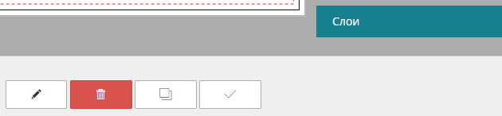{width=630px height=146px}

Чтобы увидеть все слои и их порядок, нажмите на кнопку "Слои"

{width=260px height=574px}

Слои называются соответственно компоненту и нумеруются в порядке добавления (Строка 1, Строка 2, Строка 3, ...).\
Если компоненты в области шаблона располагаются друг под другом, то в первую очередь будет отображаться тот компонент, который в списке слоев находится выше.

Таким образом, например, можно размещать компонент текст поверх компонента изображение или прямоугольник.

Также, слой можно заблокировать -- иконка замка -- в этом случае клиент не сможет его редактировать.