# Фотокарточка

### Создание конструктора

Чтобы создать новый конструктор, необходимо нажать на кнопку в верхнем правом углу окна браузера "Создать"

## Вкладка Описание

-  *Название* -- название конструктора;

-  *Тип конструктора* -- выбираем "Фотокарточка";

-  *Ширина (мм)* -- ширина фотокарточки;

-  *Высота (мм)* -- высота фотокарточки;

-  *Безопасная область (мм)* -- безопасная область макета фотокарточки;

-  *Вылеты под обрез (мм)* -- вылеты под обрез макета фотокарточки.

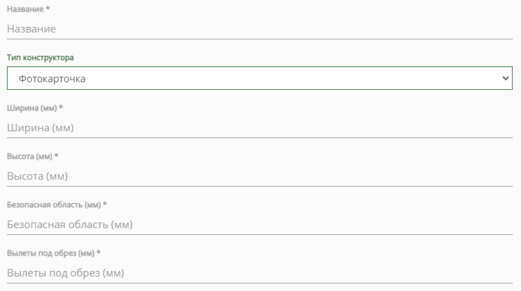{width=753px height=421px}

:::info 

Макет из конструктора формируется размерами Ш x В + вылеты под обрез.\
Например, конструктор, размерами **150 x 200 мм** и вылетами под обрез **2 мм** с каждой стороны, формирует макет размерами **154 x 204 мм**.\
Файл макета формируется в формате **.pdf**.

:::

:::danger 

После сохранения настроек изменить параметр "Тип конструктора" нельзя.

:::

После сохранения настроек, появятся новая вкладка "Шаблоны" и на вкладке "Описание" появится параметр "Принудительное автозаполнение".

### Принудительное автозаполнение

{width=743px height=107px}

Фотографии, загруженные клиентом в конструктор, будут автоматически расставлены по всем доступным компонентам "Изображение".

:::note 

Автоматическое заполнение проекта происходит до тех пор, пока в проекте имеется хотя бы один пустой компонент "Изображение".

:::

Если клиента не устраивает автоматическое заполнение, то он всегда может "Очистить" проект:

{width=488px height=200px}

Переходим на вкладку "Шаблоны".

## Вкладка Шаблоны

Основным элементом любого конструктора являются **Шаблоны**, без них конструктор не будет функционировать.

Добавить шаблоны в конструктор можно двумя способами:

-  Создать новый - "[Добавить](./fotokartochka#sozdanie-novogo-shablona)";

-  Импортировать из другого конструктора - "[Импорт](./fotokartochka#import-shablonov)".

{width=415px height=153px}

### Создание нового шаблона

В списке шаблонов нажимаем на кнопку "Добавить"

В открывшемся окне вводим следующие данные:

-  *Название* -- название шаблона, отображается в конструкторе;

-  *Сторона* -- для конструктора Фотокарточки только Лицевая;

-  *Ориентация* -- Горизонтальная или Вертикальная;

-  *Группа* -- компоненты, доступные в данном шаблоне: Изображение и текст, Только изображение или Только текст;

-  *Отображение на устройстве* -- устройство, на котором будет отображаться данный шаблон: Универсальный, Для десктопа или Для мобильных устройств;

-  *Иконка* -- иконка шаблона, отображается в конструкторе.

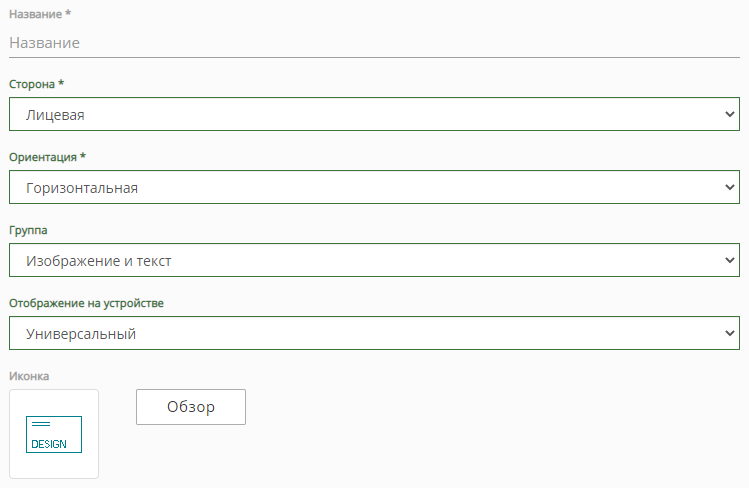{width=749px height=488px}

После сохранения настроек, откроется общий список шаблонов, в котором новый шаблон будет иметь статус "Выкл"

{width=1337px height=155px}

:::note 

Необходимо создать сам шаблон в [редакторе](./fotokartochka#redaktor): разместить на нем необходимые компоненты, которые клиент сможет использовать.

:::

### Шаблон по умолчанию

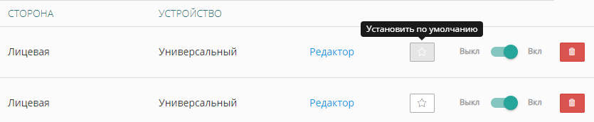{width=835px height=172px}

Имеется возможность установить шаблон по умолчанию, он будет выбран первым при загрузке конструктора.

:::info 

Чтобы снять выбор шаблона пол умолчанию, нажмите повторно на иконку "Установить по умолчанию"

:::

### Сортировка шаблонов

Шаблоны по умолчанию располагаются в том порядке, в котором были созданы.\
Имеется возможность ручной сортировки шаблонов, для этого на вкладке "Шаблоны", в самом низу экрана, нажмите на кнопку "Сортировка".

Откроется окно сортировки:

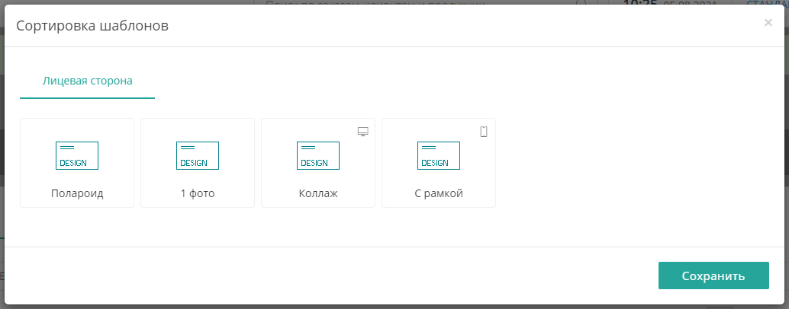{width=1034px height=406px}

Шаблоны сортируются отдельно для каждого типа и перемещаются с помощью курсора мыши.\
На превью шаблонов, в правом верхнем углу, имеется отметка о типе устройства, для которого шаблон доступен:

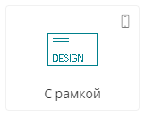{width=162px height=131px}

### Импорт шаблонов

Если в другом конструкторе уже имеются типовые шаблоны, их можно импортировать в новый шаблон с помощью кнопки "Импорт"

{width=415px height=153px}

При нажатии на кнопку "Импорт", откроется окно следующего вида:

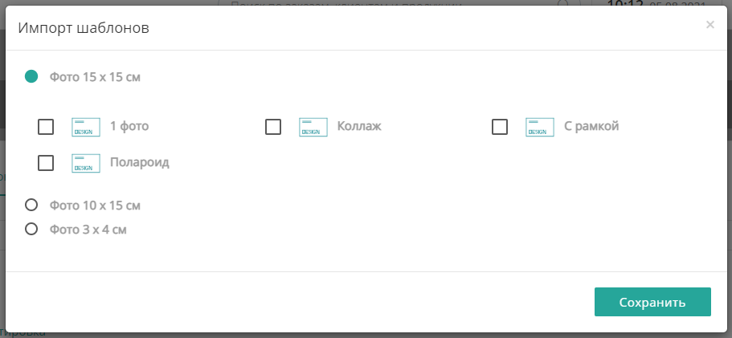{width=911px height=421px}

В этом окне выбираем конструктор, затем отмечаем шаблоны, которые необходимо импортировать.

:::danger 

Шаблоны импортируются ровно в том виде, в котором они были созданы. Компоненты шаблонов **сохраняют настройки координат**.\
Если размеры нового конструктор отличаются от размеров конструктора из которого происходит импорт, шаблоны необходимо корректировать.

:::

## Редактор

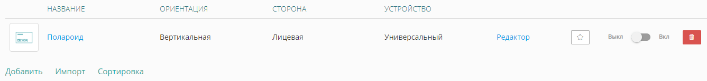{width=1337px height=155px}

В строке шаблона нажимаем на "Редактор". откроется редактор шаблона, в котором имеются следующие элементы:

-  [область шаблона](./fotokartochka#oblast-shablona-komponenty);

-  [компоненты](./fotokartochka#komponenty);

-  [слои](./fotokartochka#sloi).

### Область шаблона (компоненты)

:::note 

Изначально шаблон создается пустой, его необходимо заполнить

:::

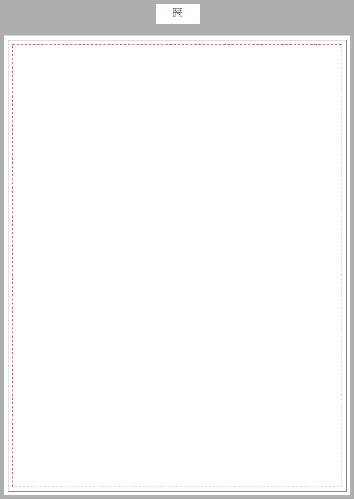{width=598px height=844px}

:::info 

Область шаблона отображает шаблон с учетом вылетов под обрез.\
**Сплошная черная линия** -- размеры готового изделия.\
**Пунктирная красная линия** -- безопасная область.

:::

Кнопка "Сетка" над областью шаблона, позволяет отобразить сетку:

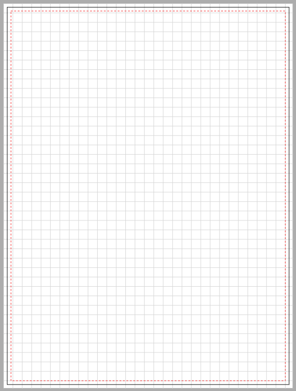{width=600px height=791px}

### Компоненты

Шаблон наполняется только с помощью компонентов. Их можно найти в левом нижнем углу редактора:

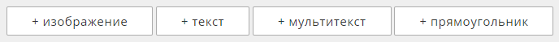{width=688px height=52px}

-  *Изображение* -- поле для загрузки изображения;

-  *Текст* -- текст в одну строку;

-  *Мультитекст* -- текст в несколько строк;

-  *Прямоугольник* -- компонент со сплошной заливкой.

Чтобы добавить любой компонент в область шаблона, нажмите на его название. Все компоненты по умолчанию добавляются в левый верхний угол шаблона.

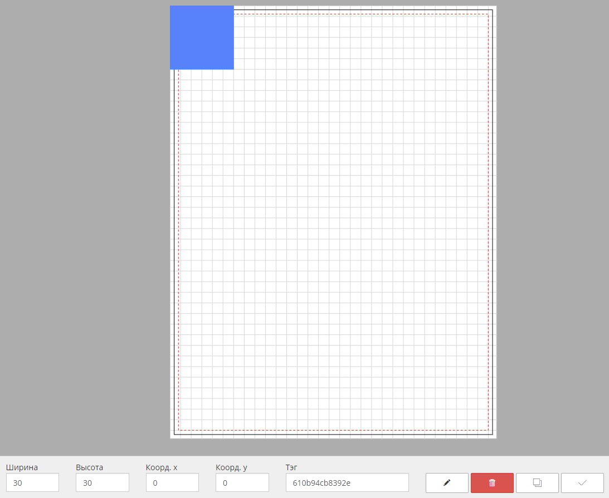{width=1093px height=895px}

Система координат начинает отсчет от левого верхнего угла области шаблона: горизонтальная -- x, вертикальная -- y (x = 0, y = 0).

Манипулировать компонентами (их расположением и размерами) можно как курсором мыши, так и ручным вводом цифровых значений в панели управления:

{width=504px height=68px}

У каждого компонента имеется параметр "Тэг", он позволяет связать разные шаблоны между собой и не потерять заполненный результат при переключении одного шаблона на другой.

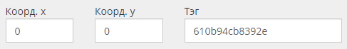{width=487px height=69px}

Как правило, в конструкторе макетов зачастую имеется несколько шаблонов. Чтобы, при переключении шаблонов, заполненные данные не терялись и не приходилось заполнять каждый шаблон заново, необходимо использовать Тэги компонентов.

Поле "Тэг" по умолчанию заполняется случайным набором цифр и букв. Компоненты из разных шаблонов, которые выполняют одну и ту же функцию, например, являются полем для загрузки логотипа, необходимо отмечать одним и тем же тэгом.

### Дополнительные настройки компонента

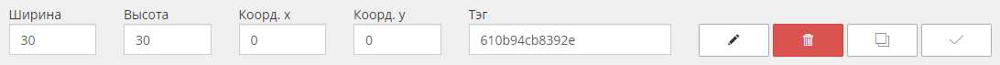{width=1092px height=71px}

В панели управления каждого компонента имеется иконка карандаша (редактировать), нажав на нее, откроются дополнительные настройки компонента.

[tabs]

[tab:Изображение]

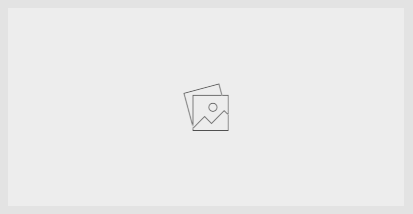{width=413px height=214px}

Настройки компонента "Изображение".

{width=610px height=525px}

В компонент можно загрузить свое изображение, оно будет отображаться в конструкторе для клиента.

Также на этот компонент можно выставить свои параметры вылетов. Они пригодятся, если изображение каким-то образом дополнительно обрабатывается, из-за чего края могут быть видны не полностью.

[/tab]

[tab:Текст/Мультитекст]

{width=401px height=57px}

Настройки компонента "Текст" и "Мультитекст".

{width=612px height=488px}

В компоненте присутствуют стандартные инструменты редактирования текста: Шрифт, Размер шрифта, Цвет шрифта, Тип шрифта и Тип выравнивания по горизонтали.

Текст может быть как подсказкой, так и значением по умолчанию. Компонент по умолчанию имеет предустановленный текст-подсказку "Текстовая строка".

-  *Подсказка* -- предустановленный текст НЕ идет в итоговый макет;

-  *Значение по умолчанию* -- предустановленный текст ИДЕТ в итоговый макет.

Также в данном компоненте имеется инструмент "Ограничить шрифты", он позволяет ограничить как размер шрифта (диапазон "от" и "до"), так и сам шрифт.

{width=578px height=289px}

[/tab]

[tab:Прямоугольник]

{width=358px height=95px}

Настройки компонента "Прямоугольник".

{width=610px height=336px}

Каждый компонент может быть определенного цвета в формате CMYK и степенью прозрачности.

Данный компонент может пригодится в каких-либо дизайнерских решениях (отображать при печати), либо в случае, когда необходимо показать клиенту, что данная часть макета не запечатывается (не отображать при печати).

[/tab]

[/tabs]

### Слои

Каждый компонент в область шаблона добавляется отдельным слоем. Слои можно блокировать и изменять их порядок.\
Слои можно найти в правом нижнем углу окна редактора:

{width=630px height=146px}

Чтобы увидеть все слои и их порядок, нажмите на кнопку "Слои"

{width=260px height=574px}

Слои называются соответственно компоненту и нумеруются в порядке добавления (1, 2, 3, ...).\
Если компоненты в области шаблона располагаются друг под другом, то в первую очередь будет отображаться тот компонент, который в списке слоев находится выше.

Таким образом, например, можно размещать компонент текст поверх компонента изображение или прямоугольник.

Также, слой можно заблокировать -- иконка замка -- в этом случае клиент не сможет его редактировать.