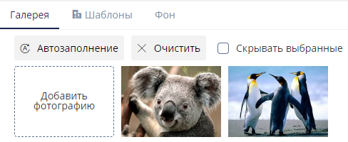
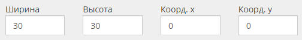
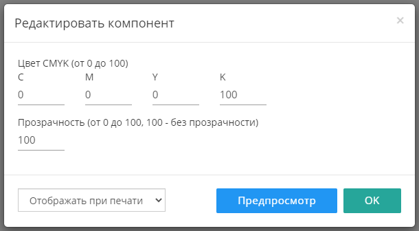
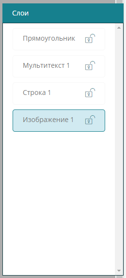

# Фотокнига

### Создание конструктора

Чтобы создать новый конструктор, необходимо нажать на кнопку в верхнем правом углу окна браузера "Создать"

## Вкладка Описание

-  *Название* -- название конструктора;

-  *Тип конструктора* -- выбираем "Фотокнига";

-  *Ширина продукта в развороте (мм)* -- ширина страниц книги в развороте;

-  *Высота (мм)* -- высота страниц книги в развороте;

-  *Безопасная область (мм)* -- безопасная область макета;

-  *Вылеты под обрез (мм)* -- вылеты под обрез макета страниц внутреннего блока;

-  *Вылеты под обрез обложки (мм)* -- вылеты под обрез макета обложки;

-  *Расстав (прибавляется с двух сторон от корешка) (мм)* -- расстояние между стороной обложки и корешком;

-  *Тип макета PDF* -- "Бабочка" или "Стандарт". Зависит от процесса печати.

.png>)

:::info 

 Бабочка -- макет внутреннего блока формируется в развороте (фотокниги типа layflat).

Стандарт -- макет внутреннего блока формируется постранично (фотокниги типа flexbind).

Макет из конструктора формируется размерами Ш x В + вылеты под обрез.\
Например, готовое изделие -- **200 x 200 мм**.\
В конструкторе необходимо указать размеры книги в развороте -- **400 x 200 мм** и вылеты под обрез **2 мм** с каждой стороны.\
Макет типа бабочка будет сформирован размерами **404 x 204 мм**.\
Макет типа стандарт -- **205 x 204 мм**.\
Почему именно 205, а не 204 -- с внешних сторон берется вылет из поля "Вылеты под обрез", с внутренней же стороны (на месте стыка двух страниц) берется значение вылета **3 мм**, это значение идет по умолчанию.

Файл макета формируется в формате **.pdf**.

:::

:::danger 

После сохранения настроек изменить параметры "Тип конструктора" и "Тип макета PDF" нельзя.

:::

После сохранения настроек, появятся новые вкладки: "Шаблоны" и "Корешок" и на вкладке "Описание" появится параметр "Принудительное автозаполнение".

### Принудительное автозаполнение

.png>)

Фотографии, загруженные клиентом в конструктор, будут автоматически расставлены по всем доступным компонентам "Изображение".

:::note 

Автоматическое заполнение проекта происходит до тех пор, пока в проекте имеется хотя бы один пустой компонент "Изображение".

:::

Если клиента не устраивает автоматическое заполнение, то он всегда может "Очистить" проект:

{width=488px height=200px}

Переходим на вкладку "Шаблоны".

## Вкладка Шаблоны

Основным элементом любого конструктора являются **Шаблоны**, без них конструктор не будет функционировать.

Добавить шаблоны в конструктор можно двумя способами:

-  Создать новый - "[Добавить](./fotokniga#sozdanie-novogo-shablona)";

-  Импортировать из другого конструктора - "[Импорт](./fotokniga#import-shablonov-1)".

.png>)

### Создание нового шаблона

В списке шаблонов нажимаем на кнопку "Добавить"

В открывшемся окне вводим следующие данные:

-  *Название* -- название шаблона, отображается в конструкторе;

-  *Сторона* -- тип шаблона: Обложка, Внутренние блоки, Титульная страница, Последняя страница или Калька;

:::note 

Шаблоны Титульная страница, Последняя страница или Калька доступны **только** в конструкторе, с типом макета PDF - "Стандарт"

:::

-  *Ориентация* -- только Горизонтальная;

-  *Группа* -- компоненты, доступные в данном шаблоне: Изображение и текст, Только изображение или Только текст;

-  *Отображение на устройстве* -- устройство, на котором будет отображаться данный шаблон: Универсальный, Для десктопа или Для мобильных устройств;

-  *Иконка* -- иконка шаблона, отображается в конструкторе.

.png>)

После сохранения настроек, откроется общий список шаблонов, в котором новый шаблон будет иметь статус "Выкл"

.png>)

:::note 

Необходимо создать сам шаблон в [редакторе](./fotokniga#redaktor): разместить на нем необходимые компоненты, которые клиент сможет использовать.

:::

### Шаблон по умолчанию

.png>)

Для каждого типа (обложка, внутренние блоки, титульная страница, последняя страница и калька) можно установить шаблон по умолчанию, он будет выбран первым при загрузке конструктора.

.png>)

:::info 

Чтобы снять выбор шаблона пол умолчанию, нажмите повторно на иконку "Установить по умолчанию"

:::

### Сортировка шаблонов

Шаблоны по умолчанию располагаются в том порядке, в котором были созданы.\
Имеется возможность ручной сортировки шаблонов, для этого на вкладке "Шаблоны", в самом низу экрана, нажмите на кнопку "Сортировка".

Откроется окно сортировки:

.png>)

Шаблоны сортируются отдельно для каждого типа и перемещаются с помощью курсора мыши.\
На превью шаблонов, в правом верхнем углу, имеется отметка о типе устройства, для которого шаблон доступен:

.png>)

### Импорт шаблонов

Если в другом конструкторе уже имеются типовые шаблоны, их можно импортировать в новый шаблон с помощью кнопки "Импорт"

.png>)

:::danger 

Шаблоны фотокниг импортируются только между конструкторами с одинаковым параметром "Тип макета PDF".\
Из конструктора с типом макета Стандарт **нельзя** импортировать шаблоны в конструктор с типом макета Бабочка и наоборот.

:::

При нажатии на кнопку "Импорт", откроется окно следующего вида:

.png>)

В этом окне выбираем конструктор, затем отмечаем шаблоны, которые необходимо импортировать.

:::danger 

Шаблоны импортируются ровно в том виде, в котором они были созданы. Компоненты шаблонов **сохраняют настройки координат**.\
Если размеры нового конструктор отличаются от размеров конструктора из которого происходит импорт, шаблоны необходимо корректировать.

:::

## Редактор

.png>)

В строке шаблона нажимаем на "Редактор". откроется редактор шаблона, в котором имеются следующие элементы:

-  [область шаблона](./fotokniga#oblast-shablona-komponenty);

-  [компоненты](./fotokniga#komponenty);

-  [слои](./fotokniga#sloi).

### Область шаблона (компоненты)

:::note 

Изначально шаблон создается пустой, его необходимо заполнить

:::

.png>)

:::info 

Область шаблона отображает шаблон с учетом вылетов под обрез.\
**Сплошная черная линия** -- размеры готового изделия.\
**Пунктирная красная линия** -- безопасная область.

:::

Кнопка "Сетка" над областью шаблона, позволяет отобразить сетку:

.png>)

### Компоненты

Шаблон наполняется только с помощью компонентов. Их можно найти в левом нижнем углу редактора:

.png>)

-  *Изображение* -- поле для загрузки изображения;

-  *Текст* -- текст в одну строку;

-  *Мультитекст* -- текст в несколько строк;

-  *Прямоугольник* -- компонент со сплошной заливкой;

-  *Текст на корешке* -- текст на корешке.

:::note 

У компонента "Текст на корешке" имеются **только** [дополнительные настройки](./fotokniga#dopolnitelnye-nastroiki-komponenta)

:::

Чтобы добавить любой компонент в область шаблона, нажмите на его название. Все компоненты по умолчанию добавляются в левый верхний угол шаблона.

.png>)

:::info 

Система координат начинает отсчет от левого верхнего угла области шаблона: горизонтальная -- x, вертикальная -- y (x = 0, y = 0).

:::

Манипулировать компонентами (их расположением и размерами) можно как курсором мыши, так и ручным вводом цифровых значений в панели управления:

{width=504px height=68px}

У каждого компонента имеется параметр "Тэг", он позволяет связать разные шаблоны между собой и не потерять заполненный результат при переключении одного шаблона на другой.

.png>)

Как правило, в конструкторе макетов зачастую имеется несколько шаблонов. Чтобы, при переключении шаблонов, заполненные данные не терялись и не приходилось заполнять каждый шаблон заново, необходимо использовать Тэги компонентов.

Поле "Тэг" по умолчанию заполняется случайным набором цифр и букв. Компоненты из разных шаблонов, которые выполняют одну и ту же функцию, например, являются полем для загрузки логотипа, необходимо отмечать одним и тем же тэгом.

### Дополнительные настройки компонента

.png>)

В панели управления каждого компонента имеется иконка карандаша (редактировать), нажав на нее, откроются дополнительные настройки компонента.

[tabs]

[tab:Изображение]

{width=413px height=214px}

Настройки компонента "Изображение".

{width=610px height=525px}

В компонент можно загрузить свое изображение, оно будет отображаться в конструкторе для клиента.

Также на этот компонент можно выставить свои параметры вылетов. Они пригодятся, если изображение каким-то образом дополнительно обрабатывается, из-за чего края могут быть видны не полностью.

[/tab]

[tab:Текст/Мультитекст]

{width=401px height=57px}

Настройки компонента "Текст" и "Мультитекст".

{width=612px height=488px}

В компоненте присутствуют стандартные инструменты редактирования текста: Шрифт, Размер шрифта, Цвет шрифта, Тип шрифта и Тип выравнивания по горизонтали.

Текст может быть как подсказкой, так и значением по умолчанию. Компонент по умолчанию имеет предустановленный текст-подсказку "Текстовая строка".

-  *Подсказка* -- предустановленный текст НЕ идет в итоговый макет;

-  *Значение по умолчанию* -- предустановленный текст ИДЕТ в итоговый макет.

Также в данном компоненте имеется инструмент "Ограничить шрифты", он позволяет ограничить как размер шрифта (диапазон "от" и "до"), так и сам шрифт.

{width=578px height=289px}

[/tab]

[tab:Прямоугольник]

{width=358px height=95px}

Настройки компонента "Прямоугольник".

{width=610px height=336px}

Каждый компонент может быть определенного цвета в формате CMYK и степенью прозрачности.

Данный компонент может пригодится в каких-либо дизайнерских решениях (отображать при печати), либо в случае, когда необходимо показать клиенту, что данная часть макета не запечатывается (не отображать при печати).

[/tab]

[tab:Текст на корешке]

Настройки компонента "Текст на корешке".

{width=612px height=488px}

В компоненте присутствуют стандартные инструменты редактирования текста: Шрифт, Размер шрифта, Цвет шрифта, Тип шрифта и Тип выравнивания по горизонтали.

Текст может быть как подсказкой, так и значением по умолчанию. Компонент по умолчанию имеет предустановленный текст-подсказку "Текстовая строка".

-  *Подсказка* -- предустановленный текст НЕ идет в итоговый макет;

-  *Значение по умолчанию* -- предустановленный текст ИДЕТ в итоговый макет.

Также в данном компоненте имеется инструмент "Ограничить шрифты", он позволяет ограничить как размер шрифта (диапазон "от" и "до"), так и сам шрифт.

{width=578px height=289px}

[/tab]

[/tabs]

### Слои

Каждый компонент в область шаблона добавляется отдельным слоем. Слои можно блокировать и изменять их порядок.\
Слои можно найти в правом нижнем углу окна редактора:

{width=630px height=146px}

Чтобы увидеть все слои и их порядок, нажмите на кнопку "Слои"

{width=260px height=574px}

Слои называются соответственно компоненту и нумеруются в порядке добавления (1, 2, 3, ...).\
Если компоненты в области шаблона располагаются друг под другом, то в первую очередь будет отображаться тот компонент, который в списке слоев находится выше.

Таким образом, например, можно размещать компонент текст поверх компонента изображение или прямоугольник.

Также, слой можно заблокировать -- иконка замка -- в этом случае клиент не сможет его редактировать.