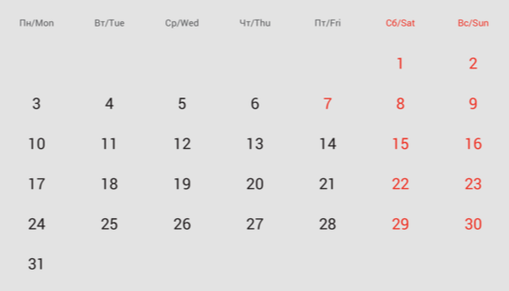
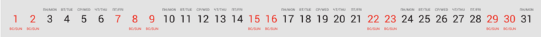
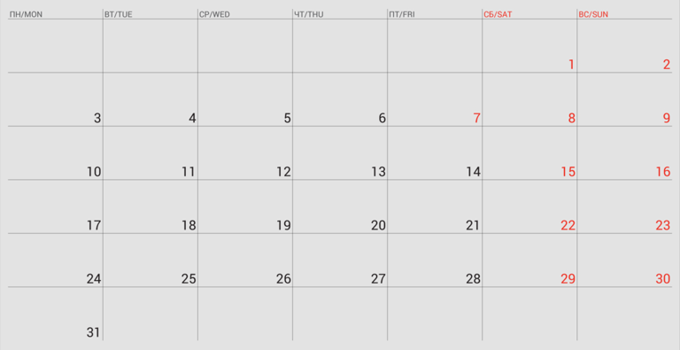

# Стили календарей

## Общее

Стили календарей необходимы для полного функционирования конструктора фотокалендарей. С помощью них можно создать различное множество календарей со своим индивидуальным стилем.

В качестве примера:

.png>)

.png>)

:::note 

Стили календарей относятся **только** к конструктору фотокалендарей.

:::

Чтобы добавить новый стиль, необходимо нажать на кнопку "Создать" в верхнем правом углу окна браузера.

В открывшемся окне необходимо вписать название стиля и настроить **каждый** компонент конструктора фотокалендарей.\
Среди них:

-  [Месяц](./konstruktory/fotokalendar#komponenty):

   -  [Стандартный](./konstruktory/fotokalendar#dopolnitelnye-nastroiki-komponenta);

   -  [Комбинированный](./konstruktory/fotokalendar#dopolnitelnye-nastroiki-komponenta);

   -  [Цифровой](./konstruktory/fotokalendar#dopolnitelnye-nastroiki-komponenta).

-  [Месяц + Год](./konstruktory/fotokalendar#komponenty);

-  [Год](./konstruktory/fotokalendar#komponenty);

-  [Сетка](./stili-kalendarei#setka) (каждый элемент сетки настраивается отдельно):

   -  Тип;

   -  Линии;

   -  Будни;

   -  Выходные/праздничные;

   -  Дни недели.

-  Фон заливки всей страницы;

-  Язык стиля;

-  Группа праздников стиля.

## Настройки

### Месяц

### Месяц + Год

### Год

Компоненты Месяц, Месяц + Год и Год имеют следующие параметры:

-  Шрифт

-  Размер шрифта

-  Стиль шрифта

-  Цвет шрифта

:::danger 

Эти параметры необходимо указать у **всех** компонентов.\
Если не выбрать, например, цвет шрифта компонента, который находится в конструкторе, конструктор не сможет отобразить страницу проекта.

:::

.png>)

### Сетка

.png>)

Шрифт и Размер относятся к числу месяца.\
Для всех элементов сетки (Линии, Будни и Выходные/праздничные) цвет настраивается индивидуально.

Компонент Сетка, помимо настроек стилей шрифтов, имеет параметр Тип:

[tabs]

[tab:Стандарт]

{width=573px height=328px}

[/tab]

[tab:Горизонтальная]

{width=768px height=53px}

[/tab]

[tab:Планинг]

{width=768px height=395px}

:::info 

Толщина линий фиксированная и составляет 1 мм.

:::

[/tab]

[/tabs]

Дни недели в сетке настраиваются отдельно: Шрифт, Размер и Цвет.

.png>)

Помимо настроек стилей шрифтов, можно отдельно настроить Фон заливки всей страницы.

.png>)

### Язык

Данный параметр отвечает за основной язык календаря. Именно на указанном языке будут отображаться следующие компоненты:

-  Месяц;

-  Месяц + Год;

-  Дни недели в сетке.

### Группа праздников

Выбранная группа праздников будет отображаться в сетке цветом Выходных/праздничных дней.\
Группы праздников можно настроить в соответствующем разделе: [Праздничные дни](./prazdnichnye-dni).

По умолчанию присутствует группа "Государственные праздники РФ"