## **Общие настройки**

Для начала работы рекомендуем назначить общие правила начисления бонусов по бонусным системам.

Для этого в Админ-панели -> Маркетинг -> Бонусная система -> нажмите на кнопку "Настройки бонусного баланса".

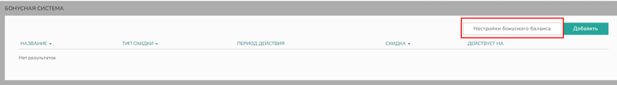{width=768px height=106px}

В открывшемся окне заполните следующие параметры:

-  *Зачисление через n дней после оплаты* (укажите кол-во дней, по истечению которых бонусы будут зачислены на счет)

-  *Сгорание после зачисления через n дней* (укажите кол-во дней, по истечению которых бонусы "сгорят", т.е. клиенту нельзя будет ими воспользоваться)

-  *Максимальный % для оплаты бонусами* (укажите какой процент от заказа можно будет оплатить бонусами)

-  *Оплата бонусами товаров со скидкой* (выберите, возможно ли будет оплатить бонусами товары со скидкой)

-  *Начислять бонусы с товаров со скидкой* (выберите, будут ли начисляться бонусы с товаров со скидкой)

-  *Начислять бонусы за заказы с Админки* (выберите, будут ли начисляться бонусы клиенту, если заказ принят в админ-панели сайта)

После выбора всех параметров, нажмите кнопку "Сохранить"

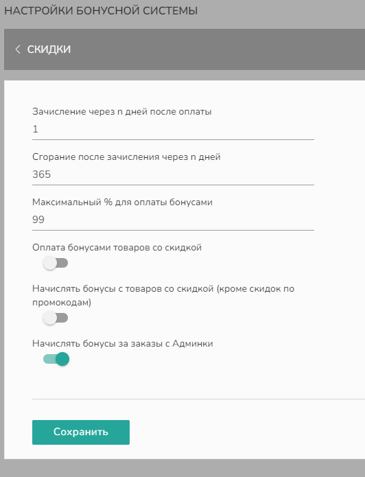{width=532px height=695px}

## **Создание и редактирование бонусной программы**

Чтобы создать бонусную программу, в Маркетинг -> Бонусная система -> нажмите на кнопку "Добавить"

Заполните вкладку **Общие**, указав:

-  *Название*

-  *% от суммы заказа*, который будет начисляться как бонус

-  *Максимальный бонус*

-  *Срок действия бонусной системы*

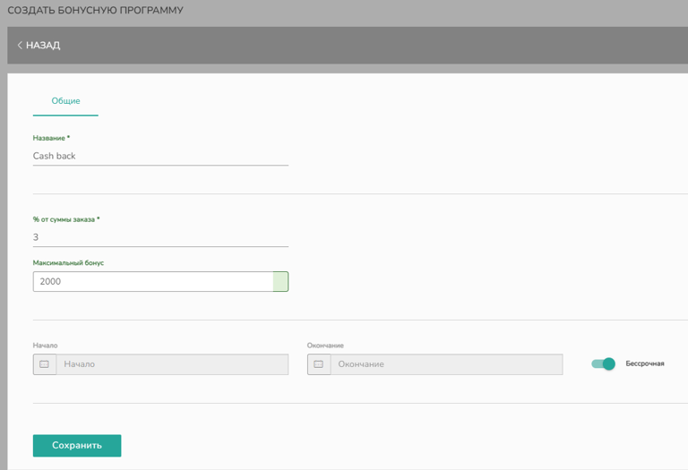{width=768px height=525px}

После внесения всех данных не забудьте нажать кнопку "Сохранить".

В появившейся вкладке **Настройки** через кнопки "Изменить" напротив нужной настройки вы можете выбрать:

-  *Дни недели*, в которые будут начисляться бонусы.

-  *Пользователей*, для которых будет действовать бонусная система. Чтобы выбрать конкретных пользователей, введите ФИО в строке под заголовком и выберите из предложенного списка.

-  *Группы*, которые будут участвовать в бонусной системе. Нажав кнопку "Изменить" выберите для каких групп **будет** применяться бонусная система. Вы также можете выбрать от обратного, проставив галочку в окошке "Все кроме" и отметив группы клиентов, которым **не будут** начисляться бонусы.

-  *Продукцию*, с заказов на которую будут начисляться бонусы. По умолчанию, указывается вся продукция, если вы хотите скорректировать список, нажмите на кнопку "Изменить" и выберите из списка нужные товары.

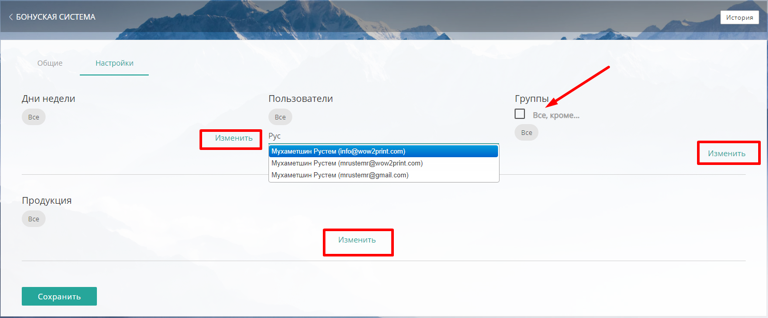{width=768px height=318px}

После настройки параметров бонусной системы нажмите на кнопку "Сохранить" и бонусная система отобразится в общем списке раздела.

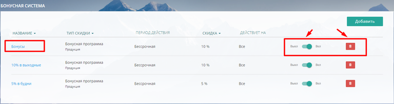{width=768px height=204px}

Чтобы отключить бонусную систему, передвиньте ползунок на "Выкл". Чтобы снова включить бонусную систему, верните ползунок в обратное положение.

Если вы хотите удалить бонусную систему, нажмите на кнопку "Удалить" (корзина) напротив.

## **Отображение на сайте**

### **Начисление бонусов**

В случае, если клиент выбирает товар, участвующий в бонусной программе, в калькуляции и в корзине отобразится количество бонусов, которые ему будут начислены после оплаты заказа.

[tabs]

[tab:В калькуляции]

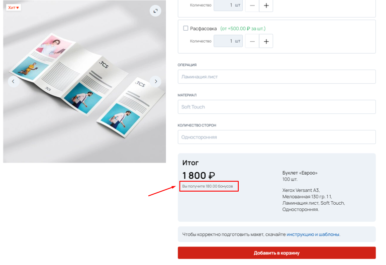{width=768px height=528px}

[/tab]

[tab:В корзине]

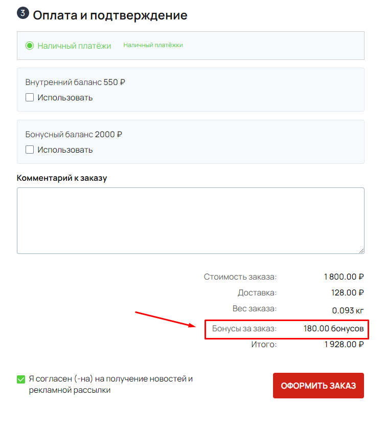{width=755px height=830px}

[/tab]

[/tabs]

### **Списание бонусов**

Если у клиента есть начисленные бонусы, в корзине при оплате заказа появится возможность оплатить с бонусного счета (баланса).

:::note 

Бонусным балансом нельзя оплатить покупки на 100%. Клиент должен оплатить 1 рубль за товар.

Бонусный баланс не покрывает доставку.

:::

**Пример:**

Клиент заказывает визитки на 1800 рублей и выбирает доставку за 128 рублей. Общая сумма заказа 1928 рублей. Для оплаты клиент использует бонусный баланс, на котором 2000 бонусов.

С бонусного баланса возможно списать 1799 бонусов. К оплате остается 129 рублей (1 рубль за товар + 128 рублей за доставку).

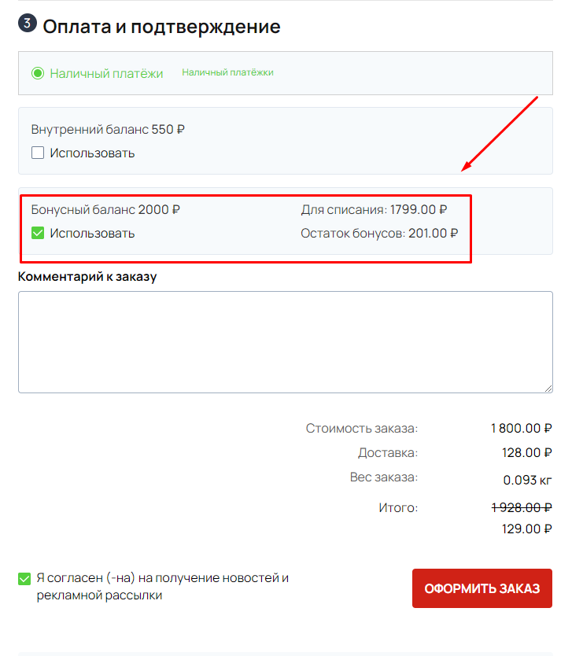{width=741px height=834px}

Выбирая опцию "Использовать" клиенту отобразится сумма списания и остаток.

:::note 

Важно! Если для оплаты заказа (в том, числе частичной) используются бонусы, за данный заказ новые бонусы не начисляются.

:::

## **Отображение в личном кабинете клиента**

В личном кабинете клиента во вкладке Заказы отображается как бонусный счет с уже начисленными бонусами, так и те бонусы, которые будут начислены, если в настройках бонусной системы вы заполнили параметр -> "Зачисление через n дней после оплаты"

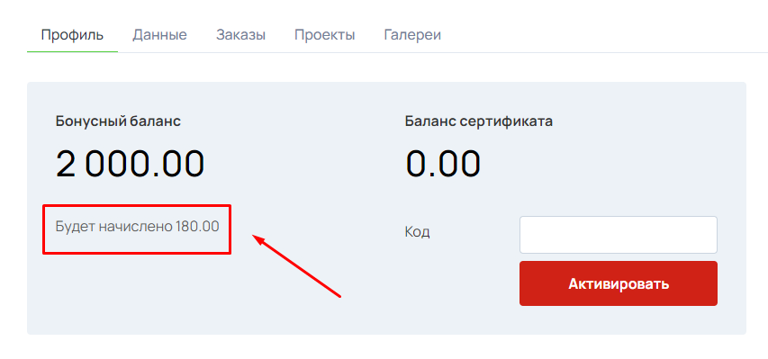{width=768px height=359px}

## **Отображение в админке**

Отслеживать зачисленные баллы и планируемые к зачислению можно в Магазин -> Контрагенты -> Клиенты -> карточка клиента вкладка Покупатели.

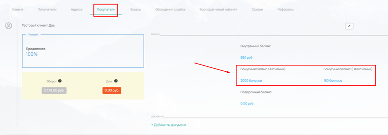{width=768px height=269px}

Чтобы проверить историю начислений и списаний бонусов нажмите на активный или неактивный бонусный баланс.

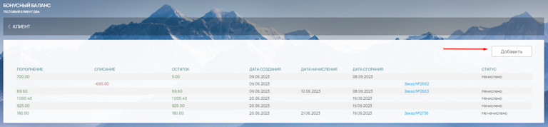{width=768px height=178px}

Вы можете вручную начислить или списать бонусы с бонусного баланса. Для этого нажмите на "Добавить". В открывшемся окне выберите Пополнение или Списание, укажите сумму и добавьте примечание.

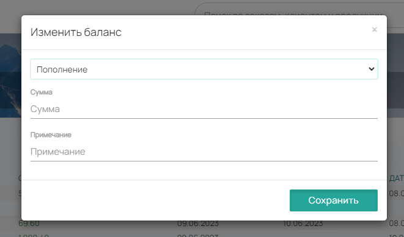{width=661px height=389px}