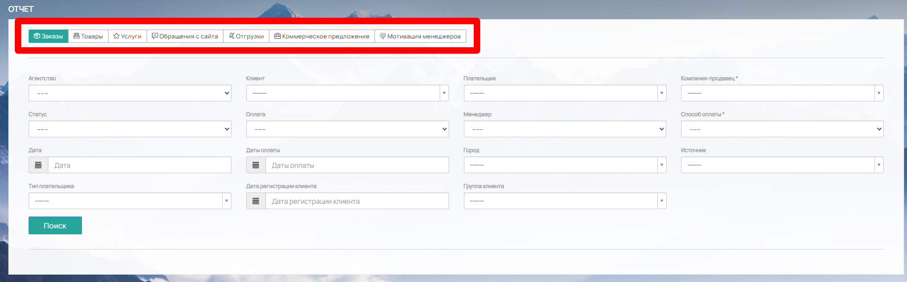
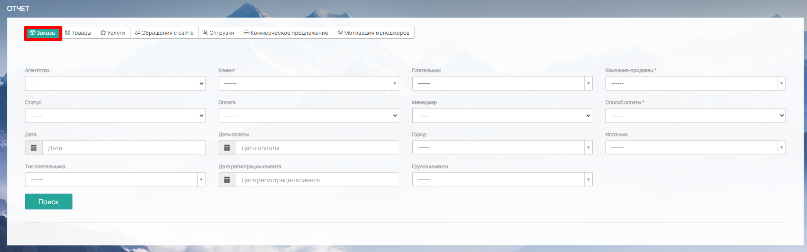
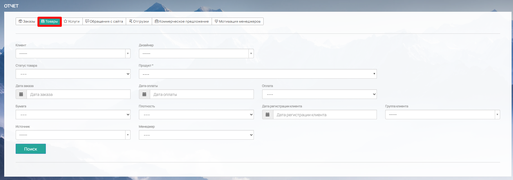
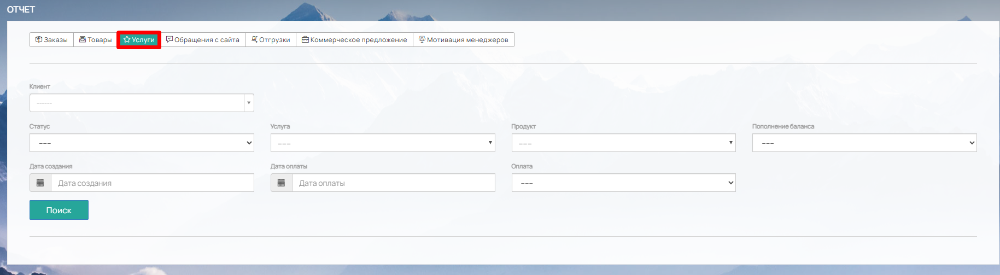
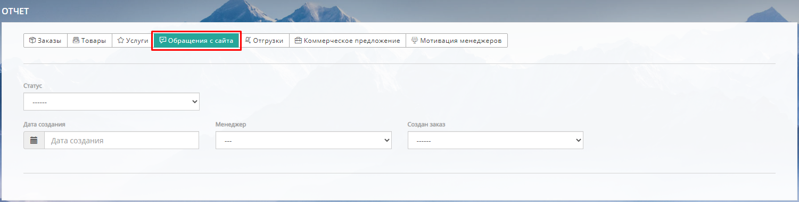
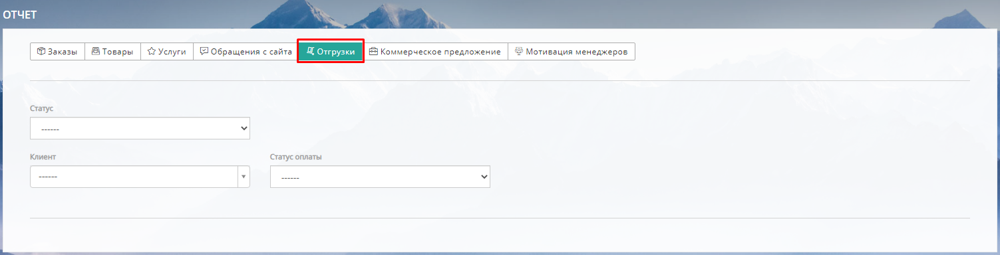
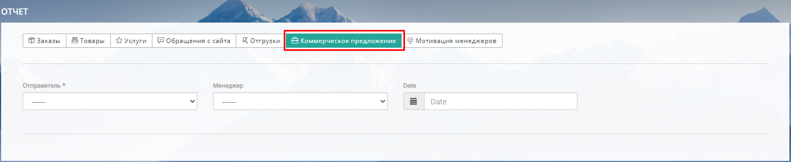
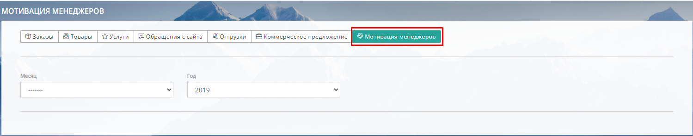
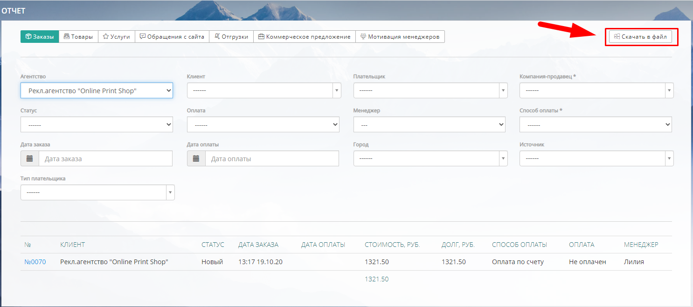

В системе предусмотрены отчеты по следующим вкладкам:

-  [Заказы](https://support.wow2print.com/reports#zakazy)

-  [Товары](https://support.wow2print.com/reports#tovary)

-  [Услуги](https://support.wow2print.com/reports#uslugi)

-  [Обращения с сайта](https://support.wow2print.com/reports#obrasheniya-s-saita)

-  [Отгрузки](https://support.wow2print.com/reports#otgruzki)

-  [Коммерческие предложения](https://support.wow2print.com/reports#kommercheskoe-predlozhenie)

-  [Мотивация менеджеров](https://support.wow2print.com/reports#motivaciya-menedzherov)

{width=1838px height=573px}

### **Заказы**

Во вкладке Заказы возможно создать отчет по следующим параметрам:

-  **Агенство.** Если вы являетесь поставщиком, то у вас есть возможность отобразить отчёт по агенствам, работающих с вами

-  **Клиент.** Все клиенты, в разделе (*Магазин -> Контрагенты -> Клиенты)*

-  **Плательщик.** Все компании из (*Магазин -> Контрагенты-> Плательщики)*

-  **Компания-продавец.** Компании, реквизиты которых заполнены в (*Настройки -> Оплата -> Реквизиты)*

-  **Статус.** Все статусы, заполненные в (*Настройки -> Статусы -> Статусы заказов)*

-  **Оплата.** Выберите из вариантов: Оплачен (учитываются только оплаченные), Не оплачен (не оплаченные заказы), Не оплачен с гарантией оплаты (только с гарантией оплаты)/Оплачены или гарантия оплаты (оплаченные заказы и заказы с гарантией оплаты)

-  **Менеджер.** Список пользователей, у которых есть доступ к работе с заказами (*Настройки -> Пользователи -> Роли и доступы*)

-  **Способ оплаты.** Все способы оплаты, предусмотренные на сайте (*включенные в Настройки -> Интеграции -> Способы оплаты*)

-  **Дата заказа.** Установите нужный календарный срок, за который требуется отчет

-  **Дата оплаты.** Установите календарный срок по оплате заказа, за который требуется отчет

-  **Город.** Выберите в поиске город, по которому вам необходим отчет

-  **Источник.** Выберите откуда пришел заказ: с сайта или через менеджера

-  **Тип плательщика.** Юр. лицо или физ. лицо.

-  **Дата регистрации клиента.** Выберите диапазон дат когда были зарегистрированы клиенты

-  **Группа клиента.** Все группы клиентов, доступные в разделе (*Магазин -> Контрагенты -> Группы клиентов*)

{width=1838px height=574px}

### **Товары**

Во вкладке Товары вы можете составить отчет по следующим параметрам:

-  **Клиент.** Все клиенты, находящиеся в разделе Магазин -> Контрагенты -> Клиенты

-  **Дизайнер.** Все сотрудники (пользователи), у которых есть доступ к работе с макетами.

-  **Статус товара.** Все статусы, заполненные в Настройки -> Статусы -> Статусы заказов

-  **Продукт.** Все продукты, как включенные, так и скрытые для отображения на сайте

-  **Оплата.** Выберите из вариантов: Оплачен (учитываются только оплаченные товары), Не оплачен (не оплаченные товары), Не оплачен с гарантией оплаты (товары у которых проставлена гарантия оплаты), Оплачены или гарантия оплаты (оплаченные товары и товары с гарантией оплаты), Оплачен/гарантия оплаты/принятый макет.

-  **Дата заказа.** Установите нужный календарный срок, за который требуется отчет

-  **Дата оплаты.** Установите календарный срок по оплате товара, за который требуется отчет

-  **Бумага/Плотность.** Для создания отчета по материалу, выберите материал с нужной плотностью в соответствующих графах.

-  **Дата регистрации клиента:** выберите диапазон дат когда были зарегистрированы клиенты

-  **Группа клиента:** все группы клиентов, доступные в разделе (*Магазин -> Контрагенты -> Группы клиентов*)

-  **Источник:** выберите откуда пришел заказ: с сайта или через менеджера

-  **Менеджер:** список пользователей, у которых есть доступ к работе с заказами (*Настройки -> Пользователи -> Роли и доступы*)

{width=1835px height=646px}

### **Услуги**

Во вкладке Услуги вы можете создать отчет по услугам, которые оформляются как заказ.

-  **Клиент.** Все клиенты, находящиеся в разделе Магазин -> Контрагенты -> Клиенты

-  **Статус услуги.** Все статусы, заполненные в Настройки -> Статусы -> Статусы заказов (тип услуга).

-  **Услуга.** Все услуги, заполненные в Справочник -> Свойства -> Доп. услуги-> выделенные в отдельный продукт (не находящиеся в калькуляции другого продукта), также услуги пополнения внутреннего баланса и баланса доставки

-  **Продукт.** Все продукты, как включенные, так и скрытые для отображения на сайте

-  **Пополнение баланса.** Выбор параметра: внутренний баланс, баланс доставки или Не отображать пополнение баланса

-  **Дата создания.** Установите нужный календарный срок, за который требуется отчет

-  **Дата оплаты.** Установите календарный срок по оплате услуги, за который требуется отчет

-  **Оплата.** Выберите из вариантов: Не оплачен (учитываются неоплаченные услуги), Оплачен (оплаченные услуги), Не оплачен с гарантией оплаты (услуги, у которых проставлена гарантия оплаты), Оплачены или гарантия оплаты (оплаченные услуги и с гарантией оплаты).

{width=1829px height=503px}

### **Обращения с сайта**

Во вкладке Обращения с сайта вы можете составить отчет по следующим параметрам:

-  **Статус.** Отображаются все статусы из Настройки -> Статусы -> Статусы обращений с сайта

-  **Дата создания.** Установите период за который требуется отчет

-  **Менеджер.** Список пользователей, у которых есть доступ к работе с обращениями с сайта (Настройки -> Пользователи -> Роли и доступы)

-  **Создан заказ.** Выберите был ли создан заказ на основании обращения или нет.

{width=1501px height=382px}

### **Отгрузки**

Во вкладке Отгрузки возможно создать отчет по следующим параметрам:

-  **Статус.** Отображаются все статусы, назначенные в Настройки -> Статусы--Статусы отгрузок

-  **Клиент.** Все клиенты, находящиеся в Магазин -> Контрагенты -> Клиенты

-  **Статус оплаты.** Выберите из вариантов: Оплачен или Не оплачен

{width=1503px height=384px}

### **Коммерческое предложение**

Во вкладке Коммерческое предложение предусмотрены отчеты по следующим параметрам:

-  **Отправитель.** Выберите Сотрудник типографии или Клиент

-  **Менеджер.** Список пользователей, у которых есть доступ к работе с заказами (Настройки -> Пользователи -> Роли и доступы)

-  **Дата.** Установите период за который требуется отчет

{width=1500px height=309px}

### **Мотивация менеджеров**

Во вкладке Мотивация менеджеров предусмотрены отчеты по следующим параметрам:

-  **Месяц** и **Год**. Выберите месяц и год за который требуется отчет.

Отобразятся все пользователи с детализацией заказов, по которым была рассчитана мотивация.

{width=1499px height=296px}

## **Экспорт данных**

После выбора параметров, сформированный отчет можно скачать в формате exel. Для этого в правом верхнем углу нажмите на кнопку "Скачать в файл"\*

{width=1486px height=659px}

\*кнопка появляется после выбора параметров