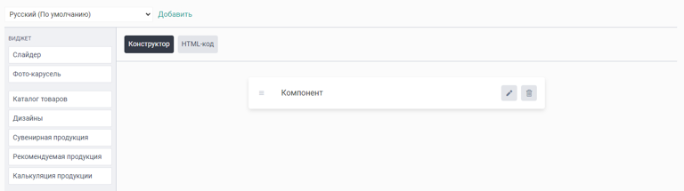
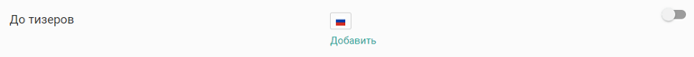

# Категории продукции

## **Общие положения**

### Структура каталога

:::tip 

 Перед началом работы с данным разделом, необходимо продумать структуру каталога продукции.

:::

Выпишите весь ассортимент продуктов, который вы хотите представить на сайте, на отдельный лист бумаги, затем постарайтесь сгруппировать его по понятным группам.

Главная задача каталога продуктов -- быть максимально понятным, а именно:

* [x] Расположение категорий -- категории должны располагаться либо в логической последовательности, либо по степени популярности продуктов;

* [x] Изображение категории -- по нему клиент сразу должен понять что находится внутри категории, без необходимости читать название;

* [x] Название категории -- должно быть коротким и передавать ключевую информацию.

## Создание категории

После того, как вы продумали [структуру каталога](./kategorii#struktura-kataloga), можно приступить к его созданию в админ-панели сайта.

В разделе «Продукция» располагаются демонстрационные категории продуктов, которые вы вполне можете использовать, но сейчас мы поговорим непосредственно о создании новой категории, для этого, в верхнем правом углу нажмем на кнопку «Добавить категорию»

.png>)

После нажатия на «Добавить категорию», откроется следующее окно с настройками:

.png>)

-  **Название**

   Название категории, отображаемое на сайте.

-  **Url**

   Ссылка на категорию, формируется автоматически при вводе названия категории.

-  **Короткое описание**

   Короткое описание категории, отображается только в [меню сайта](./../content/napolnenie-sayta/menyu/verkhnee-menyu#верхнее-меню) типа «Регулярный» и только, если данная категория является подкатегорией.

-  **Родитель**

   Позволяет выбрать родительскую категорию, тем самым сделав текущую категорию дочерней (подкатегорией).

:::info 

Родителем может быть только та категория, которая не содержит в себе продукты.

:::

-  **Отображение продукции**

   -  Блоками -- продукты категории будут отображаться отдельными блоками;

   -  Калькулятор -- категория будет сразу отображаться в виде калькулятора, а сами продукты будут отображаться как отдельный параметр калькуляции, для которого можно написать свой заголовок и выбрать вариант отображения.

-  **Количество блоков в строке**

   При отображении блоками можно выбрать количество блоков в строке -- 3, 4 или 6 в ряд.

После сохранения настроек, отобразятся новые вкладки:

[tabs]

[tab:Общие]

На данной вкладке располагаются общие настройки категории, которые заполняются при создании категории

[/tab]

[tab:Изображения]

На данной вкладке можно загрузить изображения категории, а именно:

-  **Фото тизера**

   Фото тизера категории, отображается в виджете «[Каталог товаров](./../content/vidzhety/vidzhet-katalog-tovarov)» в варианте отображения «По умолчанию».

-  **Фото тизера при наведении**

   При наведении курсора мыши на тизер категории, он сменится на фото тизера при наведении.

-  **Иконка**

   Иконка категории отображается только в том случае, если данная категория является дочерней, иконку можно увидеть в меню сайта.

-  **Изображение для задвоенного вида**

   При включении задвоенного вида в настройках виджета «[Каталог товаров](./../content/vidzhety/vidzhet-katalog-tovarov)», требуется загрузить соответствующее изображение.

-  **Изображение при наведении для задвоенного вида**

   Изображение для задвоенного вида, но при наведении курсора мыши.

[Требования к изображениям](./../content/vidzhety/vidzhet-katalog-tovarov#требования-к-изображениям).

[/tab]

[tab:Контент]

Любая категория продукции -- это отдельная страница сайта, на которой с помощью вкладки «Контент» можно разместить любой контент.

{width=292px height=98px}

Контент можно размещать как ДО тизеров продукции, так и ПОСЛЕ них

При клике на соответствующий раздел откроется стандартный редактор контента. Подробнее о работе с ним можно посмотреть [здесь](./../content/_index).

{width=768px height=215px}

После внесения изменений в редактор, необходимо активировать данный контент. На вкладке «Контент» возле названий разделов, появится соответствующий тумблер (Вкл/Выкл) и возможностью добавить [перевод](./../settings/drugie-nastroiki/nastroiki-multiyazychnosti/perevod-na-raznye-yazyki) на другие языки.

{width=768px height=64px}

[/tab]

[tab:SEO]

На данной вкладке присутствуют стандартные настройки SEO. Подробнее о них можете посмотреть [здесь](./../content/seo/_index).

[/tab]

[tab:Фильтр]

При наличии тегов здесь можно отредактировать отображение той или иной группы (фильтров) в данной категории продуктов. Подробнее о фильтрах [здесь](./tegi-filtr-produkcii).

[/tab]

[/tabs]

### Редактирование категории

Любую существующую категорию можно редактировать, для этого в разделе «Продукция» напротив нужной категории, нажмите на кнопку «Редактировать категорию». Откроется ровно такое же окно с вкладками, что и при [создании новой категории](./kategorii#создание-категории).

Внесите изменения и сохраните их.

Также в общем списке категорий вы можете:

-  **Включить/Выключить категорию**

   Путем переключения тумблера напротив названия категории.

:::info 

Категория будет отображаться на сайте только в том случае, если в ней имеются активные продукты.

:::

-  **Удалить категорию**

   В левой части каждой категории имеется чек-бокс, при его выделении снизу страницы всплывает дополнительное поле, в котором имеется иконка корзины, с помощью нее можно удалить категорию.

-  **Сортировать категории**

   Сортировать категории можно путем их перетаскивания курсором мыши.

### «Без категории»

В продукции имеется постоянный раздел «Без категории», в нем отображаются продукты без категории.

Данный раздел не редактируются и расположенные в нем продукты не отображаются на сайте.