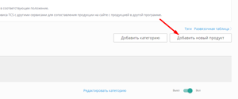
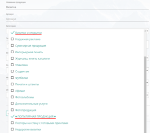
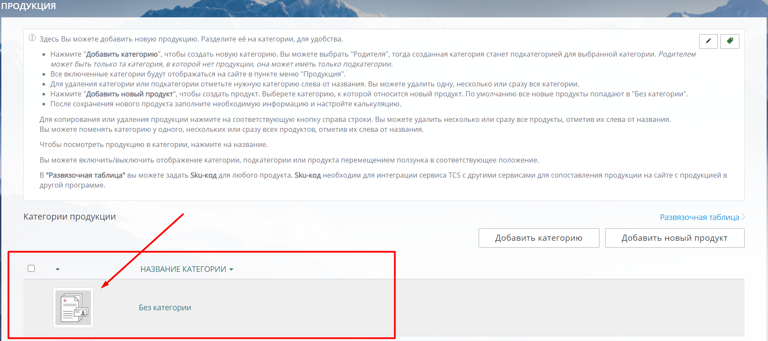
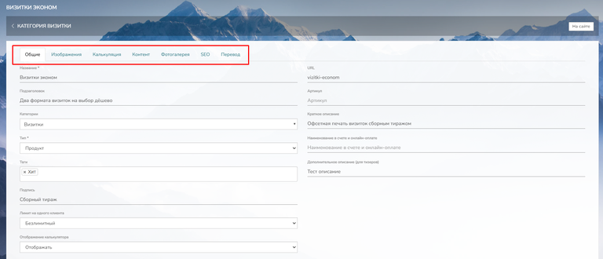
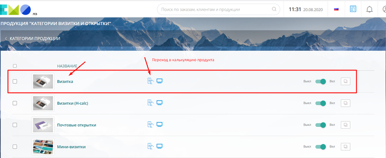
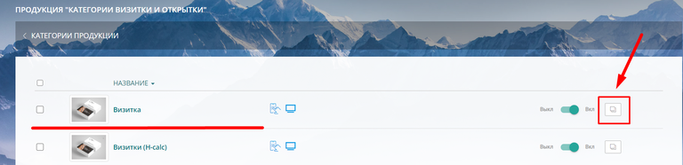
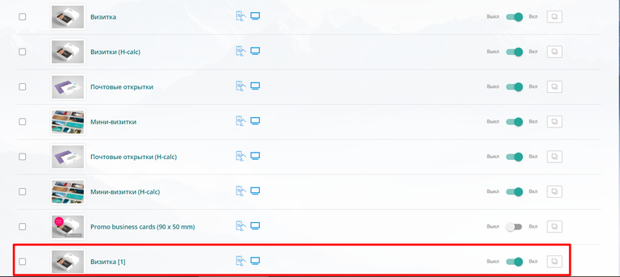
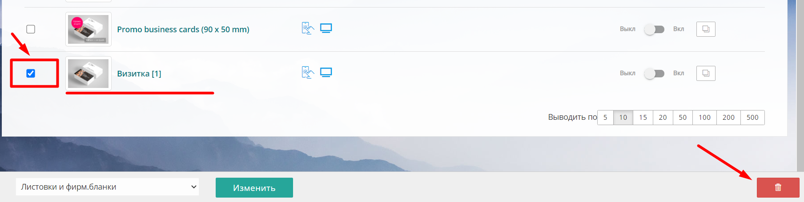

[view:hierarchy=none::::List]

## **Общие положения**

В web-to-print платформе TCS имеется несколько видов калькулятора, каждый из которого предназначен под определенную аудиторию клиентов. Перед созданием продукта важно решить какой вид калькулятора будет использоваться.

## **Добавление нового продукта**

Чтобы создать новый продукт нажмите на "Добавить новый продукт"

{width=300px height=125px}

В открывшейся форме заполните поле *Название* и в поле *Категории* выберите нужную категорию\*.\*

Вы можете выбрать **несколько категорий** для одного продукта, он будет отображаться в каждой из них, как на сайте, так и в админ-панели.

{width=300px height=265px}

Сам продукт будет находится в категории, которая расположена выше всех в списке, поэтому и на сайте в хлебных крошках будет отображаться данная категория.

Если у продукта не выбрана ни одна категория, он, по умолчанию, попадает в раздел "Без категории".

{width=768px height=341px}

## **Админ-панель продукта**

Админ-панель продукта состоит из 7 вкладок:

Общие/Изображения/Калькуляция/Контент/Фотогалерея/SEO/Перевод

{width=768px height=330px}

### **Вкладка Общие**

Во вкладке Общие автоматически переносится название продукта, указанная категория, формируется url и выбираются варианты: бесплатный продукт или нет, отображение калькулятора, тип отображения, необходимость загрузки макета.

### Вкладка Изображения

Во вкладке Изображения вы можете загрузить основную картинку (тизер), картинку при наведении и иконку товара.

### **Вкладка Калькуляция**

Во вкладке Калькуляция вводятся все технические характеристики продукта, через выводятся цены и формируются параметры для выбора клиентом на сайте: печать, материал, ламинация, дополнительные услуги, упаковка и т.д.

### **Вкладка Контент**

Во вкладке Контент можно добавить текстовое описание продукта, вставить изображение, ссылку, таблицу или html код.

### **Вкладка Фотогалерея**

В Фотогалерее добавляются изображения товара, которые затем можно отображать на сайте, в том числе, и с помощью виджетов.

### **Вкладка SEO**

Во вкладке SEO прописываются данные для SEO-продвижения: Title, Description, Keywords, Канонические ссылки и т.д.

## 

## Редактирование продукта

Чтобы отредактировать уже существующий продукт на сайта, щелкните мышью на нужный продукт. Для быстрого перехода во вкладку Калькуляция, нажмите на иконку "Калькулятор"

{width=768px height=314px}

Внесите изменения в открывшихся вкладках.

{width=768px height=330px}

Не забудьте сохранить внесенные изменения.

## Копирование продукта

Для удобства заполнения раздела Продукция, предусмотрена возможность копирования созданных продуктов.

Чтобы копировать продукт, в общем списке продуктов, нажмите на кнопку "Копировать" напротив названия продукта и подтвердите действие.

{width=768px height=186px}

Скопированный продукт появится в общем списке.

{width=768px height=343px}

## 

## Удаление продукта

Чтобы удалить продукт, отметьте его в окошке слева и нажмите кнопку "Удалить" в правом нижнем углу

{width=1808px height=457px}