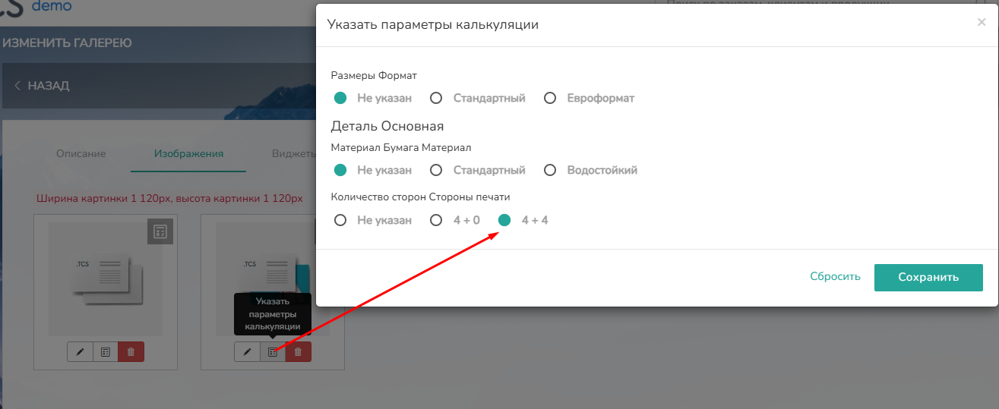
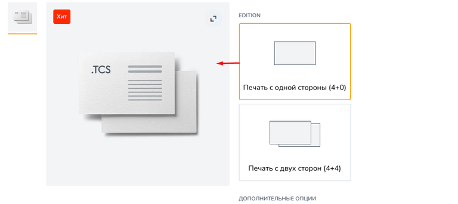
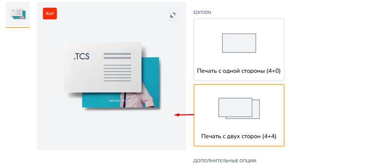
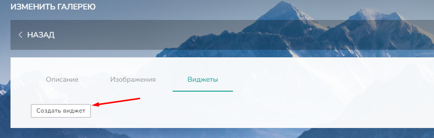
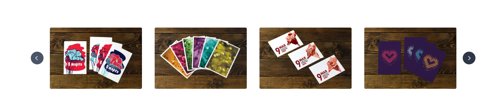
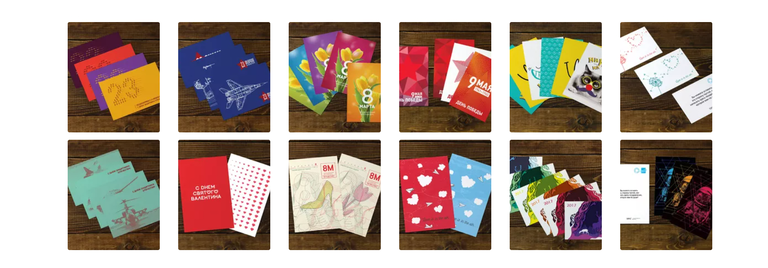
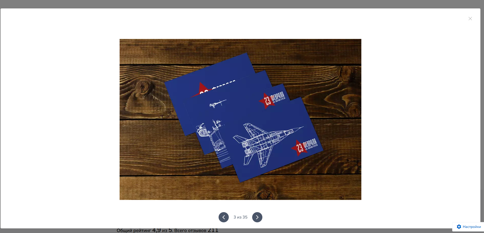
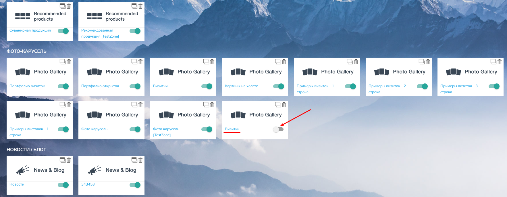

# Вкладка Фотогалерея

Фотогалерея состоит из вкладок: Описание/Изображения/Виджеты

<figure>

.png>)

<figcaption>

</figcaption>

</figure>

## **Вкладка Описание**

В данной вкладке заполняется только Название. По умолчанию оно подтягивается из вкладки "[Общие](./vkladka-obshie)" из названия продукта.

## 

## **Вкладка Изображения**

В данной вкладке есть возможность **загрузить** изображения, а так же **отредактировать** их, **указать параметры калькуляции** и **удалить** при необходимости.

<figure>

.png>)

<figcaption>

</figcaption>

</figure>

Нажав на кнопку Загрузить, вы можете добавить своё изображение для продукта.

### **Размер изображений**

**Рекомендованный размер картинки 1 120 Х 1 120 рх**.\
Увеличение или уменьшение этих параметров может негативно сказаться на качестве изображения. Контейнер для фотографии в карточке товара имеет строго заданные размеры, что приводит к его растяжению или сжатию, когда изображение пытается подстроиться под размеры окна.

### **Формат изображений**

**Тип поддерживаемых изображений** \*.jpg, \*.jpeg, \*.gif, \*.png, \*.webp.

:::info 

Рекомендуется загружать изображения формата **\*.webp** так как он имеет маленький вес, но при этом не ухудшает качество изображения. Это необходимо для более быстрой загрузки фотографий на сайте, что положительно влияет на SEO.

:::

### **Кнопка "Изменить"**

При нажатии на данную кнопку .png>) откроется настройка меню, необходимая для SEO продвижения и индивидуальной настройки изображения

<figure>

.png>)

<figcaption>

</figcaption>

</figure>

**• Язык**\
По умолчанию установлено значение "Универсальный". Если ваш сайт доступен на нескольких языках ([Настройки мультиязычности](./../../settings/drugie-nastroiki/nastroiki-multiyazychnosti/_index)), то у вас есть возможность индивидуально настроить отображение каждого изображения в зависимости от выбранного языка. Эта функция становится особенно актуальной, если изображение содержит текст на одном из языков, что значительно улучшает восприятие информации клиентом.

**• Alt**\
Атрибут, который передает текстовую информацию о картинке в случае, когда сама она не отображается на сайте.

**• Title**\
Атрибут, который описывает изображение при наведении на него курсора.

### **Кнопка "Указать параметры калькуляции"**

При нажатии кнопки раскрывается окно, в котором наглядно отображается, при каких заданных клиентом условиях, в калькуляции продукта будет появляться данное изображение.\
К примеру, как на скрине ниже, при выборе параметра Стороны печати 4+4, в карточке товара появится то изображение, для которого будет указана данная настройка.

[tabs]

[tab:Настройка параметра 4+4]

{width=1315px height=539px}

[/tab]

[tab:На сайте выбор 4+0]

{width=768px height=342px}

[/tab]

[tab:На сайте выбор 4+4]

{width=768px height=344px}

[/tab]

[/tabs]

### **Кнопка "Удалить"**

Данная кнопка безвозвратно удаляет изображение

## **Вкладка Виджеты**

Чтобы создать виджет перейдите во вкладку Виджет нажмите кнопку "Создать виджет"

{width=870px height=277px}

Обязательно заполните название виджета, для упрощения его поиска в будущем. И укажите нужную информацию в следующих полях:

**• Тип устройства** То, на каких устройствах будет отображаться данный виджет: на телефоне, десктопе (компьютере) или на том и другом одинаково (универсальный);

**• Выбор** По умолчанию нужно оставить Галерея;

**• Галерея** Можно выбрать готовые изображения из имеющихся на сайте. Изображения хранятся в Контент -> Наполнение сайта -> Галереи. По умолчанию изображений в виджете нет, их необходимо загружать сразу или после создания виджета. После загрузки новых изображений, они будут храниться так же в [Галереи](https://support.wow2print.com/kontent/untitled/galerei);

Дополнительно можно настроить отображение виджета на сайте:

**• Заголовок** Отобразится над виджетом на сайте. Поле не обязательное для заполнения;

**• Тег заголовка** Определяет стиль и иерархию значимости заголовка, от самого главного Н1, до менее значимого подзаголовка Н4;

**• Тип отображения** Выбирает тип виджета в виде Слайдера или отображение Блоками. Пример отображения виджета ниже;

**• Количество строк** Появляется только при выборе Типа отображения Блоками. Позволяет выбрать кол-во строк в котором будут отображены все изображения от 1 до 3;

**• Количество изображений в строке** Позволяет выбрать, то сколько изображений будет размещено в одной строке от 1 до 6. Параметр виден всегда.

[tabs]

[tab:Тип отображения Слайдер]

{width=1546px height=347px}

[/tab]

[tab:Тип отображения Блоками]

{width=768px height=268px}

[/tab]

[/tabs]

**• Увеличение изображений при клике** Позволяет увеличить изображение при нажатии на него в виджете на сайте. Откроется окно с прокруткой изображений из галереи загруженной в виджет.

:::info 

Если у изображения в галереи указана ссылка, то при клике на изображение на сайте произойдёт переход по этой ссылке (работает только для виджета без увеличения изображений).

:::

{width=1902px height=916px}

После выбора всех параметров, не забудьте нажать "Сохранить". Внизу страницы появится код для установки на сайт. Скопируйте его и вставьте на любую страницу сайта. [Порядок установки.](https://support.wow2print.com/kontent/vidzhety/vidzhet-foto-karusel#poryadok-ustanovki-2-var)

По умолчанию виджет будет отключён. Чтобы виджет отобразился на странице включите его в разделе Контент -> Виджеты -> раздел Фото-карусель -> включить бегунок у созданного виджета.

{width=1765px height=687px}

:::tip 

Более подробная инструкция по работе с Виджетом, указана в разделе справки "[Виджет «Фото-карусель»](https://support.wow2print.com/kontent/vidzhety/vidzhet-foto-karusel)"

:::