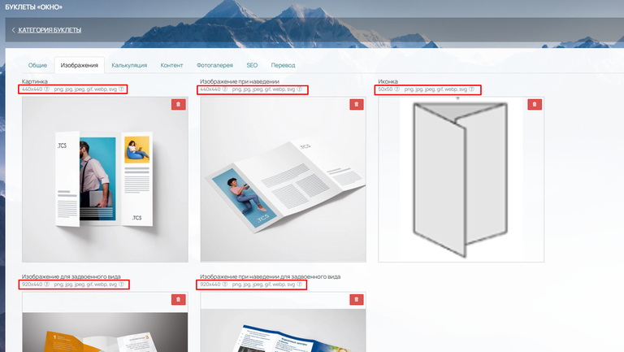
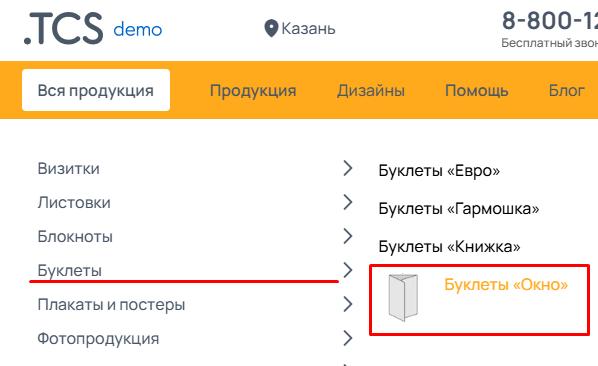
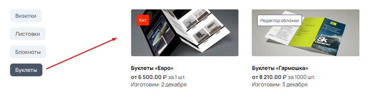
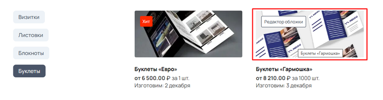

В данной вкладке загружается картинка, которая отображается как тизер продукта. Требования к каждому изображению есть в описании у каждого окна загрузки. Рекомендуем соблюдать их во избежание неправильно обрезанных фото на сайте. Для загрузки на сайт рекомендуется формат фотографий .webp т.к. он имеет малый вес и не портит качество изображения. Это так же поможет в скорости загрузки страницы, так как долгая загрузка изображений может отпугнуть клиента.

{width=768px height=433px}

**Картинка:**

Отображает основное превью продукта, которое можно увидеть в первую очередь в каталоге товара, в виджетах "Каталог товаров" и виджете "Рекомендуемая продукция"

При выборе горизонтальной калькуляции, данная картинка отображается в Корзине

**Изображение при наведении:**

Сюда вы можете загрузить изображение, которое будет отображаться при наведении на блок. Отображается в блоках продукции, виджетах «Каталог товаров» и «Рекомендуемая продукция».

**Иконка:**

Отображается в верхнем раскрывающемся меню

{width=598px height=366px}

**Изображение для задвоенного вида:**

Данное задвоенное изображение можно увидеть в виджете "Каталог товаров". В настройке виджета необходимо указать в поле Отображение один из двух вариантов -> Меню слева или Меню сверху. Далее в самом низу редактора виджета нажмите кнопку Настроить задвоенный вид и выберите какой из продуктов отображать в задвоенном виде.

{width=768px height=190px}

**Изображение при наведении для задвоенного вида:**

Отображается только в задвоенном виде, но видно только при наведении на основное изображение

{width=768px height=202px}