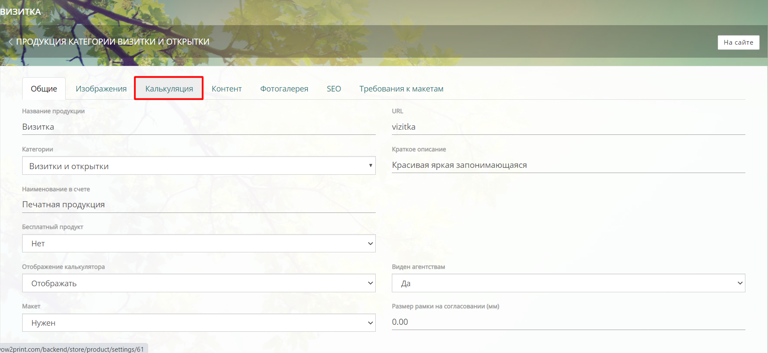

[view:hierarchy=none::::List]

{width=768px height=353px}

## В калькуляции два типа модулей:

-  Базовые (или дефолтные);

-  Все модули.

### **К** базовым **модулям относятся:**

-  Размеры;

-  Тираж;

-  Сроки производства;

-  Преднастройки.

:::info 

Данные модули называются **базовыми**, т.к. их невозможно удалить или добавить. Эти модули присутствуют по-умолчанию в любой калькуляции продукции.

:::

### **Ко всем** **модулям (дополнительным) относятся:**

-  Печать;

-  Ламинирование;

-  Резка;

-  Фальцевание;

-  Брошюровка;

-  и другие.

:::info 

 Данные модули называются **дополнительными**, т.к. их можно добавить/удалить. Эти модули по-умолчанию не присутствуют в калькуляции. Они добавляются при необходимости.

:::