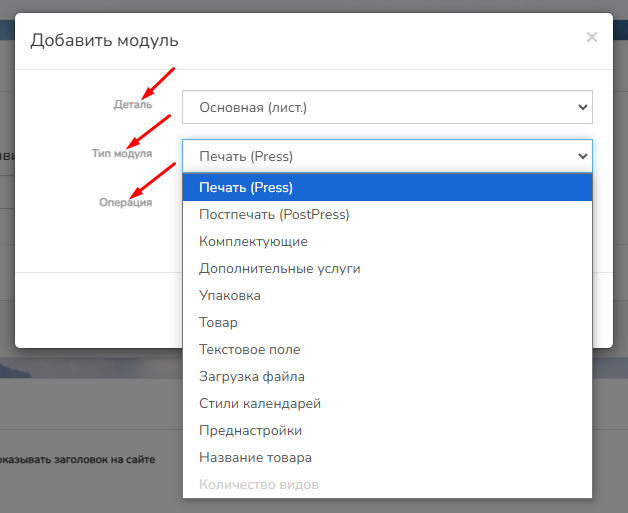
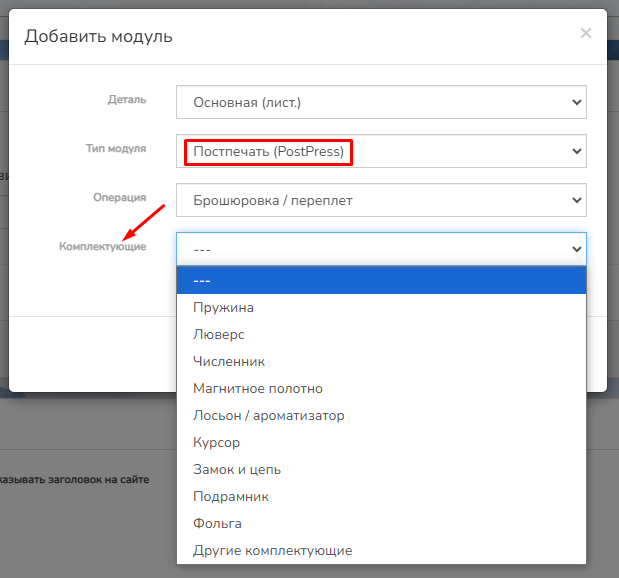
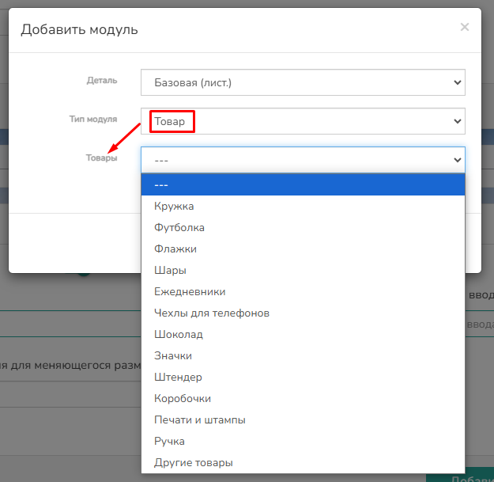

[view:hierarchy=none::::List]

После того, как вы добавите  деталь откроется функционал для добавления модулей из Справочника. Для этого в нижнем правом углу снова нажмите на знак  **Плюс**  {width=59px height=60px} и выберите "Добавить модуль"

{width=1824px height=168px}

В появившемся окне выберите Деталь к которой добавляется модуль, затем Тип модуля (разделы Справочника) и вид Операции.

{width=628px height=513px}

В случае выбора в типе **модуля Постпечать**, в большенстве Операций вы можете указать Комплектующие.

{width=619px height=578px}

В случае выбора в типе **модуля Товар**, вы можете указать определенный товар

{width=625px height=609px}

В Справочнике заполняются следующие типы модулей:

-  Операции (печать)

-  Доп. операции (Ламинирование, Гильотинная резка, Плоттерная резка, Резка углов, Фальцевание, Каширование, Брошюровка/Переплет, Установка люверсов, Тиснение/Эмбоссирование, Штрих-код, Скретч-полоса, Фольгирование, Лакирование, Полоса для подписи, Чипирование, Магнитная полоса, Сборка, Проклейка, Натяжка на подрамник, Высечка, Перфорация),

-  Комплектующие (Пружина, Люверс, Численник, Магнитное полотно, Лосьон/ароматизатор, Курсор, Замок и цепь, Подрамник, Фольга, Другие комплектующие)

-  Товары (Кружка, Футболка, Флажки, Шары, Ежедневники, Чехлы для телефона, Шоколад, Значки, Штендер, Коробочки, Печати и Штампы, Ручка, Другие комплектующие)

-  Свойства (Формат, Ширина рулона, Плотность, Толщина, Доп. услуги, Цвет, Теги, Свойства комплектующих, Группировка)

-  Упаковка (Коробочки)

-  Продукция (Детали, Размеры, Конструктор)

Подробнее о этом в разделе [Справочник](https://github.com/alexeyWow2print/support-center/tree/main/handbook/README.md)