одуль «Печать» позволяет добавить в расчет стоимости операцию печати (цифровую, офсетную и т.д.), а также настроить выбор материалов, количества сторон и (для рулонной продукции) параметры намотки.

## **Добавление модуля в калькуляцию**

Чтобы добавить операцию печати в расчет стоимости продукта:

1. В правом нижнем углу экрана нажмите кнопку **«Плюсик»**.

2. В появившемся меню выберите пункт **«Добавить модуль»**.

3. В открывшемся окне укажите:

   -  **Деталь** -- выберите из списка деталь, к которой будет относиться печать.

   -  **Тип модуля** -- установите значение «Печать» (стоит по умолчанию).

   -  **Операция** -- выберите «Печать» (стоит по умолчанию).

4. Нажмите кнопку **«Сохранить»**.

Модуль появится в структуре калькуляции выбранной детали.

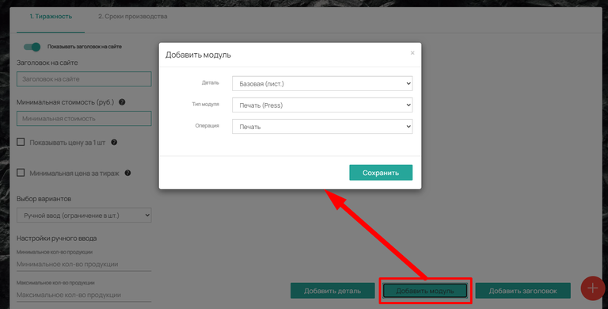{width=768px height=390px}

### **Структура модуля**

Модуль «Печать» состоит из нескольких вкладок. Их наличие зависит от единиц расчета детали:



---

*  **Вкладка**

*  **Когда доступна**

---

*  **Операция «Печать»**

*  Всегда

---

*  **Материал «Бумага»**

*  Кроме деталей с расчетом в штуках

---

*  **Количество сторон**

*  Всегда

---

*  **Намотка**

*  Только для деталей с расчетом в м²



\
**Вкладка «Операция Печать».**

Здесь настраивается оборудование (печатные машины) и основные параметры расчета.

#### **Верхняя панель (Отображение на сайте)**

-  **Показывать на сайте** -- главный переключатель. Если активен, блок «Печать» виден в карточке товара.

-  **Заголовок на сайте** -- позволяет изменить стандартное название модуля (например, «Печать» -> «Тип печати»).

-  **Отображение** -- выбор внешнего вида опций на сайте: выпадающий список, радио баттон, иконки, плитка и другие варианты.

-  **Описание** -- текст, который будет отображаться под заголовком модуля в карточке товара.

-  **Галерея** -- включает показ галереи изображений. Фотографии загружаются в настройке операции во вкладке «Фотогалерея» .

-  **Показывать заголовок на сайте** -- управляет отображением заголовка модуля.

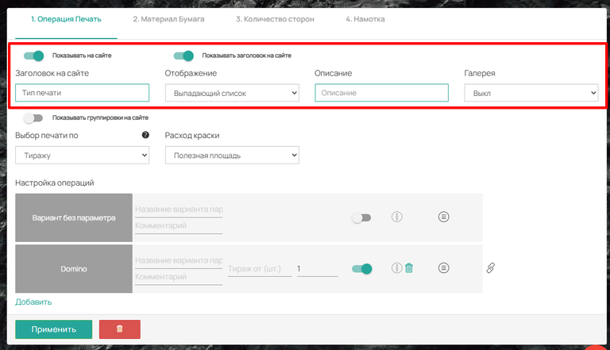{width=768px height=441px}

-  **Показывать группировки на сайте** -- если у вас есть группировки операций, этот переключатель позволит отобразить их для выбора клиенту. При включении появляются два поля:

   -  **Заголовок для группировок** -- название блока с группировками.

   -  **Отображение** -- формат показа группировок (список, радио-кнопки, иконки и т.д.).

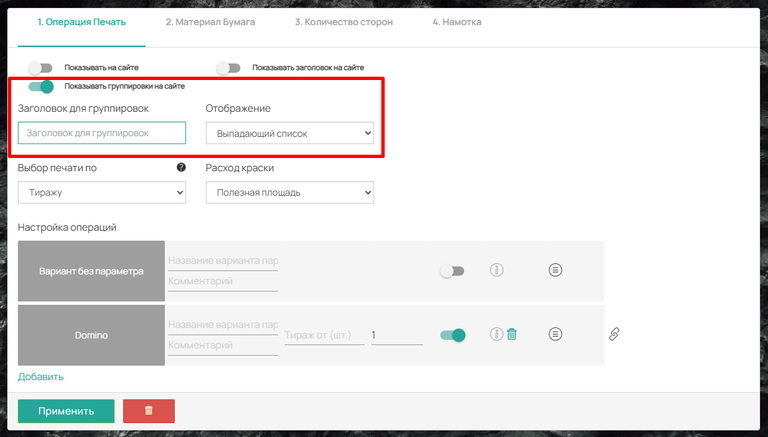{width=768px height=437px}

#### **Выбор печати по условию**

Если в калькуляции товара несколько операций печати, система позволяет задать правило выбора между ними. Доступны следующие варианты:

-  **По тиражу** -- позволяет задать тираж «ОТ», от которого будет учитываться печать. Например, от 1000 штук продукта использовать офсетную печать вместо цифровой. В поле «Тираж от (шт.)» впишите нужное значение.

-  **По количеству листов** -- работает аналогично тиражу, но условие задается от количества листов. Например, начиная с 500 листов система считает цены офсетной печати.

-  **По меньшей стоимости (Smart Calculation)** -- самый удобный способ, который не требует назначения условий. Система сама просчитывает все операции и материалы (с учетом пуска машины, приладки, вывода пластин, оттиска печати), сравнивает результаты и предлагает наименьшую стоимость.

-  **По размеру** -- позволяет настроить печать для конкретного размера изделия. Например, для листовки А5 учитывается только цифровая печать, а для листовки А4 -- только офсетная. Нужно выбрать подходящий размер напротив операции печати.

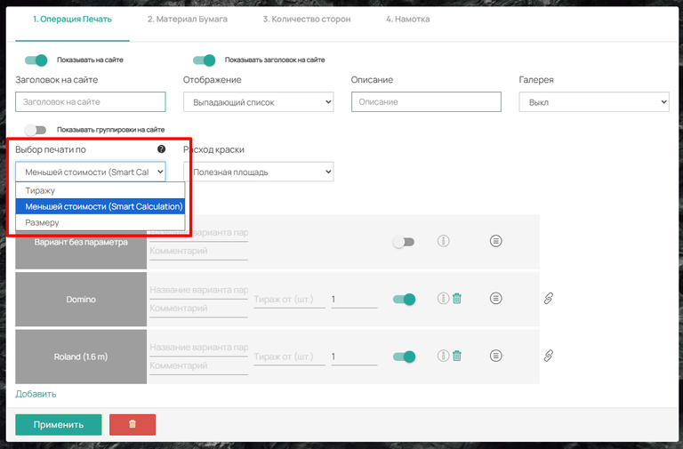{width=768px height=505px}

#### **Расход краски**

Для деталей с расчетом в квадратных метрах доступен параметр **«Расход краски»** с двумя вариантами:

-  **Полезная площадь** -- в расчет берется только та часть материала, которую занимает макет изделия.

-  **Грязная площадь** -- в расчет берется полная площадь использованного рулона, включая технологические отходы и свободные области.

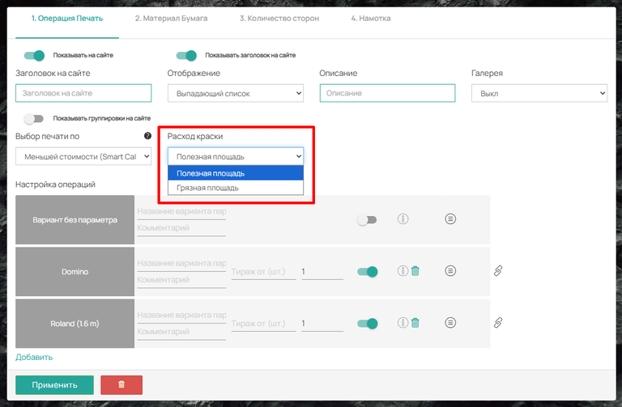{width=768px height=503px}

#### **Добавление операции**

В этом блоке добавляются конкретные печатные машины, на которых выполняется операция.

-  По умолчанию присутствует **«Вариант без параметра»**.

-  Для добавления печатной машины нажмите кнопку **«Добавить»**. Выберите существующую операцию из списка или создайте новую. (см. статью [Операция печать](https://support.wow2print.com/spravochnik/operacii/pechat)).

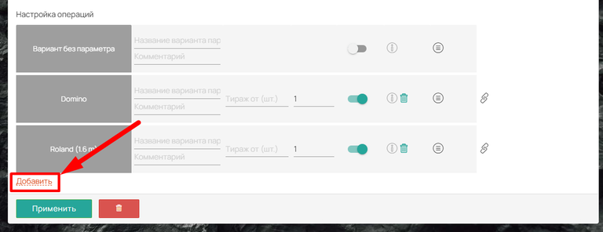{width=768px height=296px}

#### **Настройка добавленной операции**

-  **Название варианта параметра** -- наименование, которое увидит клиент на сайте.

-  **Комментарий** -- внутренняя заметка для менеджеров (видна только в панели управления).

-  **Тираж от (шт.)** -- позволяет настроить автоматическое переключение между разными печатными машинами в зависимости от объема тиража.

-  **Количество** -- коэффициент, на который умножается итоговая стоимость по этой операции. По умолчанию коэффициент равен 1.

-  **Размер** -- появляется, если в «Выбор печати по» указан «Размер». Позволяет указать, какой размер соответствует данному печатному оборудованию.

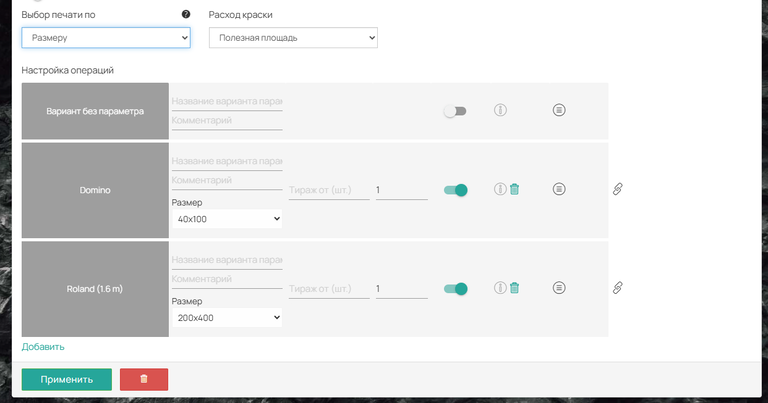{width=768px height=403px}

-  **Переключатель (Вкл/Выкл)** -- позволяет временно отключить этот вариант печати из расчетов, не удаляя его.

-  **Описание (i)** -- пояснение к данному типу печати. Отображается как всплывающая подсказка при наведении на название на сайте.

-  **Удалить** -- полностью удаляет данную операцию из модуля.

-  **Перемещение (≡)** -- позволяет менять порядок отображения печатных машин в списке на сайте.

-  **Настройка** -- переход к детальной настройке параметров выбранной печати. (см. статью [Операция печать](https://support.wow2print.com/spravochnik/operacii/pechat#operaciya-pechat))

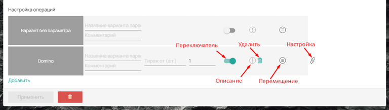{width=768px height=218px}

## **Вкладка «Материал Бумага»**

Данная вкладка доступна только в том случае, если деталь, к которой привязан модуль, рассчитывается **в листах или в квадратных метрах**. Для деталей в штуках выбор материала не отображается.

#### **Верхняя панель настроек**

-  **Показывать на сайте** -- активирует блок выбора материала для печати в карточке товара. При включении появляются:

   -  **Заголовок на сайте** -- название блока (например, «Выберите материал»).

   -  **Описание** -- пояснительный текст под заголовком.

   -  **Отображение** -- формат выбора материала (список, радиобаттон, иконки, плитка).

-  **Выбор материала по** -- определяет, какой параметр будет использоваться для выбора материала: «По плотности» или «По толщине».

-  **Галерея** -- включает показ изображений, загруженных в настройках материала (вкладка «Фотогалерея»).

-  **Показывать заголовок на сайте** -- управляет отображением заголовка блока.

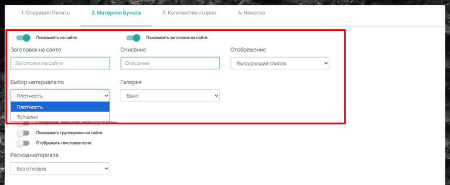{width=768px height=317px}

-  **Отображать цвет на сайте** -- если у материалов[ настроены цвета](https://support.wow2print.com/handbook/svoistva/untitled-3#dobavlenie-cveta), клиент сможет выбрать нужный. При активации появляются:

   -  **Заголовок цвета на сайте** (например, «Выберите цвет бумаги»).

   -  **Отображение цвета на сайте** -- список, радиобаттон, иконки, плитка.

-  **Отображать плотность/толщину на сайте** -- позволяет клиенту настроить выбор конкретного значения плотности или толщины бумаги. При активации появляется **Заголовок плотности / толщины на сайте**.

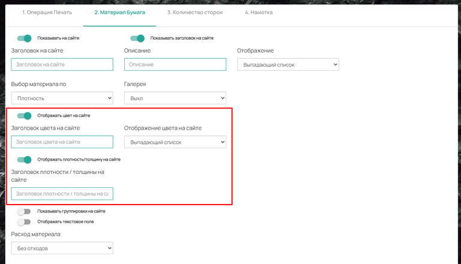{width=768px height=440px}

-  **Показывать группировки на сайте** -- аналогично вкладке операции, позволяет группировать материалы.

-  **Отображать текстовое поле** -- включает поле для ручного ввода текста клиентом (например, комментарий к материалу). При активации появляются:

   -  **Заголовок для текстового поля** -- название поля, которое увидит клиент.

   -  **Подпись текстового поля** -- отображается под заголовком.

-  **Расход материала** -- уточняет, как будет производиться расчет материала. Появляется только для деталей с расчетом в метрах квадратных:

   -  **Без отходов** -- учитывается только полезная площадь раскладки изделий.

   -  **С отходами** -- учитывается вся площадь использованного рулона до линии отреза.

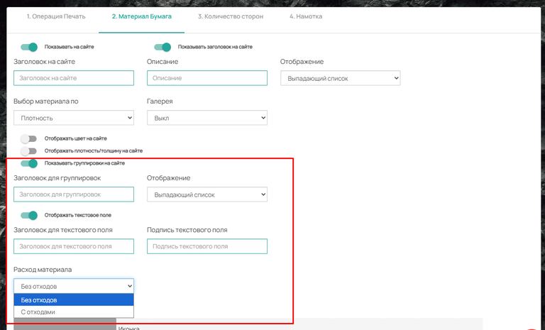{width=768px height=465px}

#### **Выбор материала**

-  По умолчанию присутствует **«Вариант без параметра»**.

-  Для добавления материалов нажмите **«Добавить»** и выберите нужный материал из справочника или создайте новый (см. статью «[Операция ](https://support.wow2print.com/handbook/dop.-operacii/operaciya-laminirovanie#dobavlenie-operacii-laminirovanie)Печать»).

**Настройка добавленного материала**

-  **Иконка** -- изображение материала для карточки товара на кнопке выбора.

-  **Название варианта параметра** -- название бумаги для сайта.

-  **Комментарий** -- внутренняя заметка, отображается только в админ-панели.

-  **Группировка** -- если в операции используется группировка для материалов, позволяет выбрать группу для данного материала.

-  **Размеры** -- отображает доступные форматы, которые поддерживаются выбранной в первой вкладке печатной машиной. Список подгружается из настроек печатной машины.

-  **Количество** -- коэффициент умножения стоимости. По умолчанию коэффициент равен 1. Коэффициентом также можно задать технологические отходы (например, коэффициент 1,05 соответствует тех.отходу 5%).

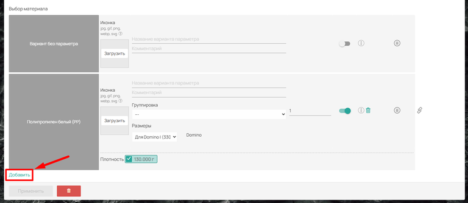{width=768px height=334px}

-  **Переключатель** -- включает или отключает этот материал из расчетов, не удаляя его.

-  **Описание (i)** -- пояснение к данному материалу. Отображается как всплывающая подсказка при наведении на название на сайте.

-  **Удалить** -- полностью удаляет данный материал из списка.

-  **Перемещение (≡)** -- позволяет менять порядок отображения материалов в списке на сайте.

-  **Настройка** -- переход к детальным параметрам материала.

-  **Толщина / Плотность** -- список значений (например, 100, 148, 300 грамм), которые есть у данного материала. Чтобы значение было доступно клиенту для выбора, нужно установить напротив него галочку. Список этих параметров задается в [настройках самого материала.](https://support.wow2print.com/spravochnik/materialy/bumaga/sozdanie-materiala-bumagi-vkladka-opisanie)

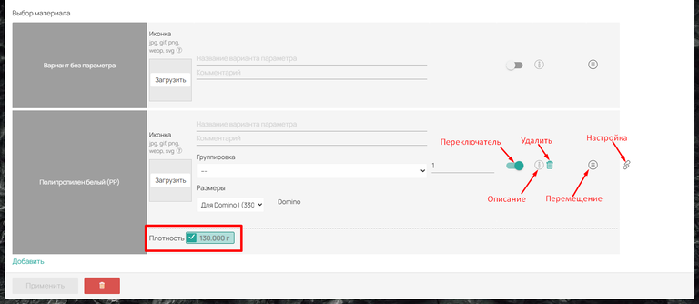{width=768px height=334px}

## **Вкладка «Количество сторон»**

Позволяет клиенту выбрать цветность печати (0+0, 1+0, 1+1, 4+0, 4+4 и другие).

#### **Настройки вкладки**

-  **Показывать на сайте** -- включает отображение выбора сторон в карточке товара. При включении появляются:

   -  **Заголовок на сайте** -- позволяет задать название блока (например, «Выберите стороны печати»).

   -  **Отображение** -- определяет, как именно клиент будет выбирать значение (выпадающий список, иконки и т.д.).

   -  **Описание** -- поле для ввода поясняющего текста. Отображается на сайте под заголовком.

-  **Показывать заголовок на сайте** -- переключатель, управляющий отображением заданного заголовка. Если его отключить, сам блок параметров останется на сайте, но его название отображаться не будет.

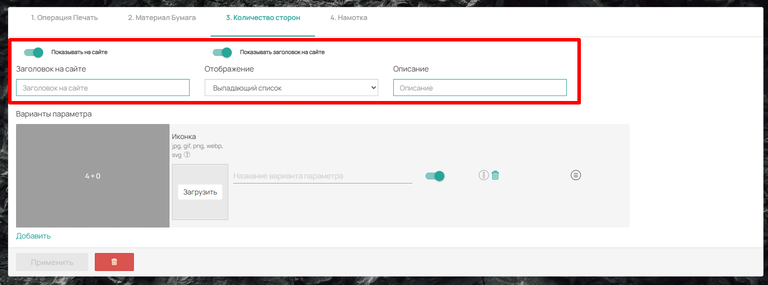{width=768px height=285px}

#### **Варианты параметров**

Нажмите **«Добавить»**, чтобы подключить доступные варианты сторон. Доступный для подключения набор определяется [в настройках печатного оборудования](https://support.wow2print.com/spravochnik/operacii/pechat#vkladka-cvetnost-i-storony-pechati), добавленного на первой вкладке.

Для каждого варианта можно настроить:

-  **Иконка** -- загрузка изображения. Будет отображаться на сайте, если в настройках отображения выбран формат «Иконки», «Радио баттон с иконками» или «Плитка».

-  **Название варианта параметра** -- текст, который увидит клиент на сайте.

-  **Переключатель** -- позволяет временно отключить этот вариант на сайте, не удаляя его из списка.

-  **Описание** -- текст подсказки. Появляется при наведении курсора мыши на название варианта в карточке товара.

-  **Удалить** -- полностью удаляет данный вариант из списка.

-  **Перемещение (≡)** -- позволяет менять порядок сортировки вариантов.

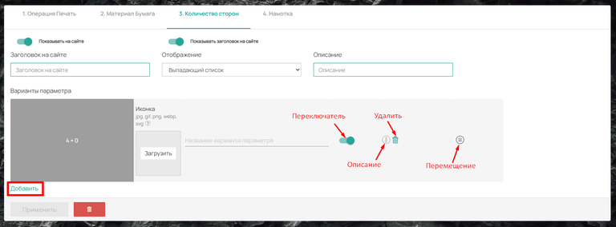{width=768px height=284px}

## **Вкладка «Намотка»**

Данная вкладка доступна только в том случае, если деталь, к которой привязан модуль, рассчитывается **в квадратных метрах** (рулонная продукция). Для остальных деталей данная вкладка не отображается.

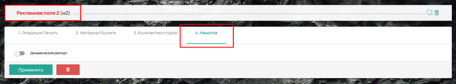{width=768px height=143px}

**Динамический рапорт** -- активирует все возможности динамического рапорта. После активации появляется переключатель **«Показывать на сайте»**. Если он активен, блок намотки будет виден в карточке товара на сайте.

Под переключателем открываются следующие поля для заполнения:

-  **Заголовок на сайте** -- позволяет изменить стандартное название модуля (например, вместо «Намотка» написать «Ориентация в рулоне»).

-  **Отображение** -- выбор внешнего вида опций на сайте (выпадающий список, радио баттон, иконки, плитка).

-  **Описание** -- текст, который будет отображаться в карточке товара под заголовком.

-  **Показывать группировки на сайте** -- если у вас есть группировки операций, этот переключатель позволит отобразить их для выбора клиенту. При включении появляются поля:

   -  **Заголовок для группировок** -- название блока с группировками.

   -  **Отображение** -- формат показа группировок (список, радио-кнопки, иконки и т.д.).

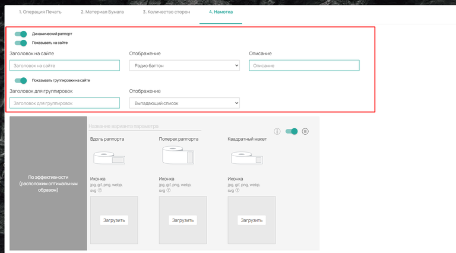{width=768px height=426px}

**Добавление параметров:** **«По эффективности»**

По умолчанию в модуле присутствует вариант **«По эффективности»**. В этом случае система автоматически размещает изделие на рапорте наиболее выгодным способом, чтобы максимально сократить расход материала и уменьшить количество отходов.

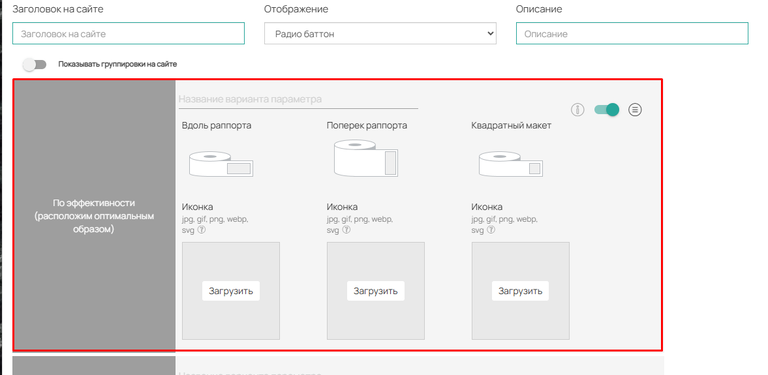{width=768px height=375px}

**Добавление пользовательских вариантов намотки**

Если клиенту недостаточно автоматического размещения, он может задать поворот макета вручную. Для этого нажмите кнопку **«Добавить»** -- откроется окно с доступными углами поворота. Система предлагает четыре варианта ориентации изделия в рулоне: **0°, 90°, 180° и –90°**.

Клиент может выбрать любое из этих направлений и точно указать, как именно должна быть развернута его продукция при намотке в рулон. Такая возможность особенно востребована для рулонных изделий -- наклеек, этикеток, самоклеящихся пленок. Ручной поворот помогает адаптировать макет под конкретные требования резки или последующей автоматической наклейки.

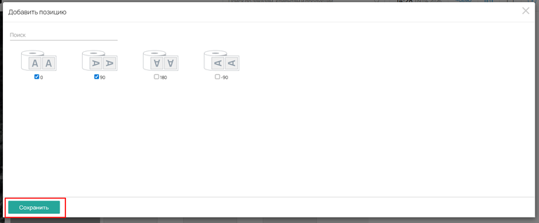{width=768px height=318px}

**Компоненты параметра намотки**

-  **Название варианта параметра** -- наименование, которое увидит клиент на сайте (например, «Без поворота», «Поворот 90°», «Поворот 180°», «Поворот –90°»).

-  **Превью изображения рапорта** -- всегда показывает, как будет располагаться изделие на рапорте. Превью срабатывает автоматически при вводе размера и показывает клиенту, как будет располагаться его изделие в рулоне. Например, для наклейки система может показать три варианта: горизонтальный макет (без поворота), вертикальный макет (поворот на 90°) и квадратный макет (поворот на 180° или –90° в зависимости от формы). Это помогает клиенту визуально оценить, какой способ намотки наиболее выгоден или подходит под его макет.

-  **Иконка** -- по умолчанию используются стандартные иконки, отображающие разные направления поворота макета (стрелка вверх -- 0°, стрелка вправо -- 90°, стрелка вниз -- 180°, стрелка влево -- –90°). При желании клиент может сменить иконку на свою, учитывая расположение макета (горизонтальное, вертикальное, квадратное).

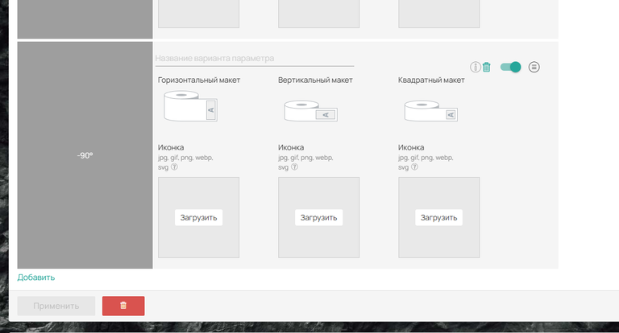{width=768px height=414px}

#### **Настройка добавленной операции:**

-  **Описание (i)** -- пояснение к данному типу намотки. Отображается как всплывающая подсказка при наведении на название на сайте.

-  **Удалить** -- полностью удаляет данную операцию из модуля (кроме операции «По эффективности» по умолчанию).

-  **Переключатель (Вкл/Выкл)** -- позволяет временно отключить этот вариант намотки из расчетов, не удаляя его.

-  **Перемещение (≡)** -- позволяет менять порядок отображения вариантов намотки в списке на сайте.

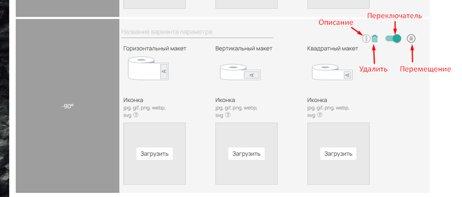{width=768px height=328px}

## **Управление модулем**

В нижней части каждого модуля расположена панель управления:

-  **Кнопка «Применить»** -- подсвечивается зеленым при некоторых изменениях в настройках. Обязательно нажимайте ее для сохранения конфигурации модуля.

-  **Кнопка «Удалить» (корзина)** -- полностью удаляет модуль «Печать» из калькуляции.

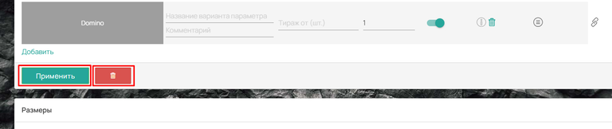{width=768px height=162px}