Размеры изделия вносятся в следующем модуле "Размеры". Рассмотрим подробнее алгоритм заполнения полей модуля:

<figure>

.png>)

<figcaption>

</figcaption>

</figure>

### **Показывать на сайте**

Переключателем "Показывать на сайте" вы можете выбрать отображать размеры на сайте для выбора клиентом или скрыть

### Показывать заголовок на сайте

При необходимости скрыть заголовок по умолчанию, воспользуйтесь переключателем "Показывать заголовок на сайте".

### Заголовок на сайте

При заполнении "Заголовка на сайте", введенный заголовок будет отображаться на сайте. В случае если заголовок не заполнен, на сайте по умолчанию будет отражаться слово "Размеры".

### Отображение

Визуальное отображение размеров на сайте можно выбрать: Выпадающий список, Радио баттон (кнопка), Иконки (изображение), Радио баттон с иконками (кнопка с изображением), Плитка (Большие иконки).

[tabs]

[tab:Выпадающий список]

{width=768px height=165px}

[/tab]

[tab:Радио баттон]

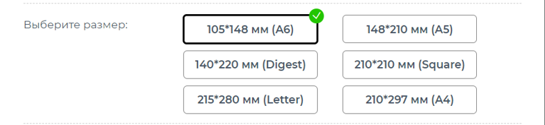{width=768px height=177px}

[/tab]

[tab:Иконки]

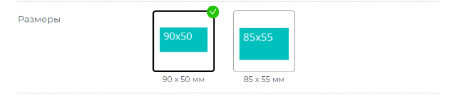{width=768px height=165px}

[/tab]

[tab:Радио баттон с иконками]

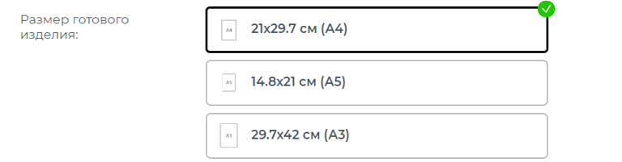{width=768px height=201px}

[/tab]

[tab:Плитка]

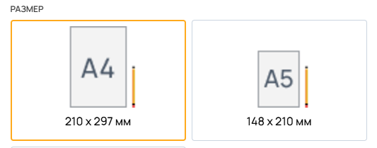{width=533px height=209px}

[/tab]

[/tabs]

### **Описание**

Появляется под названием Заголовка в карточке товара. Нужен для пояснения процесса выбора размера

### **Единица измерения для меняющегося размера**

При добавлении размера "Меняющийся", указывает какую единицу измерения использовать во введенных размерах

### **Добавление размера**

Чтобы добавить размер нажмите на кнопку [highlight:green]"Добавить"[/highlight]

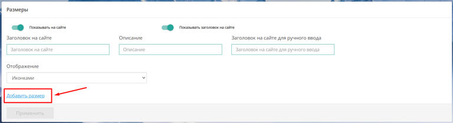{width=768px height=209px}

В открывшемся окне выберите вариант размера: Стандартный, Индивидуальный, Меняющийся. При подключенном конструкторском модуле, появится дополнительная кнопка "Конструктор"

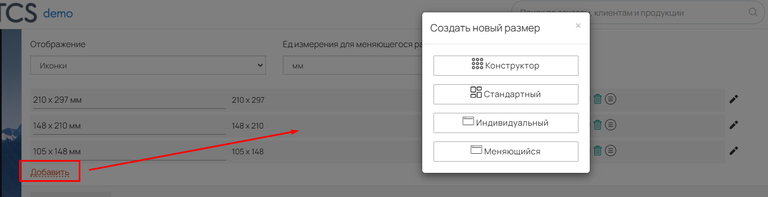{width=768px height=197px}

-  **Стандартный** - при нажатии на кнопку выйдут размеры внесенные в Справочник -> Продукция -> Размеры -> Добавить

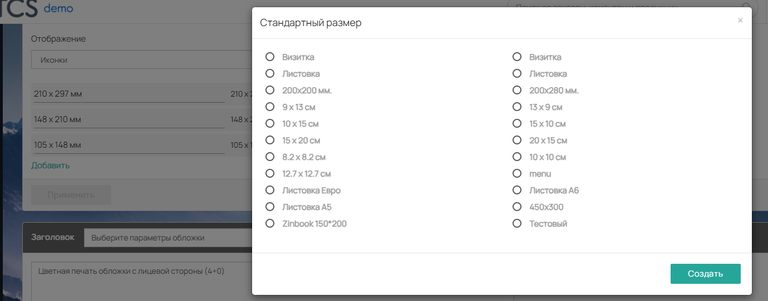{width=768px height=301px}

После добавления размера, появится строка с описанием добавленного размера. Слева указано название данного размера, правее указано значение размера, дальше находится ползунок включающий и отключающий отображение размера в калькуляции и карточке товара.

С правой стороны находятся 3 значка: 

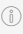{width=23px height=34px} необходим для внесения описания размера. При наведении на размер в карточке товара, высвечивается его описание 

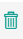{width=23px height=39px} удаляет размер 

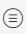{width=26px height=34px} даёт возможность переместить размер выше или ниже в списке зажав его левой кнопкой мыши

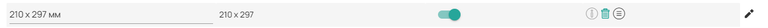{width=768px height=28px}

В самом конце добавленного размера имеется иконка карандаша {width=30px height=35px}

После его нажатия откроется окно редактирования размера

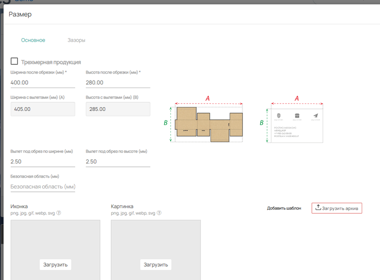{width=768px height=566px}

**Ширина / Высота после обрезки:**

Указывается конечный размер продукции, получаемый после обрезки изделия

**Вылет под обрез по ширине / высоте:**

Указывается размер вылета между изделиями на одном листе для обрезки

**Ширина / высота с вылетами:**

После нажатия кнопки Применить в центральных окошках суммируется окончательный размер

**Безопасная область:**

Указывается для клиента при загрузке макета. Необходима для удостоверения в том, что при обрезке никакой важной информации с макета не пропадёт

**Иконка:**

Нужна при отображении размеров Иконками и Плитками

**Картинка:**

Отображается в карточке товара при наведении на размер

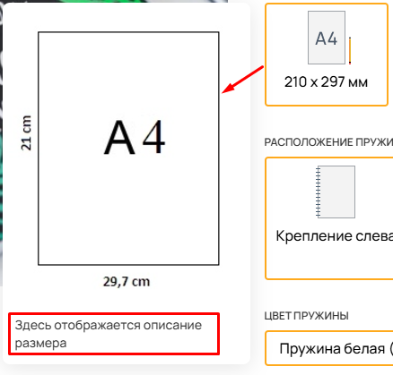{width=438px height=419px}

### **Добавить шаблон:**

При выборе определенного размера, клиент может скачать шаблон что бы подготовить нужный макет для загрузки к заказу. Что бы клиент смог скачать нужный шаблон, загрузите его в настройках размера 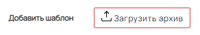{width=292px height=51px}. Шаблон необходимо загружать архивом .zip .rar .7z Скачивание шаблона появится над кнопкой оформления заказа в карточке товара.

После введения всех данных не забудьте нажать "Применить".

-  **Индивидуальный**

В Индивидуальном размере вы не выбираете из списка стандартных размеров, а можете сами создать любой размер заполнив обязательные поля "Название", "Ширина / Высота после обрезки" и если необходимо, то укажите вылеты под обрез, и безопасную область.

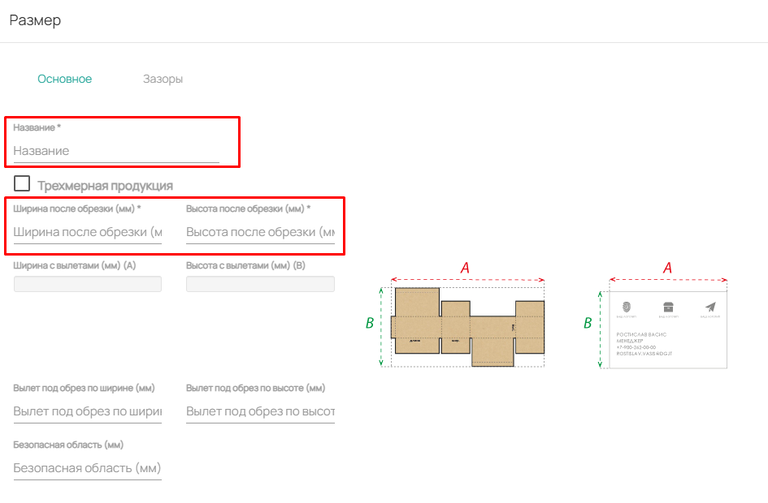{width=768px height=503px}

-  **Меняющийся**

Меняющиеся размеры позволяют настроить ручной ввод размера клиентом на сайте, при этом задать ограничения: *минимальный и максимальный размеры, максимальное значение минимальной стороны*. Также предусмотрены *вылеты под обрез по ширине и высоте, а также безопасная область при необходимости*.

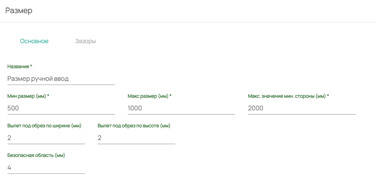{width=768px height=387px}

Для данного типа размера предусмотрена возможность выбирать единицу измерения для клиента на сайте: м, см или мм.

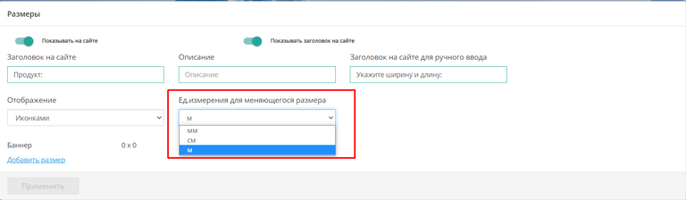{width=768px height=224px}

Пример на сайте:

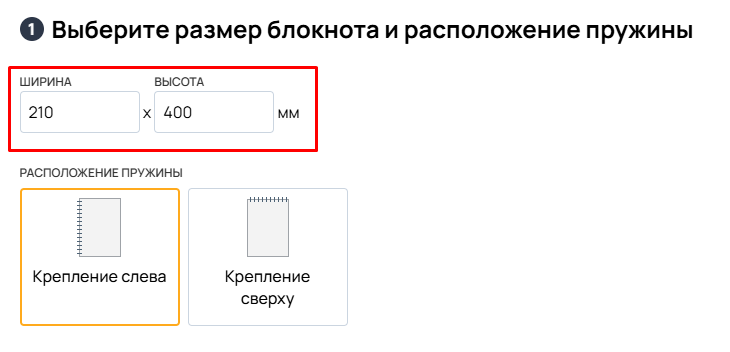{width=730px height=352px}

:::note 

По умолчанию используется ед. изм. миллиметры (мм.)

:::

## **Ориентация**

Вторя вкладка модуля Размеры. Ориентация необходима для рулонной печати этикеток и показывает в каком положении (горизонтально или вертикально) будет располагаться изделие на рулоне.

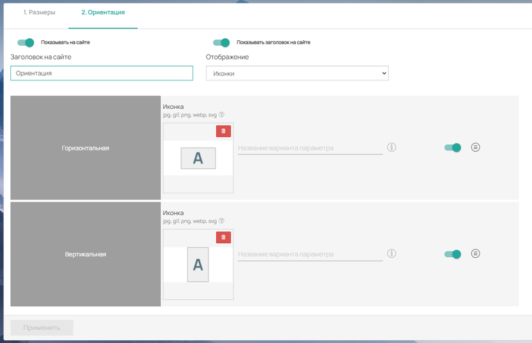{width=768px height=495px}

Тут располагаются стандартные ползунки: Показывать на сайте, Показывать заголовок на сайте. А так же имеются поля Заголовок на сайте и отображение со стандартным набором вариантов

По умолчанию Горизонтальная и Вертикальная ориентация отключены. Вы можете загрузить иконку, которая будет отображаться в карточке товара и название, которое будет под иконкой.

Как модуль выглядит на сайте:

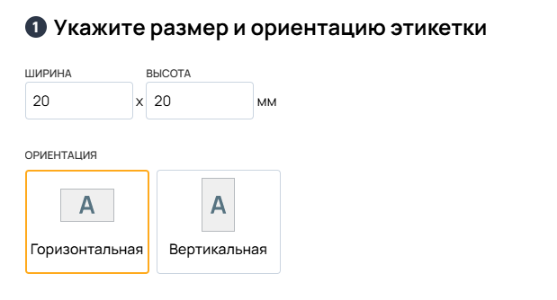{width=619px height=334px}