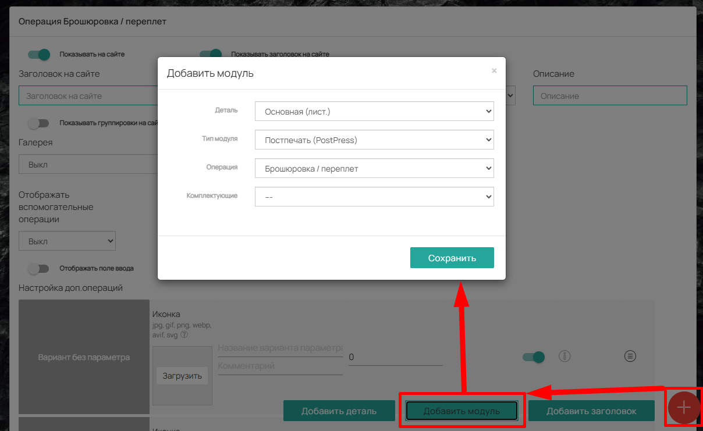
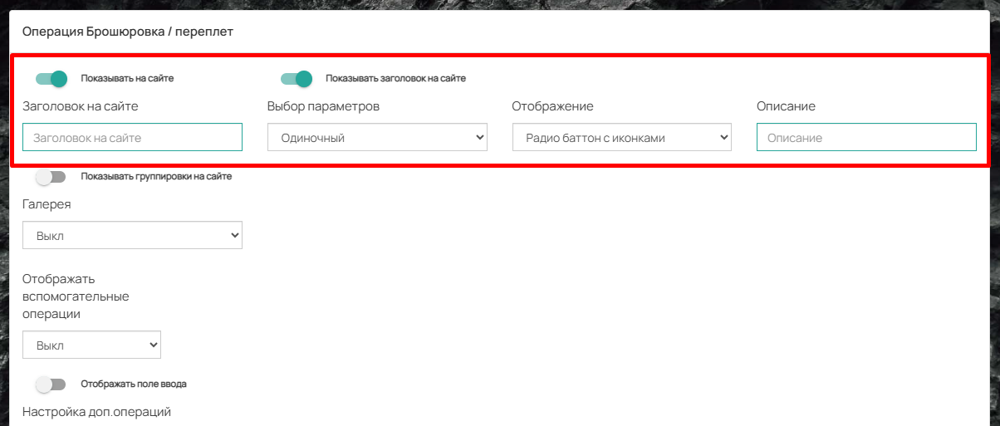
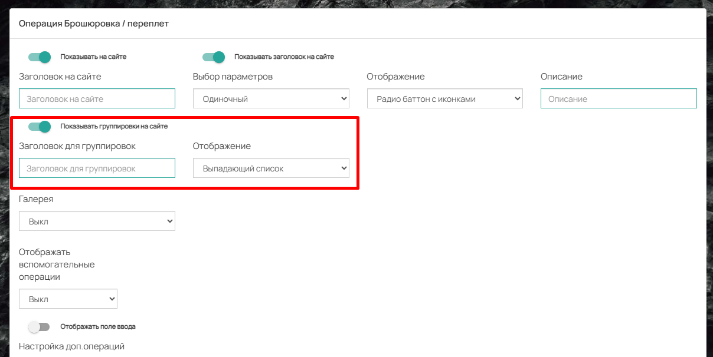
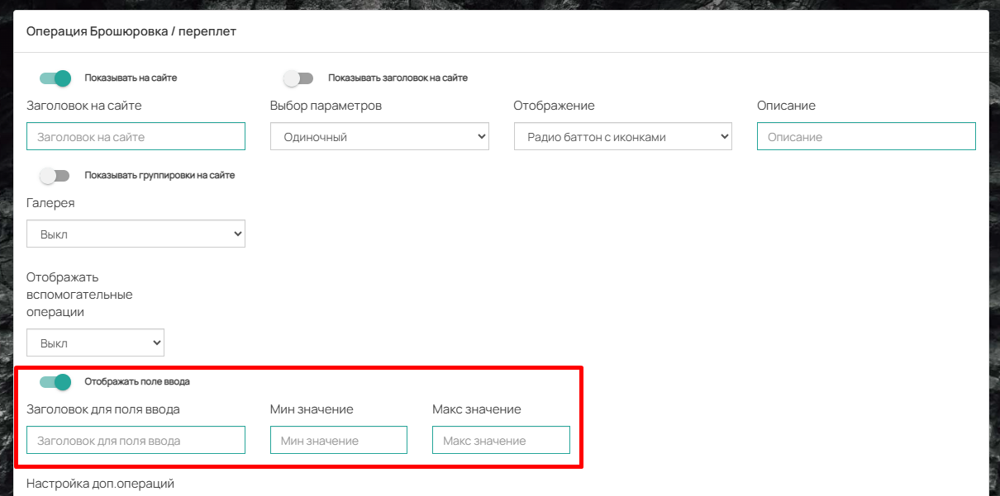
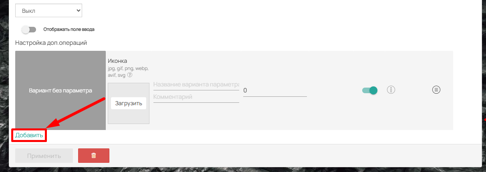
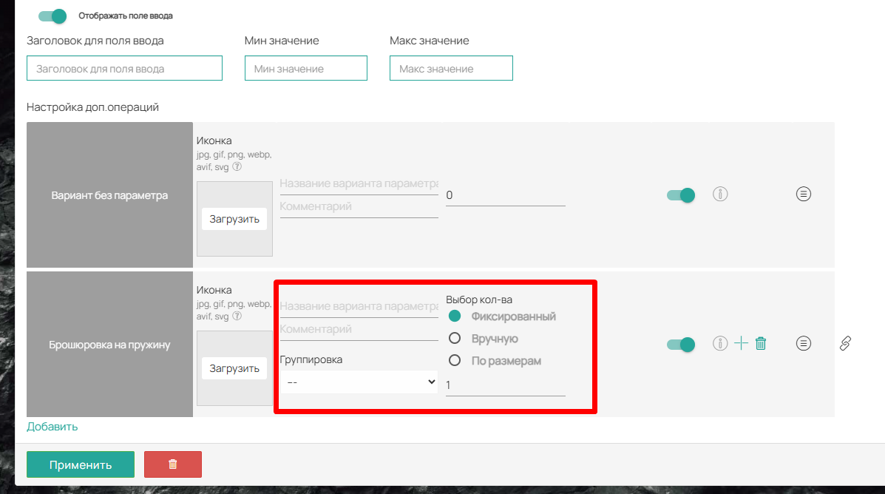
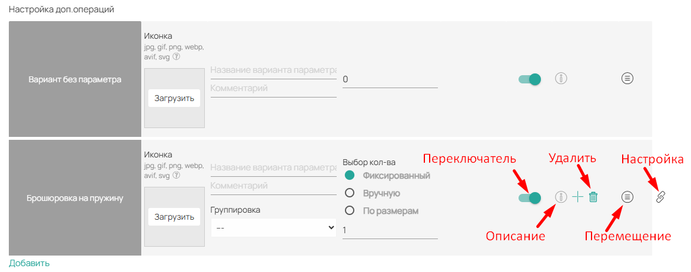
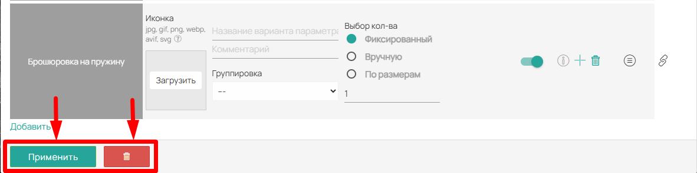

Модуль «Брошюровка / переплёт» позволяет добавить в расчёт операцию скрепления отдельных листов бумаги в единое компактное издание (каталог, отчёт или журнал).

### **Как добавить модуль в калькуляцию**

Чтобы добавить операцию брошюровки в расчёт стоимости продукта:

1. В правом нижнем углу экрана нажмите кнопку **«Плюсик»**.

2. В появившемся меню выберите пункт **«Добавить модуль»**.

3. В открывшемся окне укажите:

   -  **Деталь** -- выберите из списка деталь, к которой будет относиться брошюровка.

   -  **Тип модуля** -- установите значение **«Постпечать»**.

   -  **Операция** -- выберите **«Брошюровка / переплёт»**.

4. Нажмите кнопку **«Сохранить»**.

После этого модуль появится в структуре калькуляции выбранной детали.

{width=1208px height=741px}

### **Верхняя панель (Отображение на сайте)**

В верхней части модуля расположены настройки, отвечающие за то, как брошюровка будет отображаться в карточке товара на сайте вашей типографии.

-  **Показывать на сайте** -- главный переключатель. Если он активен, блок Брошюровки будет виден в карточке товара.

   -  **Заголовок на сайте** -- позволяет изменить стандартное название модуля. Например, вместо «Операция» можно указать «Скрепление пружиной».

   -  **Выбор параметров** -- позволяет разрешить заказчику выбрать несколько вариантов брошюровки одновременно или только один.

   -  **Отображение** -- выбор внешнего вида опций на сайте: выпадающий список, радио баттон, иконки, плитка и другие варианты.

   -  **Описание** -- текст, который будет отображаться под заголовком модуля в карточке товара.

   -  **Галерея** -- включает показ галереи изображений. Фотографии загружаются в настройке операции во вкладке **«Фотогалерея»**.

-  **Показывать заголовок на сайте** -- управляет отображением заголовка модуля.

{width=1204px height=513px}

-  **Показывать группировки на сайте** -- если у вас есть группировки операций, этот переключатель позволит отобразить их для выбора клиенту. При включении появляются два поля:

   -  **Заголовок для группировок** -- название блока с группировками.

   -  **Отображение** -- формат показа группировок (список, радиокнопки, иконки и т.д.).

{width=1208px height=606px}

#### **Отображать поле ввода**

Если клиент должен самостоятельно указывать количество (например, жёсткость или длину пружины), активируйте переключатель **«Отображать поле ввода»**. После этого появятся поля:

-  **Заголовок для поля ввода** -- название поля для клиента.

-  **Минимальное и Максимальное значение** -- диапазон допустимых значений.

{width=1210px height=601px}

### Добавление операции

В этом блоке добавляются конкретные операции, с которыми выполняется брошюровка.

-  По умолчанию присутствует **«Вариант без параметра»**.

-  Для добавления операции нажмите кнопку **«Добавить»**. Выберите существующую операцию из списка или создайте новую ([см. статью](./../../../../spravochnik/dop-operacii/broshyurovka-pereplet))

{width=1213px height=430px}

#### **Настройка добавленной операции:**

-  **Иконка** -- изображение, отображаемое на сайте при выборе формата отображения «Иконки», «Плитка» или «Радио баттон с иконками».

-  **Название варианта параметра** -- наименование, которое увидит клиент на сайте.

-  **Комментарий** -- внутренняя заметка для менеджеров (видна только в панели управления).

-  **Выбор кол-ва** -- настройка учёта количества:

   -  **Фиксированный** -- количество применяется к тиражу по умолчанию, клиент не может его изменить. При выборе этого режима появляется строка для указания фиксированного значения.

   -  **Вручную** -- клиент самостоятельно указывает количество в заказе. Ограничения ввода редактируются в поле **«Отображать поле ввода»** (описано выше).

{width=1197px height=668px}

-  **Переключатель** -- включает или отключает отображение конкретной операции на сайте.

-  **Описание** -- текст-подсказка, появляющаяся при наведении курсора на название операции в карточке товара.

-  **Удалить** -- удаляет операцию из списка модуля.

-  **Перемещение** (иконка с точками) -- позволяет изменять порядок отображения операций в списке.

-  **Настройка** -- открывает детальные параметры самой операции «Брошюровка / переплёт» для более тонкой настройки. ([см. статью](./../../../../spravochnik/dop-operacii/broshyurovka-pereplet))

{width=1174px height=463px}

### **Управление модулем**

В нижней части интерфейса модуля расположена панель управления:

-  **Кнопка «Применить»** -- подсвечивается зеленым при внесении любых изменений в настройки модуля. Для сохранения конфигурации необходимо нажать эту кнопку.

-  **Кнопка «Удалить»** (значок корзины) -- предназначена для полного удаления модуля «Лакирование» вместе со всеми добавленными операциями из калькуляции продукта.

{width=1182px height=295px}