Вкладка Общая содержит всю необходимую вводную информацию о товаре. Кроме уже внесенных названия и категории в данной вкладке можно администрировать следующие параметры:

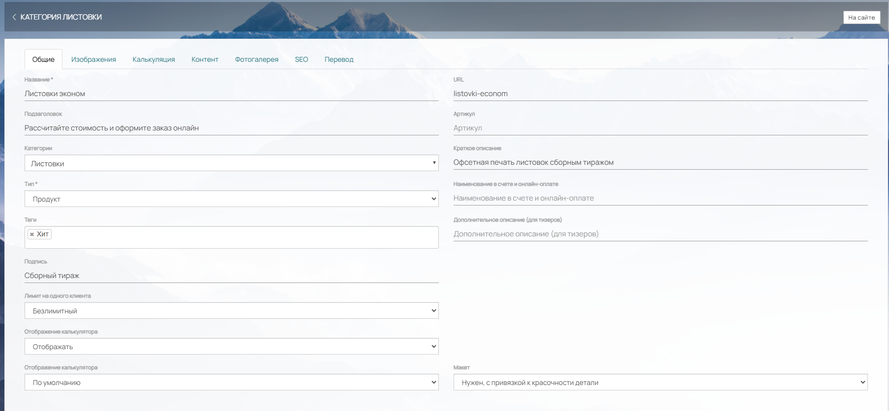{width=1809px height=838px}

### **Подзаголовок**

Он отобразится в карточке товара в верхней части перед калькулятором

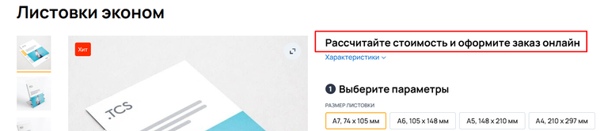{width=768px height=166px}

### **Тип**

Является обязательным полем. Можно выбрать два типа товара: Услуга или Продукт

### **Теги**

К каждому продукту можно назначить один или несколько тегов. С помощью тегов можно визуально выделить продукт или вовсе создать фильтр внутри категории продуктов. Более подробно можно узнать из статьи в справке [Теги](https://support.wow2print.com/produkciya/tegi-filtr-produkcii)

### **Подпись**

Не является обязательным полем. Используется для указания подписи под названием продукта, который отображается в каталоге товаров

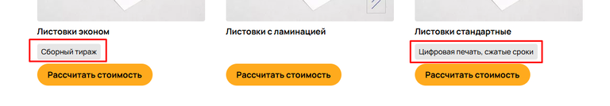{width=768px height=134px}

### **Лимит на одного клиента**

Можно выбрать один из двух параметров: 1. Безлимитный - обычный продукт с неограниченным кол-вом заказов 2. Промо-продукт - из названия понятно его предназначение, и если выбрать данный параметр, то продукт можно будет заказать всего один раз. После первого заказа, продукт продолжит отображаться для клиента, но при попытке повторного оформления, в корзине выйдет предупреждение "Промо-комплект продукта (название) вы уже приобрели ранее".

### **Отображение калькуляции**

Позволяет скрыть калькуляцию продукта, если это потребуется. Клиент будет видеть общую информацию, текст контента, изображения фотогалереи и требования к макетам.

### **Отображение калькулятора**

В этом поле можете выбрать разное отображение калькулятора: По умолчанию, Вид "Нейро", В2В (Горизонтальный), В2С (Карточка товара).

Примеры отображений:

**По умолчанию -** Вертикальное отображение параметров

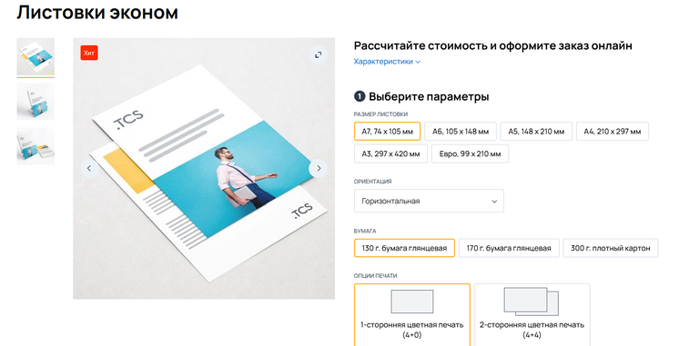{width=768px height=381px}

**Нейро -** Последовательный выбор параметров

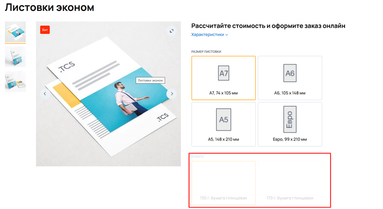{width=768px height=419px}

**В2В (Горизонтальный) -** Все параметры располагаются горизонтально и помещаются на одной странице

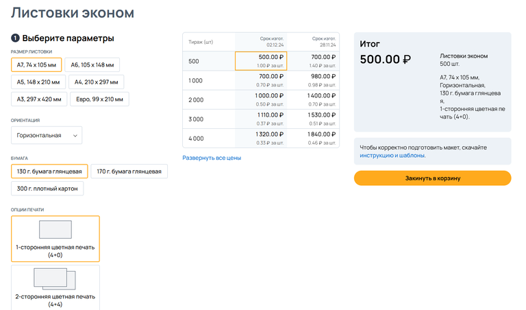{width=768px height=452px}

**В2С (Карточка товара)-** Позволяет отображать картинки фотогалереи слева, основные параметры по центру, дату готовности снизу

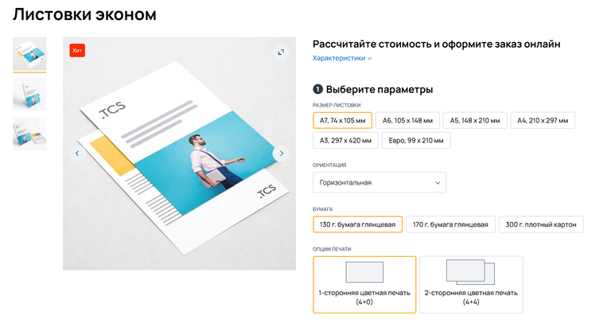{width=768px height=406px}

### **Загрузить инструкцию**

Это кнопка, при нажатии на которую можно выбрать файл с инструкцией (только **PDF**) на вашем компьютере.

После загрузки:

-  Чтобы скачать инструкцию, нажмите **«Скачать инструкцию»**.

-  Чтобы удалить загруженный файл, нажмите на **крестик** справа от кнопки.

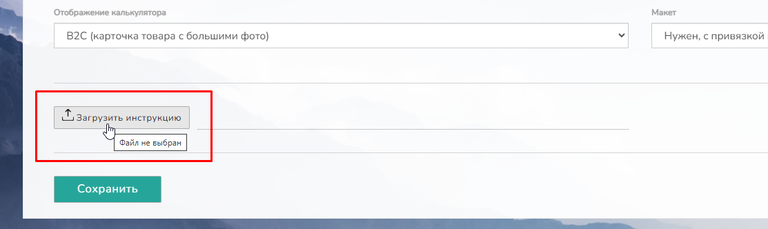{width=768px height=229px}

### **URL**

Поле *"url"* заполняется автоматически при введении названия продукта. Можете также самостоятельно ввести удобный вам URL-адрес. Если введённый адрес уже существует, то вам выйдет предупреждение о наличии данного URL на сайте. Укажите другой адрес, либо удалите или замените уже существующий, только после этого можно будет изменить URL.

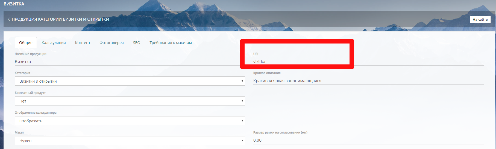{width=1815px height=548px}

### **Артикул**

Для удобства поиска и идентификации заказанного продукта можно прописать Артикул. Артикул будет отображаться на сайте, легко находится по поиску на сайте, в админ-панели и в отчетах.

### **Краткое описание**

При заполнении поля, данные отображаются в верхнем меню под названием продукта.

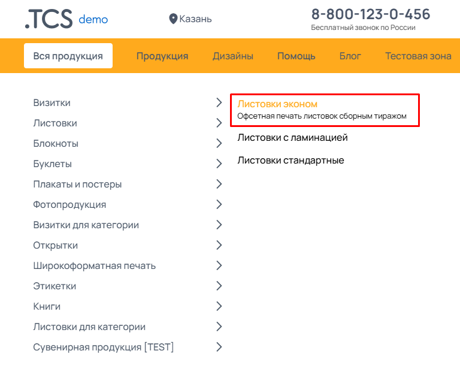{width=768px height=611px}

### **Наименование в счете**

Если вам нужно, чтобы у какого-либо продукта в счете было отличное от сайта наименование, впишите нужное в поле *Наименование в счете.*

### **Дополнительное описание (для тизеров)**

Отображает надпись над кнопкой перехода к калькуляции.

{width=768px height=345px}

### **Макет**

Данное поле необходимо для того, что бы у клиента был выбор, загрузить макет самостоятельно, либо создать его в онлайн конструкторе. Данный выбор работает, если в Настройки -> Другие настройки -> Настройки оформления заказа, поставлена галочка "Обязательная загрузка макета в калькуляции"

**Нужен с привязкой к красочности детали:** При выборе данного параметра, в корзине, над кнопкой оформления заказа, появится выбор: применить *Готовый дизайн*, *Создать с нуля* и загрузить *Свой макет*.

*• [highlight:green]Готовый дизайн[/highlight]* Позволит выбрать из каталога дизайнов подходящий вам дизайн продукта

*• [highlight:yellow]Создать с нуля[/highlight]* При выборе данного способа, откроется конструктор, в котором уже выбраны доступные варианты оформления продукта, в зависимости от конструкторских размеров, которые были указаны в калькуляции при создании продукта

*• [highlight:blue]Свой макет[/highlight]* Позволяет покупателю загрузить собственный, готовый макет.

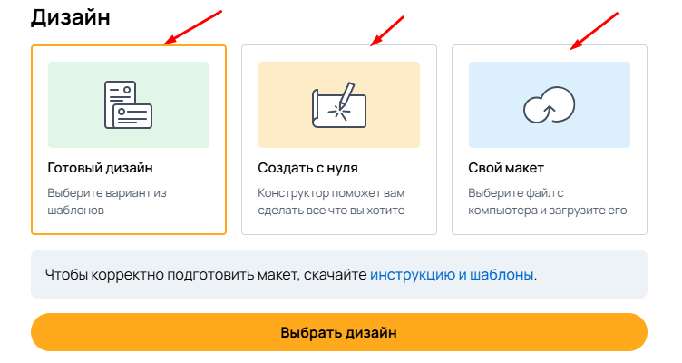{width=752px height=400px}

**Нужен без привязки к красочности детали:**

Делает обязательной загрузку макета, без применения конструктора.

**Не нужен ни при каких обстоятельствах:**

Делает невозможным загрузку макета ни каким способом. В корзине вместо кнопки загрузки макета будет отображаться тизер товара (продукта).