Вкладка «Общие» предназначена для управления основной информацией о товаре. Помимо стандартных полей «Название» и «Категория», здесь доступны для администрирования следующие параметры:

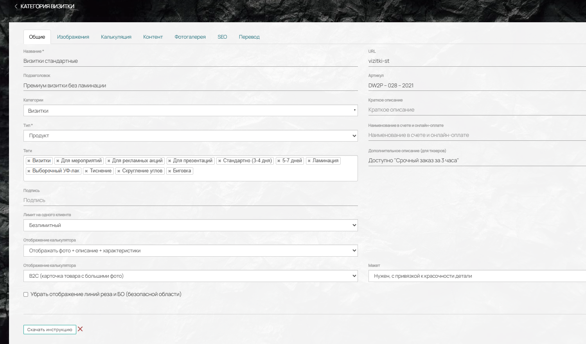{width=1498px height=882px}

### **Подзаголовок**

Отображается в карточке товара, в верхней части страницы, перед блоком калькулятора.

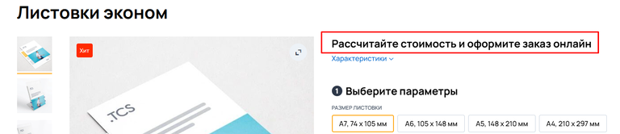{width=768px height=166px}

### **Тип**

Обязательное поле. Доступны два варианта: «Услуга» или «Продукт».

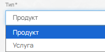{width=211px height=105px}

### **Теги**

Позволяют назначить продукту один или несколько тегов. Теги используются для визуальной маркировки товара в каталоге, а также для организации фильтрации внутри категории. Подробнее -- в статье [Теги](./../tegi-filtr-produkcii)

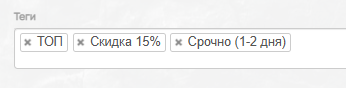{width=346px height=88px}

### **Подпись**

Необязательное поле. Указывается под названием продукта в каталоге товаров.

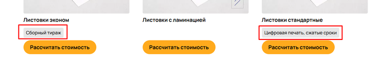{width=768px height=134px}

### **Лимит на одного клиента**

Доступны два режима:

-  **Безлимитный** -- стандартный продукт с неограниченным количеством заказов.

-  **Промо-продукт** -- предназначен для разовых заказов. После первого оформления товар продолжает отображаться в каталоге, но при повторной попытке добавления в корзину система выдаст предупреждение: *«Промо-комплект продукта (название) вы уже приобрели ранее»*.

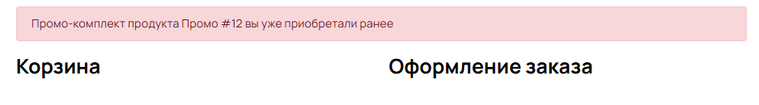{width=938px height=130px}

### **Отображение калькулятора**

Позволяет управлять видимостью калькуляционной части на странице товара. Доступны три режима:

-  **Отображать** -- калькулятор и остальной контент полностью активен и виден.

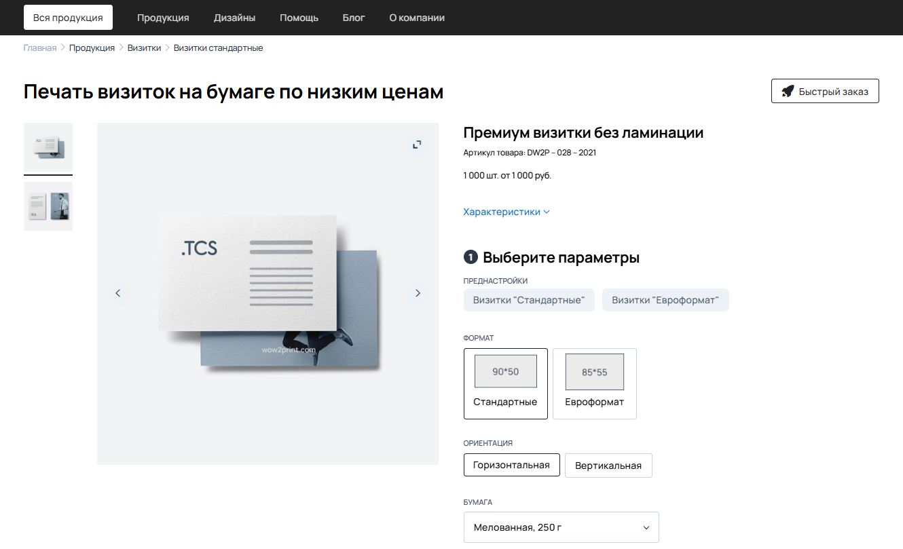{width=1330px height=809px}

-  **Не отображать** -- калькулятор скрыт. Клиенту доступен только контент, расположенный до и после него; информация о товаре на странице не показывается.

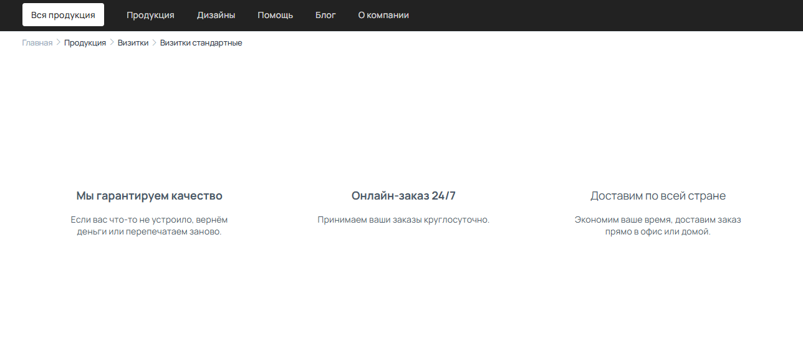{width=1288px height=550px}

-  **Отображать фото + Описание + Характеристики** -- калькулятор скрыт, при этом на странице остаются видны фотография товара, его описание и характеристики.

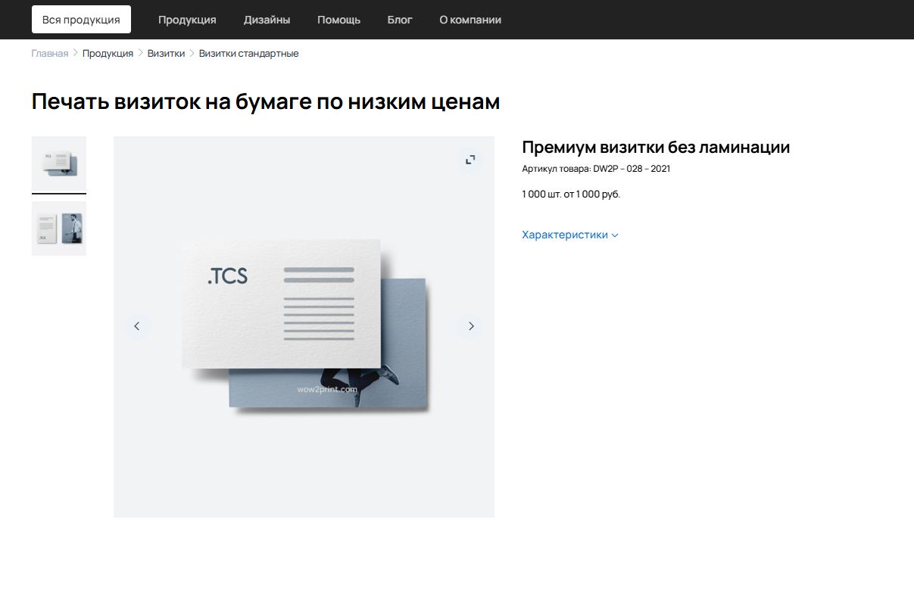{width=1207px height=781px}

### **Отображение калькулятора**

Доступны четыре режима:

-  **По умолчанию** -- вертикальное расположение параметров.

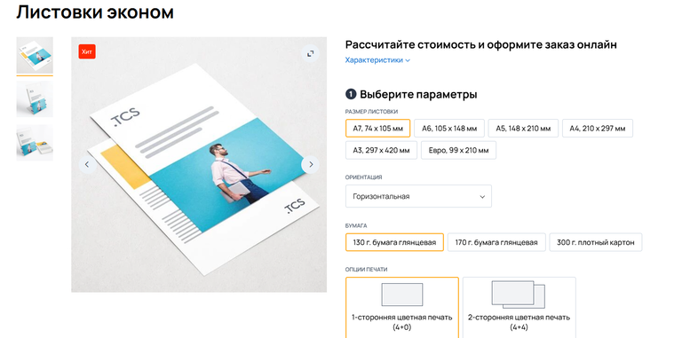{width=768px height=381px}

-  **Нейро** -- последовательный (пошаговый) выбор параметров.

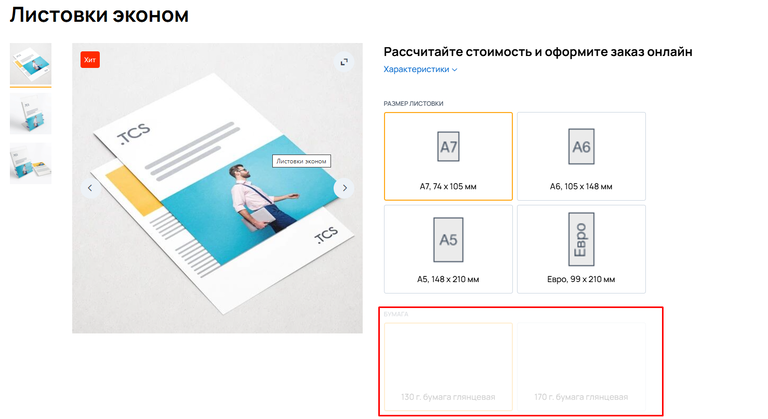{width=768px height=419px}

-  **В2В (Горизонтальный)** -- все параметры размещены горизонтально на одной странице.

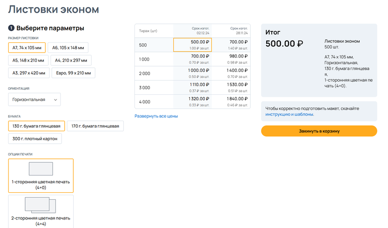{width=768px height=452px}

-  **В2С (Карточка товара)** -- фотогалерея выводится слева, основные параметры -- по центру, дата готовности -- снизу.

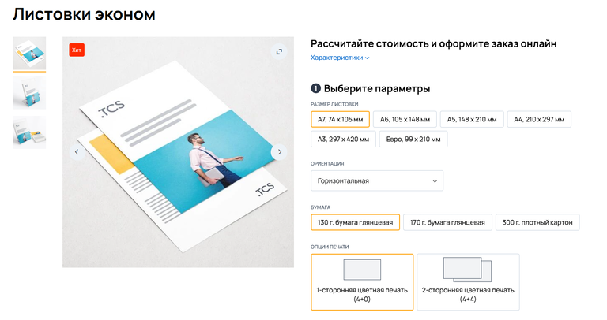{width=768px height=406px}

### **Чекбокс «Убрать отображение линий реза и БО (безопасной области)»**

Скрывает линии реза и границы безопасной области при проверке макета. Опция полезна для упрощения восприятия фигурных макетов конечным клиентом.

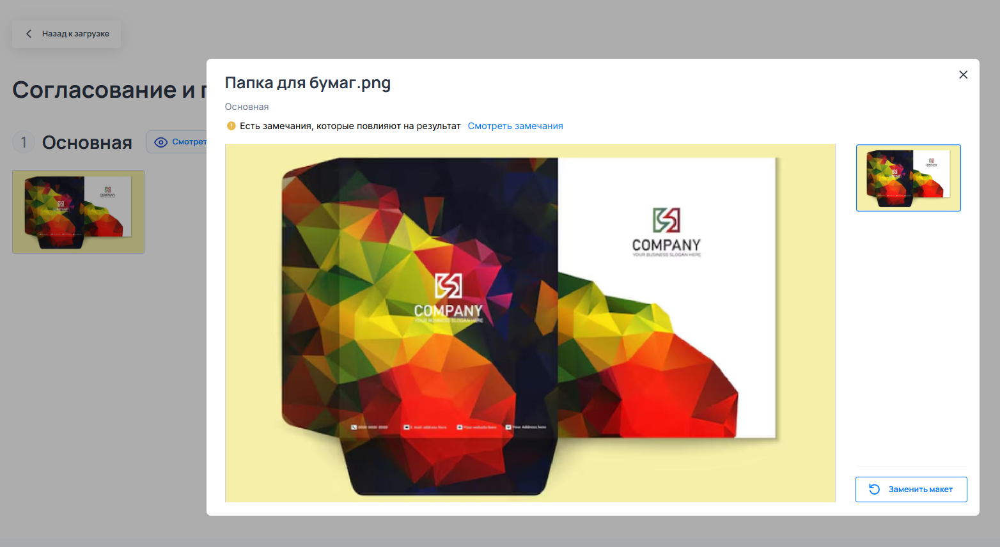{width=1564px height=856px}

### **Загрузить инструкцию**

Кнопка, позволяющая прикрепить файл инструкции в формате PDF.

После загрузки:

-  для скачивания инструкции нажмите «Скачать инструкцию»;

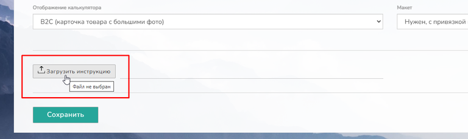{width=768px height=229px}

-  для удаления файла нажмите на крестик справа от кнопки.

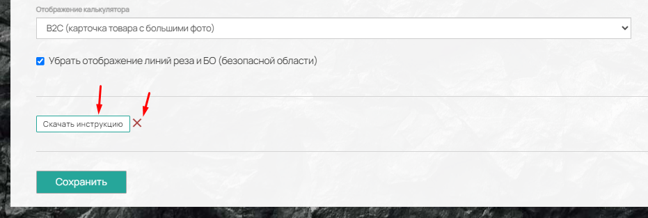{width=931px height=313px}

### **URL**

Генерируется автоматически на основе названия продукта. Допускается ручное редактирование. Если введённый адрес уже используется на сайте, система отобразит предупреждение. Для сохранения изменений потребуется указать другой URL либо заменить существующий.

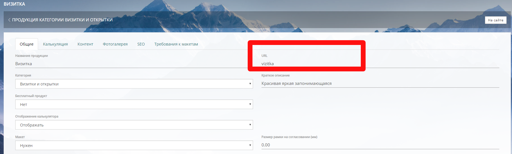{width=1815px height=548px}

### **Артикул**

Для удобства поиска и идентификации заказанного продукта можно прописать Артикул. Артикул будет отображаться на сайте, легко находится по поиску на сайте, в админ-панели и в отчетах.

### **Краткое описание**

Отображается в списке меню под названием продукта. Не действует для типа меню «Мегаменю».

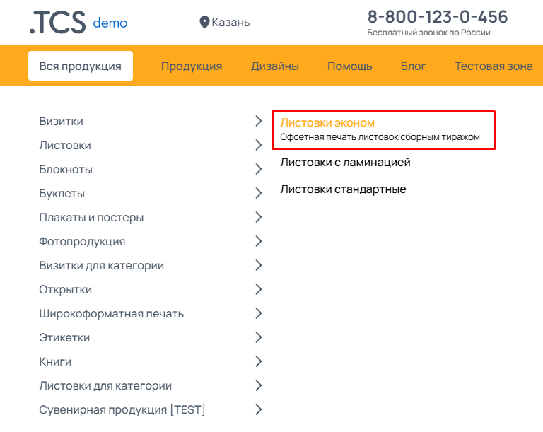{width=768px height=611px}

### **Наименование в счете и онлайн-оплате**

Позволяет задать альтернативное наименование продукта, которое будет использоваться в платёжных и учётных документах, отличное от названия на сайте.

### **Дополнительное описание (для тизеров)**

Выводится в каталоге товаров под названием, над кнопкой перехода к калькуляции.

{width=768px height=345px}

## **Макет**

Определяет способ загрузки макета клиентом. Доступно при активированной опции «Обязательная загрузка макета в калькуляции» в разделе *Настройки -> Другие настройки -> Настройки оформления заказа*.

-  **Нужен с привязкой к красочности детали:** 

В корзине, над кнопкой оформления заказа, клиенту предлагается выбор:

*• [highlight:green]Готовый дизайн[/highlight]* -- выбор подходящего макета из каталога дизайнов;

*• [highlight:yellow]Создать с нуля[/highlight]* -- открытие конструктора с предустановленными вариантами оформления, соответствующими размерам, указанным в калькуляции;

*• [highlight:blue]Свой макет[/highlight]* -- загрузка собственного готового файла.

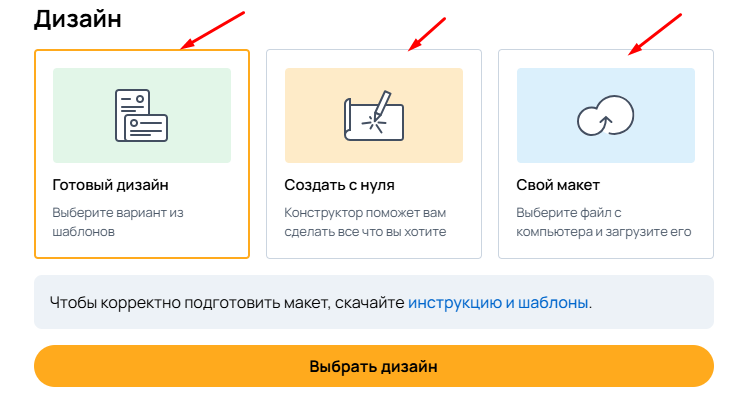{width=752px height=400px}

-  **Нужен без привязки к красочности детали:**

Загрузка макета является обязательной, использование конструктора не предусмотрено. В данном случае автоматическая проверка макета для продукта не выполняется: система игнорирует как соответствие размеров, так и количество загружаемых PDF-файлов.

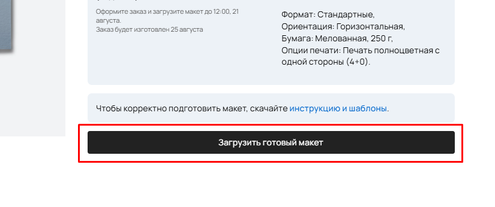{width=825px height=346px}

-  **Не нужен ни при каких обстоятельствах:**

Загрузка макета полностью заблокирована. После добавления в корзину вместо кнопки загрузки отображается тизер товара.

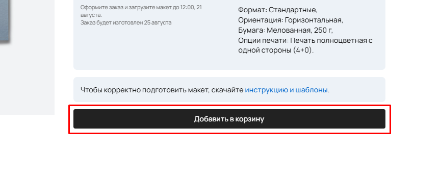{width=863px height=347px}