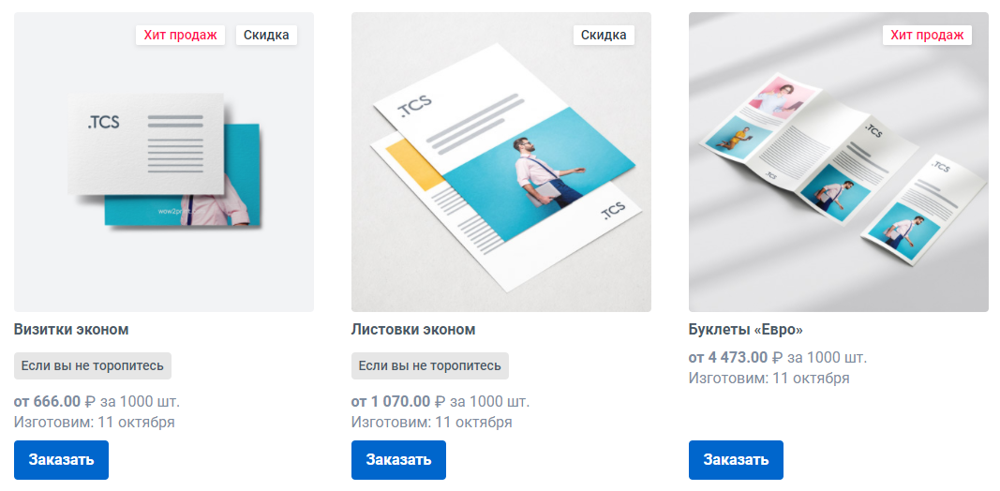
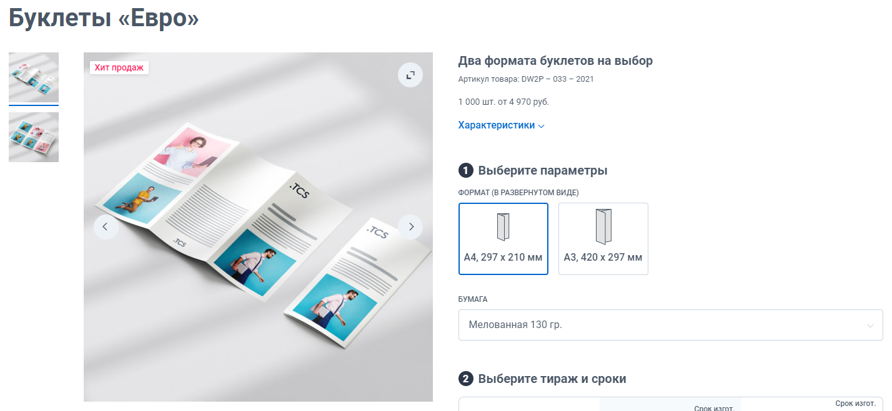
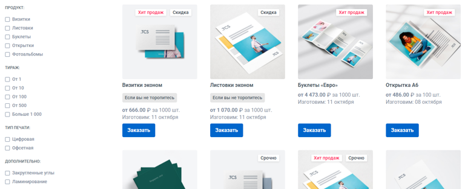
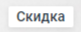
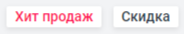
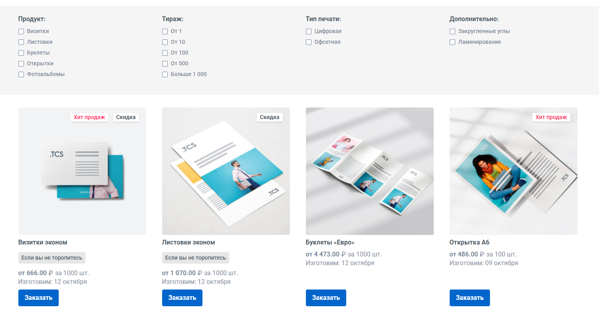
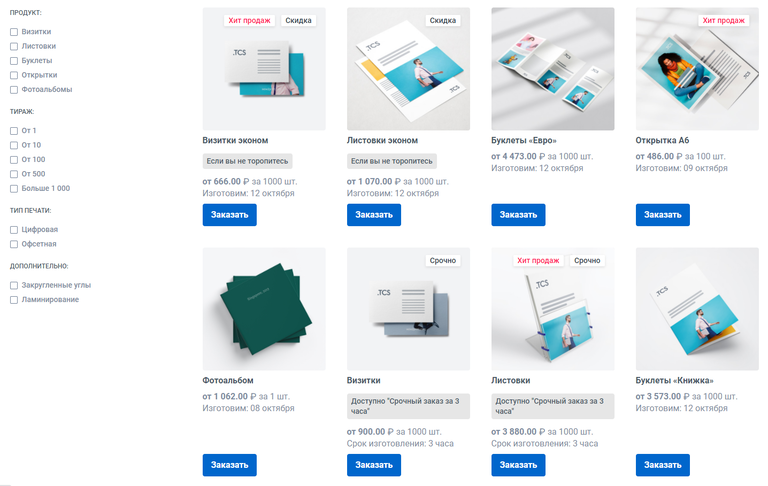

# Теги (фильтр продукции)

## Общие положения

*Вы можете выделить продукт из общего списка с помощью тега, тег может передавать информацию о наличии скидки (Скидка), стоимости продукта по отношению к аналогичным (Выгодная цена), спрос на продукт (Хит продаж) и тому подобные.*\
*Также с помощью тегов можно отобразить на странице категории фильтр, который позволит сортировать список продуктов по заданным условиям.*

Варианты использования тегов:

[tabs]

[tab:На тизере продукта]

Теги можно [отображать на тизере продукта](https://support.wow2print.com/produkciya/tegi-filtr-produkcii#dobavlenie-tegov-v-produkt) (правый верхний угол), чтобы сразу показать клиенту ключевую информацию. Например, наличие скидки на продукт или выгодной цены (Хит продаж, Скидка):

{width=1067px height=524px}

Данный тег также отображается на фотографии (левый верхний угол) в калькуляторе типа «Карточка товара»

{width=1428px height=659px}

[/tab]

[tab:Фильтр в категории]

В категории продуктов можно отобразить [полноценный фильтр](https://support.wow2print.com/produkciya/tegi-filtr-produkcii#filtr-produkcii), который реализуется с помощью системы тегов (Продукт, Тираж, Тип печати, Дополнительно). С помощью фильтров клиент сможет сортировать продукцию по заданным условиям:

{width=768px height=313px}

[/tab]

[/tabs]

### Создание тегов

Теги можно найти в разделе продукция над кнопкой «Добавить новый продукт». Кликнув на «Теги», откроется страница со всеми созданными тегами и группами тегов.

.png>)

Чтобы создать тег, необходимо нажать на «Добавить тег», откроется следующее окно с настройками:

.png>)

-  **Имя**\
   Имя тега.

-  **Группа**\
   Группа объединяющая в себе теги, является основным элементом при составлении [фильтра продукции](./tegi-filtr-produkcii#filtr-produkcii).

-  \*\*Избранный\*\*\
   Именно данный параметр отвечает за отображение тега на сайте. При его активации, тег начнет отображаться на тизере продукта и на фотографии в калькуляторе типа «Карточка товара» {width=81px height=32px}

-  \*\*Выделить цветом\*\*\
   Тег, имеющий параметр «Избранный», может быть выделен другим цветом. Цвет текста выбирается в разделе «[Элементы дизайна](./../settings/dizain-saita/elementy-dizaina#cvetovoe-oformlenie)» {width=184px height=34px}

### Добавление тегов в продукт

Сначала необходимо [создать теги](./tegi-filtr-produkcii#sozdanie-tegov), отметить в них параметр «Избранный» и затем добавить их в соответствующий продукт. Для этого перейдем в настройки [продукта](./produkty/_index#vkladka-obshie) на вкладку «Общие».

Теги добавляются в соответствующее поле «Теги», достаточно кликнуть на поле ввода и выбрать необходимый тег из списка или начать вводить название тега, после чего кликнуть на появившееся название в выпадающем списке.

### Фильтр продукции

Фильтры на сайте позволят клиенту сортировать представленную категорию продуктов по заданным условиям.

В роли группы фильтров (Продукт, Тираж, Тип печати и Дополнительно) выступают группы тегов. Группы тегов в свою очередь можно найти в разделе «Продукция» -> «[Теги](./tegi-filtr-produkcii#sozdanie-tegov)».

Фильтры и группы фильтров располагаются в том порядке, в котором они расположены в админ-панели сайта.\
Сортировать между собой их можно путем перетаскивания курсором мыши.\
Имеется два варианта отображения фильтров:

[tabs]

[tab:Сверху]

Над списком продуктов.

{width=1500px height=781px}

[/tab]

[tab:Слева]

Слева от списка продуктов

{width=768px height=486px}

[/tab]

[/tabs]

:::info 

Фильтр отображается только в том случае, если хоть один продукт категории обладает соответствующим тегом.

:::

### Отображение фильтра в категории

:::info 

Фильтр в категории продуктов по умолчанию всегда отображается.\
Отображение того или иного фильтра для конкретной категории можно настроить вручную.

:::

Настроить отображение фильтров можно в настройках категории.\
Для этого перейдите в редактирование конкретной категории -- «Редактировать категорию», далее на вкладку «Фильтр»

.png>)

При клике на «Настроить группы тегов вручную», список групп станет доступен для редактирования, можно отметить те группы, которые будут отображаться в редактируемой категории.