# Элементы дизайна

## Логотип

Логотип располагается над меню в левом верхнем углу сайта.

.png>)

Настройки логотипа выглядят следующим образом:

.png>)

-  **Требования к логотипу**

   -  Допустимые форматы: .jpeg и .png;

   -  Объем файла: не более 200 kB;

   -  Размер изображения: по высоте не более 70px.

-  **Высота логотипа**\
   Укажите высоту логотипа на сайте.

-  **Alt для логотипа**\
   Атрибут alt для изображения -- это его текстовое описание, оно необходимо, если по каким-то причинам изображения логотипа не загрузилось. На месте логотипа будет, введенный в этом поле, текст.

## Фавикон

Фавикон -- это иконка сайта, которая располагается на вкладке браузера перед названием страницы.

.png>)

-  **Требования к фавикону**

   -  Допустимые форматы: .ico;

   -  Объем файла: не более 200 kB.

## Цветовое оформление

Настройки цветового оформления:

.png>)

[tabs]

[tab:Фирменный цвет]

Фирменный цвет -- это основной цвет сайта. Данный цвет используется на всем сайте, например, заливка пункта меню и выделение пункта меню цветом, при наведении курсора мыши:

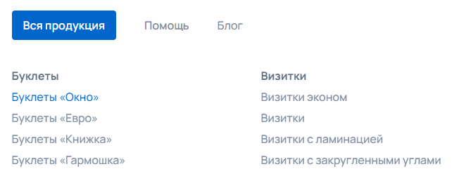{width=642px height=251px}

Выделение параметров калькуляции:

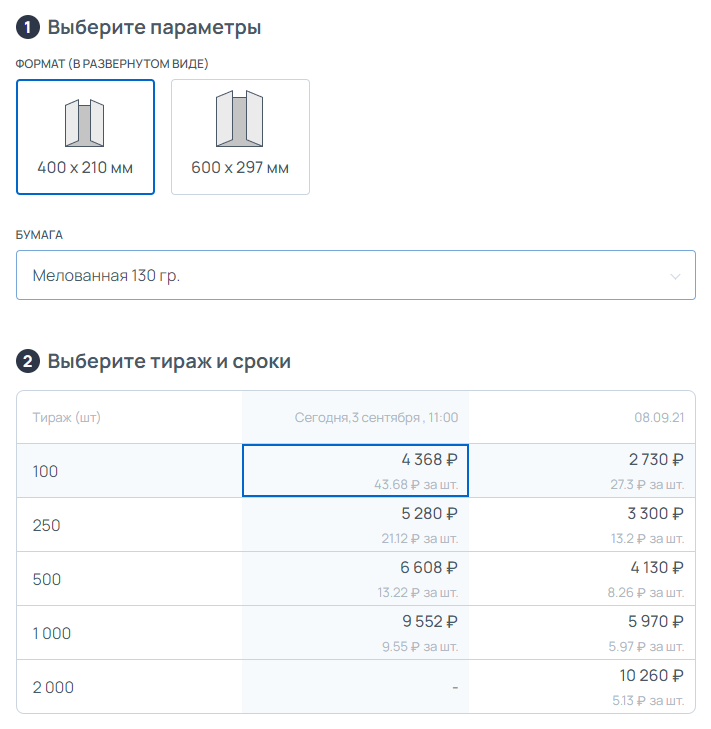{width=711px height=729px}

[/tab]

[tab:Фон конструктора]

Цвет фона конструктора

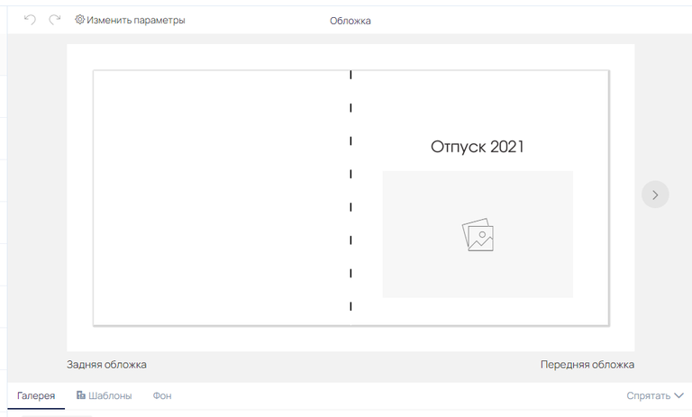{width=768px height=463px}

[/tab]

[tab:Футер и Текст футера]

Футер отображается на каждой странице сайта и располагается в самом низу страницы.

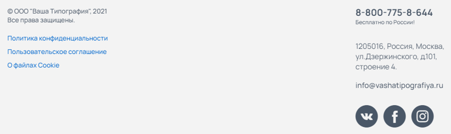{width=768px height=228px}

[/tab]

[tab:Цвет выделенных тегов]

При использовании системы тэгов продукции, можно определить свой цвет для выделенных тегов. Теги отображаются на тизере продукта в категории:

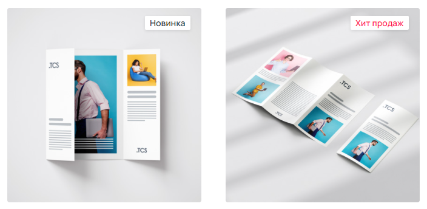{width=704px height=344px}

И в самом продукте, при варианте отображения «Карточка товара»:

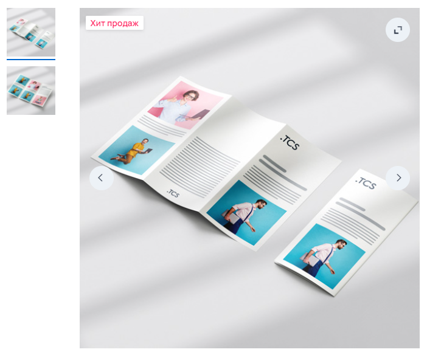{width=702px height=584px}

[/tab]

[tab:Цвет скидочного блока]

Скидочный баннер отображается на странице продукта над калькуляцией.

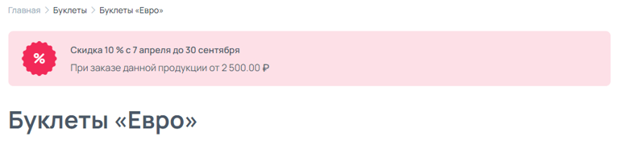{width=768px height=175px}

[/tab]

[/tabs]

## Кнопки

Также можно выбрать цвет и стиль кнопок на сайте.\
Кнопки встречаются по всему сайта, например, в калькуляции продукта, на странице корзины при оформлении заказа и так далее.

.png>)

Кнопки бывают следующих видов:

.png>)

## Тэги фильтрации

Тэги фильтрации отображаются в виджете «Каталог товаров», при использовании варианта отображения виджета «Меню слева» или «Меню сверху».\
В настройка дизайна сайта можно выбрать вариант отображения тэгов:

[tabs]

[tab:С подложкой]

В этом случае тэги отображаются кнопкой типа «Дополнительная»

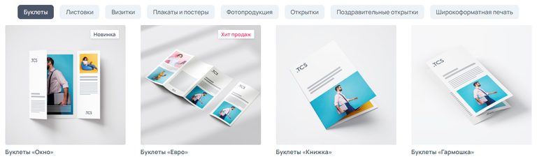{width=768px height=228px}

[/tab]

[tab:Без подложки]

В этом случае кнопки нет, выделенный тэг будет выделяться Фирменным цветом.

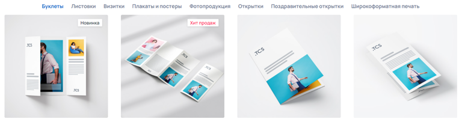{width=768px height=203px}

[/tab]

[/tabs]

## Калькулятор по умолчанию

В настройках продукта в параметре  «Отображение калькулятора» имеется вариант «По умолчанию».\
Для удобства управления внешним видом калькуляции всех продуктов, необходимо в настройках продукции выставить параметр «По умолчанию».

.png>)

Вид калькулятора по умолчанию настраивается в текущем разделе -- «Элементы дизайна».

.png>)

При изменении варианта «Калькулятора по умолчанию», изменения коснуться всей продукции, в которой выставлен параметр «Отображение калькулятора» на «По умолчанию»

## Меню

Меню отображается в верху страницы под шапкой сайта.

.png>)

Имеется два варианта отображения

[tabs]

[tab:Меню без заливки]

Меню отображается на белом фоне.

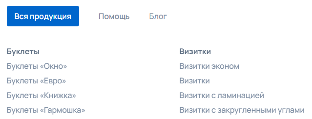{width=639px height=244px}

:::info 

Исключение, если в меню первым по порядку идет пункт с настройкой «Мегаменю», то он окрашивается в фирменный цвет сайта. Окрашивается только крайний слева пункт меню.

:::

[/tab]

[tab:Меню с заливкой]

Меню окрашивается в определенный цвет по всей ширине страницы. При выборе параметра «С заливкой», появляется палитра, в которой отдельно выбирается цвет заливки.

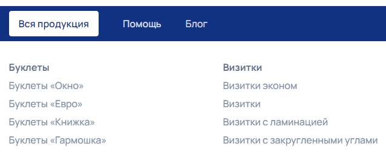{width=638px height=251px}

Исключение, если в меню первым по порядку идет пункт с настройкой «Мегаменю», то он окрашивается в фирменный цвет сайта. Окрашивается только крайний слева пункт меню.

[/tab]

[/tabs]

## Другие настройки

### Отображать город для клиента

Город, с которого клиент заходит на сайт, определяется автоматически и напрямую зависит от интеграции IpGeoBase из раздела [Интеграции](./../integracii/_index#geolokaciya). Отображается город в шапке сайта справа от логотипа.

[tabs]

[tab:С городом]

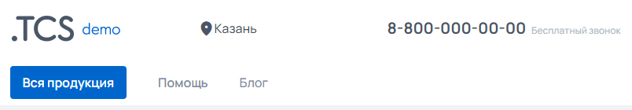{width=804px height=140px}

[/tab]

[tab:Без города]

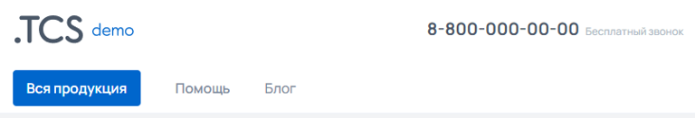{width=768px height=131px}

[/tab]

[/tabs]

Имеется возможность отключить отображение города в шапке сайта, но город по-прежнему будет определяться и будет виден клиенту на этапе оформления заказа в Корзине

.png>)

### **Запрашивать выбор города**

При включении этой функции пользователям, которые заходят на сайт впервые или у которых в кэше отсутствует сохранённое значение параметра, будет показываться окно с подтверждением геолокации. Пример сообщения: «Ваш город Москва?». Доступные варианты действий:

-  **Да** -- клиент соглашается с определённым городом.

-  **Изменить** -- открывается окно «Выберите город» для ручного выбора.

От выбранного города могут зависеть цены, если в разделе [«Корректировка цен»](./../../marketing/korrektirovka-cen) настроена наценка или скидка для определённых городов.

<figure>

.png>)

<figcaption>

</figcaption>

</figure>

### Отображать поиск в шапке сайта

Поиск позволяет искать по сайту продукты и страницы по ключевым словам, отображается в правой части шапки сайта рядом с иконкой авторизации.

[tabs]

[tab:С поиском по сайту]

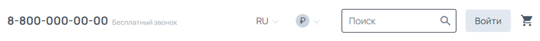{width=768px height=59px}

[/tab]

[tab:Без поиска по сайту]

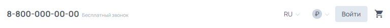{width=768px height=56px}

В отсутствии поиска по сайту в шапке, иконки языка и валюты смещаются на место поиска, ближе к иконке авторизации

[/tab]

[/tabs]

### Заглушка

Заглушка предназначена для того, чтобы сделать сайт временно недоступным для всех клиентов. При попытке зайти на сайт, клиент будет видеть окно с логотипом сайта и следующим сообщением:

.png>)

Заглушка может понадобиться в случаях, когда: 

-  необходимо значительно изменить цены на продукцию -- иначе в процессе внесения изменений, клиент сможет наткнуться на неправильные цены;

-  необходимо изменить дизайн ключевых страниц сайта (главная, продукция и т.д.) -- иначе в процессе внесения изменений, клиент сможет увидеть «рабочий» вариант дизайна, что может негативно сказаться на его опыте посещения;

-  и т.д.

:::info 

Сайт недоступен только клиентам, авторизованный в админ-панели пользователь, будет видеть сайт в штатном режиме.

:::

:::note 

Текст заглушки идет жесткий, сейчас нет возможности его редактировать.

:::

### Иконка выбора языка

При использовании модуля «Мультиязычность» и наличии на сайте нескольких языков, в шапке сайта отображается иконка выбранного языка.\
Иконка языка располагается в правой части шапки сайта, рядом с поиском. При отсутствии поиска, иконка языка располагается рядом с кнопкой авторизации.

Имеется два варианта отображения иконки языка: Флажок и Буквенное обозначение.

[tabs]

[tab:Флажок]

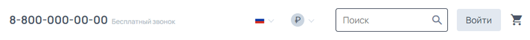{width=768px height=58px}

[/tab]

[tab:Буквенное обозначение]

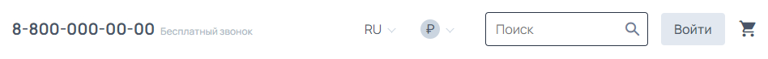{width=768px height=59px}

[/tab]

[/tabs]

### Cookie

При заходе клиента на сайт, владелец сайта обязан предупредить клиента, что сайт использует файлы cookies.

:::danger 

Сайт обязан сообщать клиентам о том, что использует файлы Cookies:

-  в России -- согласно 152-ФЗ «О персональных данных»;

-  в странах ЕС -- согласно регламенту  [General Data Protection Regulation](https://ec.europa.eu/info/law/law-topic/data-protection_en) (GDPR).

Если не соблюдать данное требование, имеется риск быть оштрафованным на сумму, согласно нормативному документу.

:::

Отображение данного сообщения:

[tabs]

[tab:Версия для настольных ПК]

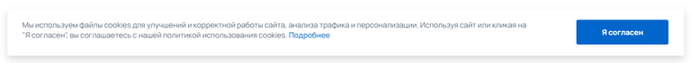{width=768px height=71px}

[/tab]

[tab:Версия для мобильных устройств]

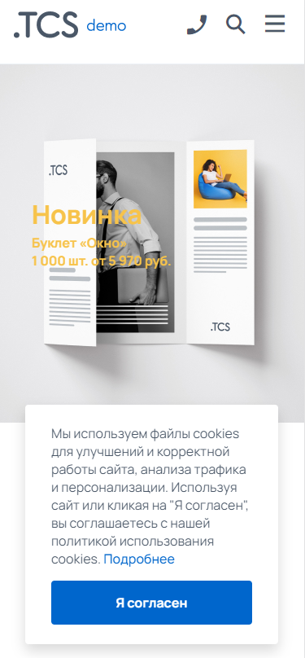{width=375px height=808px}

[/tab]

[/tabs]

\
Тем не менее, имеется возможность отключить это уведомление как для сайта в версии настольных ПК, так и на сайте в версии на мобильных устройствах.