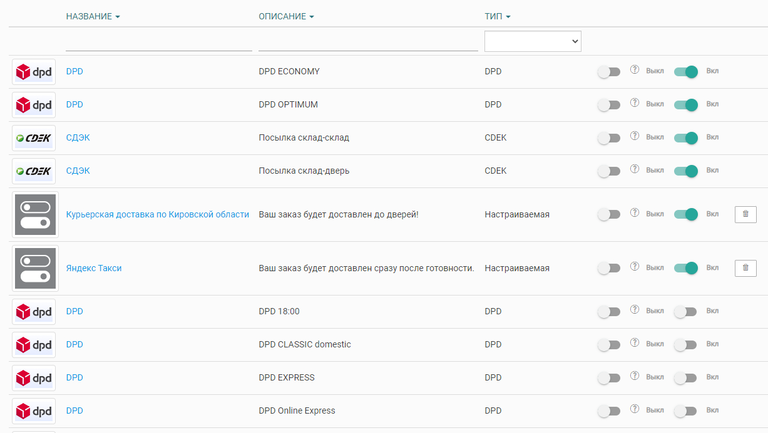
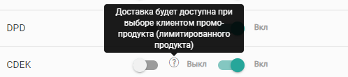

# Доставка на сайте

## Общие положения

Доставка подключается и настраивается в разделе [Интеграции](./../integracii/_index). В данном разделе имеется возможность управлять всеми доступными способами доставки -- включать их и выключать.

Перейдя в данный раздел, перед вами откроется список из всех, когда-либо подключенных, способов доставки. В начале списка будут отображаться только активные способы, отсортированные по интеграциям.

{width=768px height=433px}

Способ доставки можно включить и выключить с помощью крайнего справа тумблера. Второй тумблер отвечает за доступность доставки при заказе промо продукта.

{width=498px height=111px}

Любой продукт на сайте можно отметить как промо продукт, главная особенность подобного продукта -- каждый клиент может его заказать лишь один раз (например, пробники)

При клике на способ доставки, откроются настройки этого способа доставки.

{width=695px height=355px}

Среди них имеются:

-  **Название**\
   Данный параметр не изменяется.

-  **Описание**\
   Данный параметр не изменяется.

-  **Фиксированная стоимость**

   -  Нет -- стоимость будет высчитываться исходя из настроек самой интеграции;

   -  Да -- появится поле для ввода фиксированного значения стоимости доставки, доставка на сайте всегда будет иметь указанную стоимость.

-  **Подпись**\
   Возможность указать текст, который будет отображаться **вместо** цены. Стоимость доставки по-прежнему будет учитываться.

-  **Наименование в счете и онлайн-оплате**\
   Возможность указать какое-либо другое название для данного способа доставки, которое будет отображаться во всех документах (акт, товарный чек и т.д.)

## 