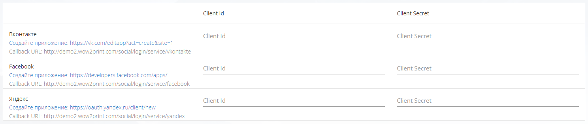
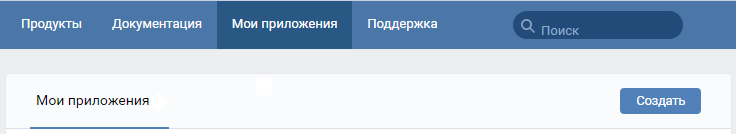
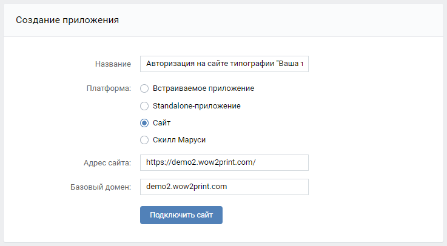

Сайтом предусмотрена возможность настройки авторизации клиентов через социальные сети Вконтакте, Facebook и Яндекс.

[view:hierarchy=none::::List]

## **Общая информация**

:::quote 

Админ-панель -> Настройки -> Другие настройки -> Авторизация через соцсети

:::

{width=1488px height=315px}

:::note 

Чтобы получить Client Id и Client Secret и настроить авторизацию, необходимо создать приложение на соответствующем сайте социальной сети:

:::

Вконтакте ->  <https://vk.com/apps?act=manage>

Facebook -> <https://developers.facebook.com/apps/>

Яндекс -> <https://oauth.yandex.ru/client/new>

### Вконтакте

Вконтакте ->  <https://vk.com/apps?act=manage>

Необходимо перейти по указанной ссылке и нажать на кнопку "Создать"

{width=736px height=134px}

Далее необходимо настроить приложение, внести соответствующие данные:

-  *Название* -- название приложения, которое будет отображаться для клиента;

-  *Платформа* -- выбираем Сайт;

-  *Адрес сайта* -- копируем адрес сайта из адресной строки браузера;

-  *Базовый домен* -- в этом поле необходимо указать адрес сайта без каких-либо лишних символов.

{width=737px height=406px}

После создания приложения, необходимо перейти в раздел Настройки (боковая панель) и вставить url в поле *Доверенный redirect URI* в формате: \
[**https://ваш\_домен.ru/social/login/service/vkontakte.k**](https://ваш_домен.ru/social/login/service/vkontakte.k)\
И Сохранить изменения.

-  *Client Id* -- это ID приложения;

-  *Client Secret* -- это Защищенный ключ.

Защищенный ключ необходимо отобразить, для этого нажмите на иконку "глаза" напротив ключа.

<figure>

.png>)

<figcaption>

</figcaption>

</figure>

Как только ключ отобразится, его и ID приложения необходимо разместить в соответствующих полях в админ-панели сайта:

:::quote 

Админ-панель -> Настройки -> Другие настройки -> Авторизация через соцсети

:::

Сохраните изменения.

### 