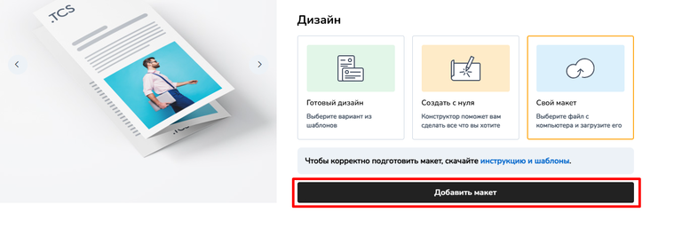
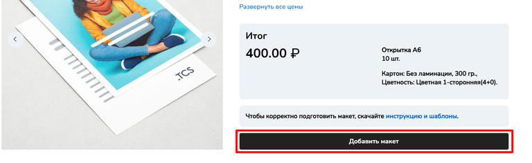
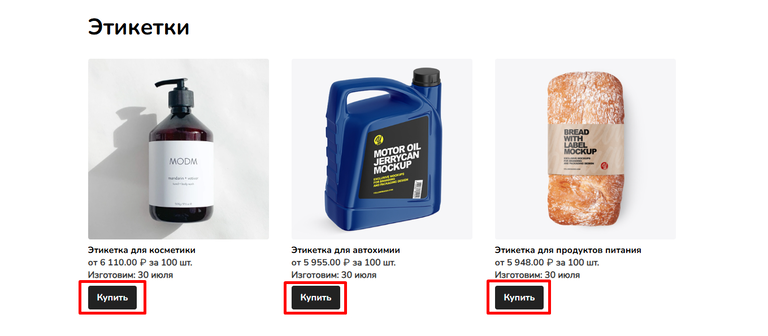
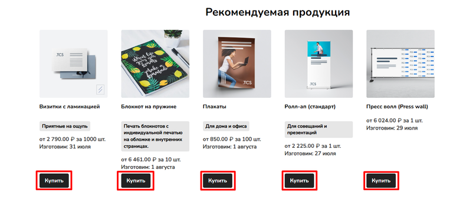
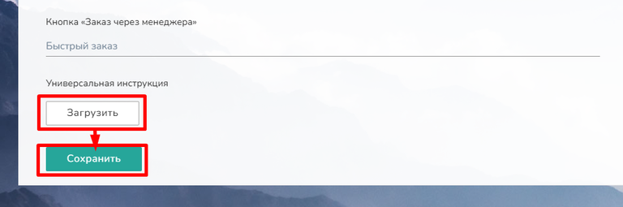
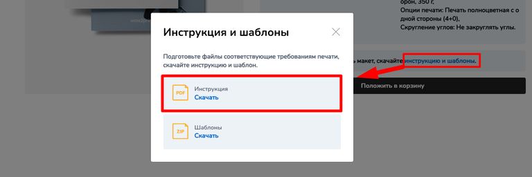

# Настройка калькуляции

### **Основная информация**

Этот раздел позволяет изменить стандартные названия кнопок на сайте. Если текущие названия вам не подходят, вы можете легко их переименовать.

Здесь представлен полный список кнопок, используемых в калькуляции товара. В каждой строке уже указано название по умолчанию, которое можно отредактировать.

Кроме того, в этом разделе можно загрузить универсальные инструкции, которые будут применяться ко всей продукции, если для отдельных товаров не заданы собственные.

### **Редактирование названия кнопок**

Чтобы изменить название кнопки:

1. Выделите текущий текст в соответствующем поле.

2. Введите новое название.

3. Нажмите **«Сохранить»**, чтобы применить изменения.

<figure>

.png>)

<figcaption>

</figcaption>

</figure>

:::note 

**Важно!** Если в [настройках калькуляции](./../../product/produkty/vkladka-kalkulyaciya/dopolnitelnye-knopki/_index#nastroiki) товара заданы свои названия кнопок, они будут иметь приоритет над указанными здесь.

:::

#### **Кнопка "Создать в конструкторе"** (для конструктора фотопродукции)

Отображается только в товарах, где в размерах указан конструкторский размер для фотокниг, фотокарточек или фотокалендарей.\
Пример изменённого названия:

<figure>

.png>)

<figcaption>

</figcaption>

</figure>

#### **Кнопка "Создать в конструкторе"** (для конструктора полиграфии)

Кнопка становится доступной после активации опции **"Обязательная загрузка макета"** в [настройках оформления заказа](./nastroiki-oformleniya-zakaza). После включения этой функции в карточке товара появляются варианты загрузки макета. При выборе варианта **"Создать с нуля"** в нижней части интерфейса отображается изменённая кнопка **"Создать в конструкторе"**.

Пример:

<figure>

.png>)

<figcaption>

</figcaption>

</figure>

#### **Кнопка «Выбрать дизайн»**

Эта кнопка появляется в карточке товара, когда покупатель выбирает вариант **"Готовый дизайн"**. Перед этим необходимо активировать функцию обязательной загрузки макета в [настройках оформления заказа.](./nastroiki-oformleniya-zakaza)

Изменённая кнопка "Выбрать дизайн" будет расположена в нижней части интерфейса и позволит перейти к каталогу готовых дизайнерских решений для выбранного товара.

Пример:

<figure>

.png>)

<figcaption>

</figcaption>

</figure>

#### **Кнопка «Загрузить макет»**

Кнопка активируется при включённой опции **«Обязательная загрузка макета»** в [настройках оформления заказа](./nastroiki-oformleniya-zakaza). В зависимости от типа товара может отображаться в двух вариантах:

1. **Для товаров с конструкторским размером**

   -  Появляется при выборе пункта **«Свой макет»** и позволяет загрузить индивидуальный макет

2. **Для обычных товаров**

   -  Кнопка отображается всегда в карточке товара. Исключение, если в настройках товара отключена [обязательная загрузка макета](./../../product/produkty/vkladka-obshie#maket). Предназначена для загрузки готового макета.

Изменённое название кнопки будет отображаться в нижней части интерфейса карточки товара.

Пример:

[tabs]

[tab:Для товара с конструкторским размером]

{width=768px height=257px}

[/tab]

[tab:Для обычных товаров]

{width=768px height=236px}

[/tab]

[/tabs]

#### **Кнопка «Добавить в корзину»**

Отображается в карточке товара, если для продукта не требуется обязательная загрузка макета.

<figure>

.png>)

<figcaption>

</figcaption>

</figure>

#### **Кнопка «Заказать»**

Эта кнопка отображается в двух местах сайта:

1. На страницах категорий товаров - располагается под изображением каждого продукта

2. В виджете "Рекомендуемая продукция" - также выводится под карточками товаров

Кнопка позволяет сразу перейти к оформлению заказа выбранного товара.

Примеры отображения:

[tabs]

[tab:На страницах категорий товаров]

{width=768px height=336px}

[/tab]

[tab:В виджете]

{width=768px height=338px}

[/tab]

[/tabs]

#### **Кнопка «Заказ через менеджера»**

Эта кнопка включается у всех товаров индивидуально и позволяет оформить заказ с помощью менеджера. Вы можете настроить её название:

-  **Для всех товаров сразу** - через текущий раздел

-  **Для конкретного товара** - в его настройках (Настройки продукта -> Калькуляция -> [Настройки](./../../product/produkty/vkladka-kalkulyaciya/dopolnitelnye-knopki/_index#nastroiki))

Если для конкретного товара задано индивидуальное название кнопки, то оно будет отображаться вместо общего.

<figure>

.png>)

<figcaption>

</figcaption>

</figure>

### **Универсальные инструкции**

В этом разделе вы можете загрузить общую инструкцию, которая будет автоматически отображаться для всех товаров на сайте. Но если у продукта во вкладке "Общие" загружена [индивидуальная инструкция](./../../product/produkty/vkladka-obshie#zagruzit-instrukciyu), то отображаться на сайте будет именно она, а не универсальная.

Как работать с разделом:

1. Нажмите кнопку "Загрузить"

2. Выберите файл инструкции в формате PDF с вашего компьютера

3. Нажмите "Сохранить" чтобы применить изменения

Загруженную инструкцию можно в любой момент удалить -- просто нажмите на значок корзины .png>) рядом с её названием.

[tabs]

[tab:Загрузка инструкции]

{width=768px height=255px}

[/tab]

[tab:Скачивание инструкции в карточке товара]

{width=768px height=256px}

[/tab]

[/tabs]