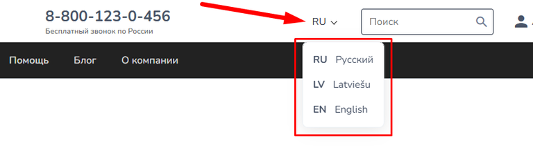
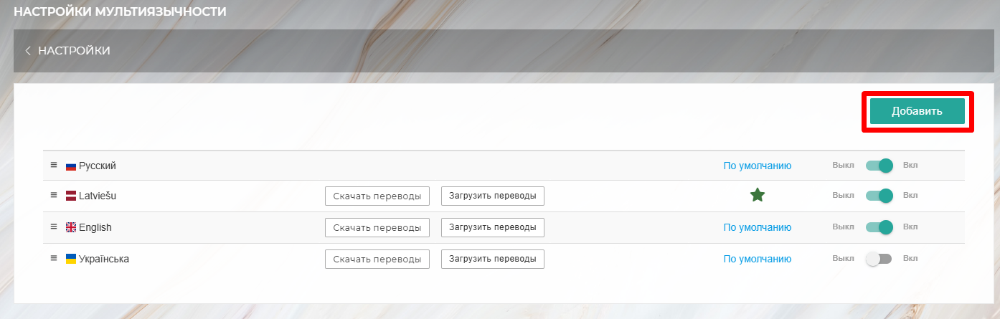
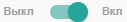
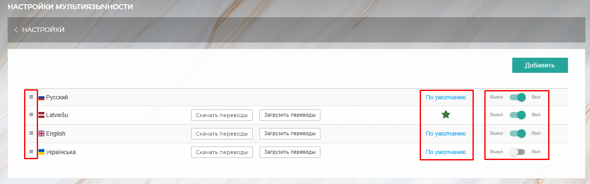
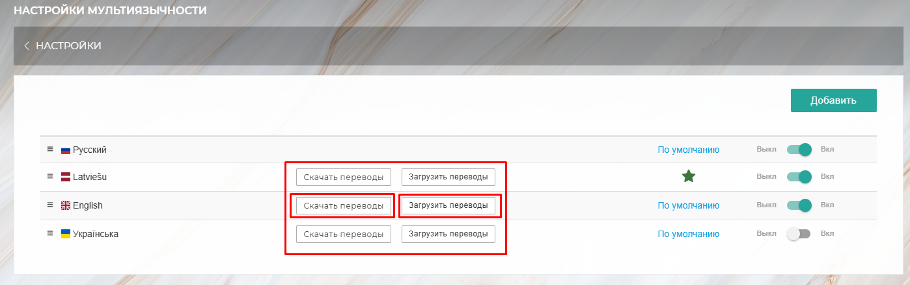
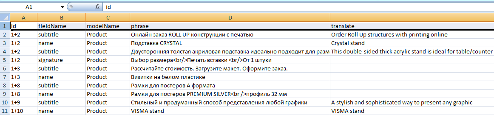

[view:hierarchy=none::::List]

{width=768px height=224px}

### **Добавление нового языка**

1. В правом верхнем углу нажмите кнопку **«Добавить»**.

2. В открывшемся окне выберите нужный язык из раскрывающегося списка.

3. Подтвердите выбор, нажав кнопку **«Сохранить»**.

Новый язык появится в общем списке переводов.

:::note 

**Примечание:** Добавленный язык автоматически переводит только системные элементы интерфейса и некоторые нередактируемые страницы сайта (например, Корзина, Личный кабинет клиента, страница оплаты и др.). \
Контент страниц (тексты, статьи, описания товаров) необходимо переводить вручную в соответствующих разделах. Подробнее в статье [**«Перевод на разные языки»**.](./perevod-na-raznye-yazyki)

:::

{width=1394px height=445px}

### **Управление списком языков**

-  **Сортировка:** Языки можно упорядочивать путем перетаскивания. Порядок языков на сайте будет соответствовать списку в настройках мультиязычности.

-  **Язык по умолчанию:** Чтобы установить язык, который будет использоваться по умолчанию для всех посетителей, нажмите кнопку **«По умолчанию»** в строке нужного языка.

-  **Включение/Отключение:** Справа от каждого языка находится переключатель {width=127px height=22px}. С его помощью можно скрыть язык из списка на сайте.

{width=1396px height=437px}

### **Работа с переводами контента («Скачать переводы» / «Загрузить переводы»)**

Для перевода текстов, которые вы добавили на сайт самостоятельно, можно использовать функцию экспорта и импорта файлов.

:::info 

**Важно:** Данная функция является опциональной и подключается для вашего сайта по индивидуальному запросу. Мы предоставляем её клиентам, которые хотят самостоятельно управлять переводами. Чтобы сделать эту задачу максимально удобной, мы реализовали выгрузку всех фраз в единый Excel-файл.

:::

В каждой строке с языком, для которой подключена эта опция, есть две кнопки:

1. **«Скачать переводы»** – позволяет скачать Excel-файл со всеми фразами, требующими ручного перевода.

2. **«Загрузить переводы»** – позволяет загрузить обратно на сайт заполненный файл с переводами.

{width=1398px height=440px}

#### **Структура файла переводов**

Скачанный Excel-файл содержит следующие колонки:

-  **id -** Уникальный технический ключ, который связывает оригинальный текст на сайте с его переводом. **Не изменяйте значения в этой колонке.**

-  **fieldName -** Название части интерфейса или поля, где используется эта фраза (например, `name`, `label`).

-  **modelName -** Указывает раздел сайта, к которому относится фраза (например, `Product`, `StoreCategory`, `CalculationModule`).

-  **phrase -** Исходный текст на русском языке. **Эту колонку также не изменяйте.**

-  **translate - Колонка для ввода перевода** фразы на выбранный язык. Вносите свои переводы именно сюда.

{width=1162px height=271px}

**Процесс перевода**

1. Скачайте файл с помощью кнопки **«Скачать переводы»** для нужного языка.

2. Заполните колонку `**translate**` в Excel-файле.

3. Сохраните файл на своем компьютере.

4. Вернитесь в раздел переводов и нажмите кнопку **«Загрузить переводы»** для того же языка.

5. Выберите заполненный файл. После загрузки проверьте, чтобы переводы корректно отобразились на страницах сайта.